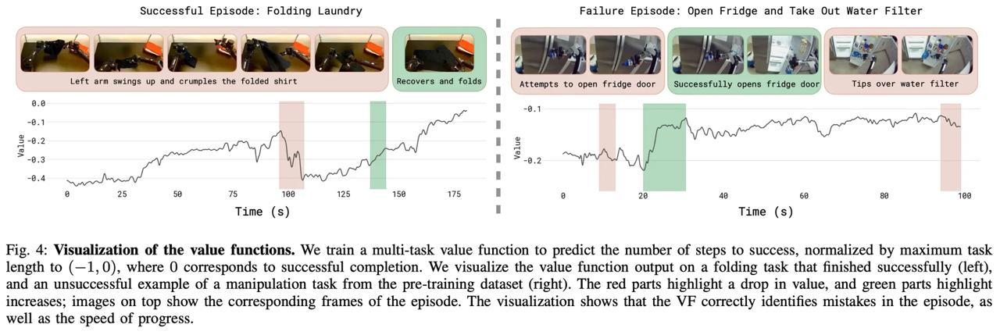
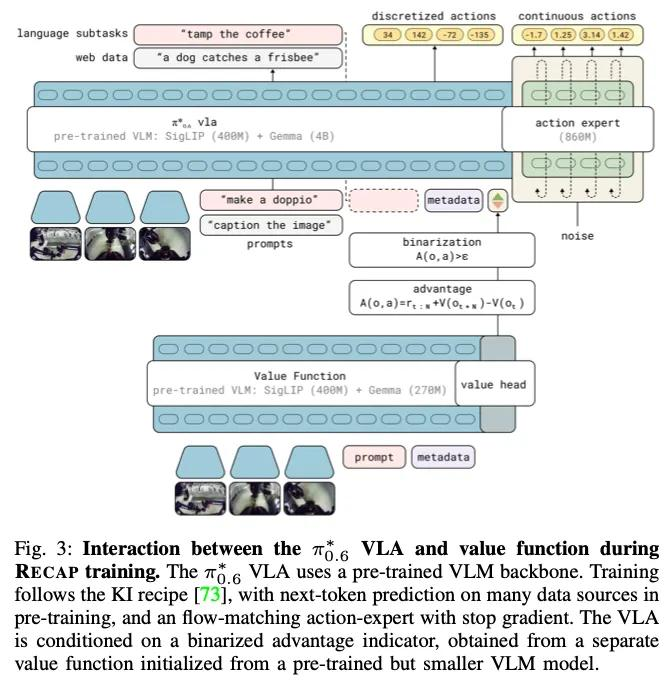
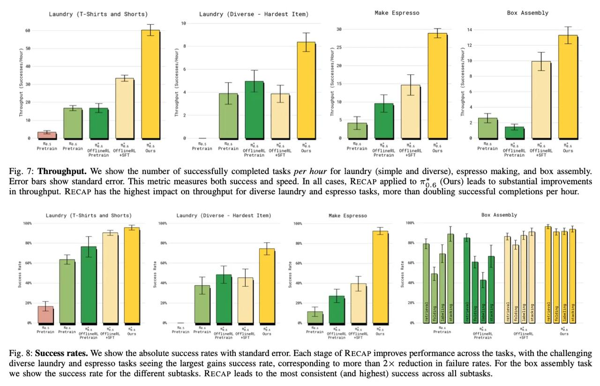

# π∗0.6: a VLA That Learns From Experience

## Краткое описание

π∗0.6 - это визуально-языково-акционная (VLA) модель, разработанная компанией Physical Intelligence, которая может улучшаться через реальные эксперименты с использованием метода под названием RECAP (Robotic Experience Collected And Processed). Модель способна обучаться на опыте, как человек, и показывает значительные улучшения в задачах, таких как приготовление эспрессо, складывание одежды и сборка картонных коробок.

## Основные компоненты

### RECAP Pipeline
- **RECAP** (Robotic Experience Collected And Processed) - основной пайплайн обучения
- Включает в себя: сбор данных, обучение функции ценности (value function), обучение с условной адаптацией по преимуществам (Advantage conditioned training)
- Повторение этих шагов позволяет оптимизировать базовую VLA модель

### Value Function
- Много-задачная функция ценности, которая предсказывает количество шагов до успеха
- Нормализована до (-1,0), где 0 соответствует успешному завершению
- Использует ту же архитектуру, что и VLA, но с меньшей моделью (670M параметров)
- Обучается на том же языковом вводе, что и VLA

### Advantage Conditioning
- Вместо подачи самих значений адвантиджей, используется флаг, зависящий от порога для каждой задачи
- Определяет, превышает ли адвантидж 30-й или 40-й процентиль (в зависимости от этапа обучения)
- VLA обучается с учетом этих условий адвантиджей

## Архитектурные особенности

### Основные изменения по сравнению с pi05:
- Замена Gemma2 на Gemma3 4B в качестве основы VLM
- Увеличенный по параметрам модуль соответствия потоков (flow matching) для предсказания действий
- Больший датасет с более качественными промптами
- Обработка действий эксперта с некаузальным вниманием
- 5 шагов на инференсе вместо 10 в pi0 и pi05

### Взаимодействие VLA и функции ценности:
- VLA использует предобученный VLM каркас (backbone)
- Обучение следует рецепту KI (Keep It Simple) с предсказанием следующего токена на многих источниках данных
- Включает flow-matching action-expert с остановкой градиента
- VLA условно зависит от бинарного индикатора адвантиджа, полученного из отдельной функции ценности

## Результаты и производительность

### Задачи, которые выполняет π∗0.6:
- Приготовление различных напитков эспрессо с 5:30 утра до 23:30
- Складывание 50 различных новых вещей одежды в новом доме
- Сборка картонных коробок
- Складывание разнообразной одежды с высокой успешностью

### Производительность:
- Значительные улучшения в пропускной способности (throughput) для сложных задач
- В задаче разнообразного складывания одежды и приготовления эспрессо RECAP более чем удваивает успешные завершения в час
- Более чем 2-кратное снижение частоты ошибок для сложных задач
- Наиболее высокая последовательность (consistency) и успешность в подзадачах сборки коробок

**Изображение показывает:** Некоторые из задач, изученных RECAP. π∗0.6, обученный с RECAP, может готовить напитки эспрессо, собирать картонные коробки и складывать разнообразную и реалистичную одежду с высокой степенью успеха. Каждая задача включает реалистичную изменчивость — сплющенные неразвернутые коробки прилипают друг к другу и гнутся, приготовление напитков эспрессо требует наливания жидкостей, а складывание одежды требует обобщения на широкий спектр предметов одежды.

## Визуализация функции ценности

Функция ценности корректно идентифицирует ошибки в эпизоде (см. визуализации на рисунках), а также скорость прогресса. Красные части выделяют падение ценности, зеленые — увеличение, а желтые — колеблющиеся участки.

**Изображение показывает:** Визуализация функции ценности на свертке задачи, которая завершилась успешно (слева), и неудачного примера задачи манипуляции из предварительного набора данных (справа). Красные части выделяют падение ценности, а зеленые — увеличение; изображения сверху показывают соответствующие кадры эпизода.

## Обзор RECAP Training

**Изображение показывает:** Взаимодействие между VLA и функцией ценности во время обучения RECAP. VLA использует предобученный VLM каркас. Обучение следует рецепту KI, с предсказанием следующего токена на множестве источников данных, а также flow-matching action-expert с остановкой градиента. VLA условно зависит от бинарного индикатора адвантиджа, полученного из отдельной функции ценности, инициализированной из предобученной, но меньшей VLM модели.

## Производительность и успехи

**Изображение показывает:** Пропускная способность (throughput) - количество успешно завершенных задач в час для складывания одежды (простой и разнообразной), приготовления эспрессо и сборки коробок. RECAP, примененный к π∗0.6, приводит к существенным улучшениям в пропускной способности. RECAP оказывает наибольшее влияние на пропускную способность для задач разнообразного складывания одежды и приготовления эспрессо, более чем удваивая успешные завершения в час.

## Дополнительные материалы

- [Официальный сайт Physical Intelligence](https://www.pi.website/blog/pistar06)
- [Оригинальная статья](https://arxiv.org/html/2511.14759)

## Связи с другими темами

- [[ai/robotics/robotic_manipulation.md]] - Обобщенные манипуляции роботов
- [[ai/multimodal_models/vla_models.md]] - Визуально-языково-акционные модели
- [[ai/reinforcement_learning/offline_rl.md]] - Оффлайн обучение с подкреплением

## Источники

1. "π∗0.6: a VLA That Learns From Experience" - Официальная статья от Physical Intelligence (ноябрь 2025)
2. https://www.pi.website/blog/pistar06 - Официальный блог Physical Intelligence
3. https://arxiv.org/html/2511.14759 - Исходная статья на arXiv
4. https://zhuanlan.zhihu.com/p/1974154942785804276 - Обзор китайской AI-сообщества