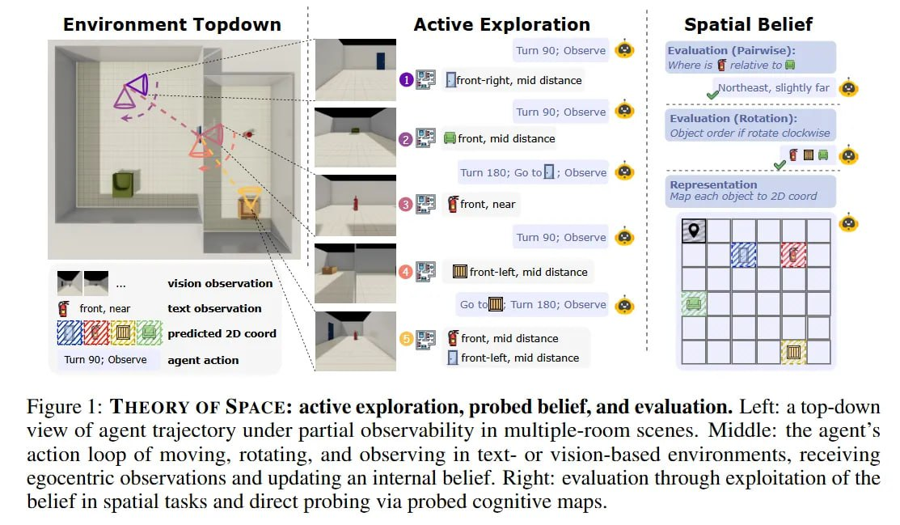
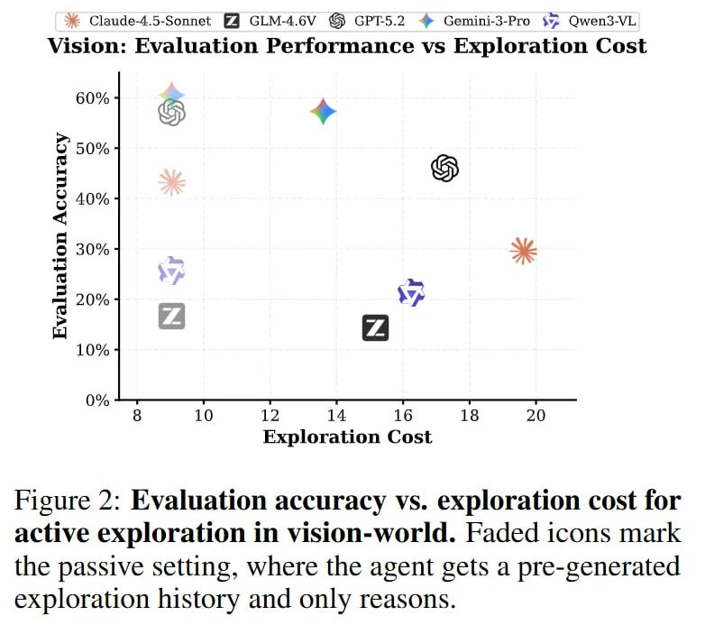
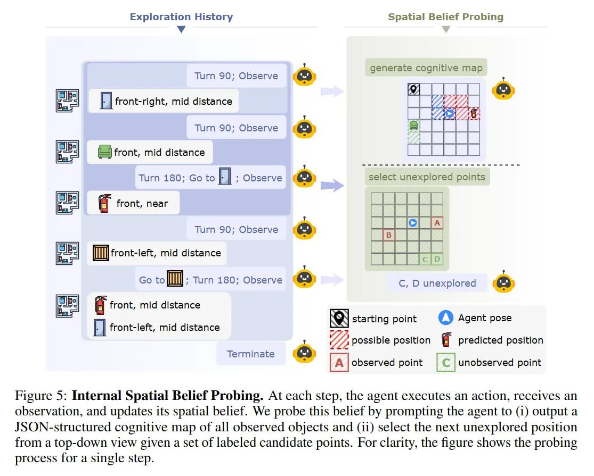

# Theory of Space: Бенчмарк для проверки пространственного интеллекта MLLM

## Общее описание

**Theory of Space (ToS)** — это бенчмарк для проверки способности мультимодальных больших языковых моделей (MLLMs) активно исследовать частично наблюдаемую среду и строить явную внутреннюю «когнитивную карту». Вместо пассивных ответов по картинкам агент должен автономно перемещаться, чтобы уменьшить неопределённость, и на каждом шаге выдавать JSON с макетом мира.

Работа наследует идеи **SpatialVLM** [[../../applications/computer_vision/multimodal_models.md]] и **Habitat** [[../../applications/agents/embodied_ai.md]], но бьёт в новую точку: zero-shot рассуждения фундаментальных моделей в динамике.

 <!-- TODO: Broken image path -->

**Рисунок 1:** Theory of Space: активное исследование, проверка убеждений и оценка. Слева: вид сверху траектории агента при частичной наблюдаемости в многокомнатных сценах. В центре: цикл действий агента (перемещение, вращение, наблюдение) в текстовых или визуальных средах с эгоцентрическими наблюдениями и обновлением внутреннего убеждения. Справа: оценка через использование убеждения в пространственных задачах и прямая проверка через когнитивные карты.

## Ключевая проблема: Разрыв между пассивным и активным

Центральная проблема статьи — разрыв между крутизной фундаментальных моделей в пассивных задачах и их беспомощностью в воплощённых (embodied) сценариях.

### Активно-пассивный разрыв (Active-Passive Gap)

Качество резко падает, когда агенты управляют камерой сами:

- **GPT-5.2** проседает с **57.1%** (пассив) до **46.0%** (актив) в визуальных тестах
- Модели оказались ужасными исследователями: они топчутся на месте и рано сдаются
- Rule-based боты (SCOUT) покрывают карту за **9 шагов**, а LLM требуется **14+** с худшим результатом

 <!-- TODO: Broken image path -->

**Рисунок 2:** Точность оценки vs. стоимость исследования для активного исследования в визуальном мире. Затенённые иконки обозначают пассивный режим, где агент получает предварительно сгенерированную историю исследования и только рассуждает.

## Формализация: Вера в пространство

Авторы предлагают рассматривать задачу не как выполнение команд, а как **построение убеждений (belief construction)**. Агент должен манипулировать вероятностным распределением B_t относительно структуры пространства S.

Формально, в момент t с историей h_t, агент аппроксимирует апостериорную вероятность:

```
B_t(S) ≈ P(S | h_t)
```

Тестируются три навыка:

1.  **Construct** — сборка карты из кусочков наблюдений
2.  **Revise** — обновление B_t, когда мир меняется (S → S') через действия
3.  **Exploit** — использование карты для решения задач

### Пространственная проверка убеждений (Spatial Belief Probing)

 <!-- TODO: Broken image path -->

**Рисунок 5:** Внутренняя пространственная проверка убеждений. На каждом шаге агент выполняет действие, получает наблюдение и обновляет своё пространственное убеждение. Мы проверяем это убеждение, предлагая агенту: (1) вывести JSON-структурированную когнитивную карту всех наблюдаемых объектов и (2) выбрать следующую неисследованную позицию с видом сверху из набора помеченных кандидатных точек.

Агента помещают в процедурно генерируемую среду (ThreeDWorld/Objaverse) с частичной наблюдаемостью. Он может двигаться, вращаться и наблюдать. Главная фишка метода — шаг **Spatial Belief Probing**. После каждого действия модель обязана «выгрузить» своё состояние в JSON-объект, описывающий карту мира видом сверху (аллоцентрическая система).

**Пример:** агент в (0,0) смотрит на Север и видит стул слева-спереди. Он должен пересчитать это в глобальные координаты, например (-1, 1), и записать в JSON. Это принуждает модель выполнять сложное преобразование из эгоцентрического (из глаз) в аллоцентрическое (карта) представление.

## Метрики эффективности

### Нормализованный прирост информации (Information Gain)

Эффективность разведки измеряют через:

```
E = 1 - (Σ log₂(max(1, C_i))) / (N * log₂(M))
```

где:
- C_i — число возможных позиций для объекта i
- N — количество объектов
- M — общее число позиций

Грубо говоря, это показывает, как быстро агент схлопывает неопределённость.

 <!-- TODO: Broken image path -->

**Рисунок 4:** Накопленный прирост информации по шагам исследования в текстовом мире.

### Другие метрики

Также проверяют:
- **Route Knowledge** (знание путей, эгоцентрично)
- **Survey Knowledge** (знание карты, аллоцентрично)
- **False Belief** (ложное убеждение) — тесты на обновление ментальной карты при перемещении объектов

## Ключевые результаты: Инсайты-холодный душ

### 1. Инерция убеждений (Belief Inertia)

Визуальные агенты с трудом переписывают память. Если объект переехал, модель часто продолжает настаивать на его старых координатах, даже видя пустое место.

Латентный концепт объекта оказывается «липким»: байесовское обновление не срабатывает должным образом. В текстовом режиме инерция ниже (**GPT-5.2 даёт 90.4%**), что намекает: многомерные визуальные входы перегружают механизм трекинга состояний.

### 2. Производительность при эксплуатации

| Модель | Route (S) | Route (D) | Survey (S) | Survey (D) | Avg |
|--------|-----------|-----------|------------|------------|-----|
| **Vision-based World** |
| GEMINI-3 PRO | лидирует в большинстве визуальных задач |
| CLAUDE-4.5 SONNET | |
| QWEN3-VL | 20.8 | 26.3 | 16.7 | 33.2 | 24.9 |
| **Text-based World** |
| GEMINI-3 PRO | лидирует в текстовых задачах |
| QWEN3-VL | 40.8 | 69.3 | 42.8 | 40.3 | 45.6 |

**Таблица 3:** Производительность эксплуатации (%) при построении убеждений через пассивные наблюдения. Модели оцениваются как агенты пассивного понимания на задачах Route- и Survey-уровня.

 <!-- TODO: Broken image path -->

**Таблица 7:** Обновление убеждений при изменениях среды. После перемещения/переориентации k=4 объектов оцениваются: идентификация изменений, стоимость повторного исследования (включая избыточность) и корректность убеждений в текстовых vs. визуальных мирах. Визуальные агенты требуют больше избыточных шагов и показывают серьёзную инерцию ориентации.

## Контекст и связь с предыдущими работами

### SpatialVLM

Работа **SpatialVLM: Endowing Vision-Language Models with Spatial Reasoning Capabilities** (arXiv:2401.12168) заложила основу для наделения VLM пространственными способностями рассуждения через контрастивное обучение на парах изображение-текст с пространственной разметкой.

### Habitat

Платформа **Habitat: A Platform for Embodied AI Research** (arXiv:1904.01201) предоставила симулятор для обучения воплощённых агентов (виртуальных роботов) в фотореалистичных 3D-средах с возможностью масштабирования через параллельное обучение тысяч агентов.

## Теоретические последствия

### Бутылочное горлышко скрытых состояний

Авторы утверждают, что настоящий пространственный интеллект требует **«Теории Пространства» (Theory of Space)** — способности поддерживать динамическое вероятностное убеждение о ненаблюдаемой части мира. Оказывается, модели плохо управляют латентным состоянием S на длинных дистанциях h_t. Они не различают *известное* и *неопределённое*, что ведёт к неэффективному блужданию и галлюцинациям при попытке достроить картину мира.

### Externalization Gap (Разрыв экстернализации)

Важное ограничение: мы судим о «мыслях» модели по JSON-выходу. Это сжатие с потерями. Возможно, модель «знает», где объект, но фейлит именно сериализацию в координаты. Хотя авторы и нашли сильную корреляцию (p < .001) между качеством карты и успехом в задаче, этот фактор нельзя исключать.

### Когнитивный скачок: эгоцентрическое → аллоцентрическое

Переход от эгоцентрического восприятия (последовательность кадров) к аллоцентрическому (карта местности) — сложнейший когнитивный скачок, который LLM пока не дается. Это подтверждает гипотезу из когнитивистики о фундаментальной сложности трансформации систем отсчёта.

## Практические выводы для исследователей

1.  **Пространственная карта — это латентная переменная**, которую текущие трансформеры не могут удерживать стабильно при активных сдвигах контекста
2.  **Нужны архитектуры с явным state tracking** — способность предсказывать следующий токен не гарантирует умения поддерживать связную карту мира во времени
3.  **Инерция убеждений и слабый эксплорейшн** кричат о необходимости новых механизмов обновления внутреннего состояния
4.  **Визуальные входы перегружают** механизм трекинга состояний — текстовые режимы показывают значительно лучшую производительность

## Будущие направления

- Архитектуры с явной памятью состояний
- Механизмы принудительного байесовского обновления
- Разделение визуального кодирования и пространственного рассуждения
- Тесты на более сложных средах beyond grid worlds

## Связи с другими темами

- [[embodied_ai.md|Embodied AI]] — основы воплощённого ИИ, взаимодействие с физической средой
- [[vla_models.md|VLA модели]] — визуально-языково-действенные модели для воплощённых агентов
- [[../../applications/computer_vision/multimodal_models.md|Мультимодальные модели]] — общие принципы обработки изображений и текста
- [[../../foundations/information_theory/index.md|Теория информации]] — метрики прироста информации и неопределённости
- [[../llm/models/foundation_models.md|Foundation модели]] — базовые архитектуры, которые тестируются в ToS
- [[../../applications/agents/vision_language_action_models.md|Vision-Language-Action модели]] — интеграция восприятия, языка и действий
- [[./theory_of_code_space.md|Theory of Code Space]] — прямое продолжение ToCS: переносит framework Theory of Space в domain software engineering, оценивая способность code agents строить архитектурные убеждения при исследовании кодовых баз

## Источники

1.  **Theory of Space: Can Foundation Models Construct Spatial Beliefs through Active Exploration?** — Pingyue Zhang, Zihan Huang, Yue Wang, Jieyu Zhang, Letian Xue, Zihan Wang, Qineng Wang, Keshigeyan Chandrasegaran, Ruohan Zhang, Yejin Choi, Ranjay Krishna, Jiajun Wu, Li Fei-Fei, Manling Li. arXiv:2602.07055, 2026. [https://arxiv.org/abs/2602.07055](https://arxiv.org/abs/2602.07055)
2.  **Theory of Space Analysis** — arXivIQ Substack. [https://arxiviq.substack.com/p/theory-of-space-can-foundation-models](https://arxiviq.substack.com/p/theory-of-space-can-foundation-models)
3.  **GitHub Repository** — Code and benchmarks. [https://github.com/mll-lab-nu/Theory-of-Space](https://github.com/mll-lab-nu/Theory-of-Space)
4.  **SpatialVLM: Endowing Vision-Language Models with Spatial Reasoning Capabilities** — arXiv:2401.12168, 2024. [https://arxiv.org/abs/2401.12168](https://arxiv.org/abs/2401.12168)
5.  **Habitat: A Platform for Embodied AI Research** — arXiv:1904.01201, 2019. [https://arxiv.org/abs/1904.01201](https://arxiv.org/abs/1904.01201)

## Дополнительные материалы

- **ThreeDWorld** — процедурно генерируемая физическая симуляция для embodied AI
- **Objaverse** — база 3D-объектов для генерации синтетических сцен
- **SCOUT** — rule-based бот для навигации, используемый как baseline в бенчмарке
