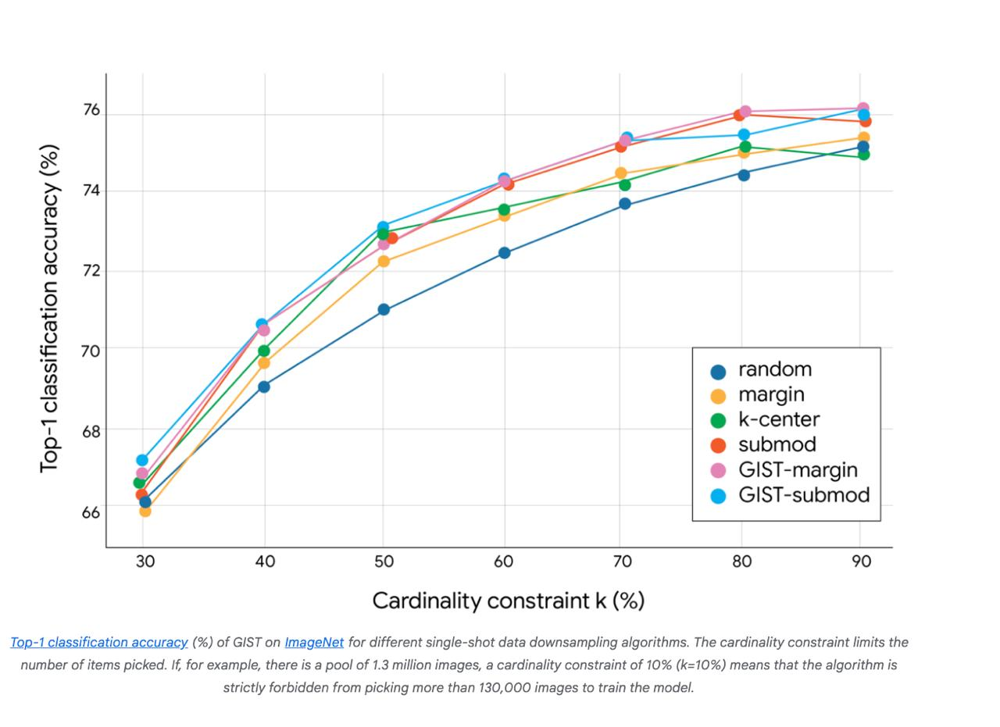

# GIST: Greedy Independent Set Thresholding - Умная выборка данных

## Описание

GIST (Greedy Independent Set Thresholding) - это алгоритм, разработанный Google Research для умной выборки данных из больших наборов данных. Алгоритм решает сложную задачу комбинаторной оптимизации, находя подмножество данных, которое одновременно разнообразно и полезно, обеспечивая теоретические гарантии для компромисса между разнообразием и полезностью.

## Цель

Цель GIST - выбрать подмножество данных, которое:
- **Максимизирует разнообразие**: обеспечивает минимальное расстояние между любыми двумя выбранными точками данных
- **Максимизирует полезность**: суммарную уникальную информацию, покрываемую подмножеством через монотонные субмодулярные функции

## Методология

### Трехступенчатый процесс

1. **Высокоценные точки**: Находит точку с наивысшей оценкой, которая еще не находится "внутри чьей-то пузырьковой зоны"
2. **VIP-селекция**: Выбирает наивысшие "VIP" точки данных и создает "запретные зоны" вокруг них
3. **Сбалансированный отбор**: Обеспечивает, чтобы окончательный выбор был как высококачественным, так и разнообразным

### Графовый подход

- Создается граф, где две точки соединены, если их расстояние меньше заданного порога
- Связанные точки считаются слишком похожими для включения в финальное подмножество
- Решается задача о максимальном независимом множестве (maximum independent set), где ни одна пара точек в подмножестве не соединена
- Используется жадный отбор через несколько порогов расстояний для нахождения оптимального баланса

### Бикритернальная структура

- Систематически тестирует различные правила расстановки, полученные из фактических расстояний между точками данных
- Для каждого правила жадно выбирает наиболее ценные точки, сохраняя ограничения на разнообразие
- Сравнивает результаты по всем протестированным расстояниям, чтобы определить "сладкое пятно"
- Заимствует максимальную полезную информацию, обеспечивая максимальное распределение данных

## Технические детали

### Название алгоритма
Greedy Independent Set Thresholding (GIST)

### Ключевая инновация
GIST разбивает проблему разнообразия-полезности на более простые задачи оптимизации:
1. **Пороговая фильтрация компонента разнообразия**: фиксирует минимально требуемое расстояние и обрабатывает данные с помощью графа, где точки соединены, если их расстояние ниже порога
2. **Приближение независимого множества**: эффективно решает задачу о максимальном независимом множестве с использованием бикритерного жадного алгоритма

### Математические гарантии
- Первый алгоритм, обеспечивающий доказуемые гарантии для компромисса разнообразия-полезности
- Гарантированно находит подмножество данных, значение которого составляет не менее половины значения абсолютного оптимального решения
- Доказано, что NP-трудно найти подмножество с более чем 0.56 долей оптимального значения

### Технический подход
- Использует бикритерный жадный алгоритм для эффективной аппроксимации решений
- Итерируется через возможные пороги расстояний, решая соответствующие проблемы независимого множества
- Сравнивает качество решения при половине расстояния d/2 по отношению к оптимальному при расстоянии d
- Действует как систематическая "настройка", находящая правильный баланс между разнообразием и ценностью

## Применения

### Основной случай использования
- **Выбор подмножества для обучения ML**: Выбор меньших, репрезентативных групп данных из массивных наборов данных для обучения (не тонкой настройки)

### Конкретные области применения
- **Большие языковые модели (LLM)**: Обработка массивных текстовых наборов данных
- **Компьютерное зрение**: Обработка сложных наборов изображений
- **Классификация изображений**: Демонстрация с моделью ResNet-56 на ImageNet
- **Ранжирование главной страницы YouTube**: Повышение разнообразия рекомендаций видео

### Реализация в реальном мире
- YouTube использовал аналогичные принципы максимизации разнообразия для улучшения разнообразия рекомендаций видео и долгосрочной ценности для пользователей

## Преимущества

### Теоретические преимущества
- **Математическая гарантия безопасности**: Обеспечивают доказуемые гарантии приближения, гарантирующие, что решения остаются близкими к истинному оптимуму
- **Сильный теоретический фундамент**: Первый алгоритм с доказуемыми гарантиями для этого конкретного компромисса
- **Конкурентное соотношение**: Сохраняет по крайней мере 50% оптимального решения

### Практические преимущества
- **Высокая точность**: Последовательно превосходит современные эталонные результаты в классификации изображений
- **Скорость**: Этап выбора подмножества невероятно быстр, часто пренебрежительно мало по сравнению со временем обучения модели
- **Масштабируемость**: Практически пригоден для интеграции в крупномасштабные учебные.pipeline с миллиардами точек данных
- **Эффективность**: Оптимизирует однократное уменьшение данных для скорости и вычислительной нагрузки при снижении затрат

### Преимущества в производительности
- Превосходящие результаты по точности классификации по сравнению со случайным, маржинальным, k-центровым и субмодулярным подходами
- Эффективный однократный отбор подмножества, сохраняющий критическую информацию
- Оптимальный баланс покрытия и отсутствия избыточности
- Позволяет обучать подмножества, которые одновременно максимально информативны и минимально избыточны

## Математическая формулировка

GIST решает задачу max-min диверсификации с монотонной субмодулярной полезностью (MDMS), стремясь решить:

**Цель**: Максимизировать $f(S) = g(S) + \lambda \cdot div(S)$

**При этом**: Ограничение по мощности $|S| \le k$

Где:
- $g(S)$ - монотонная субмодулярная функция
- $div(S) = \min_{u,v \in S : u \ne v} dist(u,v)$ - объект диверсификации max-min
- $\lambda$ - параметр, балансирующий два компонента

## Алгоритмические шаги

Алгоритм GIST (Greedy Independent Set Thresholding) работает путем:
1. Приближения серии задач о максимальном независимом множестве
2. Использования бикритерного жадного алгоритмического подхода
3. Решения задачи MDMS, которая включает выбор точек в метрическом пространстве для максимизации как субмодулярной функции, так и диверсификации

## Экспериментальные результаты

Согласно аннотации:
- Эмпирическая оценка показывает, что GIST превосходит современные эталонные алгоритмы
- Эффективность показана на задаче однократного выбора данных на ImageNet
- Демонстрирует эффективность в реальных приложениях, таких как выбор данных и отбор признаков

## Сравнение с другими методами

В документе упоминается:
- GIST превосходит существующие современные эталонные алгоритмы
- Применяется к задачам выбора данных, показывая превосходящую эффективность
- Решает ограничения предыдущих подходов к проблемам диверсификации max-min

## Изображения

**Описание изображения:** GIST ищет точку с наивысшей оценкой, которая еще не находится внутри чьей-либо "пузырьковой зоны". Затем он выбирает наивысшие оценки "VIP" точки данных (точки с цифрами) и рисует "запретную зону" вокруг них, чтобы обеспечить, чтобы отбор ИП был как высококачественным, так и разнообразным. Чем выше число, тем более ценной является эта конкретная часть данных для обучения.

**Описание изображения:** На графике показана точность классификации LOP-1 GIST на ImageNet для различных алгоритмов однократного уменьшения данных. Ограничение по мощности ограничивает количество выбранных элементов. Например, при пуле из 1,3 миллиона изображений и ограничении мощности 10% (k=10%) алгоритму строго запрещено выбирать более 130 000 изображений для обучения модели.

## Связи с другими темами

- [[../../classical_ml/reinforcement_learning/exploration_vs_exploitation|Исследование против эксплуатации]] - Принципы разнообразия и выбора ценных точек, используемые в GIST, перекликаются с балансировкой между исследованием и эксплуатацией в RL
- [[../../neural_networks/transformers/data_quality_assessment|Оценка качества данных для обучения трансформеров]] - GIST способствует повышению качества данных за счет выбора разнообразных и информативных подмножеств
- [[../../classical_ml/clustering/index.md|Кластеризация]] - GIST использует концепции расстояния и схожести, аналогичные методам кластеризации
- [[../../neural_networks/transformers/training/curriculum_learning|Постепенное обучение]] - Подобно GIST, постепенное обучение выбирает наиболее информативные данные для обучения

## Источники

1. [Google Research: Introducing GIST - The Next Stage in Smart Sampling](https://research.google/blog/introducing-gist-the-next-stage-in-smart-sampling/) - Официальное объявление Google Research об алгоритме GIST и его применении для умной выборки данных
2. [GIST: Greedy Independent Set Thresholding for Max-Max Diversification](https://neurips.cc/virtual/2025/poster/119849) - Техническая статья о GIST с математической формулировкой и гарантиями
3. [Google's New GIST Algorithm Could Rewrite How You Sample Data](https://www.etavrian.com/news/google-gist-smart-sampling-algorithm) - Статья о влиянии алгоритма GIST на методы выборки данных