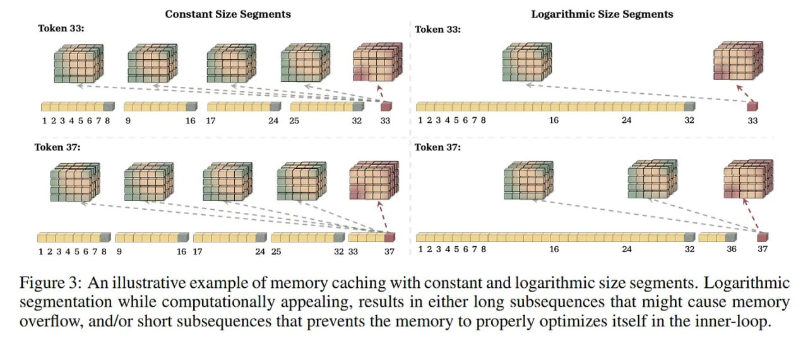

# Memory Caching: RNNs с растущей памятью

## Определение

**Memory Caching (MC)** — это фреймворк для рекуррентных нейронных сетей, который позволяет эффективной ёмкости памяти RNN расти с длиной последовательности путём кэширования чекпоинтов состояний памяти (скрытых состояний) в конце каждого сегмента последовательности. MC находит баланс между вычислительной эффективностью O(L) у RNN и растущей ёмкостью O(L²) у трансформеров, позволяя субквадратичным архитектурам достигать качества трансформеров на задачах in-context retrieval и Needle-In-A-Haystack [[1]](#источники).

## Проблема фиксированной памяти

В современном моделировании последовательностей существует фундаментальный конфликт между объёмом памяти и вычислительной эффективностью:

| Архитектура | Паттерн памяти | Сложность | Компромиссы |
|-------------|----------------|-----------|-------------|
| **Трансформеры** | Внимание как ассоциативная память; ёмкость растёт линейно с контекстом | O(L²) | Безупречный recall, но квадратичные вычисления и огромный KV-кэш на инференсе |
| **Современные RNN** (линейное внимание, structured state-space модели) | Сжимают историю в скрытое состояние фиксированного размера | O(L) | Быстрый инференс, но вынуждены агрессивно сжимать и перезаписывать информацию |

Фиксированная ёмкость памяти RNN математически вынуждает модель перезаписывать прошлую информацию по мере роста длины контекста, что создаёт серьёзное узкое место для задач на рассуждение с длинным контекстом и точным извлечением фактов [[1]](#источники).

## Основная идея Memory Caching

### Последовательность как набор чекпоинтов

Базовая идея MC опирается на рассмотрение рекуррентного обновления как непрерывного процесса оптимизации, где модуль памяти активно выучивает отображение ключей в значения.

Пусть последовательность **x ∈ ℝ^(L × d_in)** разбита на отдельные сегменты **S^(1), ..., S^(N)**. Вместо поддержки единого непрерывного состояния памяти, MC вводит стратегию сегментированного сжатия:

- Для каждого сегмента **s** модель поддерживает свой модуль памяти **M_t^(s)** (это может быть простая матрица или глубокая нейросеть)
- Память обновляется последовательно внутри сегмента: **M_t^(s) = f(M_(t-1)^(s); k_t, v_t)**
- В конце каждого сегмента **i** финальное состояние памяти **M_(L^(i))^(i)** **кэшируется**

Фундаментальная идея MC: история модели — это больше не один чрезмерно сжатый вектор, а растущая библиотека независимых, сегментированных состояний памяти, к которым можно обращаться по отдельности [[1]](#источники).


**Изображение показывает:** Общая схема метода Memory Caching. Каждый токен обращается (attend) к своей онлайн-памяти, а также к набору закэшированных памятей из прошлого.

### Роутинг и агрегация памяти

При обработке токена **x_t** в текущем сегменте **s**:

1. Модель генерирует вектор запроса: **q_t = x_t W_q**
2. В стандартной RNN выход: **y_t = M_t^(s)(q_t)** (только отклик текущей онлайн-памяти)
3. С Memory Caching система агрегирует отклики из закэшированной истории

Для эффективного управления этим процессом авторы предлагают несколько стратегий агрегации.

## Варианты агрегации памяти

### 1. Residual Memory (Остаточная память)

Простейший оператор агрегации — суммирование, действующее как residual connection across memory states:

**M_t^(s) = M_(t-1)^(s) + v_t k_t^⊤** (обновление памяти)

**y_t = Σ_(i=1)^s M_(L^(i))^(i)(q_t)** (агрегация выходов)

Критическое изменение в MC — как вычисляется выход: для retrieval модель использует forward pass как по текущей памяти (online memory), так и по закэшированным памятям для входного запроса q_t [[1]](#источники).

### 2. Gated Residual Memory (GRM)

Когда модуль памяти строго линейный, Residual Memory математически схлопывается в стандартную память фиксированного размера. Для преодоления этого ограничения вводится **input-dependent gating**:

**γ_t^(i)** — входозависимые параметры (0 ≤ γ_t^(i) ≤ 1), определяющие вклад каждого сегмента:

**y_t = γ_t^(s) M_t^(s)(q_t) + Σ_(i∈R_t) γ_t^(i) M_(L^(i))^(i)(q_t)**

Параметризация γ_t^(i) через коннектор **u_t = x_t W_u** и similarity:

**γ_t^(i) = ⟨u_t, MeanPooling(S^(i))⟩**

где MeanPooling(S^(i)) = Σ_(j∈S^(i)) k_j — простое представление контекста сегмента [[1]](#источники).

### 3. Memory Soup

Вдохновлённый weight souping (Wortsman et al., 2022), Memory Soup комбинирует состояния памяти (параметры) в единый data-dependent модуль памяти для retrieval:

**θ_(M*_t) := {Σ_(i=1)^s γ_t^(i) W_1^(i), ..., Σ_(i=1)^s γ_t^(i) W_c^(i)}**

Каждый токен строит свой собственный модуль памяти для retrieval, который также зависит от входных данных. Для линейных модулей Memory Soup математически эквивалентен GRM, но для глубоких нелинейных памятей (например, DLA или Titans) это создаёт новый input-dependent модуль памяти путём интерполяции самих параметров [[1]](#источники).

### 4. Sparse Selective Caching (SSC)

Предыдущие варианты обращаются ко всем закэшированным памятям, что вызывает значительный overhead памяти для ультра-длинных последовательностей. SSC использует router в стиле Mixture-of-Experts (MoE):

**r_t^(i) = ⟨u_t, MeanPooling(S^(i))⟩** — relevance score для каждого сегмента

Router выбирает **top-k** наиболее релевантных закэшированных состояний:

**R_t = arg Top-k({r_t^(i)}_(i=1)^(s-1))**

Итоговый выход использует только выбранные памяти:

**y_t = γ_t^(s) M_t^(s)(q_t) + Σ_(i∈R_t) γ_t^(i) M_(L^(i))^(i)(q_t)**


**Изображение показывает:** Sparse Selective Caching (SSC) памятей. Router измеряет контекстуальную схожесть каждого токена с его прошлыми сегментами и выбирает подмножество закэшированной памяти для лучшей эффективности.

MeanPooling(S^(i)) каждого сегмента может быть вычислен заранее, что делает вычисление relevance score и выбор Top-k сегментов для каждого токена полностью распараллеливаемым на GPU/TPU [[1]](#источники).

## Сложность памяти

- **Обновление памяти**: O(L) операций (не изменилось по сравнению со стандартными RNN)
- **Retrieval процесс**: требует forward pass по всем закэшированным памятям → O(N) операций на токен
- **Общая сложность**: **O(NL)**, где 1 ≤ N ≤ L

Гибкость MC:
- **N = 1** (один сегмент): не нужно кэшировать память → простая рекуррентная модель
- **N = L** (каждый токен — отдельный сегмент): кэшируются состояния памяти для всех прошлых токенов → близко к механизму внимания трансформеров [[1]](#источники).



**Изображение показывает:** Иллюстративный пример Memory Caching с сегментами постоянного и логарифмического размера. Логарифмическая сегментация, хотя и вычислительно привлекательна, приводит либо к длинным подпоследовательностям (риск переполнения памяти), либо к коротким подпоследовательностям (память не успевает правильно оптимизироваться во inner-loop).

## Эмпирические результаты

### Needle-In-A-Haystack (S-NIAH)

Базовые архитектуры DLA и Titans испытывают быструю деградацию на задаче S-NIAH-1 с контекстом 16K, падая до **44.0%** точности. При интеграции MC с SSC или GRM точность восстанавливается до **100%** на всех проверяемых длинах контекста [[1]](#источники).

**Таблица 2:** Эксперименты Needle-In-A-Haystack с тремя уровнями сложности: single-needle задачи — S-NIAH-1 (passkey retrieval), S-NIAH-2 (numerical needle), и S-NIAH-3 (UUID-based needle).

| Модель | S-NIAH-1 (passkey) | S-NIAH-2 (number) | S-NIAH-3 (UUID) |
|--------|-------------------|-------------------|-----------------|
| Titans (LMM) + Log-Linear++ | 100 | 95.6 | 17.0 |
| Titans (LMM) + Memory Soup | 100 | 95.5 | 18.6 |
| Titans (LMM) + SSC | 100 | 100 | 19.6 |

[[1]](#источники)

### Задачи in-context retrieval

MC заметно улучшает результаты на сложных задачах in-context retrieval (SQuAD, TriviaQA, Drop, NQ):

**Таблица 3:** Точность на задачах retrieval с усечением входных данных до разных длин.

| Модель | SWDE | SQuAD | FDA | TriviaQA | Drop | NQ | Avg. |
|--------|------|-------|-----|----------|------|-----|------|
| Titans (MLAL) | 31.9 | 46.6 | 46.5 | 44.6 | 45.1 | 44.6 | 40.46 |
| Titans (MLAL) + Memory Soup | 49.5 | 45.0 | 36.0 | 46.0 | 46.4 | 44.2 | 35.05 |
| Titans (LMM) | 49.2 | 34.4 | 29.0 | 44.2 | 44.7 | 45.9 | 44.5 |
| Titans (LMM) + Memory Soup | 48.3 | 46.6 | 44.8 | 48.3 | 46.6 | 44.8 | 38.43 |

Хотя чистые трансформеры всё ещё сохраняют небольшое преимущество в абсолютной точности (в среднем 41.00%), модели Titans, усиленные GRM/Memory Soup, радикально сокращают исторический разрыв между RNN и классическим вниманием [[1]](#источники).

### Пропускная способность обучения

Пропускная способность (throughput) при обучении варианта SSC остаётся практически плоской при масштабировании контекста до 32K токенов, избегая коллапса производительности, характерного для трансформеров [[1]](#источники).

**Таблица 4:** Точность на задачах LongBench (NarrativeQA, QasperQA, MultiFieldQA, HotpotQA, 2WikiMultihopQA, Musique, GovReport, QMsum, MultiNews, TREC, TriviaQA, SamSum, LCC, RepoBench-P).

| Модель | Single-Doc QA | Multi-Doc QA | Summarization | Few-shot | Code |
|--------|--------------|--------------|---------------|----------|------|
| Titans (LMM) + SSC | 10.7 | 17.2 | 15.8 | 14.7 | 41.9 |
| Titans (LMM) + GRM | 11.8 | 19.9 | 17.4 | 14.8 | 41.0 |

[[1]](#источники).

## Ограничения подхода

Несмотря на элегантность, фреймворк вводит нетривиальные компромиссы:

1. **Линейный overhead**: Постоянный размер сегмента добавляет сложность O(NL) для извлечения. Хотя это намного лучше O(L²) внимания, это всё равно мешает истинно бесконечному масштабированию контекста.

2. **Логарифмическая сегментация**: Авторы отмечают возможность использования логарифмической сегментации для снижения сложности до O(L log L), но математически это заставит утрамбовывать старые токены в массивные, сильно сжатые чанки, что агрессивно снижает точность извлечения.

3. **Memory Soup limitations**: Интерполяция параметров в Memory Soup концептуально интересна, но простое линейное смешивание весов глубоких нелинейных сетей не гарантирует получения функционально согласованной сети при сложном ландшафте лосса. Это ограничивает робастность такого подхода по сравнению с чистым роутингом SSC [[1]](#источники).

## Место в ландшафте субквадратичных моделей

Memory Caching органично вписывается в недавнее возрождение субквадратичных архитектур:

- Развивается параллельно с модификациями линейного внимания вроде **RetNet** и **RWKV**
- Напрямую опирается на идеи **меморизации на инференсе** (test-time memorization), где скрытые состояния RNN интерпретируются как ассоциативная память, оптимизируемая через градиентный спуск
- В отличие от подходов с древовидной структурой Фенвика (Fenwick tree) для логарифмического масштабирования состояний, MC выделяется введением **контекстно-зависимого роутинга (SSC)**, гарантирующего, что извлечение базируется на семантической релевантности, а не на жёстких позиционных деревьях [[1]](#источники).

## Связи с другими темами

- [[../transformers/memory_augmented_transformers.md]] — Дополненные памятью трансформеры (MATs), включая архитектуры Titans с модулем долгосрочной памяти (LMM)
- [[../transformers/long_context_transformers.md]] — Длинноконтекстные трансформеры и методы обработки длинных последовательностей
- [[../transformers/state_space_models.md]] — State Space Models (SSM) и Mamba, современные субквадратичные архитектуры
- [[../transformers/retnet_architecture.md]] — RetNet архитектура, субквадратичная альтернатива трансформерам
- [[../transformers/rwkv_architecture.md]] — RWKV архитектура, комбинация RNN и трансформеров
- [[../transformers/hybrid_architectures.md]] — Гибридные архитектуры, сочетающие внимание и RNN
- [[../transformers/linear_sequence_modeling.md]] — Линейное моделирование последовательностей
- [[../../ai/llm/llm_memory_systems/llm_memory_overview.md]] — Обзор систем памяти в LLM
- [[../../algorithms/neural_networks/architecture_patterns/efficient_architectures.md]] — Эффективные архитектуры нейронных сетей

## Источники

1. **Memory Caching: RNNs with Growing Memory** — Ali Behrouz, Zeman Li, Yuan Deng, Peilin Zhong, Meisam Razaviyayn, Vahab Mirrokni. arXiv:2602.24281, 2026. [https://arxiv.org/abs/2602.24281](https://arxiv.org/abs/2602.24281)
2. **Memory Caching: RNNs with Growing Memory (review)** — arxivIQ Substack. [https://arxiviq.substack.com/p/memory-caching-rnns-with-growing](https://arxiviq.substack.com/p/memory-caching-rnns-with-growing)

## Дополнительные материалы

- **Hierarchical Sparse Attention** — упомянуто в обзоре как похожий подход: [https://t.me/gonzo_ML_podcasts/1574](https://t.me/gonzo_ML_podcasts/1574)
- **Titans** — архитектура с модулем долгосрочной памяти, на которую опирается MC: [https://t.me/gonzo_ML_podcasts/1300](https://t.me/gonzo_ML_podcasts/1300)

```metadata
category: machine_learning
subcategory: neural_networks
tags: rnn, memory_caching, recurrent_networks, long_context, subquadratic, efficient_architectures, deep_learning, sequence_modeling
```
