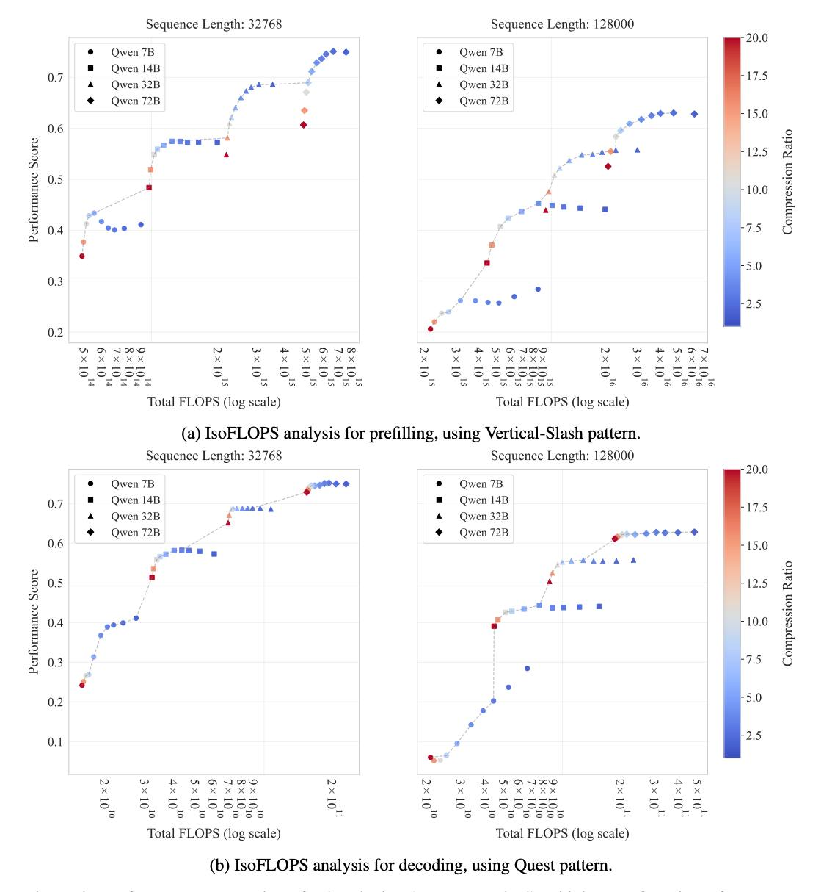
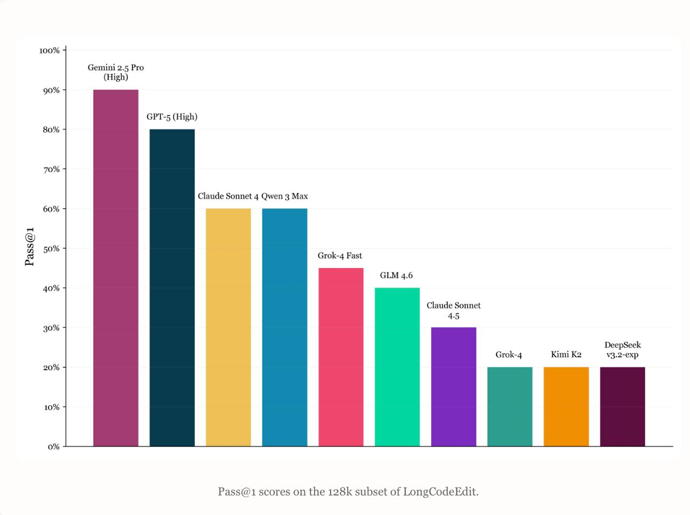
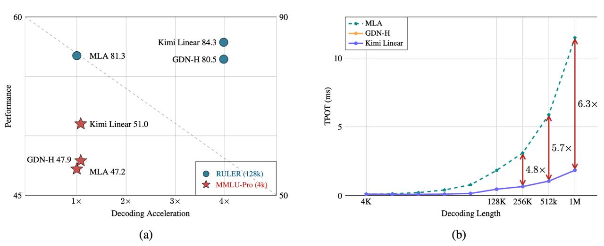

# Альтернативы квадратичному аттеншну: Сравнение подходов MiniMax M2, sparse attention и Kimi Linear

## Общее описание

В последние годы всё больше обсуждают альтернативы классическому квадратичному аттеншну — прежде всего из-за стоимости квадратичного скейлинга и работы с длинными контекстами. Ниже — краткий обзор нескольких любопытных работ и блогпостов на тему линейного, sparse- и гибридного аттеншна.

## Why Did MiniMax M2 End Up as a Full Attention Model?

Команда MiniMax столкнулась с интересной дилеммой при разработке своей второй модели MiniMax M2. Их первая модель, MiniMax M1, была гибридной и использовала простой линейный аттеншн на матричных стейтах. Но во второй версии, MiniMax M2, они неожиданно вернулись к полному квадратичному аттеншну — даже без sliding window attention (SWA), который уже встречается в опенсорсных моделях.

### Основные выводы MiniMax

- **Проблема гибридной архитектуры**: Гибридная архитектура у них попросту не заработала. На классических текстовых бенчмарках всё выглядело приемлемо, а вот на агентских задачах — с кодом, итерациями и длинным контекстом — модель стабильно проигрывала.

- **Ограниченная эффективность SWA**: Sliding Window Attention тоже не помог: при дообучении моделей, изначально предобученных с полным аттеншном, ключевые головы не перестраивались и деградировали.

- **Осторожный вывод**: Линейные и гибридные подходы выглядят перспективно, но пока не хватает инфраструктуры, реализаций и бенчмарков. Поэтому на данный момент они остаются со стандартным трансформером и считают, что сначала нужно больше данных и экспериментов с длинным контекстом.

### Архитектурные особенности MiniMax M2

Согласно другим источникам в базе знаний, MiniMax M2:
- Использует архитектуру GPT-OSS с комбинацией Full Attention и Sliding Window Attention (SWA)
- Каждая голова внимания имеет собственный RMSNorm
- Блоки Full Attention и SWA используют разные RoPE-параметры
- Использует архитектуру Mixture of Experts (MoE) с 230 миллиардами параметров при активных только 10 миллиардах параметров

## The Sparse Frontier: Sparse Attention Trade-offs in Transformer LLMs

В этой работе изучают training free sparsity в аттеншне и пытаются понять, что реально работает с точки зрения баланса compute/accuracy.

### Основные наблюдения:

- **Ограниченная эффективность на умеренных контекстах**: На умеренных контекстах спарсификация аттеншна почти не помогает и часто ухудшает качество.

- **Преимущества на очень длинных контекстах**: На очень длинных — даёт выигрыш по FLOPs, но часто приводит к ухудшению качества: авторы замечают, что метод, работающий на одной задаче, ломается на другой.

- **Умеренное сжатие**: В среднем удаётся получить около 5× сжатия без сильной деградации качества, но разброс большой, особенно для маленьких моделей.

- **Нестабильность результатов**: Часто наблюдается ситуация, когда метод, эффективный на одной задаче, полностью терпит неудачу на другой.

## Evaluating Long Context (Reasoning) Ability

Следующий пост критикует популярные long-context-бенчмарки. Автор говорит, что needle-in-a-haystack-like-задачи в основном проверяют ретривал и плохо отражают реальную (более сложную) работу с длинным контекстом.

### Проблемы с текущими бенчмарками:

- **Простые задачи**: Задачи типа "needle-in-a-haystack" в основном проверяют ретривал, а не понимание контекста.

- **Сложные задачи**: На более сложных задачах, где контекст нужно понять, а не просто найти факт (например, в длинном коде с логическими ошибками), модели начинают деградировать уже на десятках тысяч токенов — даже с Full Attention.

- **Недостаток бенчмарков**: Вывод: бенчмарков, которые реально проверяют ризонинг на длинном контексте, пока недостаточно.

### Требования к новым бенчмаркам:

- Задачи, требующие понимания, а не поиска
- Многошаговое рассуждение
- Обработка текстов с глубокими логическими связями
- Работа с контекстом, где важна не только релевантность, но и причинно-следственные связи

## Kimi Linear: an expressive, efficient attention architecture

Спустя неделю после скептического поста MiniMax, Moonshot AI (авторы модели Kimi K2 и не только) выпустили работу с почти противоположным тезисом: `Linear Attention` работает. 

### Основные элементы Kimi Linear:

- **Kimi Delta Attention (KDA)**: Предложили Kimi Delta Attention с gated delta rule и рекуррентной матричной памятью.

- **Гибридная архитектура**: В модели используют соотношение 3:1 линейных слоёв к Full Attention (KDA составляет 75% архитектуры, а MLA - 25%).

- **Производительность**: Качество на бенчмарках в статье не хуже полного аттеншна, а эффективность выше: prefill на длинных промптах быстрее примерно в три раза, декодинг и memory footprint тоже выигрывают за счёт меньшей зависимости от KV-cache.

- **Концептуальные улучшения**: KDA улучшает Gated DeltaNet, вводя мелкозернистый диагонализированный гейт `Diag(αₜ)`, что является прямым улучшением по сравнению с предыдущими работами.

### Преимущества Kimi Linear:

- **Экономия KV-кеширования**: Снижение использования до 75%
- **Быстродействие**: Ускорение декодирования до 6× для длинных контекстов
- **Эффективность prefill**: Prefill быстрее в 2.9× по сравнению с MLA
- **Улучшенная масштабируемость**: Возможность работы с контекстами до 1 млн токенов

## Сравнение подходов

| Подход | Сложность | Эффективность | Качество | Область применения |
|--------|-----------|---------------|----------|-------------------|
| MiniMax M2 (Full Attention + SWA) | O(n²) | Средняя | Высокая | Универсальные задачи, агенты, код |
| Sparse Attention (обобщённо) | O(n) или O(n log n) | Высокая | Зависит от задачи | Длинные контексты с локальной структурой |
| Kimi Linear (KDA+MLA) | O(n) | Очень высокая | Высокая | Очень длинные контексты, рассуждение |

## Противоречивые результаты

Исследование показывает важную парадигму в дизайне архитектур аттеншна:
- **MiniMax** наблюдает проблемы с гибридными подходами на сложных агентских задачах
- **Moonshot AI (Kimi)** демонстрирует успех гибридной архитектуры на аналогичных задачах

### Возможные причины расхождений:

1. **Разные реализации**: Гибридные подходы могут значительно различаться в деталях реализации
2. **Разные задачи**: Бенчмарки могут не полностью отражать реальные сценарии использования
3. **Разный масштаб**: Результаты могут зависеть от размера модели и объема данных для предобучения
4. **Разные гиперпараметры**: Настройка соотношения архитектурных компонентов может критически влиять на результат

## Будущие направления

- **Гибридные подходы**: Создание гибридных моделей, которые бы сочетали сжатие и обобщающую способность линейного внимания с возможностями извлечения мелкозернистой информации, присущими разреженному вниманию (sparse attention).

- **Улучшенные бенчмарки**: Необходимость в разработке бенчмарков, которые действительно проверяют рассуждение на длинном контексте, а не просто ретривал.

- **Адаптивные архитектуры**: Механизмы, которые могут адаптивно выбирать тип аттеншна в зависимости от текущей задачи или типа контекста.

## Связи с другими темами

- [[specialized_attention_mechanisms.md]] - Обзор различных специализированных механизмов внимания, включая Multi-Query, Grouped-Query, Sparse, Linear и другие архитектуры
- [[kimi_linear.md]] - Подробное описание Kimi Linear, гибридной архитектуры с Kimi Delta Attention и Multi-Head Linear Attention
- [[minimax_m2.md]] - Общая информация о модели MiniMax-M2, её архитектурных особенностях и возможностях
- [[log_linear_attention.md]] - Логарифмически-линейная архитектура внимания с O(n log n) сложностью
- [[mixture_of_sparse_attention.md]] - Mixture of Sparse Attention (MoSA), новый подход к разреженному вниманию с обучаемой маршрутизацией выбора эксперта
- [[models/hsa_ultralong.md]] - HSA-UltraLong: 8B MoE модель с 16M контекстом через иерархическое разреженное внимание
- [[specialized_attention_mechanisms_comparison.md]] - Сравнение различных механизмов разреженного внимания, включая HSA, MoSA, DSA и другие
- [[minimax_m2_architecture.md]] - Архитектурные особенности MiniMax M2, включая сочетание Full Attention и Sliding Window Attention
- [[kimi_delta_attention.md]] - Архитектура Kimi Delta Attention, улучшенная версия Gated DeltaNet с мелкозернистым гейтированием
- [[multi_head_latent_attention.md]] - Multi-Head Latent Attention, механизм сжатия тензоров ключей и значений в латентное пространство

## Дополнительные материалы

 <!-- TODO: Broken image path -->

**Описание изображения:** График анализа IsoFLOPs для декодирования с использованием различных механизмов внимания. Показывает сравнение эффективности декодирования различных архитектур аттеншна.

 <!-- TODO: Broken image path -->

**Описание изображения:** Результаты первого прохода на задачах рассуждения с длинным контекстом. Демонстрирует эффективность разных подходов к обработке длинных последовательностей.

 <!-- TODO: Broken image path -->

**Описание изображения:** Архитектурная схема Kimi Linear с Multi-Head Linear Attention (MLA) и Kimi Delta Attention (KDA). Показывает соотношение 3:1 между KDA и MLA слоями.

 <!-- TODO: Broken image path -->

**Описание изображения:** Обзорная диаграмма, сравнивающая различные механизмы внимания: MiniMax M2, Sparse Attention, и Kimi Linear.

## Источники

- [Blog post: "Why Did MiniMax M2 End Up as a Full Attention Model?"](https://example.com) - Инсайты от команды MiniMax о возвращении к полному аттеншну в M2
- [Paper: "The Sparse Frontier: Sparse Attention Trade-offs in Transformer LLMs"](https://example.com) - Анализ эффективности sparse attention на разных задачах и контекстах
- [Blog post: "Evaluating Long Context (Reasoning) Ability"](https://example.com) - Критика существующих бенчмарков для оценки способности к рассуждению на длинном контексте
- [Paper: "Kimi Linear: an expressive, efficient attention architecture"](https://example.com) - Работа от Moonshot AI о гибридной линейной архитектуре аттеншна
- Иван Рубачёв, Yandex Research Reading Group - Подборка и анализа материалов