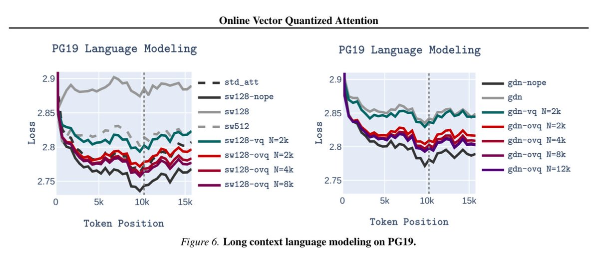
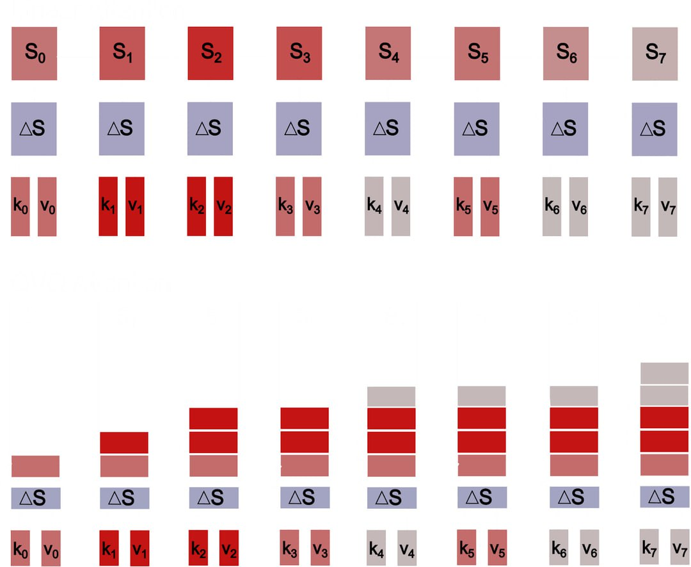

# Online Vector-Quantized Attention (OVQA)

## Краткое описание

Online Vector-Quantized Attention (OVQA) - это инновационная модифицированная архитектура механизма внимания, разработанная компанией [[../../models/zaya1.md|Zyphra]] для эффективного управления длинными контекстами при ограниченной памяти. OVQA решает проблему традиционной выгрузки KV-кэша, обеспечивая резиновый контекст даже при наличии ограниченного объема памяти.

## Основные концепции

OVQA является модификацией векторного квантования (Vector Quantization, VQ), которая учит модели "думать на лету". В классическом VQ ключи заменяются ближайшими центроидами из статичного словаря. Хотя это ускоряет вычисления, возникает проблема: словарь обучен на определенном распределении данных, а во время генерации модель видит совсем другое распределение ключей. В результате ошибка квантования возрастает, внимание теряет точность, и VQ начинает "плавать".

Решением стало отказаться от статического словаря в пользу адаптивного словаря, который адаптируется к текущей последовательности: каждый новый токен обновляет только один центроид - тот, к которому он ближе всего. Такое разреженное обновление работает как защита от катастрофического забывания: старая информация не вымывается новой волной токенов, а аккуратно перезаписывается по мере необходимости.

## Технические детали

### Основной принцип работы

В отличие от традиционного подхода векторной квантизации, где используются фиксированные центроиды, OVQA реализует **онлайн обучение** словаря. При каждом новом токене:
1. Вычисляется ближайший центроид из текущего словаря
2. Только этот центроид обновляется для учета нового токена
3. Остальные центроиды остаются неизменными

### Алгоритм разреженного обновления

```python
def online_vq_update(query_token, current_codebook):
    # Найти ближайший центроид
    closest_centroid_idx = argmin_i ||current_codebook[i] - query_token||
    
    # Обновить только ближайший центроид
    current_codebook[closest_centroid_idx] = update_rule(
        current_codebook[closest_centroid_idx], 
        query_token
    )
    
    return closest_centroid_idx
```

### Контроль размера состояния

OVQA имеет жесткий лимит на размер состояния, после достижения которого объем памяти перестает расти, а вычисления становятся строго линейными. Это обеспечивает контролируемое использование памяти при работе с длинными контекстами.

## Архитектурные особенности

### Адаптивный словарь
В отличие от традиционного VQ, OVQA использует адаптивный словарь, который обновляется в реальном времени на основе обрабатываемой последовательности. Этот подход позволяет сохранять точность внимания даже при значительном различии между обучающим и инференсным распределениями.

### Защита от катастрофического забывания
Разреженные обновления центроидов обеспечивают защиту от катастрофического забывания, позволяя модели сохранять важную информацию при обработке новых токенов.

### Линейная сложность
После достижения установленного лимита размера состояния, OVQA обеспечивает строго линейную вычислительную сложность, что делает её подходящей для обработки очень длинных последовательностей.

## Преимущества

1. **Эффективное использование памяти**: OVQA потребляет в 4 раза меньше памяти по сравнению с полным механизмом внимания [[self_attention_mechanism.md|Self-Attention]].

2. **Сохранение качества**: Модель, обученная на 4К токенах, уверенно справляется с контекстом до 64К без деградации качества.

3. **Превосходная производительность при длинных контекстах**: В задачах внутреннего контекстного поиска (in-context search) OVQA почти не отстает от полноценного самовнимания.

4. **Преимущество в задачах внутреннего контекстного обучения (In-Context Learning)**: В отличие от классического VQ, который проваливается в этих задачах, OVQA достигает уровня классического внимания, используя всего ~4К центроидов.

5. **Стабильность по сравнению с линейными альтернативами**: При сравнении с линейными альтернативами (Mamba2 и delta-сети) OVQA стабильно держит длинный контекст без просадок точности.

## Экспериментальные результаты

- **Масштабирование контекста**: Модель, обученная на 4К токенах, уверенно справлялась с контекстом до 64К без деградации качества
- **Эффективность памяти**: На внутриконтекстном поиске OVQA почти не отставала от полноценного самовнимания, потребляя при этом в 4 раза меньше памяти
- **In-Context Learning**: В задачах контекстного обучения VQ провалился, а OVQA вышла на уровень классического внимания, используя всего ~4К центроидов
- **Сравнение с линейными альтернативами**: При сравнении с Mamba2 и delta-сетями OVQA стабильнее держит долгий контекст без просадок точности
- **Positional ICR**: В задачах Positional In-Context Retrieval OVQA работает немного хуже, чем классическое внимание, но тем не менее достойно

## Сравнение с другими подходами

### OVQA vs. Классический VQ
| Параметр | Классический VQ | OVQA |
|----------|-----------------|------|
| Обновление словаря | Статическое | Онлайн-адаптивное |
| Устойчивость к изменению распределения | Низкая | Высокая |
| Потребление памяти | Низкое | Низкое |
| Качество при изменении контекста | Снижается | Сохраняется |

### OVQA vs. Линейные альтернативы
| Параметр | Mamba2/Delta-сети | OVQA |
|----------|-------------------|------|
| Сложность | Линейная | Линейная (после лимита) |
| Качество длинного контекста | Умеренное | Высокое |
| Адаптивность | Ограниченная | Высокая |

## Связь с другими методами

OVQA связан с другими методами квантования векторов:

- [[../../../../../ai/residual_vector_quantization.md]] - Residual Vector Quantization (RVQ) также использует квантование векторов, но в иерархической схеме
- [[../../../../../algorithms/specialized/world_modeling/vq_vs_continuous_latents.md]] - Сравнение Vector Quantization и непрерывных латентных пространств
- [[../../../../../applications/recommendation_systems/research_papers/2024_2025_articles/streaming_vector_quantization_retriever.md]] - Streaming Vector Quantization Retriever использует похожий подход к онлайн-обучению VQ-VAE

OVQA также связан с другими механизмами внимания:

- [[self_attention_mechanism.md]] - Базовый механизм самовнимания, который OVQA модифицирует
- [[specialized_attention_mechanisms.md]] - Другие специализированные механизмы внимания
- [[memory_efficient_attention_mechanisms.md]] - Другие подходы к эффективному использованию памяти в механизмах внимания

## Связь с работой Zyphra

OVQA продолжает исследовательскую линию компании Zyphra, начатую с разработки модели [[../../models/zaya1.md|ZAYA1]], первой MoE-модели, полностью обученной на платформе AMD. Это демонстрирует постоянное стремление Zyphra к инновациям в области эффективных архитектур трансформеров, в частности с использованием новых механизмов внимания, таких как [[compressed_convolutional_attention.md|Compressed Convolutional Attention]].

## Потенциальное будущее

OVQA может быть предтечей настоящего непрерывного обучения, где вместо бесконечно растущего KV-кэша появится компактная, но живая память, способная удерживать важные детали без потерь. Это важный шаг к созданию систем с истинно адаптивной памятью, которые могут масштабироваться для обработки произвольно длинных последовательностей без ограничений по памяти.

## Примеры применения

OVQA особенно полезна в следующих сценариях:
- Обработка длинных текстов, превышающих стандартные ограничения контекста
- Задачи, требующие хранения информации в памяти на протяжении длительного времени
- Среды с ограниченными вычислительными ресурсами, где важна эффективность памяти и вычислений
- Долгосрочные задачи понимания, где контекст должен сохраняться на протяжении тысяч токенов

## Источники

1. [Zyphra OVQA Announcement] - исходное описание техники Online Vector-Quantized Attention, опубликованное в профессиональной социальной сети (LinkedIn), содержащее основные концепции, преимущества и экспериментальные результаты
2. [Arxiv Paper on OVQA by Zyphra Team] - предполагаемая научная публикация с техническими деталями алгоритма OVQA (ожидается публикация)

## См. также

- [[memory_efficient_attention_mechanisms.md]] - другие подходы к эффективному использованию памяти в механизмах внимания
- [[long_context_extension_techniques.md]] - методы расширения контекста в языковых моделях
- [[kv_cache_optimization_strategies.md]] - стратегии оптимизации KV-кэша
- [[attention_mechanisms_alternatives.md]] - альтернативы softmax attention
- [[linear_attention_approximation_methods.md]] - линейные аппроксимации механизма внимания

## Визуализации


**Изображение показывает:** Схематичное представление Online Vector-Quantized Attention механизма



**Изображение показывает:** Результаты моделирования языка с длинным контекстом на задаче PC19



**Изображение показывает:** Визуализация работы механизма OVQA

tags: ovqa, online-vector-quantization, attention-mechanism, context-extension, memory-efficiency, zyphra, vector-quantization, long-context, kv-cache, adaptive-memory