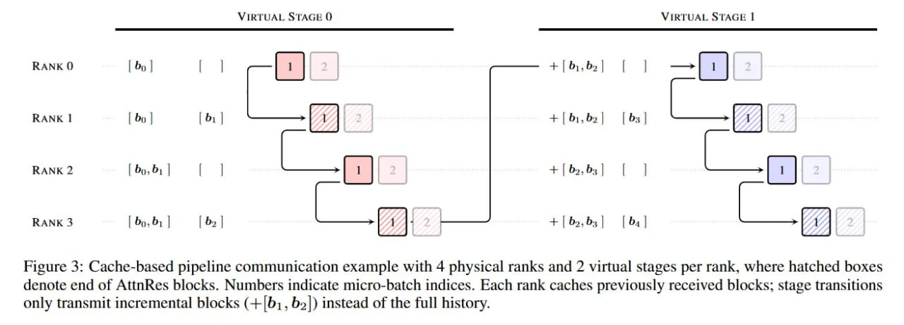

# Attention Residuals (AttnRes): Замена фиксированных residual connections на depth-wise внимание

## Обзор

**Attention Residuals (AttnRes)** — архитектурная инновация от команды Kimi (Moonshot AI), предложенная в 2026 году, которая заменяет традиционные аддитивные residual-соединения на механизм **выучиваемого поканального внимания с софтмаксом** для агрегации репрезентаций из всех предыдущих слоёв по глубине сети.


**Изображение показывает:** (a) Standard Residuals — стандартные residual соединения с равномерным аддитивным накоплением; (b) Full AttnRes — каждый слой селективно агрегирует выходы всех предыдущих слоёв через выученные веса внимания; (c) Block AttnRes — слои группируются в блоки, уменьшая память с O(Ld) до O(Nd).

**Ключевое достижение:** Вычислительное преимущество в **1.25x** при достижении целевого лосса бейзлайна на задачах на рассуждение (GPQA, Math, HumanEval) при идентичном количестве параметров.

## Проблема: PreNorm Dilution (Размытие в PreNorm)

### Стандартные residual connections

В архитектуре трансформеров с PreNorm базовое правило обновления:

```
h_l = h_{l-1} + f_{l-1}(h_{l-1})
```

Это работает как градиентная магистраль, обеспечивающая стабильное обучение за счёт обхода нелинейных преобразований. Однако такое сложение накладывает жёсткое структурное ограничение: **равномерную агрегацию по глубине**.

### Проблема размытия

Каждому предыдущему слою присваивается одинаковый единичный вес. В сочетании со стандартной архитектурой PreNorm [[normalization_placement.md]], такое невзвешенное накопление приводит к тому, что:

- **Магнитуда скрытого состояния растёт как O(L)** с глубиной сети
- Информация из ранних слоёв **теряется в residual stream**
- Более глубокие слои вынуждены выдавать всё большие активации для преодоления "раздутого" потока
- Снижается **эффективная глубина** и дестабилизируется динамика обучения

Это устанавливает **структурный предел на масштабирование моделей в глубину**.

## Решение: Внимание по глубине сети

### Основная идея

Авторы проводят аналогию между:
- **Временным измерением** в рекуррентных нейросетях
- **Измерением глубины** в сетях прямого распространения

Подобно тому как трансформеры заменили временную рекуррентность механизмом self-attention, авторы предлагают заменить **аддитивную рекуррентность по глубине на внимание с софтмаксом**.

### Математическая формулировка

**Полный механизм Attention Residuals:**

```
h_l = Σ_{i=0}^{l-1} α_{i→l} · v_i
```

где:
- `v_0 = h_1` — базовый эмбеддинг токена
- `v_i = f_i(h_i)` — преобразования последующих слоёв
- `α_{i→l}` — распределение внимания, управляющее агрегацией

**Распределение внимания вычисляется как:**

```
α_{i→l} = softmax(w_l^T · RMSNorm(v_i))
```

где:
- `w_l ∈ ℝ^d` — **специфичный для слоя выучиваемый псевдо-запрос (pseudo-query)**, независимый от входных данных
- `RMSNorm` — критическая математическая деталь для нормализации исторических векторов

### Роль RMSNorm

Добавление оператора RMSNorm — критическая деталь. Он нормализует исторические векторы ключей `v_i`, чтобы:
- Выходы с большой магнитудой **пассивно не доминировали** в распределении софтмакса
- Сеть принимала **осознанные решения о маршрутизации на основе контента**
- Реализовывалась **конкурентная нормализация источников**

## Block AttnRes: Масштабирование для больших моделей

### Проблема полного механизма

При полном механизме Attention Residuals вычисление входа для слоя `l` требует пулинга внимания над выходами всех `l-1` предыдущих слоёв. Это требует поддержания **KV-кеша выходов слоёв размером O(Ld)**, что непрактично для глубоких сетей.

### Поблочная агрегация

Авторы вводят механизм **Block AttnRes**:

1. Непрерывная последовательность из `L` слоёв разбивается на `N` отдельных блоков
2. Вместо хранения каждого слоя система накапливает **частичную сумму для каждого блока**:

```
b_n = Σ_{j∈block_n} f_j(h_j)
```

3. Когда токен поступает на новый слой внутри блока `n`, его псевдо-запрос `w_l` смотрит на:
   - Эмбеддинг токена `b_0`
   - Завершённые исторические репрезентации блоков `[b_1, ..., b_{n-1}]`
   - Обновляемую внутриблочную частичную сумму `b_n^{i-1}`

### Преимущества Block AttnRes

- Уменьшает KV-кеш по глубине с **O(Ld) до O(Nd)**
- Плавно интерполирует между:
  - **Стандартным residual-коннектом (N=1)**
  - **Полным вниманием по глубине (N=L)**

## Оптимизация пайплайн-параллелизма

### Проблема коммуникации

В стандартном пайплайн-параллелизме передача полной истории из `N` репрезентаций блоков на каждой границе перегрузила бы коммуникационную шину.

### Cross-stage caching

Исследователи спроектировали систему **кеширования между стадиями**:

- Физические стадии обрабатывают несколько виртуальных стадий подряд
- Узлы локально кешируют поступающие истории блоков
- На последующих виртуальных стадиях передаются только **новые инкрементальные суммы блоков** вместо всего исторического контекста



**Изображение показывает:** Пример коммуникации в пайплайне с кешированием на 4 физических рангах и 2 виртуальных стадиях на ранг, где заштрихованные блоки обозначают конец блоков AttnRes. Каждая стадия кеширует ранее полученные блоки; переходы между стадиями передают только инкрементальные блоки вместо полной истории.

### Двухфазная схема инференса

Для инференса используется стратегия **двухфазных вычислений**:

**Фаза 1:** Выполняет батчевое межблочное внимание для всех слоёв в блоке одновременно по отношению к закешированной истории

**Фаза 2:** Последовательно вычисляет внутриблочную последовательность, объединяя локальные суммы с выходами Фазы 1 через **online softmax** [[doc_1773900672_722747b3_arxiv_1805.02867.pdf]]

**Результат:** Разделение амортизирует чтение из памяти, снижая оверхед на задержку инференса до уровня **менее 2%**.

### Аппаратные ограничения

Несмотря на оптимизации, Attention Residuals вносят оверхед:
- **5.5d на слой** чтений из памяти (vs 3d у стандартных слоёв)
- Вспомогательный KV-кеш для генерации с длинным контекстом
- Оверхед по памяти усиливается при работе с миллионами токенов

## Экспериментальные результаты

### Методология валидации

Эффективность механизма провалидирована на:
- **48B-параметрическая архитектура Mixture-of-Experts**
- **3B активных параметров**
- Обучена на **1.4T токенов**

### Механистические результаты

**Стандартный бейзлайн:**
- Магнитуды выходов растут **линейно**
- Нормы градиентов сильно смещены в сторону **ранних слоёв**

**Block AttnRes:**
- Ограничивает магнитуды скрытых состояний в **периодический паттерн**
- Паттерн сбрасывается на границах блоков
- Более **равномерное распределение градиентов** по всей глубине сети

### Анализ выученных весов внимания

Сеть формирует **специализированные skip connections**:
- **Слои перед вниманием** сохраняют широкие рецептивные поля, удерживая начальный эмбеддинг токена в контексте
- **Слои перед MLP** демонстрируют явную диагональную зависимость от своих непосредственных предшественников

### Улучшение метрик

Стабильный прирост на бенчмарках для задач на рассуждение:
- **GPQA**
- **Math**
- **HumanEval**

**Вычислительное преимущество:** Достижение целевого лосса бейзлайна с преимуществом в **1.25x**.

## Исторический контекст и связи

### Связь с предыдущими работами

Attention Residuals помещают предыдущие попытки в фреймворк структурированных матриц:

1. **Highway Networks** [[doc_1770610116_ff433aab_arxiv_1505.00387.pdf]] — управляемые пропускные соединения, по сути выполняют линейное внимание по глубине с состояниями в виде матриц

2. **Hyper-Connections (HC)** и **mHC** [[doc_1767278717_439596be_arxiv_2512.24880.pdf]] — недавние инновации с параллельными потоками, расширяющие residual stream

3. **DeepCrossAttention** — "supercharging transformer residual connections"

### Сравнение с альтернативами

| Подход | Механизм | Масштабирование |
|--------|----------|-----------------|
| **Standard Residual** | Фиксированное сложение | O(L) рост магнитуд |
| **Highway Networks** | Вентилируемые соединения | Линейное внимание |
| **Hyper-Connections** | Расширенный residual stream | Проблемы стабильности |
| **mHC** | Manifold-constrained проекции | Восстановление identity mapping |
| **Attention Residuals** | Softmax attention по глубине | O(Nd) кеш, 1.25x эффективность |

## Ключевые концепции и термины

- **PreNorm Dilution** — размытие информации в residual stream из-за равномерной агрегации
- **Depth-wise Softmax Attention** — механизм внимания по измерению глубины сети
- **Pseudo-query (w_l)** — выучиваемый параметр для каждого слоя, независимый от входа
- **Block AttnRes** — поблочная версия с частичными суммами для масштабирования
- **Cross-stage Caching** — система кеширования для пайплайн-параллелизма
- **Two-phase Inference** — двухфазная схема инференса с online softmax

## Связи с другими темами

[[normalization_placement.md]] — Сравнение Post-LN и Pre-LN нормализации, проблема PreNorm dilution напрямую связана с ограничениями PreNorm архитектуры.

[[deep_residual_learning_resnet.md]] — Оригинальные residual connections из ResNet, которые Attention Residuals заменяют на learnable механизм.

[[llm_architectures_comparison.md]] — Сравнение архитектур трансформеров, включая различные варианты residual connections и их влияние на масштабирование.

[[mixture_of_experts_architecture.md]] — MoE архитектура, на которой валидировались Attention Residuals (48B параметров, 3B активных).

[[depth_scaling_strategies.md]] — Стратегии масштабирования трансформеров по глубине, Attention Residuals предлагают новый подход к эффективному увеличению глубины.

[[doc_1767278717_439596be_arxiv_2512.24880.md]] — Manifold-Constrained Hyper-Connections, альтернативный подход к расширению residual connections с сохранением стабильности.

## Источники

1. **Attention Residuals (основная статья)** — Chen, G., Zhang, Y., Su, J., et al. "Attention Residuals". arXiv:2603.15031 [cs.LG], 2026. https://arxiv.org/abs/2603.15031

2. **GitHub репозиторий** — Moonshot AI. "Attention-Residuals". https://github.com/MoonshotAI/Attention-Residuals

3. **Ревью на arXivIQ** — "Attention Residuals". arXivIQ Substack. https://arxiviq.substack.com/p/attention-residuals

4. **PreNorm архитектура** — Xiong, R., et al. "On Layer Normalization in the Transformer Architecture". arXiv:2002.04745 [cs.LG], 2020. https://arxiv.org/abs/2002.04745

5. **Online Softmax** — Milakov, M., Gimelshein, N. "Online Normalization for Training Neural Networks". arXiv:1805.02867 [cs.LG], 2018. https://arxiv.org/abs/1805.02867

6. **Highway Networks** — Srivastava, R. K., Greff, K., Schmidhuber, J. "Highway Networks". arXiv:1505.00387 [cs.NE], 2015. https://arxiv.org/abs/1505.00387

7. **mHC: Manifold-Constrained Hyper-Connections** — Xie, Z., Wei, Y., Cao, H., et al. "mHC: Manifold-Constrained Hyper-Connections". arXiv:2512.24880 [cs.LG], 2025. https://arxiv.org/abs/2512.24880

8. **Обсуждение на Gonzo ML** — https://t.me/gonzo_ML/4497

## Дополнительные материалы

- **Medium Deep Dive** — "We Fixed Time With Attention, Now We're Fixing Depth: A Deep Dive into Attention Residuals". https://medium.com/gopenai/we-fixed-time-with-attention-now-we-are-fixing-depth-a-deep-dive-into-attention-residuals-47836e0dbf8f

- **Анализ на MLPOD** — "Kimi 推出 Attention Residuals:用深度注意力替代固定残差连接". https://www.mlpod.com/1473.html
