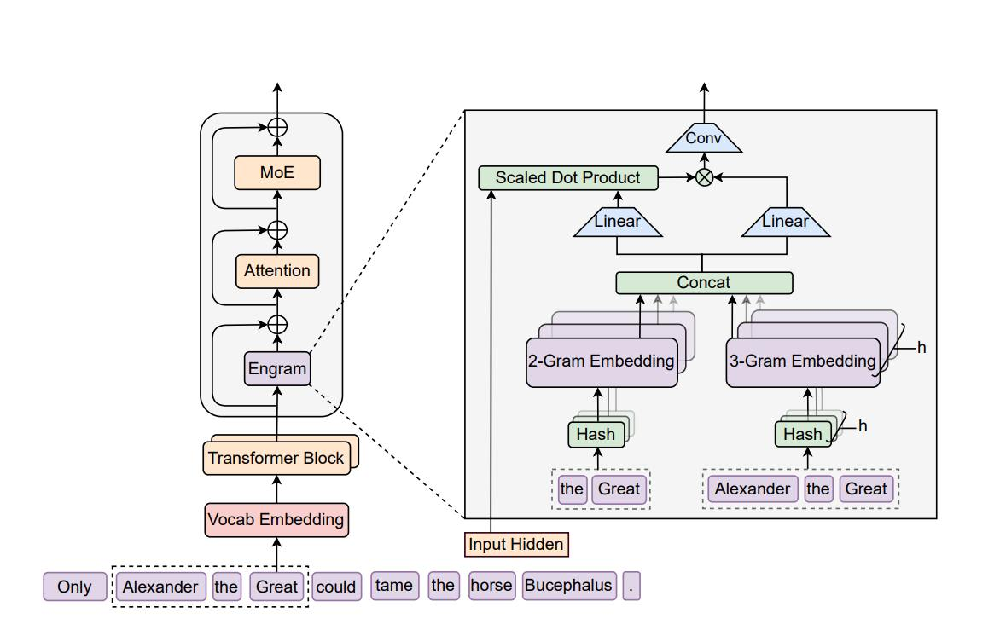
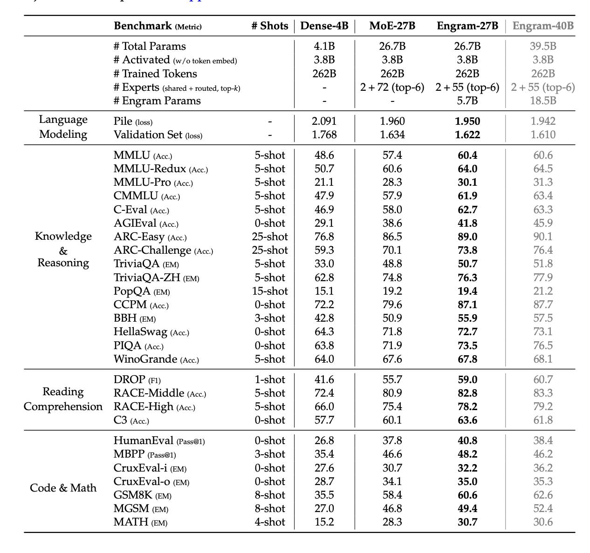

# Условная память через масштабируемый поиск: система Engram

## Определение

Engram — это модуль "условной памяти", разработанный DeepSeek AI, который внедряет massive статические таблицы N-грамм эмбеддингов прямо в слои трансформера. Цель системы — отделить хранение знаний от нейронных вычислений, реализуя O(1).lookup операции для быстрого извлечения информации о статических сущностях, фразах и идиомах. Это позволяет освободить головы внимания для более сложных задач рассуждения.

## Контекст проблемы

Стандартные Large Language Models сталкиваются с рядом ограничений:
- **Фиксированное окно контекста** — ограниченная способность обрабатывать длинные последовательности
- **Статичные знания** — обученные параметры не обновляются после первоначального обучения
- **Вычислительная неэффективность симуляции памяти** — модели используют дорогостоящие операции внимания для простого извлечения фактов
- **Недостаточная специализация** — головы внимания используются как для знаний, так и для рассуждений

При использовании архитектур Mixture-of-Experts (MoE), таких как DeepSeekMoE, модель все равно вынуждена симулировать извлечение памяти через дорогостоящие операции с плавающей точкой. Когда модель встречает статическую сущность, например "Diana, Princess of Wales", она обычно тратит несколько слоёв внимания и FFN просто чтобы восстановить эту фиксированную ассоциацию. Это расточительство: глубокие динамические логические цепи используются для того, что по сути является поиском в хеш-таблице.

## Основные компоненты Engram



**Архитектура Engram показывает** как модуль условной памяти встраивается в трансформер, включая tokenizer compression, hash embeddings для 2- и 3-грамм, context-aware gating и добавление к residual stream.

### 1. Модуль условной памяти (Conditional Memory Module)

В отличие от стандартных слоёв эмбеддингов, которые находятся только на входе, модули Engram вставляются глубоко внутри сети. **Абляции показали**, что оптимально вставлять Engram-модуль во **2-й слой**, а комбинация **2-го и 6-го слоёв** даёт более низкий validation loss. Выход модуля добавляется к residual stream.

Они функционируют как отдельные, оптимизируемые примитивы, отделенные от нейронных вычислений.

### 2. Таблицы эмбеддингов N-грамм

- **Статичные таблицы**: Содержат предварительно вычисленные эмбеддинги для N-грамм (суффиксов)
- **Масштабируемость**: Таблицы могут содержать миллиарды параметров, вынесенных за пределы основной модели
- **Детерминированный доступ**: Индексы для извлечения определяются входной последовательностью

### 3. Механизм многоголового хэширования (Multi-Head Hashing)

- **Tokenizer Compression**: Перед построением n-грамм применяются **детерминированные преобразования** для приведения токенов к canonical ID. Это аналог стемминга или лемматизации, но для токенов — нормализация регистра, пробелов и поверхностных форм.
- **Извлечение N-грамм**: Суффиксные N-граммы (2- и 3-граммы) извлекаются из контекста
- **Hash Embeddings подход**: Напрямую индексировать n-граммы нельзя (их слишком много), поэтому используется вариация **multiplicative-XOR хэширования** для уменьшения коллизий в рамках небольшого словаря. Для каждой n-граммы получают хеш — одно число.
- **Многоголовое хэширование**: Используется несколько голов, поэтому на выходе получается **несколько хешей-чисел** для каждой n-граммы. Это буквально индексы, по которым получают вектора из `nn.Embedding`, где у каждой головы и n-граммы независимые вектора — и дальше их конкатенируют.

### 4. Контекстно-зависимое управление (Context-Aware Gating)

Критически важно, что сырой поиск зашумлён из-за возможных коллизий хешей и полисемии. Чтобы отфильтровать мусор, реализован Context-Aware Gating — механизм, вдохновленный dot product attention:

- **Запрос (Query)**: Текущее скрытое состояние слоя (hidden state) служит как Query
- **Ключ/Значение (Key/Value)**: К извлеченным эмбеддингам применяются линейные преобразования, аналогичные `W_K` и `W_V` в attention
- **Branch-specific fusion**: В mHC-архитектуре для каждой ветки используется **свой W_K** — это один из самых важных компонентов по результатам абляций
- **Вычисление шлюза**: В отличие от attention здесь **нет софтмакса**, вместо него используется **сигмоида**, а полученные скоры поэлементно перемножаются с V
- **Фильтрация**: Шлюз определяет, релевантна ли извлеченная память текущему семантическому контексту

## Архитектурные особенности

### Разделение памяти и логики

Engram реализует явное разделение:
- **Память**: Статические знания хранятся в таблицах эмбеддингов
- **Логика**: Динамические рассуждения обрабатываются основной нейронной сетью
- **Интеграция**: Сырая память фильтруется через гейтинг и вливается в residual stream

### Функция P:V→V' для нормализации токенов

Чтобы максимизировать семантическую плотность для памяти, авторы вводят сюръективную функцию P:V→V', которая схлопывает сырые ID токенов в канонические идентификаторы (нормализуя регистр и пробелы). Это гарантирует, что ключ памяти представляет собой семантический концепт, а не поверхностную форму записи.

### Закон распределения разреженности (Sparsity Allocation Law)

Исследователи изучили, как разделить фиксированный бюджет "неактивных" параметров между экспертами MoE (условные вычисления) и слотами Engram (условная память). Эксперименты выявили чёткую U-образную кривую на валидационном лоссе. Чистая MoE модель (100% бюджета у экспертов) субоптимальна, так как тратит вычисления на статические паттерны. С другой стороны, модель с доминированием Engram проваливается, так как ей не хватает динамической способности к рассуждению.

"Золотая середина" — перераспределение примерно **20–25% бюджета разреженных параметров в Engram**.

### Allocation Ratio (ρ) в MoE-моделях

Engram проверяют в MoE-моделях. В них есть параметры, которые не активны на forward. **Allocation ratio (ρ)** — это доля неактивных параметров, которая содержится в блоках экспертов; в MoE ρ=1. 

Параметры для Engram берут, **уменьшая количество неактивных экспертов**, поэтому становится **ρ<1**. Чтобы понять, какую долю параметров экспертов оптимально перенаправить в модуль, делают **grid search** — запускают несколько претрейнов и меняют только ρ.

Минимальный лосс получается, когда **четверть неактивных параметров уходит в Engram**. Это протестировали на двух бюджетах FLOPs.

## Преимущества

1. **Вычислительная эффективность**: Значительное снижение вычислительной нагрузки по сравнению с полным вниманием
2. **Разгрузка внимания**: Освобождение голов внимания для сложного рассуждения
3. **Масштабируемость памяти**: Возможность хранения знаний за пределами основной модели
4. **Детерминированный доступ**: Предсказуемое время извлечения из памяти
5. **Предварительная загрузка (Prefetching)**: Возможность предварительной загрузки эмбеддингов из RAM

## Инженерные особенности

### Стратегия Prefetch-and-Overlap

Особенностью Engram является возможность стратегии Prefetch-and-Overlap:
- **Детерминированные индексы**: Поскольку индексы зависят исключительно от входной последовательности токенов (суффиксных N-грамм), которая известна до начала прямого прохода
- **Предварительная загрузка**: Система может подгружать эмбеддинги из Host RAM (память CPU) через PCIe, пока GPU считает предыдущие слои
- **Минимальный оверхед**: Вынос массивной таблицы эмбеддингов на 100B параметров в память CPU даёт ничтожный оверхед на инференсе (<3%)

### Обход ограничений HBM

- **Масштабирование**: Позволяет скейлить параметры памяти линейно с дешёвой системной RAM
- **Независимость от GPU**: Память не ограничена объемом HBM видеокарт
- **Стоимость**: Использование дешёвой RAM вместо дорогих кластеров GPU

## Практические результаты

### Производительность

Эксперименты с Engram-27B показали рост метрик не только на knowledge-intensive-задачах, но иногда ещё сильнее на reasoning, math и code:



**Таблица бенчмарков показывает** сравнение моделей Dense-4B, MoE-27B, Engram-27B и Engram-40B по различным метрикам: MMLU, ARC, TriviaQA, BBH, HumanEval, GSM8K, MATH и другим. Engram-27B показывает значительный прирост по всем категориям задач.

**Знания:****
- MMLU (5-shot): +12.0 (с 48.6 до 60.4)
- MMLU-Redux (5-shot): +13.3 (с 50.7 до 64.0)
- MMLU-Pro (5-shot): +9.0 (с 21.1 до 30.1)
- ARC-Challenge (25-shot): +14.5 (с 59.3 до 73.8)
- TriviaQA (5-shot): +17.7 (с 33.0 до 50.7)

**Reasoning:**
- BBH (3-shot): +13.1 (с 42.8 до 55.9)
- HellaSwag (0-shot): +8.4 (с 64.3 до 72.7)

**Code & Math:**
- HumanEval (0-shot): +14.0 (с 26.8 до 40.8)
- GSM8K (8-shot): +25.1 (с 35.5 до 60.6)
- MATH (4-shot): +15.5 (с 15.2 до 30.7)
- MBPP (3-shot): +12.8 (с 35.4 до 48.2)

**Длинный контекст:**
На бенчмарках с длинным контекстом тоже получаются лучшие метрики. Multi-Query Needle In A Haystack прыгнул с 84.2 до 97.0.

### Sensitivity анализ

Исследователи проводят sensitivity-анализ, зануляя выход Engram-модуля, и видят, что **сильнее всего это бьёт по задачам, требующих factual knowledge**.

Так получается, потому что у модели увеличивается **effective depth**: ранним слоям не нужно заниматься knowledge lookup (имитировать его), и больше слоёв теперь могут «думать».

## Ограничения

1. **Жесткость статических лукапов**: Память доступна только для чтения во время инференса
2. **Невозможность адаптации**: Таблица Engram не может адаптироваться к новым знаниям без переобучения
3. **Зависимость от фильтрации**: Модель должна эффективно фильтровать нерелевантную выдачу
4. **Обучение-инференс несоответствие**: Бэкбон становится зависимым от модуля памяти

## Сравнение с другими подходами

| Подход | Тип | Разреженность | Эффективность | Адаптивность |
|--------|-----|---------------|---------------|--------------|
| Стандартное внимание | Нейронное | Нет | Низкая | Высокая |
| Разреженное внимание | Нейронное | Да, фиксированная | Средняя | Средняя |
| **Engram** | **Условная память** | **Да, обучаемая** | **Высокая** | **Низкая (во время инференса)** |

## Важные компоненты по результатам абляций

Самыми важными компонентами Engram-модуля оказываются:
1. **Branch-specific fusion** — свой W_K для каждой ветки в mHC-архитектуре
2. **Context-aware gating** — механизм фильтрации на основе сигмоиды
3. **Tokenizer compression** — детерминированные преобразования для canonical ID

Меньше влияют:
- Свёртка по seq_len
- Добавление 4-граммы (при условии, что будут делить общий бюджет параметров с 2- и 3-граммами)

## Источники

1. "Conditional Memory via Scalable Lookup: A New Axis of Sparsity for Large Language Models" - Xin Cheng, Wangding Zeng, Damai Dai, Qinyu Chen, Bingxuan Wang, Zhenda Xie, Kezhao Huang, Xingkai Yu, Zhewen Hao, Yukun Li, Han Zhang, Huishuai Zhang, Dongyan Zhao, Wenfeng Liang
2. [Оригинальная статья](https://github.com/deepseek-ai/Engram/blob/main/Engram_paper.pdf)
3. [Репозиторий с кодом](https://github.com/deepseek-ai/Engram)
4. [Обзор статьи на arXivIQ](https://arxiviq.substack.com/p/conditional-memory-via-scalable-lookup)

## Связи с другими темами

- [[memory_augmented_transformers.md]] - Другие подходы к дополнению трансформеров памятью
- [[moe_architectures_gradient_stability.md]] - Сравнение с архитектурами MoE, с которыми работает Engram
- [[mixture_of_sparse_attention.md]] - Сравнение с другими методами разреженности
- [[specialized_attention_mechanisms.md]] - Специализированные механизмы внимания
- [[dynamic_moe_routing_hymba.md]] - Другие методы динамической маршрутизации
- [[mat_memory_operations.md]] - Операции памяти в дополненных памятью трансформерах
- [[llm_memory_systems.md]] - Системы памяти в LLM
- [[transformer_architecture.md]] - Базовая архитектура трансформеров

## Метаинформация

```metadata
category: algorithms
subcategory: neural_networks
tags: transformers, memory, engram, conditional-computation, deep-learning
```