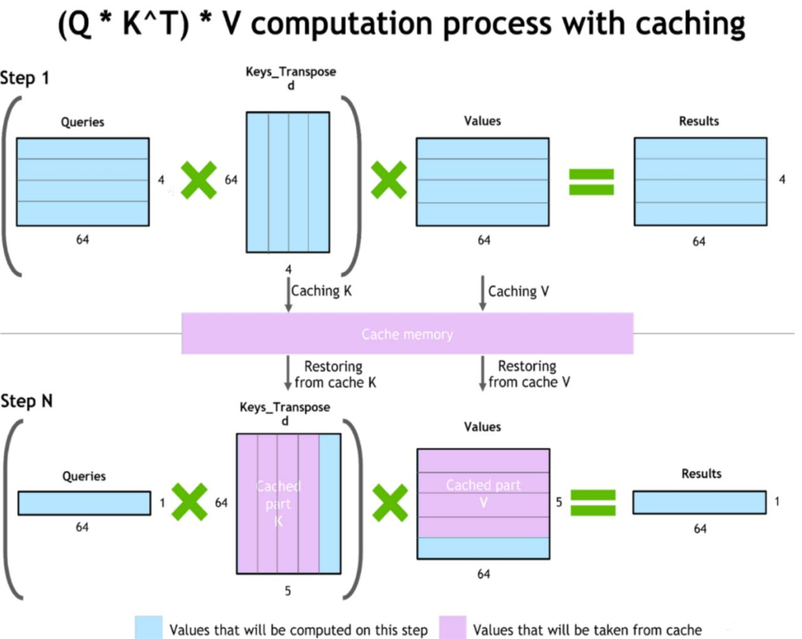

# Системы управления KV-кэшем: vLLM и LMCache

## Введение

Управление KV-кэшем (Key-Value cache) стало критически важным аспектом развёртывания больших языковых моделей в продакшене. KV-кэш быстро растёт по нескольким осям: число слоёв, длина контекста, число KV-голов, head_dim и dtype, что создаёт серьёзные проблемы для памяти GPU и эффективности инференса.

Например, при хранении KV в FP16/BF16 (2 байта) для контекста 8K:
- **~2 ГБ** для моделей 30B с GQA (зависит от точной архитектуры)
- **~4 ГБ** для LLaMA-2-7B
- **~36 ГБ** для GPT-3-175B

И это только для одной последовательности, без учёта большого количества одновременных пользователей.

## Проблема фрагментации памяти GPU

Если аллоцировать KV-кэш как один большой непрерывный блок памяти, со временем возникает серьёзная проблема фрагментации:
- Появляются «дырки», куда не помещаются новые большие кэши
- Суммарно свободной памяти может быть достаточно, но она не используется эффективно
- Возникает недоутилизация GPU-памяти и снижение пропускной способности

### Решение: Paged Attention

Типовое решение проблемы фрагментации — **Paged Attention**:
- KV-кэш режется на страницы фиксированного размера
- Управление осуществляется через таблицу блоков (page table)
- Вместо одного большого куска появляются небольшие блоки
- Блоками проще управлять и переиспользовать между запросами
- Аналогия с виртуальной памятью в операционных системах

## vLLM: Цельный inference-движок вокруг Paged Attention

**vLLM** — это высокопроизводительная библиотека для инференса и сервинга LLM, разработанная в UC Berkeley Sky Computing Lab.

### Архитектура

vLLM представляет собой цельный inference-движок, построенный вокруг Paged Attention:
- Зрелая реализация paged-подхода к управлению памятью
- Multi-GPU поддержка через tensor parallel
- Коммуникации через NCCL
- Open-source проект

### Ключевые технологии

1. **PagedAttention**
   - Избегает фрагментации памяти при обработке различных запросов
   - Улучшает плотность использования GPU-памяти
   - Позволяет обслуживать больше конкурентных запросов

2. **Continuous Batching**
   - Обрабатывает новые запросы без ожидания завершения предыдущих
   - Максимизирует использование вычислительных ресурсов
   - Обеспечивает более высокую пропускную способность

3. **FlashAttention и FlashInfer**
   - Интеграция с оптимизированными вычислениями внимания
   - Более эффективное исполнение моделей

4. **Speculative Decoding**
   - Использует маленькую «предлагающую» модель для быстрой генерации токенов
   - Токены проверяются крупной моделью
   - Ускорение процесса генерации в несколько раз

5. **Chunked Prefill**
   - Делит предварительную обработку длинных запросов на части
   - Повышает отзывчивость системы при обработке длинных входов

6. **Prefix Caching**
   - Повторное использование вычислений для общих частей запросов
   - Снижение вычислительных затрат при обработке похожих запросов

### Преимущества vLLM

- ✅ Зрелая реализация paged-подхода
- ✅ Multi-GPU (tensor parallel) и коммуникации через NCCL
- ✅ Open-source
- ✅ Широкая поддержка моделей (Llama, Mixtral, Deepseek, мультимодальные)
- ✅ Поддержка квантования (GPTQ, AWQ, FP8, INT4/INT8)
- ✅ Совместимость с Hugging Face и OpenAI API

### Ограничения vLLM

- ❌ Сложнее «вклинивать» нестандартные политики работы с KV
- ❌ Не всегда удобно расширять под свои эксперименты
- ❌ KV-кэш в основном локален узлу/серверу
- ❌ Шаринг и распределённое хранение — отдельная задача

## LMCache: KV-кэш как отдельный многоуровневый слой

**LMCache** — это система управления KV-кэшем, которая рассматривает кэш как отдельный многоуровневый слой хранения.

### Архитектура

LMCache использует иерархическую архитектуру с несколькими уровнями хранения:

1. **GPU HBM (Hot Tier)**
   - Самые «горячие» данные для быстрого доступа
   - Минимальная задержка
   - Ограниченный объём

2. **CPU RAM (Warm Tier)**
   - Промежуточный уровень
   - Больший объём, но выше задержка
   - Spillover для данных, не помещающихся в GPU

3. **SSD/Disk (Cold Tier)**
   - Долгосрочное хранение
   - Наибольший объём
   - Наибольшая задержка, но подходит для префиксов

4. **Distributed Storage (Optional)**
   - Распределённое хранение между серверами
   - Кросс-серверное переиспользование KV
   - Масштабируемость

### Ключевые возможности

1. **Многоуровневое кэширование**
   - Явная работа со страницами/блоками на нескольких уровнях
   - Автоматическое перемещение данных между уровнями
   - Адаптивное управление на основе паттернов доступа

2. **Распределённое хранение KV**
   - Поддержка кросс-сессийного переиспользования
   - Кросс-серверный шаринг KV-кэша
   - Снижение дублирования вычислений

3. **Расширяемость и интеграция**
   - Фокус на модульности архитектуры
   - Возможность интеграции с различными inference-движками
   - Open-source проект

4. **Оптимизация TTFT (Time To First Token)**
   - Резкое снижение задержки для запросов с перекрывающимися префиксами
   - Эффективное кэширование общих частей промптов

### Преимущества LMCache

- ✅ Явная работа с многоуровневым хранением (GPU, CPU, SSD, распределённый)
- ✅ Поддержка распределённого хранения KV
- ✅ Фокус на расширяемости и интеграции
- ✅ Кросс-сессийное и кросс-серверное переиспользование
- ✅ Значительное снижение TTFT для повторяющихся запросов
- ✅ Open-source

### Ограничения LMCache

- ❌ Сочетание с оптимизациями внутри узла зависит от конкретной интеграции
- ❌ NVLink/NVSwitch, tensor parallel — не всегда «из коробки»
- ❌ Требует дополнительной настройки для оптимальной работы
- ❌ Меньшая зрелость по сравнению с vLLM

## Сравнение vLLM и LMCache

| Характеристика | vLLM | LMCache |
|----------------|------|---------|
| **Основной фокус** | Цельный inference-движок | KV-кэш как отдельный слой |
| **Управление памятью** | Paged Attention (GPU) | Многоуровневое (GPU/CPU/SSD/Distributed) |
| **Распределённость** | Локален узлу (шаринг — отдельная задача) | Встроенная поддержка распределённого хранения |
| **Multi-GPU** | Tensor parallel через NCCL | Зависит от интеграции |
| **Расширяемость** | Сложнее вклинивать кастомные политики | Фокус на модульности и расширяемости |
| **Зрелость** | Высокая | Средняя |
| **Кросс-сессийное reuse** | Ограниченное | Полная поддержка |
| **Снижение TTFT** | Через Prefix Caching | Через многоуровневое кэширование |

## Другие подходы к оптимизации KV-кэша

Оптимизироваться можно почти по любой размерности KV-кэша:

### По головам внимания
- **Multi-Query Attention (MQA)** — один KV на все Q-головы
- **Grouped-Query Attention (GQA)** — меньше K/V-голов при том же числе Q-голов
- Значительное сокращение объёма кэша

### По слоям и контексту
- **Sliding Window Attention** — хранение только окна последних W токенов
- **Local attention** — внимание только к локальным токенам
- **Sparse attention** — разреженные паттерны внимания

### По dtype
- **Квантование** — INT8, INT4, FP8
- Сокращение размера каждого элемента кэша

### По head_dim
- **Multi Latent Attention** — подходы с латентными представлениями
- Сокращение размерности представлений

### Умное сокращение контекста
- **KVZip** — оценка важности через attention при реконструкции промпта (teacher-forcing), требует дополнительный прогон
- **KVZap** — предсказание важности по скрытому состоянию, адаптивное сжатие по порогу
- **ShadowKV** — использование landmarks и SVD для сжатия

## Ограничение KVZip/KVZap

Главное ограничение подхода KVZip/KVZap — **пока нет хорошей реализации, совместимой с Paged Attention**:
- Неравномерная длина кэша для разных голов
- Требует работы с блоками переменной длины
- Критично для использования в высоконагруженной системе
- Необходимы кастомные CUDA-ядра для эффективной обработки

## Визуализация процесса вычислений



**Изображение показывает:** Процесс вычисления внимания с использованием KV-кэша, где ключи и значения для предыдущих токенов сохраняются и переиспользуются при авторегрессионной генерации.

## Выводы

KV-кэш — важный фактор, который определяет, как модель будет работать в продакшене. Уже есть подходы, которые помогают сократить объём кэша, но без продуманной архитектуры хранения и управления памятью проблему они не решают.

### Ключевые выводы:

1. **Paged Attention** стал стандартом де-факто для управления памятью GPU
2. **vLLM** предлагает зрелое, цельное решение для inference
3. **LMCache** фокусируется на многоуровневом и распределённом хранении KV
4. **Гибридные подходы** (vLLM + LMCache или аналогичные комбинации) могут дать наилучшие результаты
5. **Адаптивные методы** сжатия (KVZap, ShadowKV) требуют кастомной интеграции с Paged Attention

## Источники

1. "Айсберг KV-кэшей, или Как эффективно считать трансформеры" — Кирилл Маляев, RecSys Channel — основной источник материала о проблемах KV-кэширования и сравнении vLLM/LMCache
2. "KVZap: Fast, Adaptive, and Faithful KV Cache Pruning" — NVIDIA research о методе сжатия KV-кэша через предсказание важности токенов
3. "Ускорение E2E-инференса через оптимизацию KV-кэша. Часть I и II" — Владислав Кругликов (Душный NLP) — подробное описание ShadowKV и других методов оптимизации
4. vLLM official documentation — Sky Computing Lab, UC Berkeley
5. LMCache project documentation — многоуровневая система управления KV-кэшем
6. "PagedAttention: Efficient Memory Management for Large Language Models" — оригинальная статья о PagedAttention
7. FlashInfer documentation — библиотека оптимизированных kernels для attention механизмов

## Связи с другими темами

- [[kv_cache_optimization.md]] — общие методы оптимизации KV-кеширования, включая классификацию pre-train и post-train методов
- [[kvzap_kv_cache_pruning.md]] — подробное описание метода KVZap для прунинга KV-кэшей
- [[attention_locality_kv_cache_optimization.md]] — оптимизация KV-кэша через локальность внимания, метод ShadowKV
- [[vllm_inference_optimization.md]] — детальное описание оптимизаций инференса в vLLM
- [[paged_attention_mechanisms.md]] — механизмы Paged Attention для управления памятью
- [[flash_attention_and_grouped_mechanisms.md]] — FlashAttention и групповые механизмы внимания (GQA, MQA)
- [[inference_efficiency_comparison.md]] — сравнение методов эффективности инференса
- [[distributed_inference.md]] — распределённый инференс и параллелизм
- [[model_quantization_techniques.md]] — техники квантования моделей для сокращения памяти
- [[long_context_handling_methods.md]] — методы обработки длинных контекстов, включая оптимизации KV-кэша

```metadata
category: algorithms
subcategory: neural_networks/transformers/inference
tags: kv-cache, vllm, lmcache, paged-attention, inference-optimization, memory-management, distributed-systems
```
