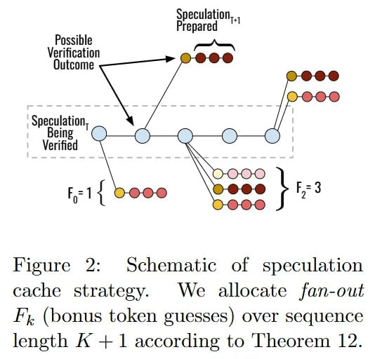

# Speculative Speculative Decoding (SSD) и Saguaro

## Описание

**Speculative Speculative Decoding (SSD)** — это инновационный алгоритм ускорения инференса больших языковых моделей, разработанный Tanishq Kumar, Tri Dao и Avner May из Stanford University, Princeton University и Together AI. SSD устраняет последовательную зависимость между спекуляцией и верификацией в традиционном спекулятивном декодировании, позволяя этим операциям выполняться параллельно на разном оборудовании.

**Saguaro** — оптимизированная реализация SSD, достигающая ускорения до **2x быстрее оптимизированного спекулятивного декодирования** (vLLM/SGLang + SpecDec) и до **5x быстрее авторегрессивного декодирования**.

## TL;DR

**ЧТО сделали**: Авторы представляют Speculative Speculative Decoding (SSD) и его оптимизированную реализацию Saguaro. SSD разрушает последовательную зависимость между генерацией черновика (drafting) и верификацией в стандартном спекулятивном декодировании. Теперь draft-модель предсказывает результаты верификации и проактивно генерирует спекуляции параллельно с тем, как target-модель проверяет предыдущий шаг.

**ПОЧЕМУ это важно**: Эффективно скрывая задержку (latency) генерации черновика за вычислениями верификации, SSD достигает ускорения до 2х по сравнению с оптимизированными бейзлайнами спекулятивного декодирования и до 5х по сравнению со стандартным авторегрессионным декодированием. Что критично, подход расширяет строгую границу Парето между задержкой и пропускной способностью (throughput), доказывая, что спекулятивные методы могут стать более вычислительно эффективными в расчете на одно устройство за счет агрессивного асинхронного параллелизма.

## Ключевая проблема традиционного Speculative Decoding

В обычном спекулятивном декодировании существует последовательная зависимость:
- Draft-модель генерирует токены → Верификатор проверяет → Draft-модель ждет → Повтор

**SSD устраняет эту зависимость**: пока верификатор проверяет токены из раунда T, draft-модель уже предсказывает исходы верификации и заранее готовит спекуляции для раунда T+1.

### ⏳ Проблема классического SD

Генерация текста в языковых моделях (авторегрессионное декодирование) фундаментально упирается в пропускную способность памяти, поскольку токены предсказываются строго один за другим.

Хотя спекулятивное декодирование (https://arxiv.org/abs/2211.17192) изящно смягчает эту проблему, используя быструю draft-модель для предложения токенов, которые бóльшая target-модель параллельно верифицирует, оно вводит новый последовательный боттлнек. В стандартном SD draft-модель вынуждена простаивать в ожидании, пока target-модель прогонит forward pass для верификации, прежде чем сможет предложить следующую порцию токенов.

Этот поочерёдный пинг-понг ограничивает теоретическое максимальное ускорение. Исследователи из Стэнфорда, Принстона и Together AI задались простым структурным вопросом: что если draft-модель вообще не будет останавливаться? Полученная архитектура переходит от последовательного цикла черновик-верификация к непрерывному асинхронному пайплайну, где draft-модель использует время верификации для «предварительной спекуляции» наиболее вероятных исходов текущего шага.


**Figure 1:** (Left) Обычное спекулятивное декодирование (SD) требует, чтобы верификатор ждал, пока draft-модель подготовит токены. (Center) В SSD спекуляция работает на отдельном устройстве (1x H100) параллельно с верификацией; draft-модель предварительно вычисляет спекуляции для многих возможных исходов верификации и немедленно возвращает токены, если один из исходов происходит. (Right) End-to-end производительность SSD, SD и авторегрессионного (AR) декодирования на Llama-3.1-70B на TP=4 H100s, batch size 1, greedy decoding, Llama-3.2-1B draft model.

## Принцип работы SSD

### Основная идея
1. **Параллелизация**: Speculator и Verifier работают параллельно на разном оборудовании
2. **Предварительное предсказание**: Draft-модель предсказывает наиболее вероятные исходы верификации (включая бонус-токен)
3. **Кэширование спекуляций**: Для каждого предсказанного исхода заранее готовится спекуляция и сохраняется в "speculation cache"
4. **Мгновенная выдача**: Если фактический исход верификации совпадает с предсказанным, спекуляция возвращается немедленно без overhead

### 🧠 Как устроен кэш спекуляций

Чтобы понять SSD, нужно определить теоретическую базу шага верификации. Базовой единицей в этом фреймворке является результат верификации, обозначаемый математически как **v^T := (k, t^*)**.

В любом заданном раунде T целевая модель оценивает последовательность предложенных токенов. Исход определяется:
- **k** — количество успешно принятых токенов черновика
- **t^*** — единственный «бонусный токен», который сэмплируется из остаточного распределения (residual distribution) целевой модели при первом отказе (или из целевого распределения, если все k токенов приняты)

Пространство состояний всех возможных исходов верификации огромно и масштабируется как **O(KV)**, где K — глубина спекулятивного заглядывания (lookahead length), а V — размер словаря модели. Фундаментальное предположение SSD состоит в том, что распределение этих исходов сильно скошено и хорошо предсказуемо.

Вычисляя наиболее вероятные значения v^T, draft-модель может превентивно собрать кэш спекуляций **S^T**, который маппит ожидаемые исходы верификации в заранее предсказанные последовательности токенов. Если реальная верификация совпадает с записью в S^T, происходит попадание в кэш (cache hit).



**Figure 2:** Схематическое представление стратегии кэша спекуляций. Мы распределяем fan-out F_k (предположения бонус-токена) по длине последовательности K+1 согласно Theorem 12.

### Алгоритм SSD
```
Function speculator(prompt, primary_draft, backup_draft):
    primary_draft.prefill(prompt)
    spec_tokens ← primary_draft.speculate(prompt)
    
    while True do:
        SEND spec_tokens to verifier
        
        # Предсказание исходов верификации (Section 4.1)
        verification_outcomes ← predict_verify_outcomes(spec_tokens, primary_draft)
        
        # Подготовка спекуляций для всех исходов (Section 4.2)
        cache ← speculate_for_outcomes(outcomes, primary_draft)
        
        WAIT TO RECEIVE verify_outcome from verifier
        
        if verify_outcome ∈ cache then:
            spec_tokens ← cache[verify_outcome]  # Cache hit!
        else:
            spec_tokens ← fallback_speculate(verify_outcome, primary_spec, backup_spec)  # Section 4.3
```

### ⚙️ Алгоритм в динамике

Давайте посмотрим, как это работает на практике, прогнав одну входную последовательность через алгоритм SSD. Представьте, что target-модель на 70B параметров прямо сейчас верифицирует K=5 токенов, предложенных в раунде T.

Одновременно с этим draft-модель на 1B параметров на отдельном GPU начинает предсказывать исход v^T. Она вычисляет, что наиболее вероятный сценарий — это принятие k=3 токенов с последующим бонусным токеном t^* = "the".

Вместо того чтобы ждать, draft-модель принимает это предсказание за чистую монету и немедленно авторегрессионно генерирует следующие K токенов, ветвящихся от слова "the", сохраняя эту последовательность в свой кэш S^{T+1}. И делает она это параллельно для нескольких путей с высокой вероятностью.

Спустя миллисекунды большая 70B модель завершает верификацию и сообщает реальный исход: k=3 и t^* = "the". Процесс-координатор мгновенно запрашивает кэш draft-модели. Поскольку предсказанный v^T идеально совпал с реальным, происходит cache hit.

Заранее вычисленная последовательность моментально отправляется в target-модель для раунда T+1, полностью обходя задержку на forward pass черновой модели. Если бы target-модель вместо этого вернула t^* = "apple", система зарегистрировала бы промах (cache miss), сбросила кэш и перешла к синхронной стратегии спекуляции.

## Три ключевые проблемы SSD и решения Saguaro

### 1. Предсказание исходов верификации (Saguaro Cache)

**Проблема**: Пространство возможных исходов верификации огромно — примерно (K+1) × V, где K — длина спекуляции, V — размер словаря.

**Решение Saguaro**: Формулировка как задача ограниченной оптимизации + **геометрический fan-out**.

#### Геометрический fan-out (Theorem 12)

Оптимальное распределение бюджета кэша B по позициям следует геометрической прогрессии:

**Базовая формула:**
```
F_k = min(B, F_0 × a^k)
```

**Уточненная формула (степенной закон):**
```
F_k = F_0 * a_p^{k/(1+r)}
```

где:
- `F_k` — количество предсказаний бонус-токена на позиции k (fan-out на позиции k)
- `a` / `a_p` — acceptance rate draft-модели
- `r` — экспонента степенного закона, управляющего частотой попаданий в кэш
- `F_0` выбирается так, чтобы Σ F_k = B

**Интуиция**: Вероятность принятия k токенов убывает геометрически, поэтому не стоит тратить вычисления на предсказание бонус-токена на позициях с низкой вероятностью принятия. Попытки угадать бонусный токен t^* для глубоких позиций спекуляции — это пустая трата вычислений.

**Точность предсказания**: До **90%** для бонус-токена.


**Figure 3:** Scaling of cache hit rates with fan out. (Left, middle) Rejection rates (1 - p_hit(F)) conditioned on prior speculation от primary vs backup speculator. Rejection rates (cache misses) падают по степенному закону от draft fan-out, демонстрируя, что cache hit rate растет с размером кэша. (Right) Общий cache hit rate p_hit(F).

🛠 **Инженерия Saguaro: маски и ветвления**

Сборка такого кэша в условиях жёсткого бюджета по времени требует серьезной системной инженерии. Draft-модель может предварительно вычислить лишь ограниченное количество веток, упираясь в лимит бюджета B.

Поскольку длины верифицированных строк обычно подчиняются геометрическому распределению, попытки угадать бонусный токен t^* для глубоких позиций спекуляции — это пустая трата вычислений. Авторы доказывают, что оптимальная стратегия ветвления (fan-out, то есть сколько бонусных токенов угадывать на каждой позиции k) описывается усеченной геометрической прогрессией: F_k = F_0 * a_p^{k/(1+r)}, где a_p — это acceptance rate, а r — экспонента степенного закона, управляющего частотой попаданий в кэш.

Чтобы реализовать это аппаратно, draft-модель декодирует все F(K+1) веток одновременно за один multi-query forward pass. Для этого в Saguaro используются сильно кастомизированные разреженные маски внимания. Эти маски гарантируют, что каждая спекулятивная ветка обращает внимание только на универсально верифицированный префикс и свой собственный путь ветвления.

Авторы написали кастомные CUDA-ядра на базе FlashInfer (https://arxiv.org/abs/2501.01005) и изолировали draft-модель на выделенном GPU (например, 1xH100 для черновика, 4xH100 для таргета), используя быстрые линки NCCL для передачи минимальных O(BKV) бит. Это нужно для синхронизации cache hits без необходимости гонять огромные KV-кэши между устройствами.


**Figure 4:** Advantage of geometric fan out strategy увеличивается при высоких температурах, улучшая как speculation cache hit rate (right), так и end-to-end speed (left). Результаты усреднены по четырем датасетам. При всех температурах SSD с любой стратегией fan-out превосходит обычное спекулятивное декодирование.

### 2. Баланс между Acceptance Rate и Cache Hit Rate (Saguaro Sampling)

**Проблема**: Бонус-токен выбирается из residual distribution `r(·) ∝ max(p_target(·) - p_draft(·), 0)`, которую трудно предсказать, особенно при высоких температурах.

**Решение Saguaro**: **Cache-aware sampling scheme** — модификация схемы сэмплирования draft-модели для упрощения предсказания residual distribution.

#### Принцип работы
- Берём топ-5 самых вероятных токенов по мнению draft-модели
- Искусственно занижаем их вероятности при генерации черновика
- Это заставляет residual distribution, куда смотрит большая модель, концентрироваться на этих же топ-5 токенах
- Большая модель «видит» большую разницу между p(x) и q(x) для топовых токенов → с большей вероятностью выберет именно их

**Почему это работает**: Если черновик «скромничает» и занижает вероятности топовых токенов → разница становится больше → большая модель с большей вероятностью выберет именно их.

**Trade-off**: Смещение draft distribution может снизить acceptance rate, но увеличивает cache hit rate. Saguaro находит оптимальный баланс.

🎯 **Форсируем попадания в кэш**

Истинный секрет производительности Saguaro кроется в умении манипулировать базовыми распределениями вероятностей для искусственного увеличения cache hits, вкупе со строгой математической стратегией фоллбэка.

В стандартном SD бонусный токен сэмплируется из остаточного распределения r(·) ∝ max(p_{target}(·) - p_{draft}(·), 0). Saguaro вводит новую схему сэмплирования, управляемую константой понижения веса C ∈ [0, 1].

Намеренно подавляя вероятности p_{draft}, которые draft-модель присваивает токенам, помещенным в кэш спекуляций, остаточная масса r(·) механически концентрируется ровно на этих закэшированных токенах. Этот тщательно выверенный компромисс слегка снижает общий acceptance rate, но кардинально повышает предсказуемость попаданий в кэш, давая чистое ускорение.


**Figure 5:** We introduce SAGUARO sampling, a novel sampling scheme designed specifically for SSD. (Left) Интерполирует между высоким cache hit rate и высоким speculative acceptance rate. (Right) Иллюстративная схема того, как Saguaro sampling увеличивает residual probability mass на топ draft токенах, поощряя сэмплированный бонус-токен находиться в speculation cache по конструкции.

### 3. Стратегия Fallback (Saguaro Fallback)

**Проблема**: При cache miss необходимо быстро подготовить спекуляцию, иначе теряются преимущества асинхронности.

**Решение Saguaro**: **Адаптивная стратегия по batch size**:

| Batch Size | Fallback Strategy |
|------------|-------------------|
| Малый (b < b*) | Primary speculator = Backup speculator |
| Большой (b > b*) | Low-latency speculator (быстрый, но менее точный) |

**Критический размер batch b***: Выводится теоретически (Corollary 16), определяет точку переключения стратегии.

Естественно, промахи мимо кэша неизбежны, особенно с ростом размера батча. Исследователи выводят критический порог размера батча b^*. Для батчей размером b < b^* фоллбэк Saguaro при промахе заключается в синхронном запуске нейросетевой draft-модели (принимая на себя удар по latency).

Однако, когда размер батча превышает b^*, вероятность одновременного попадания в кэш для всего батча стремится к нулю, что ведет к простоям. Поэтому на больших батчах Saguaro динамически переключается на сверхбыстрый не-нейросетевой бэкап-спекулятор (например, n-gram модель), чтобы вычислительные блоки target-модели оставались загруженными. Именно такое умное масштабирование позволяет Saguaro доминировать на границе Парето.


**Figure 6:** (Left) Оптимальный backup speculator (fast vs neural) зависит от размера батча, как предсказывает Theorem 17 (temperature 0). (Right) Прогноз улучшения скорости декодирования с ростом draft compute (и thus, fan-out) для batch size 16 с fast backup speculator. При больших размерах батчей мы становимся compute bound, speedups требуют больше GPU для drafting.

## Теоретические результаты

### Theorem 7: Speedup относительно авторегрессивного декодирования
```
Speedup_AR = (p_hit × E_hit + (1 - p_hit) × E_miss) / (p_hit × T_p + (1 - p_hit) × T_b)
```

где:
- `E_hit`, `E_miss` — ожидаемое количество сгенерированных токенов
- `T_p`, `T_b` — время primary и backup speculator относительно verifier

### Corollary 8: Строго быстрее SD
SSD с primary и backup = M работает не хуже SD (строго лучше если p_hit > 0, T_SD > 0).

### Corollary 9: Bounds speedup над SD
```
(1 + T_SD) / (1 + T_SD × (1 - p_hit)) × (E_hit / E_SD) ≤ Speedup_SD ≤ (1 + T_SD) × (E_hit / E_SD)
```

**Интуиция**: Максимальное ускорение пропорционально:
1. Сокращению latency от скрытия draft latency `(1 + T_SD)`
2. Увеличению ожидаемого количества токенов `(E_hit / E_SD)`

## Экспериментальные результаты

### Setup
- **Модели**: Llama-3 (основной текст), Qwen-3 (Appendix F)
- **Датасеты**: Alpaca, GSM8k, UltraFeedback, HumanEval
- **Hardware**: 
  - Target: 4×H100
  - Draft (SSD): 1×H100 (отдельное устройство)
  - Draft (SD): collocated на том же hardware

### Ключевые метрики
| Метрика | Значение |
|---------|----------|
| Speedup vs SD | до 2x |
| Speedup vs AR | до 5x |
| Cache hit rate | до 90% (prediction accuracy) |
| Улучшение Pareto frontier | Latency-Throughput |


**Figure 7:** (Left) End-to-end decoding speed comparison of SSD compared to SD и стандартному авторегрессионному декодированию на Llama-3.1-Instruct 70B across four datasets. (Right) SSD улучшает throughput-latency Pareto frontier.

### Влияние температуры
Геометрический fan-out показывает преимущество над uniform strategy особенно при высоких температурах, где SD и uniform начинают деградировать.

## Сравнение с другими методами

| Метод | Параллелизм | Верификатор compute | Fallback | Batch size |
|-------|-------------|---------------------|----------|------------|
| **SSD (Saguaro)** | Полный (асинхронный) | Без изменений | Адаптивный | Любой |
| Speculative Decoding | Нет (последовательный) | Без изменений | N/A | Любой |
| AMUSD/PEARL | Частичный (только all-accept) | Без изменений | N/A | Малый |
| SwiftSpec | Частичный (tree cache) | Без изменений | Just-in-time | Малый/Средний |
| SpecBranch | Частичный (single branch) | Без изменений | Static | Малый/Средний |
| Tree-based SD | Нет (последовательный) | Высокий | N/A | Любой |

### Преимущества SSD над tree-based методами
1. **Нет дополнительного verifier compute** — весь tree должен быть проверен в target forward pass
2. **Масштабирование speculation compute** — pre-speculation для многих исходов параллельно
3. **Комбинируемость** — SSD можно комбинировать с tree-based подходами

## 🧩 Место в экосистеме инференса

Эта работа выступает мощным оркестратором наряду с недавними достижениями в параллельном и древовидном спекулятивном декодировании.

Такие методы, как Medusa (https://arxiv.org/abs/2401.10774) и EAGLE-3 (https://arxiv.org/abs/2503.01840), оптимизируют ширину генерируемого черновика для повышения acceptance rate. В то же время подходы вроде SwiftSpec (https://arxiv.org/abs/2506.11309) пытались распараллелить подготовку кэша, но забуксовали при масштабировании на большие батчи.

Saguaro выделяется тем, что формально объединяет древовидную спекуляцию с асинхронным выполнением. Важно отметить: авторы подчёркивают, что SSD абсолютно ортогонален архитектурным улучшениям драфтинга. Они даже успешно продемонстрировали объединение SSD с EAGLE-3. Вместо верификации одной цепочки при попадании в кэш, гибрид SSD-EAGLE-3 заранее спекулирует и возвращает из кэша целые деревья токенов, многократно умножая ожидаемое количество принятых токенов за итерацию.

## ⚠️ Ограничения и лимиты

Главное слабое место SSD — агрессивное потребление FLOPs ради снижения задержки. В то время как стандартный SD тратит вычисления на отклонённые токены впустую, SSD намеренно сжигает еще больше вычислений, заранее оценивая целые ветвящиеся пути, которые почти наверняка будут отброшены. Фреймворк конвертирует простой вычислительных мощностей draft-модели в снижение latency.

Следовательно, для рабочих нагрузок, жёстко ограниченных пропускной способностью (throughput) и уже утилизирующих железо по максимуму — например, масштабная генерация оффлайн-данных для RL или пакетная обработка — SSD лишь добавляет ненужный оверхед на верификацию, не давая значимого прироста throughput.

Кроме того, накладные расходы по памяти на поддержание кэша спекуляций масштабируются как **O(BFK(K+1)(V+1))**. Хотя на современной HBM-памяти это вполне решаемо, формула накладывает теоретические верхние границы на глубину заглядывания K и ветвление F, прежде чем начнут сыпаться ошибки Out-Of-Memory.

## 🏁 Общее впечатление

Speculative Speculative Decoding фундаментально переписывает границы задержки инференса, доказывая, что последовательный пинг-понг между черновиком и верификацией — это инженерный артефакт, а не математическая необходимость.

Рассматривая процесс верификации как предсказуемое распределение и применяя оптимизацию с ограничениями для предварительного вычисления исходов, Saguaro раздвигает границу Парето. Для инфраструктуры сервинга, где time-to-first-token и задержка между токенами определяют жизнеспособность продукта, выделение части железа кластера строго под асинхронное вероятностное кэширование выглядит крайне заманчиво. SSD доказывает, что в современном стеке LLM самый ценный ресурс — это не просто сырые FLOPs, а способность выстроить их в идеальный пайплайн.

## Практическое применение

### Когда использовать SSD
- **Latency-critical приложения** (real-time inference)
- Доступно отдельное hardware для draft model
- Batch size ≤ критического порога
- **Time-to-first-token** и задержка между токенами критичны для продукта

### Ограничения
- **Throughput-bound workloads**: RL в большом масштабе, offline генерация — SSD добавляет verification overhead
- **Hardware требования**: Нужно отдельное устройство для draft model (в SSD конфигурации)
- **Память**: Накладные расходы O(BFK(K+1)(V+1)) на кэш спекуляций

### Аналогия для понимания SSD

**Представь ресторан с подготовкой заказов наперёд:**

1. **Пока клиент ест** (верификация идёт) → ты готовишь топ-5 возможных следующих блюд на выбор
2. **Кладёшь их на полку** — это speculation cache (KV-кэш спекуляции)
3. **Попадание в кэш**: Клиент заказывает «пасту карбонара» → у тебя есть на полке! → Мгновенно отдаёшь
4. **Промах кэша**: Клиент заказывает «ризотто с грибами» → на полке нет! → Приходится готовить с нуля (fallback стратегия), что медленно, но уже O(log N) вместо O(N)

В результате: до **2X быстрее** оптимизированного спекулятивного декодирования, до **5X быстрее** авторегрессивного декодирования.

## Связанные темы

### Основные связи
- [[speculative_decoding.md]] — основы спекулятивного декодирования, базовый алгоритм, который SSD делает асинхронным
- [[eagle_speculative_decoding.md]] — продвинутая draft архитектура с tree-based спекуляцией, совместимая с SSD для дополнительной оптимизации (SSD-EAGLE-3 гибрид)
- [[vllm_inference_optimization.md]] — оптимизация vLLM, сравнивается с SSD по производительности (SSD до 2x быстрее vLLM + SpecDec)
- [[speculative_diffusion_decoding.md]] — использование диффузионных моделей как draft, альтернативная архитектура для SSD
- [[lk_losses_speculative_decoding.md]] — оптимизация acceptance rate через LK losses, ортогональна оптимизациям SSD
- [[radar_rl_dynamic_draft_trees.md]] — RL для динамических деревьев спекуляций, может комбинироваться с SSD
- [[block_verification_speculative_decoding.md]] — проверка целых блоков токенов, комплементарный подход к верификации

### Дополнительные связи
- [[multi_token_prediction.md]] — MTP может работать как "черновая модель" для спекулятивного декодирования, упрощает реализацию self-speculative decoding
- [[distillspec_knowledge_distillation.md]] — Knowledge Distillation для улучшения согласования draft и target моделей
- [[fr_spec_frequency_ranked_sampling.md]] — FR-Spec оптимизирует большие словари, совместим с SSD
- [[griffin_effective_token_alignment.md]] — выравнивание токенов для ускорения спекулятивного декодирования
- [[foundational_speculative_decoding_papers.md]] — основополагающие работы по спекулятивному декодированию
- [[medusa_speculative_decoding|Medusa]] — простой фреймворк ускорения инференса, оптимизирует ширину генерируемого черновика
- [[swiftspec|SwiftSpec]] — пытался распараллелить подготовку кэша, но забуксовал при масштабировании на большие батчи

## Источники

### Основная статья
- **Kumar T., Dao T., May A.** "Speculative Speculative Decoding" — arXiv:2603.03251, март 2026
  - arXiv: https://arxiv.org/abs/2603.03251
  - GitHub: https://github.com/tanishqkumar/ssd
  - Ревью: https://arxiviq.substack.com/p/speculative-speculative-decoding

### Связанные работы
- **Leviathan Y. et al.** "Fast Inference from Transformers via Speculative Decoding" (2023) — https://arxiv.org/abs/2211.17192
- **Chen Z. et al.** "Speculative Decoding for Large Language Models" (2023)
- **FlashInfer**: https://arxiv.org/abs/2501.01005
- **Medusa**: https://arxiv.org/abs/2401.10774
- **EAGLE-3**: https://arxiv.org/abs/2503.01840
- **SwiftSpec**: https://arxiv.org/abs/2506.11309

## Дополнительные материалы

- Appendix A-F оригинальной статьи содержат детальные доказательства и дополнительные эксперименты
- Спецификации аппаратной реализации Saguaro (CUDA-ядра, разреженные маски внимания)
- Детали интеграции с EAGLE-3 и другими draft архитектурами
