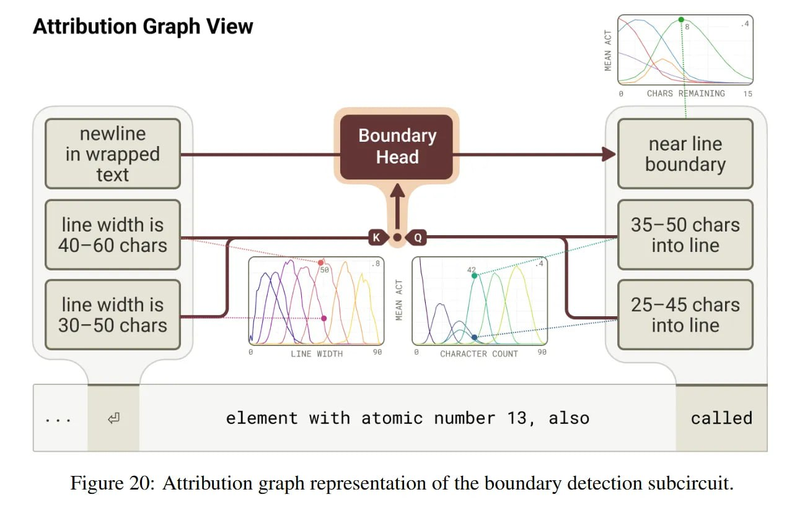
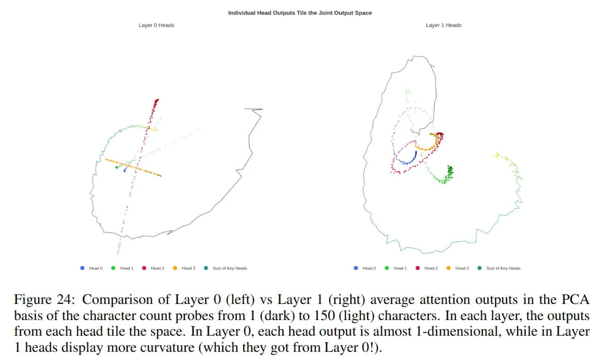
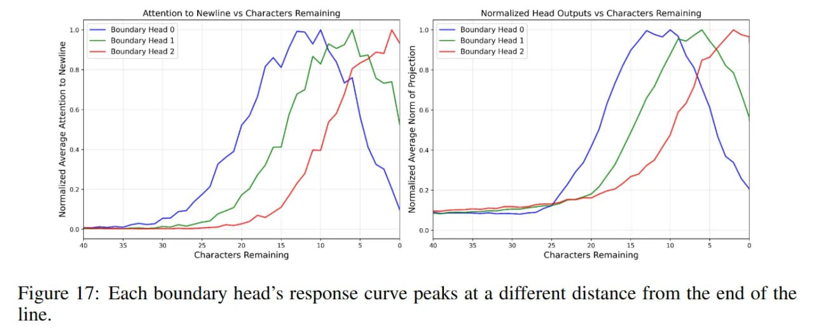
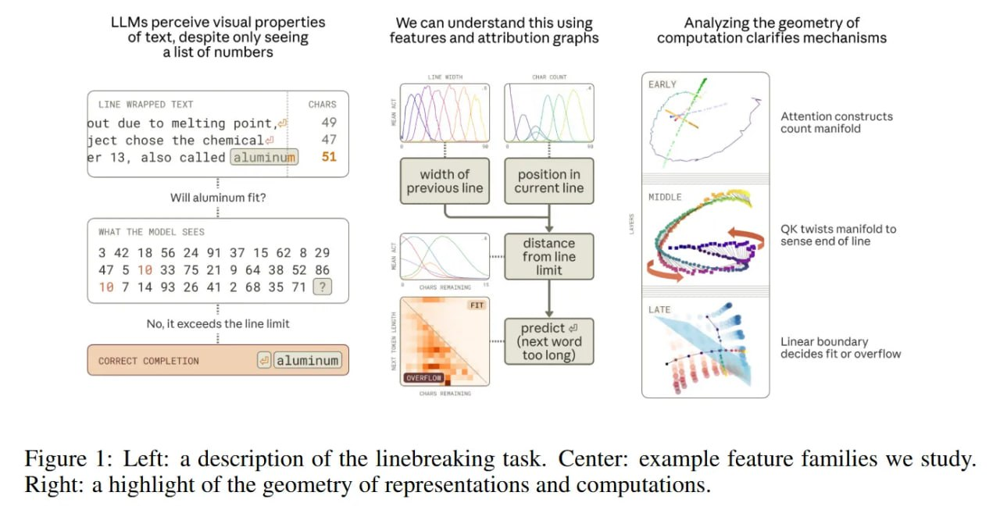
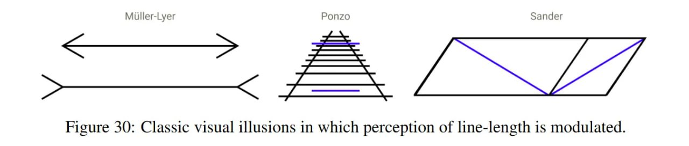
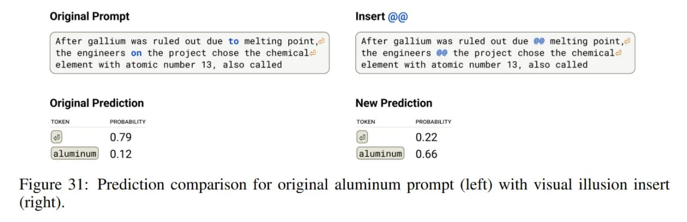

# Многообразия признаков и геометрия счёта в трансформерах

## Краткое описание

Исследование механизмов, с помощью которых трансформеры выполняют арифметические задачи (например, подсчёт символов) через манипуляции с низкоразмерными геометрическими структурами — многообразиями признаков (feature manifolds). Работа демонстрирует, что модель Claude 3.5 Haiku не использует дискретные регистры для счёта, а вместо этого строит спиралевидное многообразие в residual stream и выполняет геометрические операции (вращение, проекцию) для точных арифметических вычислений.

## Ключевые концепции

### Многообразие подсчёта символов (Character Count Manifold)

Центральный объект исследования — 1D-кривая, «спиралью» проходящая через низкоразмерное подпространство residual stream. Модель вкладывает скалярный счёт `c` в кривую, которая извивается так, что:
- Далёкие друг от друга точки становятся ортогональными
- Локальная непрерывность сохраняется
- 6-мерное пространство захватывает 95% дисперсии

**Математическое свойство «звона» (ringing):** График косинусного сходства между репрезентацией счёта `i` и `j` напоминает sinc-функцию (sin(x)/x). Такая волнистая структура — оптимальное решение для упаковки последовательности векторов в низкую размерность [1][2].

### Арифметика через вращение

Модель сравнивает текущий счётчик с лимитом через геометрическое вращение, а не вычитание:

```
score = x_Q^T W_{QK}^T W_{QK} x_K
```

**Головы границ (Boundary Heads)** вращают спираль так, что вектор количества символов `i` выравнивается с вектором ширины строки `k`, когда `i ≈ k - ε`. Задача вычитания превращается в задачу выравнивания (alignment): score внимания пикует, когда повёрнутый вектор «текущей позиции» накладывается на вектор «лимита строки» [1].

### Распределённый алгоритм и хор голов

Счёт реализован «стереоскопически» через распределённый алгоритм:

1. **Головы нулевого слоя** — первичные сенсоры: смотрят на предыдущий перенос строки (используя его как *attention sink*) и выдают вектора, грубо оценивающие расстояние
2. **Головы первого слоя** — агрегируют сигналы, закручивая их в спиральную структуру

Модель использует «хор» голов с разными смещениями рецептивных полей для повышения разрешения, позволяя различать 49 и 50 символов [1].

### Дискретные признаки vs непрерывная геометрия

Работа перекидывает мост между двумя подходами к интерпретируемости:

| Дискретные признаки (SAE) | Непрерывная геометрия (многообразия) |
|---------------------------|--------------------------------------|
| Разреженные словари признаков | Низкоразмерные кривые в residual stream |
| Локальные координаты | Глобальная параметризация |
| «Клетки места» (place cells) | Спиральные многообразия |
| Автоматическое обнаружение | Требует ручного анализа |

**Дуализм:** систему можно видеть как дискретные признаки (латенты SAE) *или* как непрерывную геометрию. Для задач с непрерывными переменными (позиция, величина) геометрический взгляд часто оказывается более экономным и точным [1][2].

## Биологические параллели

Найденные репрезентации аналогичны биологическим нейронным цепям:

- **Признаки подсчёта** (активируются на диапазонах, например, 35-45 символов) → клетки места (place cells) в гиппокампе
- **Признаки границ** (возбуждаются на определённом расстоянии) → клетки границ (boundary cells)

Это подтверждает гипотезу о том, что трансформеры развивают вычислительные механизмы, схожие с биологическими системами обработки информации [1].

## Оптические иллюзии в тексте

Для доказательства причинной роли геометрии авторы создали текстовые «визуальные иллюзии»:

- Вставка последовательностей вроде `@@` (разделители в git diff) заставляет головы подсчёта ошибаться в определении начала строки
- Это сбрасывает или сдвигает внутренний «одометр», и модель ломает строку не там, где надо
- Полный аналог оптических иллюзий в биологическом зрении (как стрелки в иллюзии Мюллера-Лайера) [1]

## Налог на сложность (Complexity Tax)

Найти эти многообразия было трудно. Если разреженные словари (Crosscoders) автоматически находят признаки, то сшивание их в геометрическую картину требует ручного труда. Автоматическое обнаружение того, что кластер из 100 дискретных признаков — это на самом деле дискретизированная спираль, остаётся открытой проблемой [1].

## Выводы и будущее

Трансформеры решают логические задачи, проецируя дискретные состояния на непрерывные многообразия и выполняя линейно-алгебраические манипуляции. Для улучшения reasoning способностей будущих моделей могут потребоваться архитектуры, явно поддерживающие такие высокоразмерные геометрические операции [1].

## Связи с другими темами

[[../circuits_in_transformers_using_sae.md]] — Использование разреженных автоэнкодеров для открытия схем в трансформерах
[[../transcoders_for_interpretability.md]] — Транскодеры для анализа внутренних состояний трансформеров
[[../../../foundations/interpretability/mechanistic_interpretability/sparse_autoencoders/reasoning_features_identification.md]] — Идентификация признаков рассуждений в SAE
[[../attention_sink_phenomenon.md]] — Феномен attention sink, используемый как сток внимания
[[../../../vision_transformers/position_prediction/rope_rotary_embeddings.md]] — Rotary embeddings: позиционные кодировки через вращение
[[../positional_encoding_approaches.md]] — Подходы к позиционному кодированию в трансформерах

## Источники

1. **When Models Manipulate Manifolds: The Geometry of a Counting Task** — Wes Gurnee, Emmanuel Ameisen, Isaac Kauvar, Julius Tarng, Adam Pearce, Chris Olah, Joshua Batson. Anthropic, 2025. arXiv:2601.04480. https://arxiv.org/abs/2601.04480
   - Transformer Circuits Thread: https://transformer-circuits.pub/2025/linebreaks/index.html
   - Исследование механизмов переноса строк в Claude 3.5 Haiku через геометрические многообразия

2. **The Origins of Representation Manifolds in Large Language Models** — Alexander Modell, Patrick Rubin-Delanchy, Nick Whiteley. 2025. arXiv:2505.18235. https://arxiv.org/abs/2505.18235
   - Теоретическая основа для понимания многообразий представлений в LLM
   - Доказательство того, что косинусное сходство кодирует внутреннюю геометрию многообразий

3. **Crosscoders: Unsupervised Discovery of Interpretable Features** — Anthropic, 2024. https://transformer-circuits.pub/2024/crosscoders/index.html
   - Разреженные автоэнкодеры, используемые для обнаружения признаков в работе

4. **When Models Manipulate Manifolds: Review** — arxivIQ Substack. https://arxiviq.substack.com/p/when-models-manipulate-manifolds
   - Обзор и анализ исследования от независимых экспертов

## Медиафайлы

### Основные фигуры из статьи


*Рисунок 6: Многообразие подсчёта символов представлено как спиральная кривая в 6-мерном подпространстве. Crosscoder-признаки (кресты) дискретизируют кривую, локально параметризуя её через активности 2-3 соседних признаков [1].*


*Рисунок 14: Головы границ вращают многообразие символов для выравнивания с лимитом строки. Когда повёрнутый вектор текущей позиции накладывается на вектор лимита, attention score достигает пика, сигнализируя о необходимости переноса [1].*


*Рисунок 5: Семейство признаков, представляющих текущий счётчик символов в строке. Tuning curve активности признаков увеличивается при больших значениях счёта, аналогично клеткам места в гиппокампе [1].*


*Рисунок 20: Граф атрибуции для предсказания новой строки. Признаки «ширины предыдущей строки» и «позиции в текущей строке» вместе активируют признаки «расстояния от лимита строки» [1].*


*Рисунок 24: Сравнение голов слоя 0 — «хор» голов с разными рецептивными полями работает совместно для повышения точности подсчёта [1].*


*Рисунок 17: Ответ каждой головы границ показывает специфические диапазоны активации для разных расстояний до лимита строки [1].*


*Рисунок (слева): Паттерн «звона» в косинусном сходстве векторов счёта напоминает sinc-функцию, что является оптимальной упаковкой последовательности векторов в низкую размерность [1].*


*Рисунок 4: Ключевые шаги в вычислениях переноса строки через построение и манипуляцию многообразиями [1].*


*Рисунок 30: Классическая иллюзия Мюллера-Лайера — аналог текстовых иллюзий, созданных для демонстрации причинной роли геометрии в подсчёте [1].*


*Рисунок 31: Точность предсказания переноса строки в зависимости от длины строки и конфигурации голов внимания [1].*


*Рисунок 2: Пара промптов, демонстрирующая задачу переноса строк с неявным ограничением в 50 символов [1].*

```metadata
category: mechanistic_interpretability
subcategory: feature_manifolds
tags: manifolds, geometry, counting, linebreaking, claude_3.5_haiku, boundary_heads, character_count, spiral_manifold, ringing_pattern, place_cells, boundary_cells, crosscoders, anthropic_research
```
