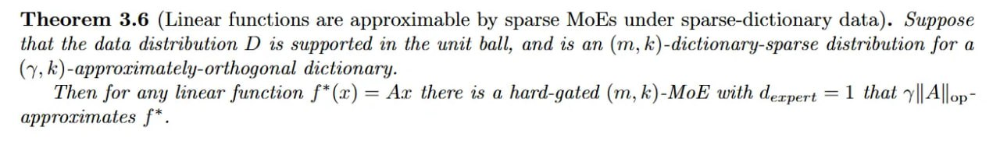

# Скрытая смесь экспертов (Secret Mixture of Experts) в MLP слоях LLM

## Описание

**Скрытая смесь экспертов (Secret MoE)** — это теоретический фреймворк и эмпирическое открытие, демонстрирующее, что плотные слои MLP (Multilayer Perceptron) в обученных больших языковых моделях (LLM) по своей природе выполняют **разреженные вычисления**, которые можно точно аппроксимировать слоями Mixture of Experts (MoE) с разреженной активацией.

Это открытие даёт механистическое объяснение тому, почему переход от плотных архитектур к MoE настолько эффективен в современных передовых моделях: стандартные MLP уже обладают скрытой MoE-подобной структурой, приобретённой во время предобучения.

## Ключевая гипотеза

**Гипотеза 3.1 (Secret MoE Hypothesis)**: В предобученной трансформер-модели плотные MLP слои могут быть хорошо аппроксимированы разреженно-активирующимися слоями MoE с гораздо меньшим количеством активных параметров, чем оригинальный MLP [[1]](#источники).

Эта гипотеза основана на новом теоретическом соединении между:
- Структурой **разреженных автоэнкодеров (SAE)** в пространстве активаций
- Скрытой **MoE-подобной структурой** в вычислениях MLP

## Теоретические основы

### Математика разреженности

#### Стандартный MLP слой

Плотный MLP слой вычисляет преобразование:

```
f_MLP(x; A, B) = Aσ(Bx)
```

где:
- `x ∈ ℝ^d` — входной вектор
- `σ` — нелинейная активация (применяется поэлементно)
- `A, B` — матрицы весов
- `d_mlp` — промежуточная размерность

#### Слой MoE

MoE слой с `m` экспертами имеет функцию гейтинга `g: ℝ^d → ℝ^m` и вычисляет:

```
f_MoE(x) = Σ_{i=1}^m g(x)_i · f_MLP(x; A_i, B_i)
```

Когда роутинг принудительно задаёт разреженность, для любого входа активны только `k ≪ m` экспертов, что радикально снижает количество задействованных параметров.

### Теорема о невозможности для гауссовских данных

**Теорема 3.3 (Inapproximability of identity by sparse MoEs under Gaussian data)**: При изотропном гауссовском входном распределении `D = 𝒩(0, I_d/d)` не существует `(m,k)`-MoE с жёсткой функцией гейтинга и количеством активных нейронов `k·d_exp < d/2`, которое могло бы аппроксимировать тождественную функцию `f*(x) = x` [[1]](#источники).

**Вывод**: Самой по себе архитектурной разреженности недостаточно. Эффективность MoE фундаментально зависит от структуры распределения входных данных.

### Словарно-разреженная структура активаций

**Определение 3.4 (Dictionary-sparse structure)**: Распределение `D` над векторами является `(m,k)`-словарно-разреженным, если существует словарь векторов `v_1, ..., v_m` такой, что любой вектор `x` в носителе `D` лежит в `x ∈ span{v_i1, ..., v_ik}` для некоторых `i1, ..., ik ∈ [m]` [[1]](#источники).

**Определение 3.5 (Approximately orthogonal dictionary)**: Словарь `v_1, ..., v_m ∈ ℝ^d` является `(γ,k)`-ортогональным, если для любого `x ∈ ℝ^d` и `i1, ..., ik ∈ [m]` выполняется:

```
‖Σ_{j=1}^k v̂_ij v̂_ij^⊤ x - z‖ ≤ γ‖z‖
```

где `z` — проекция `x` на span векторов `v_i1, ..., v_ik` [[1]](#источники).

### Теорема о представимости линейных функций

**Теорема 3.6 (Linear functions are approximable by sparse MoEs under sparse-dictionary data)**: Если распределение данных `D` словарно-разрежено и имеет приблизительно ортогональный словарь, то для любой линейной функции `f*(x) = Ax` существует жёстко-гейтированная `(m,k)`-MoE с `d_expert = 1`, которая `γ‖A‖_op`-аппроксимирует `f*` [[1]](#источники).

**Следствие**: Когда входные фичи словарно-разрежены и примерно ортогональны, MoE требует **экспоненциально меньше** активных нейронов для аппроксимации целевой функции по сравнению с плотным MLP.

## Эмпирическая валидация через дистилляцию

### Методология послойной дистилляции

Для эмпирического подтверждения скрытой MoE-структуры используется **послойная дистилляция**:

1. **Сбор активаций**: Пропускание последовательности токенов через первые `ℓ-1` слоёв сети для генерации внутренних активаций `x_t ∈ ℝ^d` на входе целевого MLP слоя на глубине `ℓ`

2. **Формирование датасета**: Создание датасета `D^act` из реальных внутренних активаций, который становится ground truth пространством входов

3. **Целевой выход**: Вычисление `y_t = f_MLP_teacher(x_t)` — результат работы обученного плотного MLP на этих активациях

4. **Обучение студента**: Обучение MoE-студента с нуля, минимизируя среднеквадратичную ошибку относительно `y_t`

5. **Контрольный эксперимент**: Параллельное обучение на синтетическом гауссовском датасете `D^gauss` с совпадающим средним и ковариацией для проверки роли структуры активаций

### Результаты дистилляции

Эмпирическая валидация проведена на моделях:
- **Pythia-70M** (слой ℓ=3)
- **Gemma-270M** (слой ℓ=9)
- **Pythia-410M** (слой ℓ=12)

**Ключевые результаты** [[1]](#источники):
- На реальном датасете активаций `D^act` MoE-студенты объясняют **существенно большую долю дисперсии** по сравнению с плотными MLP при том же бюджете активных параметров
- На гауссовском контрольном датасете `D^gauss` MoE **не показывают никакого преимущества** над MLP
- В Pythia-410M разреженная MoE достигает паритета с плотным MLP, используя **в 8 раз меньше активных нейронов**


**Рисунок 3:** Датасет внутренних активаций создаётся путём прямого прохода текстовых данных через все слои, предшествующие MLP, который мы хотим дистиллировать. На активациях (слева) MoE значительно превосходит MLP по объяснённой дисперсии. На гауссовских данных (справа) преимущество исчезает.

## Инженерные оптимизации для дистилляции

### Общий эксперт (Shared Expert)

Для улучшения оптимизации используется модифицированная формула MoE с общим экспертом:

```
f_MoE+Shared(x) = f_MLP(x) + f_MoE(x)
```

где общий MLP активен постоянно для всех входов. Выделение части общего бюджета активных нейронов на разделяемого эксперта значительно улучшает результаты дистилляции [[1]](#источники).

### Низкоранговый роутинг (Low-Rank Routing)

Для стабилизации обучения функция роутинга перепараметризуется с использованием **факторизации Бурера-Монтейро**:

```
R = R_1 · R_2
```

где:
- `R_1 ∈ ℝ^{m × d_proj}`
- `R_2 ∈ ℝ^{d_proj × d}`
- `d_proj` — низкоранговое бутылочное горлышко (`d_proj < d`)

**Эмпирический результат**: Несмотря на ограничение выразительности, низкоранговая параметризация **улучшает общий лосс дистилляции** при обучении Adam с MSE [[1]](#источники).

## Связь с механистической интерпретируемостью

### Разреженные автоэнкодеры (SAE)

Исследование естественно пересекается с использованием **разреженных автоэнкодеров** для распутывания наложенных фичей в нейросетях [[2]](#источники):

| SAE | Secret MoE |
|-----|------------|
| Проецируют активации в высокоразмерное интерпретируемое пространство словаря | Сеть неявно использует словарную логику роутинга внутри собственного вычислительного графа |
| Декодируют фичи постфактум | MoE эксплуатируют ту же базовую разреженность архитектурно |

**Теоретический мост**: Доказывая, что MoE используют ту же разреженность, которую призваны улавливать SAE, работа связывает декодирование фичей с архитектурным масштабированием [[1]](#источники).

### Гипотеза лотерейного билета

Результаты дают свежий взгляд на **гипотезу лотерейного билета** [[4]](#источники):

| Традиционные лотерейные билеты | Скрытые MoE |
|-------------------------------|-------------|
| Находят статичные, не зависящие от входа разреженные подсети весов | Динамические, зависящие от входа паттерны разреженности |
| Статичная функциональная подсхема | Текучая функциональная подсхема, меняющаяся от входа |

## Ограничения метода

1. **Изоляция MLP**: Фреймворк послойной дистилляции изолирует MLP от системной динамики блока трансформера, что может не улавливать каскадные ошибки и межслойные зависимости [[1]](#источники)

2. **Геометрия лосса роутинга**: Точная геометрия поверхности лосса роутинга остаётся открытым вопросом, хотя низкоранговая параметризация эмпирически улучшает оптимизацию

3. **Ручная настройка**: MoE-студент требует ручной настройки баланса между общим и маршрутизируемыми экспертами

4. **Масштабируемость**: Оценка проводилась на моделях до 410M параметров; требуется валидация на более крупных масштабах

## Практическое значение

### Для архитектурного дизайна

1. **Обоснование MoE**: Работа превращает MoE из эвристического инженерного трюка в принципиальное архитектурное выравнивание

2. **Быстрое прототипирование**: Методология дистилляции даёт ресурсоэффективный фреймворк для итерации алгоритмов роутинга без обучения foundation моделей с нуля

3. **Оптимальная разрежённость**: Анализ обученных сетей через призму эмерджентных структур указывает путь к оптимальному распределению разреженности

### Для индустрии

- **Экономия вычислений**: Явное создание моделей как MoE убирает ненужное вычислительное бутылочное горлышко в плотных MLP
- **Масштабирование**: Математически обоснованная причина для масштабирования разреженности в передовых моделях
- **Интерпретируемость**: Механистическое объяснение внутренней работы MLP слоёв

## Примеры применения

### DeepSeek-V3

DeepSeek-V3 использует MoE архитектуру с:
- **671B** общих параметров
- **37B** активных параметров на токен
- **256** экспертов, **9** активных на токен
- Вспомогательный лосс-free стратегия для балансировки нагрузки [[3]](#источники)

Secret MoE гипотеза объясняет, почему такая архитектура эффективна: плотные MLP в предобученных моделях уже выполняют аналогичные разреженные вычисления.

### Qwen3.5-Plus

Qwen3.5-Plus демонстрирует предельно разреженную MoE архитектуру:
- **397B** общих параметров
- **17B** активных параметров (~4.3%)
- **Менее 5%** вычислительной мощности на запрос

## Медиафайлы



**Теорема 3.6:** Если распределение данных D словарно-разрежено и имеет приблизительно ортогональный словарь, то для любой линейной функции f*(x) = Ax существует жёстко-гейтированная (m,k)-MoE с d_expert = 1, которая γ‖A‖_op-аппроксимирует f*.


**Рисунок 1:** Гипотеза Secret MoE — MLP слой в предобученном трансформере аппроксимируется разреженно-активирующимся MoE слоем.


**Рисунок 5:** Популярный подход в теории глубокого обучения (слева) в контрасте с подходом данной статьи (справа) к пониманию того, что делает модель. На активациях MoE достигает паритета с MLP, используя в 8 раз меньше активных нейронов (Pythia-410M).

## Связи с другими темами

- [[../mixture_of_experts.md|Смесь экспертов (MoE)]] — Базовая архитектура MoE и её применение в LLM
- [[../mixture_of_experts_architecture.md|Архитектура MoE]] — Общее описание концепций MoE
- [[circuits_in_transformers_using_sae.md|Цепочки в трансформерах с SAE]] — Использование разреженных автоэнкодеров для интерпретации
- [[mechanistic_interpretability.md|Механистическая интерпретируемость]] — Общая область изучения внутренней работы нейросетей
- [[../deepseek_v3.md|DeepSeek V3]] — Крупная реализация MoE архитектуры с 671B параметрами
- [[../llm_architectures_comparison.md|Сравнение архитектур LLM]] — Сравнение различных подходов к масштабированию
- [[../sparse_gating_mechanism_attention_sink_mitigation.md|Разреженный гейтинг для mitigation attention sinks]] — Разреженные механизмы гейтинга в attention
- [[../../ai/interpretability/sparse_autoencoders.md|Разреженные автоэнкодеры (SAE)]] — SAE для извлечения интерпретируемых фичей
- [[../dynamic_sparsity_approaches.md|Динамические подходы к разреженности]] — Динамическая разреженность в нейросетях

## Источники

1. **Boix-Adsera E.** "Secret mixtures of experts inside your LLM" — arXiv:2512.18452, Декабрь 2025. [https://arxiv.org/abs/2512.18452](https://arxiv.org/abs/2512.18452) — Основная статья о Secret MoE гипотезе, теоретических результатах и эмпирической валидации через дистилляцию.

2. **Anthropic.** "Towards Monosemanticity: Decomposing Language Models With Dictionary Learning" — Transformer Circuits Thread, 2023. [https://transformer-circuits.pub/2023/monosemantic-features/index.html](https://transformer-circuits.pub/2023/monosemantic-features/index.html) — Исследование разреженных автоэнкодеров и моносемантичных фичей.

3. **DeepSeek-AI.** "DeepSeek-V3 Technical Report" — arXiv:2412.19437, Декабрь 2024. [https://arxiv.org/abs/2412.19437](https://arxiv.org/abs/2412.19437) — Технический отчёт о MoE архитектуре DeepSeek-V3.

4. **Frankle J., Carbin M.** "The Lottery Ticket Hypothesis: Finding Sparse, Trainable Neural Networks" — arXiv:1803.03635, Март 2018. [https://arxiv.org/abs/1803.03635](https://arxiv.org/abs/1803.03635) — Оригинальная статья о гипотезе лотерейного билета.

5. **Shazeer N. et al.** "Outrageously Large Neural Networks: The Sparsely-Gated Mixture-of-Experts Layer" — arXiv:1701.06538, Январь 2017. [https://arxiv.org/abs/1701.06538](https://arxiv.org/abs/1701.06538) — Оригинальная статья о разреженно-гейтированных MoE слоях.

## Дополнительные материалы

- **Код исследования**: [https://github.com/eboix/secret_moe](https://github.com/eboix/secret_moe) — Репозиторий с кодом для воспроизведения экспериментов по дистилляции.

- **Ревью на arxivIQ**: [https://arxiviq.substack.com/p/secret-mixtures-of-experts-inside](https://arxiviq.substack.com/p/secret-mixtures-of-experts-inside) — Разбор статьи на русском языке.

- **Telegram-канал «Китайский ИИ»** — Дополнительная информация о MoE реализациях в китайских моделях.

```metadata
category: machine_learning
subcategory: mechanistic_interpretability
tags: MoE, sparse_computation, dictionary_sparsity, MLP, distillation, SAE, lottery_ticket
```
