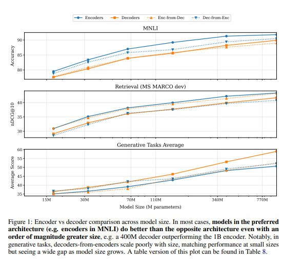
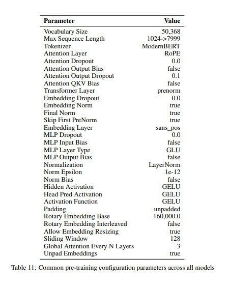
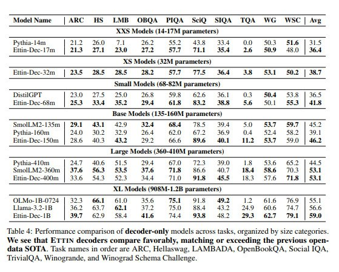
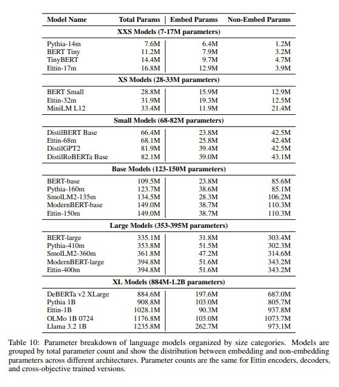
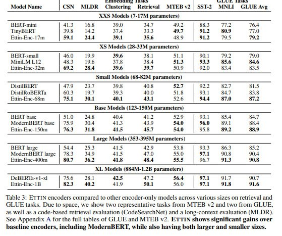
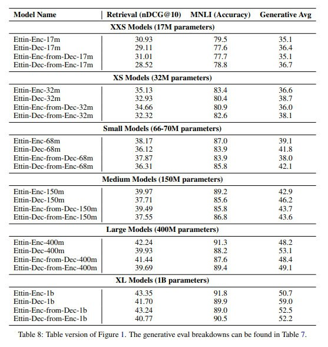

# Seq vs Seq: An Open Suite of Paired Encoders and Decoders

## Описание

Статья "Seq vs Seq: An Open Suite of Paired Encoders and Decoders" представляет исследование по сравнению энкодерных и декодерных архитектур, обученных на одинаковых условиях. Авторы проверили гипотезу о возможности конвертации энкодеров в декодеры и наоборот путем изменения задачи обучения и небольшого дообучения.

## Модели Ettin

### Общая информация
- **Название**: Ettin - серия моделей от 17M до 1B параметров
- **Архитектура**: Обучены как на MLM (Masked Language Modeling), так и на CLM (Causal Language Modeling) задачах
- **Данные**: Обучались на DCLM/Dolma
- **Цель**: Создание сопоставимых энкодерных и декодерной моделей для прямого сравнения

### Архитектурные особенности
- Используют рецепт обучения от ModernBERT
- Упрощенная архитектура по сравнению с современными версиями (без мержинга моделей, разных theta для локального и глобального RoPE и т.д.)
- Сопоставимые архитектурно энкодеры и декодеры для прямого сравнения

## Экспериментальные результаты

### Сравнение с другими моделями
- **Декодеры**: Сравниваются с Pythia, DistillGPT, Olmo и SmolLM-2
- **Энкодеры**: Сравниваются с ModernBERT, BERT, DistilRoBERTa и MiniLM
- **Результат**: Ettin показывает лучшие результаты по сравнению с бейзлайнами в большинстве случаев

### Конвертация архитектур
#### Эксперимент: изменение задачи обучения
- Изменение задачи на противоположную (CLM -> MLM; MLM -> CLM)
- Дообучение на 50B токенов с противоположной задачей
- Тестирование на трех задачах: классификация (MNLI), retrieval (MSMarco), генерация (ARC, HS, PIQA и др.)

#### Результаты конвертации
- **Для генеративных задач**: Лучшие результаты показывают базовые декодеры
- **Для энкодерных задач**: Лучшие результаты у базовых энкодеров
- **Для конвертированных моделей**: 
  - Добавление второго шага обучения снижает качества в "родных" задачах
  - Чуть улучшает качество в "неродных" задачах
  - Нет четкого тренда: в зависимости от масштаба моделей выигрывают то Enc-from-Dec, то Dec-from-Enc

## Выводы исследования

1. **Конвертация возможна**: Если есть качественные декодеры, их можно конвертировать в энкодеры с некоторым улучшением качества решения классификационных задач.

2. **Энкодеры остаются важными**: Если есть качественные энкодеры сопоставимых размеров, они превосходят конвертированные декодеры.

3. **Не заменяет энкодеры**: Наличие больших декодеров не делает энкодеры ненужными. Заскейленный энкодер будет лучше конвертированного декодера такого же размера.

## Обсуждение

### MLM vs CLM обучение
- **MLM** является более разреженным по сигналу: на каждый пример из датасета получаем всего 15-30% маскированных токенов
- **CLM** обеспечивает сигнал на каждом токене для обучения
- Декодеры могут сходиться до заданной перплексии быстрее энкодеров из-за более плотного сигнала

### Потенциальные улучшения
- Возможность гибридных архитектур, сочетающих преимущества разных подходов (например, с Mamba/RWKV)
- Вопрос эффективности конвертации после контрастивного обучения остается открытым

## Сравнение с другими архитектурами

### Отношение к энкодер-декодер моделям
- Работа связана с исследованиями RedLLM и другими сравнениями архитектур
- Подчеркивает важность сопоставимости условий сравнения разных архитектур
- Дополняет знания о гибкости архитектур и возможности конвертации

### Сравнение с работой "Encoder-Decoder or Decoder-Only?"
- Дополняет исследования о предпочтительности разных архитектур
- Показывает возможность прямой конвертации между архитектурами
- Предоставляет эмпирические данные о взаимозаменяемости архитектур

## Имплементация и доступность

### Доступные ресурсы
- Код, веса, данные и промежуточные чекпоинты выложены в открытый доступ
- Репозитории на HuggingFace и GitHub
- Полная воспроизводимость экспериментов

### Архитектурные детали
- Параметры моделей: от 17M до 1B параметров
- Сравнение с конкурентами по параметрам и архитектуре

### Визуализации и сравнения

 <!-- TODO: Broken image path -->

**Описание:** Архитектурное сравнение моделей RedLLM (энкодер-декодер) и DecLLM (декодер-только), показывающее различия в структуре и подходах к обработке последовательностей.

 <!-- TODO: Broken image path -->

**Описание:** Таблица с общей конфигурацией предобучения моделей Ettin, показывающая параметры и настройки для различных размеров моделей.

 <!-- TODO: Broken image path -->

**Описание:** Таблица сравнения производительности декодерных моделей Ettin с бейзлайнами, демонстрирующая превосходство Ettin над другими моделями.

 <!-- TODO: Broken image path -->

**Описание:** Таблица с разбиением параметров для различных языковых моделей, включая Ettin, показывающая сопоставимость по размеру с конкурентами.

 <!-- TODO: Broken image path -->

**Описание:** Таблица сравнения энкодерных моделей Ettin с бейзлайнами, демонстрирующая превосходство Ettin над другими энкодерными моделями.

 <!-- TODO: Broken image path -->

**Описание:** Диаграмма, показывающая результаты моделей по задачам retrieval, сравнивая эффективность различных подходов энкодирования.

## Связи с другими темами

- [[../encoder_decoder_vs_decoder_only.md]] - Сравнение архитектур энкодер-декодер и декодер-только
- [[../../training/contrastive_learning_methods.md]] - Контрастивное обучение и его влияние на энкодеры
- [[../../attention/masking_patterns.md]] - Паттерны маскирования в трансформерах
- [[modern_bert.md]] - ModernBERT, используемый в рецепте обучения Ettin
- [[pythia_models.md]] - Модели, с которыми сравнивались Ettin
- [[olmo_models.md]] - Один из бейзлайнов для сравнения

## Источники

1. [Статья "Seq vs Seq: An Open Suite of Paired Encoders and Decoders"] - Основная публикация с результатами исследования
2. [Блог на Hugging Face](https://huggingface.co/blog/ettin) - Блог-пост с объяснением результатов
3. [Модели Ettin на Hugging Face](https://huggingface.co/models?search=ettin) - Модели, опубликованные авторами
4. [Код репозитория для Ettin](https://github.com/ettin-research/seq-vs-seq) - Репозиторий с реализацией и экспериментами