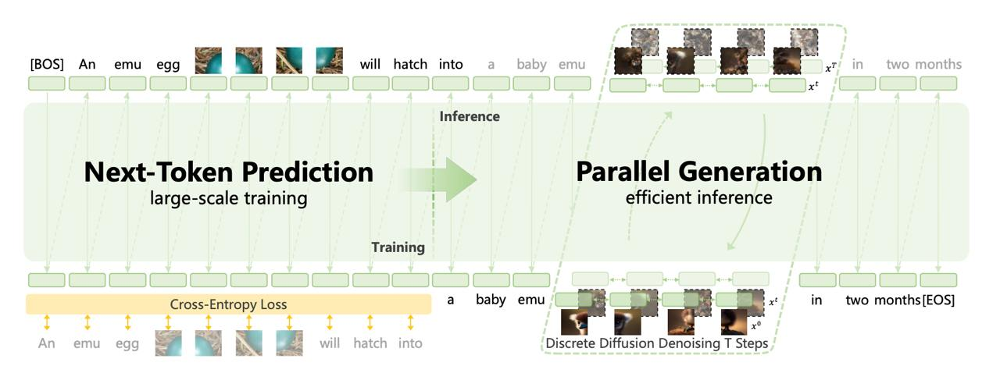

# Emu3.5 - Масштабная мультимодальная world-модель

## Общее описание

**Emu3.5** - это новая масштабная мультимодальная world-модель, разработанная BAAI (Beijing Academy of Artificial Intelligence), которая работает одновременно с двумя потоками данных: текстом и пикселями, предсказывая их совместное состояние на каждом шаге. В отличие от предыдущих работ, здесь авторы прямо говорят, что пытаются построить не просто мультимодальную модель, а некую world модель.

## Архитектура

### Native Multimodal Model
- **Unified World Modeling**: Предсказывает следующее состояние совместно для визуальных и языковых потоков, обеспечивая когерентное моделирование и генерацию мира
- **End-to-End Pretraining**: Обучена с унифицированной next-token предсказательной целью над чередующимися последовательностями "видео-язык"
- **Native Multimodal I/O**: Обрабатывает и генерирует чередующиеся визуально-текстовые последовательности без адаптеров модальностей или специфичных для задач головных модулей
- **Decoder-only архитектура**: Использует один decoder-only-трансформер на 34B параметров, обучаемый чисто авторегрессионно

### Обучение
- Обучена на более чем 10 триллионах чередующихся vision-language токенов из видеокадров и транскриптов
- Захватывает пространственно-временную структуру
- Дообучена с помощью методов подкрепления (Reinforcement Learning) для улучшения рассуждения, композициональности и качества генерации
- Вместо того чтобы опираться в основном на пары картинка-текст, модель обучают преимущественно на чередующихся (interleaved) видео-текстовых последовательностях из интернета
- Видео нарезают на ключевые кадры, аудио транскрибируют с помощью ASR с таймстемпами, а затем всё это склеивают в одну длинную последовательность
- Так модель учится не отдельным сценам, а событиям во времени: динамике, переходам, причинно-следственным связям - это и есть их практическое определение «world learning»
- Кроме видео используют обычные image-text-данные и большой объём text-only-данных
- После претрейна модель доучивают — сначала на гигантском SFT (150 млрд сэмплов), а потом через RL-алайнмент, чтобы она вела себя адекватно и по тексту, и по картинкам

## Ключевые особенности

### Токенизация
- Все модальности токенизируются в общее дискретное пространство
- Словарь модели — около 280k токенов, из которых ~150k приходятся на текст, а остальная часть — на визуальные токены
- Для визуальной части используется собственный токенизатор с REPA-подобной стабилизацией через SigLIP
- Авторы честно признают, что дискретизация всё равно даёт артефакты, поэтому опционально добавляют диффузионный декодер поверх авторегрессионной генерации

### DiDA (Discrete Diffusion Adaptation) подход
- **Принцип работы**: Преобразует последовательное декодирование в параллельное двустороннее "денойзинг"-предсказание в дискретном пространстве токенов
- **Преимущество**: Обеспечивает примерно 20× более быстрый инференс без потери качества
- **Механизм**: Использует дискретные диффузионные адаптации для ускорения генерации
- На этапе инференса модель временно переводится в режим дискретной диффузии: визуальные токены зашумляются и затем восстанавливаются за несколько итераций

### Производительность
- Превосходит Nano Banana (Gemini 2.5 Flash Image) в задачах генерации, редактирования и интерливинга
- Высокое качество мультимодального рассуждения и генерации благодаря RL-дообучению
- Оптимизирована для задач длинного горизонта визуально-языковой генерации

## Применения

### Основные задачи
- Генерация изображений по текстовому описанию
- Редактирование изображений
- Интерливинговые задачи (чередование текста и изображений в одном потоке)
- Долгосрочное прогнозирование визуальных и текстовых последовательностей

### Возможности генерации
- X2I синтез (любое-в-изображение)
- Создание текстово-насыщенных изображений
- Пространственно-временно согласованное моделирование мира
- Открытая эмбодиментная манипуляция в виртуальном мире
- Выдаёт длинные согласованные визуальные нарративы
- Генерация историй с картинками
- Пошаговые визуальные инструкции
- Навигация по сцене по текстовым командам — как будто внутри есть некоторое представление пространства

## Сравнение с другими моделями

### Сравнение с Emu3
- Emu3: Год назад, у них была работа под названием Emu3: Next-Token Prediction is All You Need. Тогда идея была довольно простой: свести текст, картинки и видео к единой задаче next-token prediction. Генерации выглядели сочными, но при внимательном рассмотрении страдали от типичных артефактов дискретизации — текстуры «плыли», мелкие детали разваливались.
- Emu3.5: Амбиции заметно выросли. В Emu3.5 архитектурно всё по-прежнему прямолинейно: один decoder-only-трансформер на 34B параметров, обучаемый чисто авторегрессионно. Самое интересное — в данных.

| Модель | Производительность | Особенности |
|--------|-------------------|-------------|
| Emu3.5 | Современный уровень | Native multimodal, DiDA, World modeling |
| Nano Banana (Gemini 2.5 Flash) | Высокий уровень | Быстрая мультимодальная обработка |
| Emu3 | Предыдущая версия | Менее оптимизированный инференс |

## Варианты модели

- **Emu3.5**: Полнофункциональная версия
- **Emu3.5-Image**: Специализированная версия для обработки изображений
- **Emu3.5-VisionTokenizer**: Специализированная версия для токенизации визуальных данных

## Технические требования

- Рекомендуется ≥2 GPU для лучшей пропускной способности
- Требует flash_attn==2.8.3 для оптимальной производительности
- Конфигурация через configs/config.py

## Связи с другими темами

- [[../../computer_vision/multimodal_models.md|Мультимодальные модели]] - Общие понятия о мультимодальных архитектурах
- [[../../computer_vision/world_models.md|World модели]] - Концепция world моделей, на которых основана Emu3.5
- [[../llm_diffusion_integration.md|Диффузионные модели]] - Теоретическая основа для подхода DiDA
- [[../../inference/multimodal_inference_optimization.md|Оптимизация мультимодального инференса]] - Техники ускорения инференса, включая DiDA
- [[../architectures/diffusion/diffusion_llm_architectures.md|Диффузионные LLM архитектуры]] - Сравнение с другими диффузионными подходами
- [[adamas_attention_mechanism.md|Механизмы внимания]] - Альтернативные архитектурные решения для обработки мультимодальных данных
- [[emu.md|Семейство Emu]] - Общая информация о семействе моделей Emu, к которому принадлежит Emu3.5
- [[../../../../../vision_language_models/nemotron_colembed_v2/index.md|Vision-Language модели]] - Сравнение с другими подходами в области визуально-языкового моделирования

## Источники

- CV Time - разбор работы Emu3.5: Native Multimodal Models are World Learners от команды китайского Института искусственного интеллекта
- Оригинальная статья: Emu3.5: Next-Token Prediction is All You Need

## Дополнительные материалы

- 
**Изображение показывает:** Общая схема тренировочного пайплайна Emu3.5
- 
**Изображение показывает:** Диаграмма архитектуры модели Emu3.5