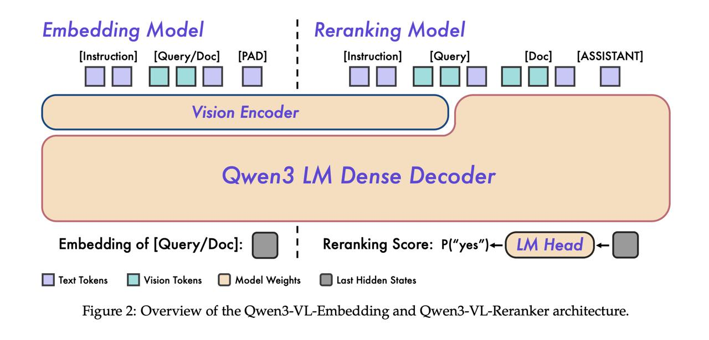

# Qwen3-VL-Reranker: Модель мультимодального реранжирования

## Краткое описание

Qwen3-VL-Reranker - это модель для оценки степени соответствия между запросами и документами в задачах мультимодального поиска. Модель принимает пару (запрос, документ), которые могут быть текстовыми, визуальными или их комбинацией, и возвращает оценку релевантности от 0 до 1.

## История разработки

Qwen3-VL-Reranker стала частью единой фреймворк-системы, представленной командой Qwen в январе 2026 года. Модель была разработана как дополнение к Qwen3-VL-Embedding для обеспечения полного пайплайна мультимодального поиска и ранжирования.

## Архитектура

### Основные компоненты

- **Мультимодальный процессор**: Обрабатывает пары запрос-документ с различными комбинациями модальностей
- **Система оценки релевантности**: Возвращает вероятность соответствия от 0 до 1
- **Инструкционный интерфейс**: Принимает инструкции для настройки поведения модели

### Архитектурные особенности

- Основана на архитектуре VLM (Vision-Language Model)
- Модифицированный выходной слой для задачи классификации релевантности
- В качестве оценки "релевантности документа запросу" используется соотношение вероятностей токенов "yes" и "no"
- Полный инференс VLM, но с измененной интерпретацией выхода
- Только стадия prefill (обработка входного контекста), без стадии декодирования
- Многократно более быстрый инференс по сравнению с полноценными VLM

### Обзор архитектуры

 <!-- TODO: Broken image path -->

**Изображение показывает:** Обзор архитектуры моделей Qwen3-VL-Embedding и Qwen3-VL-Reranker, демонстрирующий как они обрабатывают мультимодальные входные данные для генерации эмбеддингов и оценки релевантности.

## Применение

### Функция реранжирования
```
def reranker(instruction: str, query: str | Image, document: str | Image) -> float
```

### Области применения

- **Финальное ранжирование в RAG-системах**: Оценка релевантности извлеченных документов перед генерацией ответа
- **Мультимодальный поиск**: Ранжирование результатов, которые могут быть текстовыми, визуальными или комбинацией
- **Оценка качества пар "запрос-документ"**: Использование в системах оценки качества поиска

## Особенности

- **Оценка релевантности от 0 до 1**: Возвращает вероятность соответствия запроса документу
- **Поддержка различных комбинаций модальностей**: Может обрабатывать текст-текст, текст-изображение, изображение-текст, изображение-изображение пары
- **Высокая скорость инференса**: Быстрая обработка без этапа генерации токенов
- **Интеграция с Qwen3-VL-Embedding**: Часто используется в паре для обеспечения полного пайплайна поиска
- **Доступные размеры**: Модель доступна в двух вариантах: 2 и 8 миллиардов параметров
- **Quantization-aware обучение**: Тренировка проводится в режиме quantization-aware, что позволяет квантовать полученные эмбеддинги в int8 с минимальной потерей качества
- **Matryoshka Representation Learning (MRL)**: Использует подход матрешки, при котором лоссы применяются не только к полным эмбеддингам, но и к их частям (32, 64, 128, 256, 512 элементов), позволяя использовать усеченные эмбеддинги разного размера
- **Длинный контекст**: Большое окно контекста (32K токенов) позволяет обрабатывать 10–20 страниц изображений совместно с текстом

## Обучение модели

### Многоэтапный процесс обучения
Обучение модели проходит в несколько этапов:
1. **Этап s0**: Обучение начального эмбеддинга на всем датасете с использованием контрастивного InfoNCE-лосса
2. **Этап s1**: Использование Embedding:s0 для фильтрации датасета и последующее обучение улучшенного эмбеддера и реранкера
3. **Этап s2**: Фильтрация с помощью реранкера и использование его скоров как таргета для дистилляции эмбеддинга
4. **Финальный этап**: Усреднение (сферическая интерполяция) весов с Embedding:s1 для создания финальной модели Embedding:s3

### Quantization-aware обучение
Модель тренируется с учетом квантования: при вычислении лоссов для эмбеддингов одновременно вычисляются лоссы для квантизованных в int8-эмбеддингов. Это позволяет:
- Квантовать эмбеддинги в int8 (масштабировать в интервал [-127, 128] и округлить)
- Хранить и использовать эмбеддинги с практически неизменным качеством

### Матрешечное обучение представлений (Matryoshka Representation Learning)
Подход, при котором лоссы применяются не только к полным эмбеддингам, но и к их первым:
- 32 элементам
- 64 элементам
- 128 элементам
- 256 элементам
- 512 элементам
- 1024 элементам (полному эмбеддингу)

Это позволяет использовать "подсрезы" эмбеддингов разного размера, сокращая размер эмбеддингов базы документов в 10–50 раз при сохранении качества.

## Сравнение с другими моделями

- Расширяет возможности традиционных текстовых моделей реранжирования до визуальных данных
- Сочетает преимущества Qwen3-VL с задачами оценки релевантности
- Обеспечивает согласованное поведение между текстовыми и визуальными запросами
- Превосходит все существующие открытые и закрытые модели на мультимодальных бенчмарках
- На текстовых задачах есть более сильные модели, но они существенно больше по размеру

## Пайплайн мультимодального поиска

### Двухэтапный подход

1. **Первоначальный поиск с помощью эмбеддингов**: Использование Qwen3-VL-Embedding для быстрого поиска кандидатов
2. **Финальное ранжирование**: Применение Qwen3-VL-Reranker для точной оценки релевантности топ-N кандидатов

### Архитектура модели
- **Reranker**: Выполняет полный инференс VLM, но в качестве оценки "релевантности документа запросу" использует соотношение вероятностей токенов "yes" и "no"
- **Embedding**: Выполняет инференс до последнего слоя (скрытое состояние перед проекцией в вероятности словаря возвращается как эмбеддинг)
- **Только стадия prefill**: Обработка входного контекста без стадии декодирования, что делает инференс многократно быстрее

## Связи с другими темами

- [[qwen3-vl-embedding.md]] - Модель эмбеддингов из той же серии для задач мультимодального поиска
- [[qwen-vl-series.md]] - Общая информация о серии Qwen-VL моделей
- [[qwen3-vl.md]] - Подробная информация о Qwen3-VL
- [[qwen3-vl-training-pipeline.md]] - Многоэтапный процесс обучения модели
- [[qwen3-vl-unified-framework.md]] - Единая фреймворк-система для мультимодального поиска и ранжирования
- [[../../../applications/nlp/reranking.md]] - Общие принципы реранжирования результатов поиска
- [[../../../applications/nlp/embedding_models.md]] - Модели эмбеддингов для RAG-систем
- [[vlm_models.md]] - Общие понятия о Vision Language моделях
- [[matryoshka_representation_learning.md]] - Подход к обучению представлений с разными размерами

## Источники

1. Технический отчет команды Qwen о Qwen3-VL-Embedding и Qwen3-VL-Reranker моделях для мультимодального поиска и ранжирования (январь 2026)
2. Статья "Qwen3-VL-Embedding and Qwen3-VL-Reranker: A Unified Framework for State-of-the-Art Multimodal Retrieval and Ranking" подготовлена Борисом Зимкой, CV Time (январь 2026)
3. [[./qwen3-vl-embedding.md]] - Связанная модель эмбеддингов из той же серии для задач мультимодального поиска