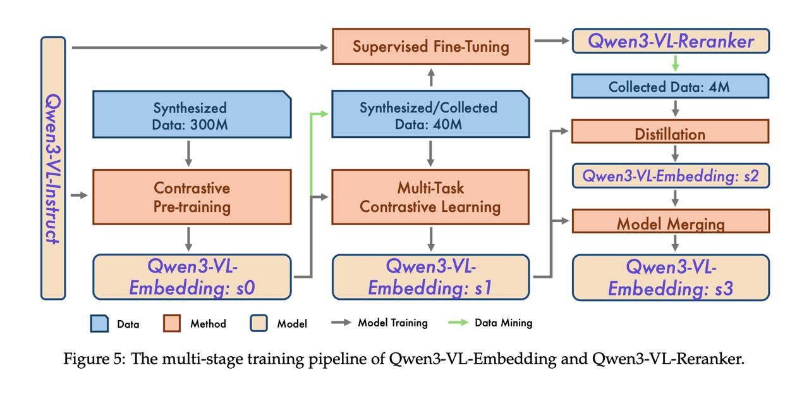

# Qwen3-VL-Embedding и Qwen3-VL-Reranker: Многоэтапный процесс обучения

## Краткое описание

Многоэтапный процесс обучения для моделей Qwen3-VL-Embedding и Qwen3-VL-Reranker использует сложную методологию, при которой модели с этапа X используются для фильтрации данных для этапа X+1, а эмбеддинги и реранкеры обучают друг друга на разных этапах.

**Изображение показывает:** Процесс многоэтапного обучения моделей Qwen3-VL-Embedding и Qwen3-VL-Reranker, демонстрируя как каждая стадия использует результаты предыдущей для улучшения качества итоговой модели.

## Этапы обучения

### Этап s0: Обучение начального эмбеддинга
- **Основная цель**: Первичное обучение эмбеддингов на всем датасете
- **Метод**: Использование контрастивного InfoNCE-лосса
- **Результат**: Модель Embedding:s0
- **Особенности**: Обучение на базе LoRA к Qwen3-VL для сохранения способностей бэкбона

### Этап s1: Фильтрация датасета и обучение улучшенных моделей
- **Использование**: Применение Embedding:s0 для фильтрации датасета
- **Результат**: Отфильтрованный датасет для следующего этапа
- **Обучение**: На отфильтрованном датасете обучается:
  - Улучшенный эмбеддер (Embedding:s1)
  - Модель реранжирования (Reranker)
- **Метод**: Совместное обучение эмбеддингов и реранкера

### Этап s2: Дистилляция через реранкер
- **Использование**: Применение обученного Reranker для фильтрации данных
- **Метод**: Использование скоров (оценок) реранкера как таргета для дистилляции эмбеддинга
- **Результат**: Улучшенная модель эмбеддингов (Embedding:s2)
- **Особенность**: Информация от реранкера используется для улучшения эмбеддингов

### Финальный этап: Усреднение весов
- **Метод**: Сферическая интерполяция весов между Embedding:s2 и Embedding:s1
- **Результат**: Финальная модель Embedding:s3
- **Особенность**: Сохранение сильных сторон обеих моделей

## Архитектурные особенности процесса

### LoRA-обучение
- **Цель**: Сохранение способностей сильного бэкбона Qwen3-VL
- **Метод**: Все этапы обучения используют LoRA (Low-Rank Adaptation) к Qwen3-VL
- **Преимущество**: Минимизация риска деградации базовой модели

### Взаимное обучение
- **Эмбеддинги ↔ Реранкеры**: Модели обучают друг друга на разных этапах
- **Этап X → Этап X+1**: Модели с одного этапа фильтруют данные для следующего
- **Итеративное улучшение**: Каждый этап улучшает качество предыдущих

### Фильтрация данных
- **Dynamic filtering**: Использование промежуточных моделей для фильтрации данных
- **Quality improvement**: Удаление некачественных или hard-negative примеров
- **Balanced datasets**: Нормализация распределения датасетов для избежания доминирования одного домена

## Технологии обучения

### Quantization-aware обучение
- **Цель**: Подготовка моделей к работе с квантованными эмбеддингами
- **Метод**: Одновременное вычисление лоссов для полных и квантованных в int8 эмбеддингов
- **Результат**: Возможность квантования эмбеддингов в int8 с минимальной потерей качества

### Matryoshka Representation Learning (MRL)
- **Метод**: Применение лоссов не только к полным эмбеддингам, но и к их "подсрезам" (32, 64, 128, 256, 512 элементов)
- **Результат**: Поддержка эмбеддингов разных размеров из одного вектора
- **Преимущество**: Сокращение размера эмбеддингов базы документов в 10-50 раз

### Контрастивное обучение
- **InfoNCE loss**: Используется как основной лосс для обучения эмбеддингов
- **Многомодальные пары**: Обучение на парах запрос-документ с разными модальностями
- **Hard negatives**: Использование сложных негативных примеров

## Структура датасетов

### Структура данных
- **Инструкция задачи I**: Одна текстовая инструкция, описывающая задачу
- **Мультимодальная база документов D[i]**: Коллекция документов с текстом и изображениями
- **Мультимодальные запросы Q[j]**: Запросы разного типа
- **Матрица меток R[i, j]**: Определяет D[i] как релевантный или нерелевантный Q[j]

### Генерация данных
- **VLM-генерация**: Использование VLM для описания и классификации документов
- **Фильтрация**: Удаление некачественных документов
- **Разнообразие запросов**: Генерация запросов разных типов (как релевантных, так и hard-negative)
- **Post-training фильтрация**: Дополнительная фильтрация существующими моделями

## Результаты и оценка

### Метрики производительности
- **Превосходство на бенчмарках**: Модели превосходят все существующие открытые и закрытые модели на мультимодальных бенчмарках
- **Текстовые задачи**: На текстовых задачах есть более сильные (но большие) модели
- **Сбалансированная производительность**: Хорошие результаты на текстовых и визуальных задачах

### Области применения
- **Мультимодальный поиск**: Поиск документов, сочетающих разные модальности
- **RAG-системы**: Интеграция в системы извлечения ответов на основе внешней информации
- **Рекомендательные системы**: Мультимодальные рекомендации на основе текста и изображений

## Сравнение с другими подходами обучения

### Традиционное обучение
- **Одностадийное обучение**: Обычно одна стадия с фиксированным датасетом
- **Отдельные модели**: Эмбеддинги и реранкеры обучают независимо

### Многоэтапный подход Qwen3-VL
- **Итеративное улучшение**: Каждая стадия использует предыдущие результаты
- **Взаимное обучение**: Модели обучают друг друга
- **Фильтрация данных**: Использование промежуточных моделей для очистки данных

## Связи с другими темами

- [[qwen3-vl-embedding.md]] - Модель эмбеддингов, обученная этим пайплайном
- [[qwen3-vl-reranker.md]] - Модель реранжирования, обученная этим пайплайном
- [[qwen3-vl-unified-framework.md]] - Общая система, включающая обе модели
- [[matryoshka_representation_learning.md]] - Метод обучения представлений, используемый в пайплайне
- [[lora_optimization.md]] - Метод низкоранговой адаптации, используемый в обучении

## Источники

1. Технический отчет команды Qwen о многоэтапном обучении Qwen3-VL-Embedding и Qwen3-VL-Reranker (январь 2026)
2. Статья "Qwen3-VL-Embedding and Qwen3-VL-Reranker: A Unified Framework for State-of-the-Art Multimodal Retrieval and Ranking" подготовлена Борисом Зимкой, CV Time (январь 2026)
3. [[./qwen3-vl-embedding.md]] - Результат обучения: модель эмбеддингов
4. [[./qwen3-vl-reranker.md]] - Результат обучения: модель реранжирования