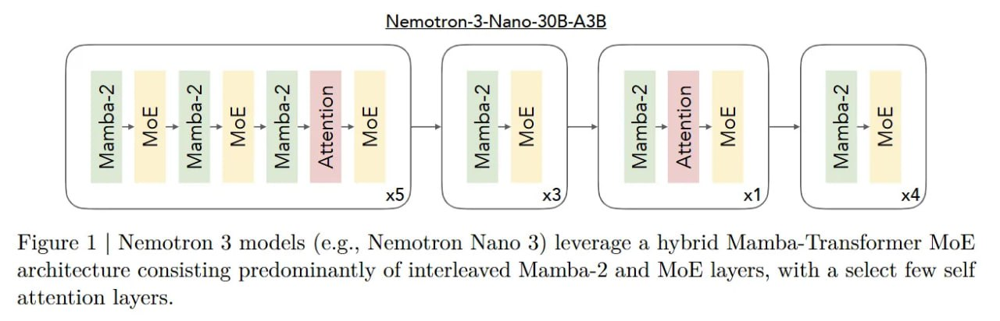
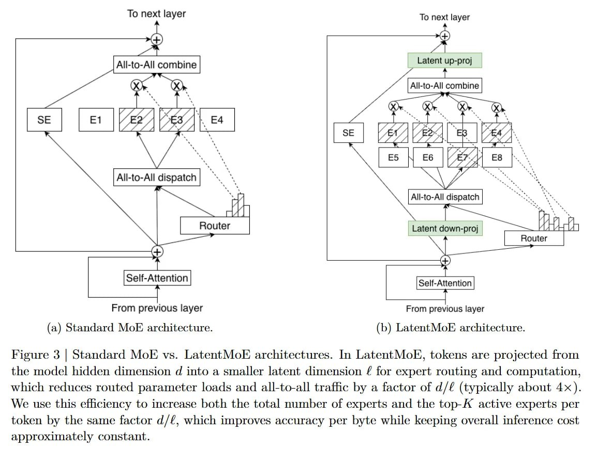
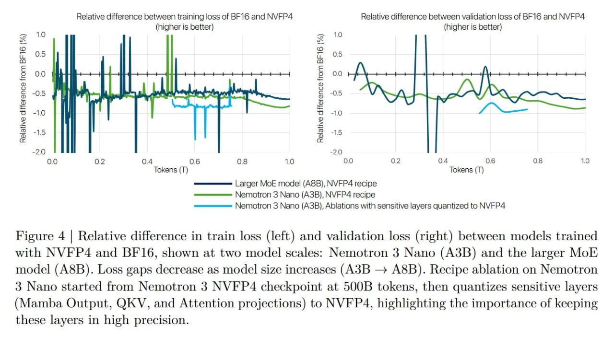
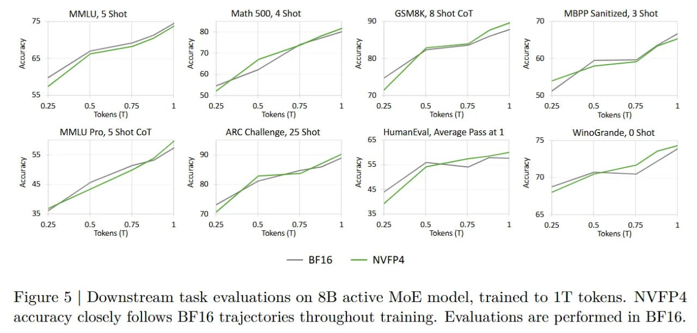
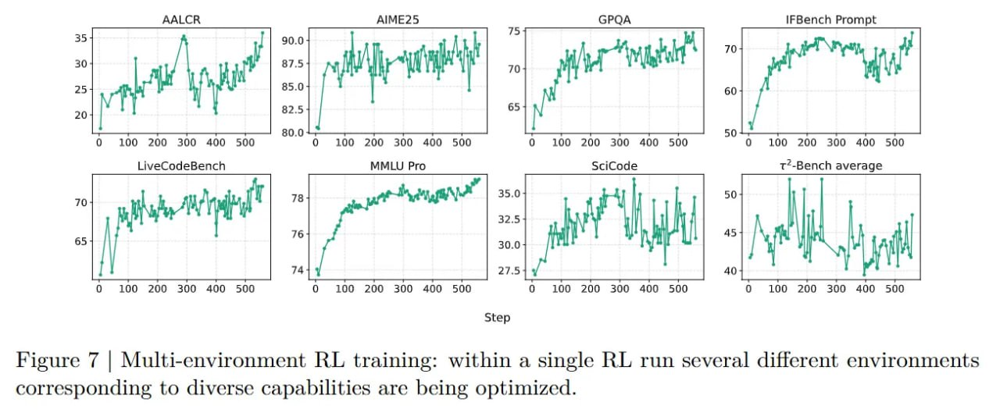
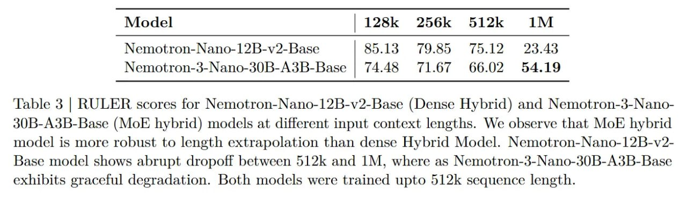
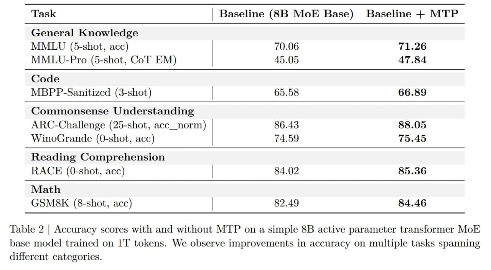

# NVIDIA Nemotron 3: Семейство эффективных и открытых языковых моделей

## Общее описание

NVIDIA Nemotron 3 - это семейство моделей, представленное NVIDIA, включающее Nano, Super и Ultra версии, построенных на гибридной архитектуре Mamba-Transformer Mixture-of-Experts (MoE). Главные инновации: LatentMoE (роутинг со сжатием для экономии канала), нативное обучение в NVFP4 для крупных моделей и одновременное RL-обучение в нескольких средах.

## История и развитие

NVIDIA Nemotron 3 представляет собой эволюцию от плотных гибридных архитектур к разреженным MoE ради скорости. Если Nemotron 2 Nano доказала, что можно заменить трансформерные слои на Mamba, то с масштабированием и стабильностью на длинном контексте были проблемы. Nemotron 3 решает это, внедряя основу Mixture-of-Experts (MoE), перемежающуюся слоями Mamba-2.

## Архитектурные особенности

### Гибридная архитектура Mamba-Transformer MoE

- **Основа архитектуры**: Стек, где доминируют Mamba-2 слои, перемешанные с MoE и редкими слоями внимания
- **Эффективная обработка длинных последовательностей**: Позволяет избавиться от квадратичной сложности, Mamba обновляет рекуррентное состояние фиксированного размера
- **Интеграция преимуществ**: Mamba обеспечивает постоянное состояние и эффективность, а редкие слои внимания позволяют точечно извлекать информацию и решать проблему "вспоминания", свойственную чистым SSM

### LatentMoE (Сжатый MoE)

Самый теоретически интересный вклад - архитектура LatentMoE в моделях Super и Ultra. Обычные MoE на высоких скоростях часто упираются не во флопсы, а в накладные расходы на коммуникацию (all-to-all communication). Ширина канала для отправки токенов экспертам растёт линейно с размерностью модели d.

Чтобы обойти это узкое место, авторы предлагают роутинг через проекции. Вместо отправки полного эмбеддинга x∈R^d, вход проецируется в латентное пространство меньшей размерности z∈R^ℓ, где ℓ < d. Эксперты работают внутри этого сжатого пространства. Коэффициент сжатия d/ℓ обычно даёт четырёхкратную экономию трафика.

Принцип "сохранения вычислительной энергии": сэкономленное на передаче реинвестируется в увеличение общего числа экспертов N' и активных экспертов K'. Если обычная модель активирует K экспертов, LatentMoE запускает K * (d/ℓ). Это бустит нелинейность и ёмкость модели без нагрузки на коммуникацию, эффективно разменивая размерность на разнообразие экспертов.

## Ключевые инновации

### 1. Решение проблемы длинного контекста

- **Переход к разреженности**: Плотная структура страдала от резкой деградации качества при выходе за пределы контекста обучения
- **Устойчивость к длине**: Переход на MoE позволил Nemotron 3 Nano деградировать гораздо плавнее и уверенно работать на длине до 1 миллиона токенов
- **Преимущества RULER bench**: Бенчмарк RULER подтверждает, что новинка кардинально превосходит плотный бейзлайн Nemotron-2 (54.19 против 23.43 на 1M токенов)

### 2. NVFP4 Training

- **Низкоточное обучение**: Модели Super и Ultra обучаются в NVFP4 - формате с 16-элементным скейлингом микроблока
- **Селективная точность**: Анализ чувствительности показал, что выходные проекции Mamba и QKV в Attention не любят шум квантования и дают выбросы. Эти слои оставили в MXFP8 или BF16
- **Производительность**: Такая селективная точность даёт трёхкратный прирост скорости на Blackwell (GB200), удерживая разницу в лоссе с BF16 в пределах 1%

### 3. Multi-environment Reinforcement Learning

- **Одновременное обучение**: Модель учится одновременно в разных средах (математика, код, использование инструментов) через алгоритм GRPO
- **Борьба с "катастрофическим забыванием"**: Одновременное обучение предотвращает деградацию на других задачах
- **Контроль бюджета рассуждений**: Спецтокен ⟨think_stop⟩ заставляет модель завершить цепочку рассуждений (CoT), что позволяет балансировать между скоростью и точностью

### 4. Multi-Token Prediction (MTP)

- **Предварительное планирование**: Обучение с Multi-Token Prediction заставляет модель планировать вперёд, улучшая точность (+2.4% в среднем)
- **Нативное "черновое моделирование"**: MTP работает как встроенная "черновая модель" для спекулятивного декодирования

## Архитектурные детали

### Гибридная механика

Для токена x_t архитектура проходит через стек, где доминирует Mamba-2 вперемешку с MoE и редкими слоями внимания. Это избавляет от квадратичной сложности. Mamba обновляет рекуррентное состояние фиксированного размера. Когда токен попадает в слой LatentMoE, он проходит down-проекцию W_{down} ∈ R^{d×ℓ}, роутится к экспертам и проецируется обратно W_{up} ∈ R^{ℓ×d} в остаточный поток (residual stream).

### Позиционная информация

- **Неявная позиционная информация**: Так как Mamba даёт неявную позиционную информацию, разреженным слоям внимания не нужны Rotary Positional Embeddings (RoPE) - частый источник ошибок при экстраполяции длины
- **Высокая пропускная способность**: В итоге Nemotron 3 держит высокую пропускную способность (спасибо константному состоянию Mamba) и умеет точечно извлекать информацию через Attention

## Производительность и benchmarks

### Длинный контекст

- **Окно в 1M токенов**: Архитектура уверенно работает с контекстом длиной до 1 миллиона токенов
- **Стабильность при экстраполяции**: Валидация на бенчмарке RULER показала, что гибрид Mamba-MoE куда лучше переваривает экстраполяцию длины, чем плотный Nemotron 2
- **Комплементарность**: Хребет Mamba держит глобальную структуру сверхдлинной последовательности без взрыва памяти, а редкий Attention ищет "иголки в стоге сена"

### Сравнение с предыдущими версиями

| Модель | Тип архитектуры | Контекст | RULER 1M |
|--------|----------------|----------|----------|
| Nemotron-2 (плотный) | Плотный гибрид | 512K | 23.43 |
| Nemotron-3 (MoE) | Разреженный гибрид | 1M | 54.19 |

## Практические применения

### Агенты для edge-устройств

- **Память vs Кэш**: Если пилите агентов для edge-устройств, где нужна память, но мало кэша - смотрите на Nemotron 3 Nano
- **Эффективность**: Архитектура оптимизирована под железо и предоставляет высокую пропускную способность

### Инференс и развертывание

- **Open модели**: Модели открыты (NVIDIA-Nemotron-Nano-30B-A3B на HuggingFace)
- **Полный стек RL**: Открытый стек для RL-обучения — шаг к демократизации агентов

## Ограничения и сложности

- **Сложная реализация**: За скорость приходится платить сложностью реализации
- **Капризность к квантованию**: Необходимость высокой точности для выходных слоёв Mamba намекает, что архитектура капризнее к квантования, чем обычные трансформеры
- **Требования к LatentMoE**: LatentMoE требует тщательного тюнинга проекций, чтобы не потерять выразительность в латентном пространстве
- **Проверка in-context learning**: Опора на Mamba требует внимательной проверки способностей к in-context learning, хотя слои внимания призваны это компенсировать

## Сравнение с конкурентами

| Аспект | Nemotron 3 | Традиционные трансформеры | Чистые SSM |
|--------|------------|---------------------------|------------|
| Длинный контекст | 1M+ токенов | Ограниченный | Ограниченный |
| Пропускная способность | Высокая | Средняя | Высокая |
| Рассуждения | Высокая | Высокая | Низкая |
| Эффективность | Очень высокая | Низкая | Высокая |

## Связи с другими темами

- [[nvidia_nemotron_2_mamba_transformer.md]] - Предыдущая версия, на основе которой была разработана Nemotron 3
- [[mamba_architecture.md]] - Основная архитектура, используемая в гибридной модели
- [[mamba_2_architecture.md]] - Улучшенная версия Mamba, используемая в Nemotron 3
- [[mixture_of_experts_architecture.md]] - Общая архитектура MoE, на которой основана Nemotron 3
- [[latentmoe_architecture.md]] - Инновационная архитектура маршрутизации экспертов с сжатием, используемая в Nemotron 3 Super и Ultra
- [[nvfp4_format.md]] - Формат квантования, используемый для обучения
- [[reasoning_benchmarks.md]] - Бенчмарки, на которых тестируются модели
- [[ruler_benchmark.md]] - Бенчмарк для оценки способности модели обрабатывать длинные контексты
- [[grpo_algorithm.md]] - Алгоритм, используемый для многократного RL-обучения
- [[multi_token_prediction.md]] - Техника, использованная для улучшения обучения
- [[nvidia_nemotron_colembed_v2.md]] - Семейство мультимодальных эмбеддинговых моделей, построенных на базе архитектуры Nemotron, для задач визуального поиска документов

## Визуализации

 <!-- TODO: Broken image path -->

**Изображение показывает:** Архитектуру Nemotron 3 моделей (например, Nemotron Nano 3), использующих гибридную Mamba-Transformer MoE архитектуру, состоящую преимущественно из чередующихся Mamba-2 и MoE слоев, с небольшим количеством слоев самовнимания.

 <!-- TODO: Broken image path -->

**Изображение показывает:** Гибридная Mamba-Transformer MoE архитектура, используемая моделями Nemotron 3, может достигать передового качества на ведущих бенчмарках рассуждения и задачах с ультра-длинным контекстом, обеспечивая при этом улучшение пропускной способности по сравнению с аналогичными по размеру MoE трансформерами.

 <!-- TODO: Broken image path -->

**Изображение показывает:** Сравнение стандартной архитектуры MoE и LatentMoE. В LatentMoE токены проецируются из скрытой размерности d в меньшую латентную размерность l для маршрутизации и вычислений экспертов, что уменьшает объем параметров экспертов и трафик all-to-all в d/l раз (обычно около 4x).

 <!-- TODO: Broken image path -->

**Изображение показывает:** Относительная разница в тренировочном (слева) и валидационном (справа) лоссе между моделями, обученными с использованием NVFP4 и BF16, показана при двух масштабах модели: Nemotron 3 Nano (A3B) и более крупная MoE модель (AB).

 <!-- TODO: Broken image path -->

**Изображение показывает:** Оценки задач downstream для 8B активных MoE моделей, обученных до 1Т токенов. Точность NVFP4 близко следует траекториям BF16 на протяжении всего обучения. Оценки выполняются в BF16.

 <!-- TODO: Broken image path -->

**Изображение показывает:** Накопительное среднее значение отрицательного логарифма правдоподобия как функция от позиции токена в данных кода. Nemotron 3 Nano base демонстрирует улучшенные предсказания до 1М токенов в кодовых данных.

 <!-- TODO: Broken image path -->

**Изображение показывает:** Обучение с подкреплением в нескольких средах: в рамках одного RL запуска оптимизируются сразу несколько различных сред, соответствующих разнообразным возможностям.

 <!-- TODO: Broken image path -->

**Изображение показывает:** Компромисс между точностью и эффективностью с контролем бюджета рассуждений во время инференса.

 <!-- TODO: Broken image path -->

**Изображение показывает:** Таблица 3 - RULER оценки для моделей Nemotron-Nano-12B-v2-Base (плотный гибрид) и Nemotron-3-Nano-30B-A3B-Base (MoE гибрид) на разных длинах входного контекста. MoE гибридная модель более устойчива к экстраполяции длины, чем плотная гибридная модель.

 <!-- TODO: Broken image path -->

**Изображение показывает:** Таблица 2 - Оценки точности с и без MTP на простой 8B активной параметрической трансформерной MoE базовой модели, обученной на T токенах. Мы наблюдаем улучшения точности по нескольким задачам из разных категорий.

## Источники

1. [NVIDIA Nemotron 3: Efficient and Open Intelligence](https://arxiv.org/abs/2512.20856) - Основная статья о семействе моделей Nemotron 3
2. [NVIDIA Research: Nemotron 3 Technical Report](https://research.nvidia.com/labs/nemotron/files/NVIDIA-Nemotron-3-White-Paper.pdf) - Технический отчет от NVIDIA
3. [Nemotron 3 Nano Technical Report](https://research.nvidia.com/labs/nemotron/files/NVIDIA-Nemotron-3-Nano-Technical-Report.pdf) - Технический отчет о Nemotron 3 Nano
4. [ArXivIQ Review: NVIDIA Nemotron 3](https://arxiviq.substack.com/p/nvidia-nemotron-3-efficient-and-open) - Обзор и анализ статьи
5. [HuggingFace Collection: NVIDIA Nemotron-V3](https://huggingface.co/collections/nvidia/nvidia-nemotron-v3) - Коллекция моделей на HuggingFace
6. [GitHub: NVIDIA-NeMo/RL](https://github.com/NVIDIA-NeMo/RL) - Открытый стек для RL-обучения