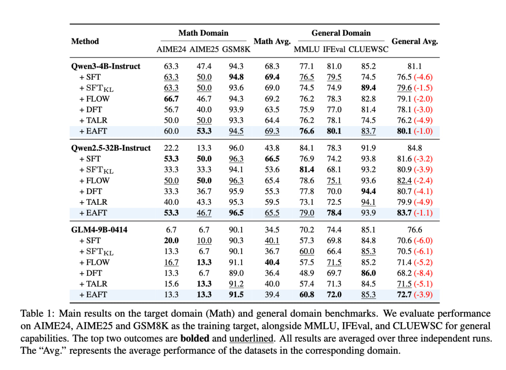
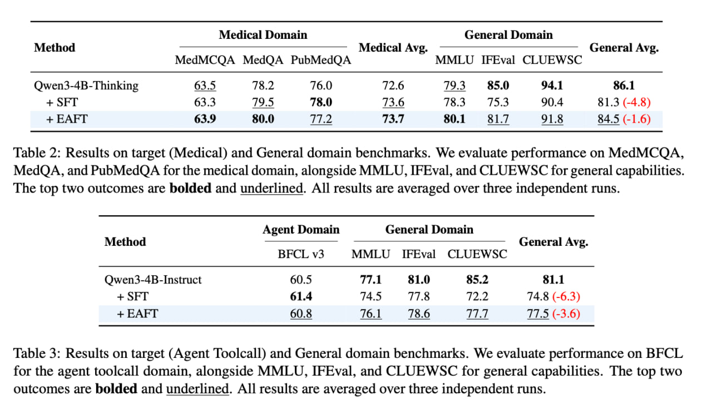
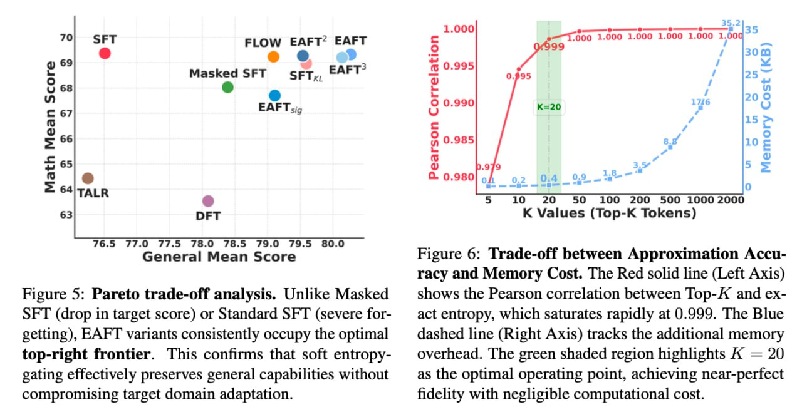

# Адаптивный fine-tuning с энтропийным контролем (Entropy-Adaptive Fine-Tuning, EAFT)

## Определение

Адаптивный fine-tuning с энтропийным контролем (Entropy-Adaptive Fine-Tuning, EAFT) - это метод дообучения трансформерных языковых моделей, который решает проблему катастрофического забывания при тонкой настройке. EAFT модифицирует стандартную функцию потерь (кросс-энтропию) с помощью адаптивного гейтинг-механизма, который масштабирует потери на основе энтропии токенов, позволяя модели сохранять общие знания при обучении на целевом домене.

## Основные особенности

- **Энтропийный гейтинг**: Использует энтропию токенов как сигнал для масштабирования потерь
- **Адаптивное масштабирование**: Модулирует влияние токенов на обучение в зависимости от их "вредности"
- **Сохранение знаний**: Уменьшает катастрофическое забывание при сохранении эффективности тонкой настройки
- **Простота реализации**: Легко интегрируется в стандартные процедуры обучения
- **Без дополнительных шагов**: Работает без дополнительных этапов обучения (в отличие от GOLD метода)

## Принцип работы

EAFT работает по следующей схеме:

1. **Определение "вредности" токенов**: Авторы определяют "вредность" токенов как сочетание низкой энтропии и низкой вероятности в top-K распределении
2. **Конфликт уверенности**: Когда модель уверена в выборе токена (низкая энтропия), но этот токен не совпадает с целевым (низкая вероятность), происходит "confident conflict"
3. **Адаптивное масштабирование**: Модифицирует стандартную кросс-энтропию домножением логарифма на H_t / ln(K), где H_t - энтропия на top-K, а ln(K) - максимальная энтропия на top-K
4. **Динамическое обучение**: При низкой энтропии коэффициент стремится к нулю, снижая влияние токена на обучение; при высокой энтропии коэффициент стремится к единице

## Математическая формулировка

Стандартная кросс-энтропия модифицируется следующим образом:

L_EAFT = -α_t * log(p(y_t | x, θ))

где α_t = H_t / ln(K), H_t - энтропия на top-K токенах, а K - размер top-K.

Когда энтропия H_t низкая, α_t стремится к 0, что уменьшает влияние токена на обучение. Когда H_t высокая, α_t стремится к 1, позволяя нормальному обучению.

## Преимущества

- **Сохранение знаний**: Значительно уменьшает катастрофическое забывание при тонкой настройке
- **Сохранение эффективности**: Сохраняет преимущества обучения на целевом домене
- **Простота реализации**: Требует минимальных изменений в существующих системах обучения
- **Перенаправление градиентов**: В отличие от изменения скорости обучения, изменяет направление градиентов
- **Пер-токенное масштабирование**: Позволяет более точно контролировать влияние разных токенов

## Сравнение с другими методами

| Метод | Подход | Преимущества | Недостатки |
|-------|--------|------------|-----------|
| **Стандартный SFT** | Обычная кросс-энтропия | Простой, эффективный | Высокий риск забывания |
| **MASKED SFT** | Маскировка токенов с низкой уверенностью | Уменьшает забывание | Может ухудшать обучение |
| **KL-дивергенция** | Ограничение отклонения от исходной модели | Сохраняет оригинальное поведение | Может ограничивать адаптацию |
| **DFT** | Масштабирование потерь на вероятность токена | Балансирует обучение и сохранение | Сложнее для настройки |
| **FLOW** | Per-sequence downweighting опасных семплов | Учет последовательности | Требует вычислительно сложной оценки |
| **TALR** | Масштабирование per-token потерь по норме градиентов | Адаптивное к сложности | Меньше информации о внутренних состояниях |
| **EAFT** | Масштабирование per-token по энтропии | Эффективный баланс | Нужно определить top-K параметр |

## Результаты экспериментов

- **Модели**: Qwen3-4b-Instruct, Qwen-2.5-32b-Instruct, GLM4-9b-0414
- **Домены**: математика, медицина, вызовы инструментов
- **Метрики**: AIME24, AIME25, GSM8K, MMLU, IFEval, CLUEWSC и другие
- **Результаты**: EAFT показывает лучшее соотношение "забывание-обучение" среди всех протестированных методов
- **Преимущество**: Сохраняет общие способности при адаптации к целевым доменам

## Отличия от традиционных методов

- В отличие от маскировки токенов (STM), EAFT использует мягкое масштабирование
- В отличие от KL-регуляризации, EAFT применяет per-token подход
- В отличие от DFT, использует энтропию, а не вероятность токена
- В отличие от TALR, использует внутренние состояния модели (энтропию) для оценки

## Возможные улучшения

- **Нелинейные функции**: Вместо H_t можно использовать f(H_t) = H_t^p, Sigmoid(H_t)
- **Оптимизация top-K**: Выбор оптимального размера top-K для конкретной задачи
- **Динамические пороги**: Адаптивное изменение порога энтропии в процессе обучения

## Применение

EAFT особенно эффективен:
- При адаптации моделей к узкоспециализированным доменам
- В сценариях, где важна сохранность общих знаний
- Для небольших доменных тюнов, где важно сохранить робастность
- При работе с ограниченными вычислительными ресурсами (метод дешевый)

## Ограничения

- **Языковая специфика**: При адаптации к сильно отличающимся языкам могут возникнуть проблемы
- **Токенизация**: Для плохо токенизируемых последовательностей (например, редких слов) может произойти неправильное масштабирование
- **Требует настройки**: Необходимо определить параметр top-K для энтропийного анализа

## Связи с другими темами

- [[llm_fine_tuning_preserving_skills.md]] - основы сохранения навыков при дообучении
- [[gold_method.md]] - альтернативный метод сохранения знаний через дистилляцию
- [[techniques_for_small_models.md]] - дополнительные техники эффективного обучения
- [[continual_learning/catastrophic_forgetting/catastrophic_forgetting.md]] - фундаментальная проблема, которую решает EAFT
- [[confidence_measurements_in_llm_reasoning.md]] - измерения уверенности, используемые в EAFT

## Источники

1. [Entropy-Adaptive Fine-Tuning: Mitigating Forgetting via Entropy-Gated Loss Scaling](https://arxiv.org/) - оригинальная статья о методе EAFT
2. [Mitigating Forgetting in LLM Fine-Tuning via Selective Token Masking (STM)](https://openreview.net/forum?id=1ktdvp1EYI) - метод Selective Token Masking, сравниваемый с EAFT
3. [GOLD: General On-Policy Logit Distillation](https://arxiv.org/abs/) - альтернативный метод сохранения знаний при дообучении
4. [Huggingface Blog Post on Fine-Tuning Preservation Methods](https://huggingface.co/blog/) - объяснение методов сохранения знаний при дообучении

## Медиа

**Рисунок показывает:** (a) Маскирование "уверенных конфликтов" токенов (нижние 15% по энтропии и вероятности) эффективно уменьшает деградацию общих возможностей, наблюдаемую при стандартной SFT. (b) В математических, медицинских и агентных доменах EAFT соответствует SFT в улучшениях целевой задачи (верхние столбцы) при значительном минимизации падения производительности на общих бенчмарках (нижние столбцы).

**Таблица показывает:** Сравнение EAFT с другими методами (SFT, FLOW, DFT, TALR) на моделях Qwen3-4B, Qwen2.5-32B и GLM4-9B. EAFT достигает лучшего баланса между обучением на целевом домене и сохранением общих знаний.

**Таблица показывает:** Результаты на медицинских бенчмарках (MedMCQA, MedQA, PubMedQA) и общих бенчмарках. EAFT сохраняет лучший баланс между специализацией и общими способностями.

**Рисунок показывает:** В отличие от маскировки SFT (падение в целевом показателе) или стандартной SFT (серьезное забывание), варианты EAFT постоянно занимают оптимальную верхнюю правую границу. Это подтверждает, что мягкое энтропийное гейтинг эффективно сохраняет общие возможности без ущерба для адаптации целевого домена.