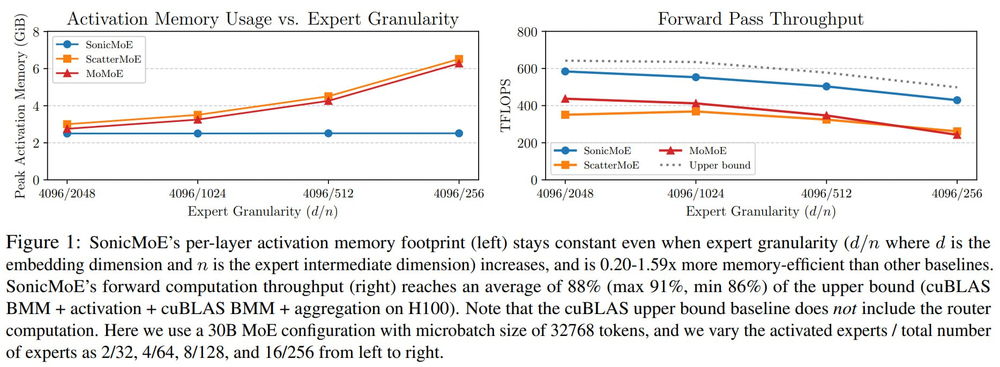

# SonicMoE: Оптимизация вычислений и памяти для архитектур Mixture of Experts

## Общее описание

SonicMoE - это новая оптимизация от Tri Dao, направленная на ускорение обучения моделей Mixture of Experts (MoE). Решение показывает почти двукратное ускорение по сравнению с лучшими открытыми ядрами MoE при одновременном использовании почти вдвое меньше памяти для хранения активаций [1]. На практике это повышает эффективность обучения в 1.5 раза — 64 H100 с SonicMoE обучаются модели 7B MoE с такой же скоростью, как 96 H100 со старой кодовой базой [1].

### Место в экосистеме оптимизации MoE

SonicMoE является важным шагом в развитии архитектур Mixture of Experts, решая ключевые проблемы вычислительной эффективности и потребления памяти при обучении MoE-моделей. Он продолжает тенденцию оптимизации архитектур, таких как Switch Transformers, GShard и другие подходы к MoE.

## Технические детали

### Оптимизация памяти и вычислений

- **Постоянный объем памяти на слой**: Активационная память SonicMoE остается постоянной даже при увеличении гранулярности экспертов (d/n, где d - размерность вложения, а n - размерность промежуточного слоя эксперта) [2]
- **Повышенная эффективность памяти**: 0,20-1,59x более эффективный по сравнению с другими базовыми решениями [2]
- **Производительность вычислений**: Пропускная способность вычислений вперед достигает в среднем 88% (максимум 91%, минимум 66%) от верхней границы (cuBLAS BMM + активация + cuBLAS BMM + агрегация на H100) [2]
- **Без учета вычислений роутера**: Верхная граница cuBLAS не включает вычисления роутера [2]

 <!-- TODO: Broken image path -->

**Изображение показывает:** График, иллюстрирующий постоянный объем памяти активации на слой SonicMoE при увеличении гранулярности эксперта, а также высокую пропускную способность вычислений вперед, достигающую 88% от верхней границы на H100.

### Экспериментальные конфигурации

- Использовалась конфигурация 30B MoE
- Размер микро-батча: 32/768 токенов
- Варьировались соотношения активированных экспертов к общему количеству экспертов: 2/32, 4/64, 8/128 и 16/256 [2]

## Преимущества SonicMoE

### Вычислительная эффективность
- **Значительное ускорение**: Почти вдвое быстрее по сравнению с лучшими открытыми ядрами MoE [1]
- **Снижение потребления памяти**: Практически вдвое меньше памяти для хранения активаций [1]
- **Улучшенная эффективность обучения**: Повышение общей эффективности обучения в 1.5 раза [1]

### Масштабируемость
- **Более эффективное обучение**: Позволяет обучать более крупные модели MoE с теми же вычислительными ресурсами [1]
- **Снижение затрат**: Потенциальное снижение затрат на обучение MoE-моделей благодаря улучшенной эффективности [1]

## Сравнение с существующими решениями

| Аспект | SonicMoE | Другие решения |
|--------|----------|----------------|
| Скорость обучения | ~В 2 раза быстрее | Стандартная | 
| Потребление памяти | ~В 2 раза меньше | Стандартное |
| Эффективность обучения | 1.5x лучше | Базовая |
| Масштабируемость | Улучшена | Ограничена |

## Практическое применение

### Обучение на H100
- 64 H100 с SonicMoE обучаются 7B MoE модель с такой же скоростью, как 96 H100 со старой кодовой базой [1]
- Экономия на вычислительных ресурсах и увеличение плотности вычислений

### Интеграция с существующими архитектурами MoE
- Совместимость с существующими MoE архитектурами
- Потенциал для интеграции с моделями вроде Switch Transformers, Mixtral 8x7B и других MoE моделей

## Технологии и методы

### Оптимизация ядра
- Новые подходы к организации вычислений и памяти в архитектурах MoE
- Оптимизация для современного оборудования (H100 и т.д.)

### Роутинг и активация
- Сохранение эффективных методов роутинга между экспертами
- Оптимизация процесса активации экспертов для снижения издержек

## Будущее развитие

- Возможности дальнейшей оптимизации для распределенных систем
- Потенциал для улучшения инференса MoE моделей
- Возможности интеграции с другими методами оптимизации архитектур трансформеров

## Связи с другими темами

- [[mixture_of_experts_architecture.md]] - Основы архитектур MoE, на которых базируется SonicMoE
- [[models/deepseek_v3_2_exp.md]] - Современная MoE модель, которая может использовать подобные оптимизации
- [[optimization/toon_for_llm_optimization.md]] - Другие методы оптимизации для обучения LLM
- [[memory_efficient_training.md]] - Общие методы эффективного обучения с ограниченной памятью

## Источники

1. Публикация в Telegram @ai_newz о SonicMoE и её характеристиках
2. Данные экспериментов, представленные в image: img_1766156032_aqadha5rg2r7mup8_figure_1_sonicmoe_s_per_layer_activation.jpg с описанием производительности и потребления памяти
3. Результаты тестирования на H100 с различными конфигурациями MoE