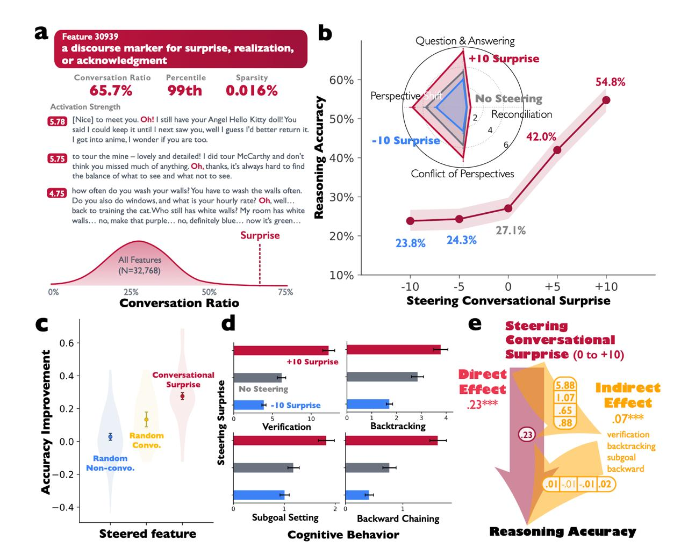

# Усиление внутренних маркеров диалога для улучшения ризонинга в LLM

## Краткое описание

Исследование от Google показывает, что усиливать внутренние маркеры диалога (типа "Oh" или "Wait") в больших языковых моделях (LLM) может удвоить точность ответов на сложных задачах. Авторы используют разреженные автоэнкодеры (sparse autoencoder) для нахождения нейронных признаков, отвечающих за удивление/осознание/смену точки зрения, и демонстрируют, что их усиление значительно улучшает способность моделей к рассуждению.

## Основная информация

На основе недавнего исследования от Google, которое выявило, что RL (обучение с подкреплением) на самом деле учит модели думать не дольше, а коллективнее. Модели, когда они "думают", симулируют диалог между разными внутренними голосами, задают себе вопросы, критикуют или выделяют аспекты, и именно в такой структуре внутреннего диалога заключен феномен ризонинга (reasoning).

### Методология

Авторы использовали разреженный автоэнкодер (sparse autoencoder) для:
- Поиска нейронного признака, отвечающего за удивление/осознание/смену точки зрения
- Признак активировался в начале предложений в диалоговых контекстах
- На практике отвечал за употребление таких маркеров как «О!», «Подожди-ка», «Ага, значит...»

Затем этот признак специально усиливался во время генерации, и отслеживались метрики производительности.

### Результаты

- Используемая модель: DeepSeek-R1-Llama-8B
- Задача: сложные задачи комбинаторной арифметики
- Исходная точность: 27.1%
- Точность с усилением диалогового маркера: 54.8%
- Точность с подавлением диалогового маркера: 23.8%

Статистическая значимость была проверена - авторы сравнивали усиление этой особенности с усилением других признаков, и эффект был очевиден. Параллельно с усилением этого маркера в модели также растет способность к когнитивному стратегическому мышлению.

## Новые концепции и термины

- **Внутренние маркеры диалога (Internal dialog markers)**: лингвистические элементы вроде "Oh", "Wait", "Hmm", "Ah", "Okay", которые сигнализируют о когнитивных изменениях внутри процесса мышления модели
- **Разреженный автоэнкодер (Sparse autoencoder)**: метод разложения плотных представлений, получаемых из LLM, в разреженные низкоразмерные представления с помощью штрафа за разреженность
- **Коллективное мышление (Collective thinking)**: концепция, согласно которой обучение с подкреплением учит модели думать не дольше, а коллективнее - симулируя диалог между различными внутренними голосами

## Визуализация и примеры



**Изображение показывает:** Концептуальное представление внутренних диалоговых маркеров в LLM и как они активируются в процессе рассуждения, возможно, с иллюстрацией нейронных признаков, отвечающих за удивление/осознание/смену точки зрения.

## Примеры применения

- Улучшение точности на сложных задачах рассуждения в LLM
- Усиление когнитивных стратегических способностей моделей
- Возможность целенаправленной стимуляции процессов рассуждения внутри модели через манипуляцию с внутренними маркерами

## Связи с другими темами

- [[mechanistic_interpretability.md]] - исследование внутренних механизмов работы нейронных сетей
- [[sparse_circuits_interpretability.md]] - современный подход к созданию изначально интерпретируемых моделей через разреженные сети
- [[attention_visualization.md]] - визуализация и интерпретация механизмов внимания
- [[reasoning_patterns.md]] - подходы к рассуждению в ИИ-моделях
- [[thoughtbubbles.md]] - архитектура для внутреннего мышления/рассуждения в моделях

## Источник

Информация взята из обсуждения исследования Google о внутренних маркерах диалога в LLM и их влиянии на способности к рассуждению, упомянутом в статье с ссылкой arxiv.org/pdf/2601.10825. Исследование показывает, что усиление внутренних маркеров диалога может удвоить точность на сложных задачах.

## Дополнительные материалы

- Статья на arXiv: arxiv.org/pdf/2601.10825
- Другие исследования по механистической интерпретируемости и разреженным автоэнкодерам для интерпретации внутренностей LLM

```metadata
category: reasoning
subcategory: internal_mechanisms
tags: attention, sparse_autoencoder, reasoning, dialog_markers, interpretability, google_research, llm_architecture
```