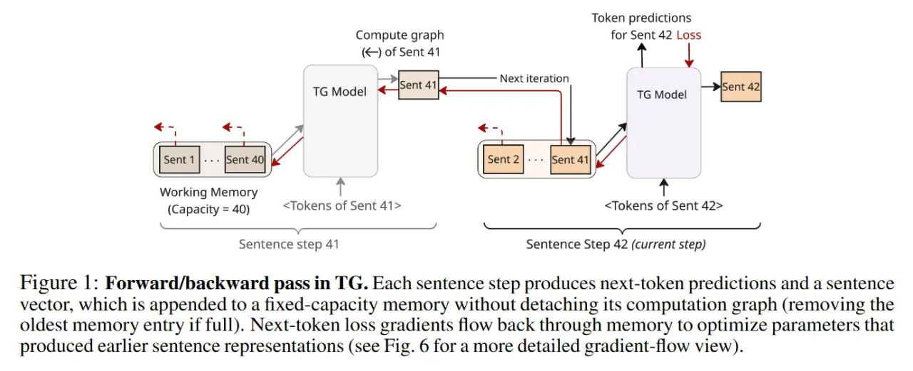
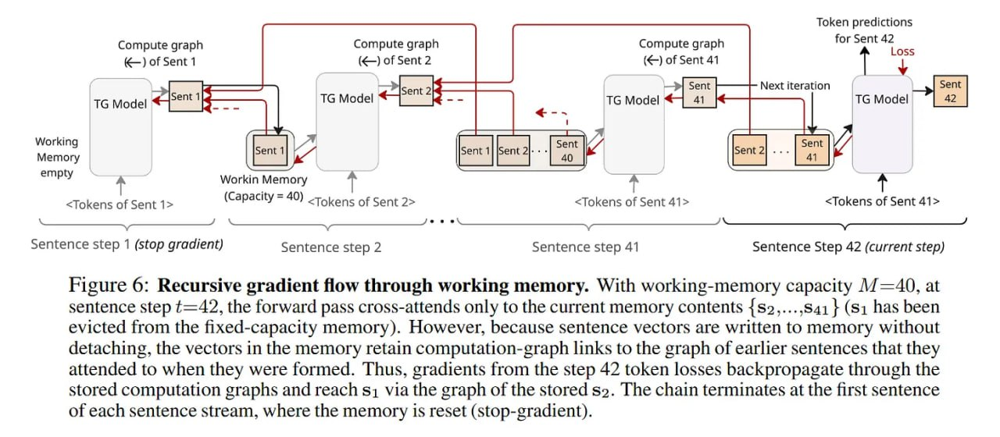
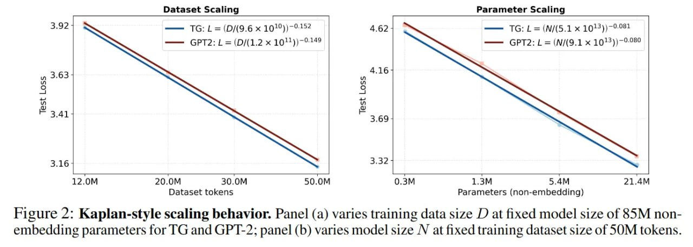

# Подробный анализ модели Thought Gestalt

## Мотивация и проблематика

### Ловушка поверхностной статистики

Текущая парадигма LLM рассматривает понимание языка как моделирование плоской последовательности токенов, оптимизируя условную вероятность P(w_t | w_{<t}). Метод рабочий, но страдает от серьёзных теоретических и практических ограничений. Когнитивистика подсказывает, что люди не хранят в голове дословную стенограмму прошлого контекста. Вместо этого мы сжимаем лингвистические входы в «ситуационные модели» — ментальные репрезентации событий, сущностей и отношений.

Стандартные трансформеры, напротив, полагаются на «контекстуализацию» через механизм внимания к конкретным позициям токенов. Эта зависимость ведёт к таким феноменам, как Reversal Curse: модель, обученная на фразе «Сын Майкла — это Джон», не справляется с запросом «Отец Джона — это...». Модель выучивает поверхностный порядок слов, а не лежащий в основе факт отношения.

## Архитектурные инновации

### Предложение как квант смысла

Модель Thought Gestalt (TG) атакует эту неэффективность, сдвигая атомарную единицу исторического контекста с *токена* на *предложение*. Идея вдохновлена моделью Sentence Gestalt и когнитивной теорией о том, что границы предложений служат естественными точками для интеграции информации в память.

### Эмерджентные векторы предложений

В TG модель работает на двух уровнях абстракции одновременно. Нижний уровень занимается дословной генерацией текущего предложения, используя стандартный causal masking. Верхний уровень управляет «памятью предложений» — последовательностью векторов { m_{t-K}, ..., m_{t-1} }.

Теоретическая целостность здесь зависит от определения вектора предложения m_t (размерности d). В отличие от подходов с замороженными энкодерами (типа BERT) или вспомогательными лоссами, m_t является эмерджентным свойством генеративного процесса. Он извлекается из скрытого состояния токена <EOS> на промежуточном слое, проецируется через линейную голову и оптимизируется исключительно для минимизации лосса кросс-энтропии *будущих* токенов.

## Механизмы обучения

### Рекуррентная оптимизация

Гипотеза в том, что для точного предсказания будущего на основе сжатой памяти, это сжатие m_t должно захватывать семантический «гештальт» события, а не просто лексическую строку. Ключевая фишка: модель обучается end-to-end, то есть градиенты от предсказания будущих токенов текут назад через память, оптимизируя параметры, которые создали представления прошлых предложений.

### Стабилизация обучения

Реализация такой рекуррентности внутри трансформера вносит значительную нестабильность и вычислительные накладные расходы из-за BPTT (Backpropagation Through Time). Чтобы справиться с взрывным ростом глубины графа вычислений, авторы используют curriculum learning на потоках предложений (sentence-stream curriculum). Обучение начинается с коротких потоков (например, S=30 предложений), эффективно ограничивая глубину бэкпропа. По мере обучения длина потока увеличивается, позволяя модели выучивать более длинные зависимости, когда стабильные короткие репрезентации уже сформированы.

## Сравнительный анализ

### Отличия от других методов расширения памяти

1. **Отличие от KV-cache**: Вместо хранения полной истории прошлых токенов (как в классическом KV-кэше), TG сжимает каждое обработанное предложение в единое векторное представление — «гештальт» — и сохраняет его в дифференцируемой памяти.

2. **Отличие от RAG**: В отличие от подходов с извлечением информации, TG создает обучаемые внутренние сжатые репрезентации.

3. **Отличие от Transformer-XL**: В отличие от Transformer-XL, TG сохраняет граф вычислений, что позволяет энд-ту-энд обучение дифференцируемой памяти.

## Архитектура и визуализации

 <!-- TODO: Broken image path -->

**Image shows:** Архитектура TG с чередующимися блоками само-внимания и кросс-внимания. Токены внутри текущего предложения смотрят друг на друга через стандартное само-внимание, и одновременно смотрят через кросс-внимание на дифференцируемую память предыдущих предложений. Контекстуализированное скрытое состояние EOS на 7-м слое проецируется через линейную голову для создания репрезентации предложения.

 <!-- TODO: Broken image path -->

**Image shows:** Процесс прямого/обратного прохода в TG. Каждый шаг предложения создает предсказания следующих токенов и вектор предложения, который добавляется в память фиксированной емкости без отсоединения графа вычислений. Градиенты от потерь следующих токенов распространяются обратно через память для оптимизации параметров, которые создали более ранние репрезентации предложений.

 <!-- TODO: Broken image path -->

**Image shows:** Рекурсивный поток градиентов через рабочую память. Поток градиентов может распространяться через несколько шагов, позволяя будущим потерям влиять на обучение более ранних представлений.

## Сравнение масштабирования

 <!-- TODO: Broken image path -->

**Image shows:** Поведение масштабирования TG по сравнению с GPT-2. Панель (a) показывает изменение размера обучающей выборки D при фиксированном размере модели 85M параметров; панель (b) показывает изменение размера модели N при фиксированном размере датасета 50M токенов.

## Экспериментальные результаты

### Законы масштабирования

Используя фреймворк от Kaplan et al., авторы фитят степенные законы к тестовому лоссу относительно размера датасета (D) и количества параметров (N). Графики демонстрируют, что TG стабильно сдвигает кривую масштабирования вниз по сравнению с аналогичным бейзлайном на GPT-2. Результаты показывают, что GPT-2 требует примерно в 1.05x – 1.08x (на 5–8%) больше токенов, чтобы достичь той же перплексии, что и TG.

### Reversal Curse

Авторы используют контролируемый пробинг «Отец-Сын», чтобы проверить, может ли модель обобщать отношения в обратную сторону (A отец B -> B сын A). Эксперименты демонстрируют, что TG снижает «distractor bias» (склонность предсказывать неправильную сущность на основе простой встречаемости слов) значительно быстрее, чем GPT-2. Бейзлайн GPT-2 показывает устойчивый отрицательный отрыв (предпочитая дистрактор) даже на больших масштабах данных.

## Теоретические последствия

### Новая парадигма обучения

Thought Gestalt предлагает принципиальную архитектурную коррекцию «амнезийной» природы стандартных трансформеров, которые выбрасывают промежуточные абстракции, как только окно контекста сдвигается вперёд. Относясь к предложениям как к дифференцируемым семантическим единицам, авторы успешно реанимируют ключевое обещание рекуррентных нейросетей (RNN), не жертвуя преимуществами параллельного обучения трансформеров внутри блока предложения.

### Демонстрация механизма сжатия

Демонстрация того, что способность предсказывать *будущее* может эффективно контролировать сжатие *прошлого*, указывает путь к моделям, которые не просто предсказывают следующее слово, но непрерывно уточняют свою внутреннюю модель мира.

## Практические применения

### Для исследователей

Для исследователей в области нейро-символического ИИ и генерации, дополненной памятью, эта статья даёт конкретный план (blueprint) для тренировки дифференцируемой памяти в режиме end-to-end.

### Возможные расширения

1. **Трансформеры для кода**: Адаптация TG для обработки кода, где «мысли» могут быть связаны с логическими блоками/функциями
2. **Мультимодальные трансформеры**: Расширение концепции на визуальные/аудио мысли
3. **Диалоговые системы**: Использование сжатой памяти для долгосрочных диалогов

## Ограничения и будущая работа

### Текущие ограничения

1. **Масштаб оценки**: Основные эксперименты проводятся на WikiText-103 с моделями около 85M параметров — по современным меркам это «микро-масштаб».

2. **Границы предложений**: Предположение, что границы предложений чётко совпадают с границами «мыслей», является эвристикой, которая может ломаться в неформальном тексте, коде или диалогах.

### Направления будущей работы

1. **Динамическая сегментация**: Разработка более динамичных стратегий сегментации, которые не зависят от границ предложений.
2. **Масштабирование**: Оценка эффективности на масштабах 7B+ параметров и триллионных датасетов.
3. **Адаптация**: Применение концепции к другим доменам (например, код, музыка, визуальные данные).

## Связи с другими темами

[[../index.md]] - Основная страница о модели Thought Gestalt
[[../../reasoning/index.md]] - Модели рассуждения в трансформерах
[[../../memory/llm_long_term_memory.md]] - Долгосрочная память в языковых моделях

## Источники

1. Borazjanizadeh, N., & McClelland, J. L. (2025). Modeling Language as a Sequence of Thoughts. arXiv:2512.25026. https://arxiv.org/abs/2512.25026
2. Berglund, L., et al. (2023). The Reversal Curse: LLMs trained on "A is B" fail to learn "B is A". arXiv:2309.12288. https://arxiv.org/abs/2309.12288