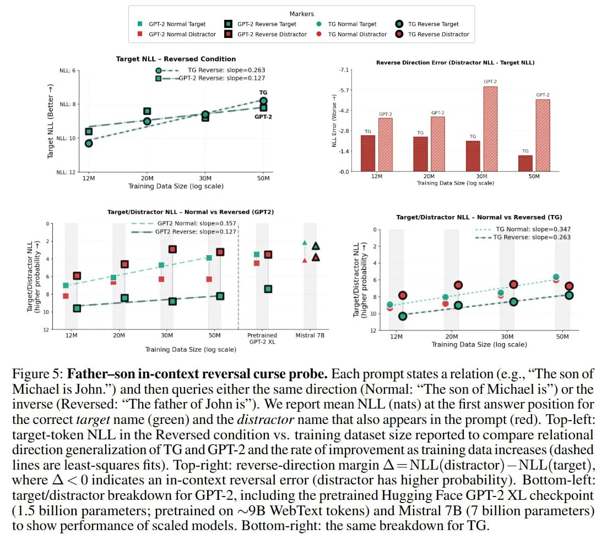

# Reversal Curse и его преодоление в модели Thought Gestalt

## Определение Reversal Curse

Reversal Curse — это феномен, при котором языковые модели, обученные на утверждении формы "A is B", не способны автоматически обобщить это знание в обратном направлении "B is A". Например, модель может успешно отвечать на вопрос "Кто отец Джона?", если обучалась на фразе "Сын Майкла — это Джон", но при этом не сможет ответить на вопрос "Кто сын Майкла?".

Этот феномен был подробно описан в работе Berglund et al. (2023) в статье "The Reversal Curse: LLMs trained on 'A is B' fail to learn 'B is A'" (arXiv:2309.12288).

## Причины возникновения

### Поверхностное обучение
- Модели учатся ассоциации токенов, а не семантическим отношениям
- Они запоминают поверхностную статистику последовательности токенов
- Направленность обучения приводит к асимметрии знаний

### Ограниченная индуктивная способность
- Стандартные трансформеры не обучены инвертировать отношения
- Обучение на одном направлении не создает симметричных внутренних представлений
- Модели не обучаются "мышлению" в обе стороны отношения

## Проблемы, вызываемые Reversal Curse

### Ограничения в рассуждении
- Модели не могут эффективно рассуждать о двунаправленных отношениях
- Проблемы с логическим выводом в обратном направлении
- Ограничения в понимании симметричных отношений (родитель-ребенок, муж-жена и т.д.)

### Практические последствия
- Ошибки в QA-системах при запросах в обратном направлении
- Проблемы с логическим выводом
- Ограничения в интерпретации знаний

## Решение через модель Thought Gestalt

### Сжатие в векторы мыслей
- Вместо хранения последовательности токенов, модель сжимает каждое предложение в векторное представление (гештальт)
- Этот гештальт содержит семантическое содержание предложения, а не только лексические связи

### Двунаправленное обучение
- Поскольку градиенты текут через сжатую память, будущее обучает прошлое
- Модель учится создавать представления, полезные для понимания отношений в любом направлении
- Сжатие m_t оптимизируется для предсказания будущего, что требует понимания семантических отношений

### Семантическая стабильность
- Вектор m_t содержит отношения между сущностями, а не последовательность токенов
- Это делает информацию доступной независимо от направления запроса
- Повышает устойчивость к Reversal Curse

## Экспериментальные доказательства

### Тестирование на задачах типа "Отец-Сын"
- Авторы Thought Gestalt использовали контролируемый пробинг "Отец-Сын"
- Проверяли способность модели обобщать отношения в обратном направлении
- TG показывает значительное улучшение по сравнению с GPT-2

### Снижение "distractor bias"
- TG снижает "distractor bias" (склонность предсказывать неправильную сущность на основе простой встречаемости слов) значительно быстрее, чем GPT-2
- GPT-2 показывает устойчивый отрицательный отрыв (предпочитая дистрактор) даже на больших масштабах данных

## Визуализация проблемы Reversal Curse

 <!-- TODO: Broken image path -->

**Image shows:** Задача проверки Reversal Curse с использованием отношения "отец-сын". Каждый пример состоит из предложения, устанавливающего отношение (например, "сын Майкла - Джон"), за которым следует префикс запроса. В нормальном условии запрос повторяет утверждение до позиции ответа (например, "сын Майкла - "). В обратном условии запрос инвертирует направление отношения (например, "отец Джона - "). Результаты показывают среднюю NLL (натуральные логарифмы) на первой позиции ответа для правильного целевого имени (зеленый) и отвлекающего имени, которое также присутствует в запросе (красный).

## Сравнение с другими подходами

### Традиционные трансформеры
- Полагаются на поверхностную статистику токенов
- Не обучают симметричные внутренние представления
- Подвержены Reversal Curse

### Индукционные головы
- В больших моделях могут частично справляться с обратными отношениями
- Однако все равно не обеспечивают надежного двунаправленного понимания
- Не являются преднамеренным решением Reversal Curse

### Thought Gestalt
- Преднамеренно решает проблему через сжатие в семантические гештальты
- Обеспечивает более надежное понимание отношений
- Демонстрирует систематическое улучшение

## Теоретическая значимость

### Новая парадигма представления знаний
- Переход от токенного уровня к семантическому уровню представления
- Понимание, что сжатие в латентные "мысли" создает более надежные семантические репрезентации
- Подтверждение важности внутренних моделей мира

### Практическая значимость
- Показывает путь к моделям, которые непрерывно уточняют внутреннюю модель мира
- Демонстрирует, что способность предсказывать будущее может контролировать сжатие прошлого
- Предоставляет blueprint для тренировки дифференцируемой памяти в режиме end-to-end

## Связи с другими темами

[[./index.md]] - Основная информация о модели Thought Gestalt
[[../../reasoning/chain_of_thought.md]] - Другие подходы к рассуждению в моделях
[[../../attention/attention_mechanisms.md]] - Механизмы внимания, на которых основан TG

## Источники

1. Berglund, L., et al. (2023). The Reversal Curse: LLMs trained on "A is B" fail to learn "B is A". arXiv:2309.12288. https://arxiv.org/abs/2309.12288
2. Borazjanizadeh, N., & McClelland, J. L. (2025). Modeling Language as a Sequence of Thoughts. arXiv:2512.25026. https://arxiv.org/abs/2512.25026