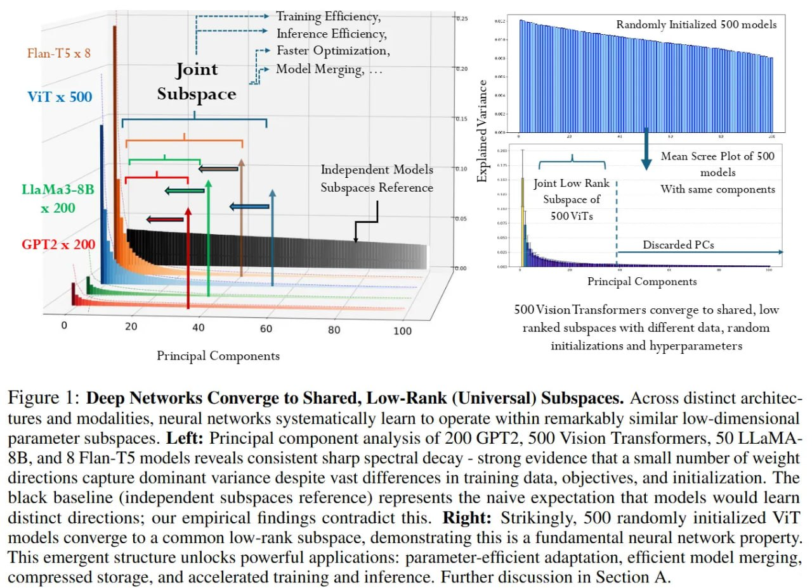
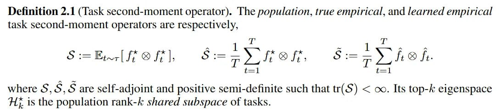
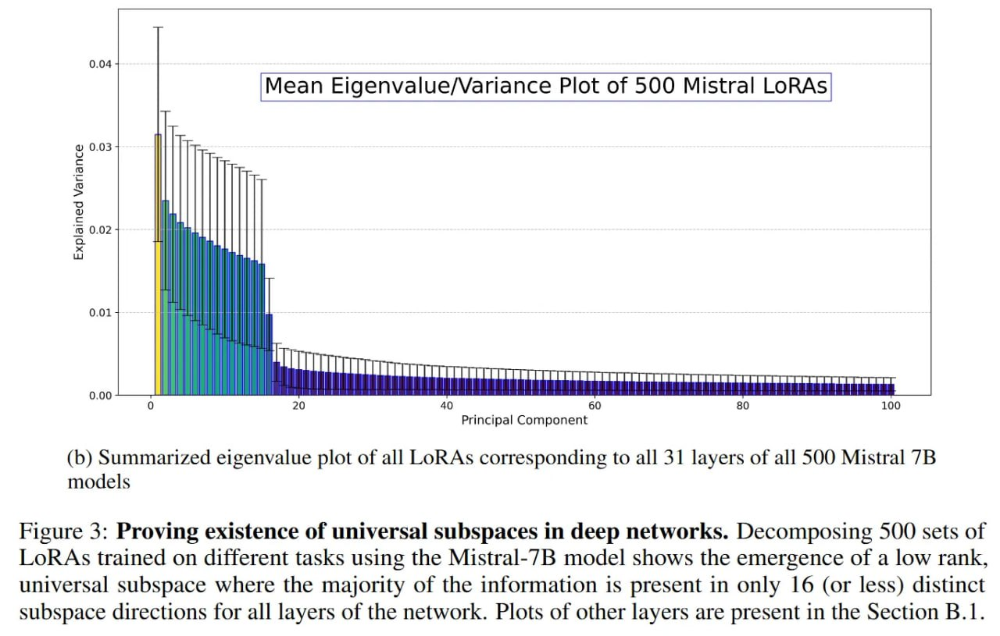
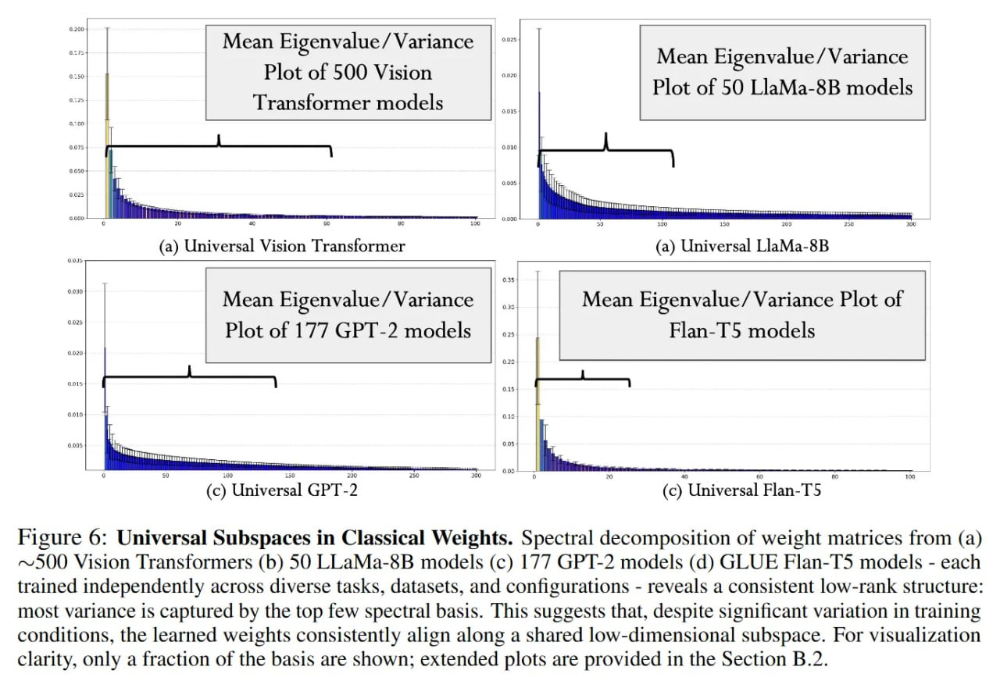

# Гипотеза универсального весового подпространства (Universal Weight Subspace Hypothesis)

## Описание

Гипотеза универсального весового подпространства - это новая концепция в области машинного обучения, предложенная исследователями Пракхаром Каушиком, Шраваном Чаудхари, Анкитом Вайдья, Рамой Челлаппа и Аланом Юиллом. Согласно этой гипотезе, модели глубокого обучения, обученные на совершенно разных задачах, сходятся к общему низкоразмерному подпространству параметров, несмотря на различия в задачах, данных и инициализации. Это открытие дает геометрическое объяснение успеху методов параметрически эффективной настройки (PEFT), таких как LoRA, и открывает возможности для экстремального сжатия моделей и мгновенного слияния моделей.

## Основные положения

### От хаоса к единому многообразию

Текущая парадигма трансферного обучения рассматривает каждую адаптированную модель как отдельную сущность. Независимо от того, обучаем ли мы ResNet-50 на разных датасетах картинок или делаем дообучение Mistral-7B на разных инструкциях, итоговые матрицы весов обычно воспринимаются как независимые точки в многомерном пространстве. Однако гипотеза универсального весового подпространства ставит эту независимость под сомнение, утверждая, что сама архитектура накладывает сильный индуктивный сдвиг (inductive bias), который загоняет траектории оптимизации в общее низкоранговое многообразие, вне зависимости от конкретных данных или инициализации.



**Image shows:** На левом графике: анализ главных компонент 200 GPT-2, 500 Vision Transformers, 50 LLaMA-3B и 5 Flan-T5 моделей показывает систематическое убывание спектра - убедительное доказательство того, что небольшое количество направлений весов захватывает доминирующую дисперсию. На правом графике: 50 случайно инициализированных ViT-моделей сходятся к общему низкоранговому подпространству, демонстрируя, что это фундаментальное свойство нейронных сетей.

### Математический фундамент

Для формализации этой геометрической сходимости авторы моделируют предикторы как элементы сепарабельного гильбертова пространства H. Центральный объект изучения - популяционный оператор второго момента S, который описывает общее подпространство, натянутое на предикторы различных задач.



**Image shows:** Математическое определение популяционного, истинного эмпирического и изученного эмпирического операторов второго момента задачи. Эти операторы S, S, S являются самосопряженными и положительно полуопределенными, такими что tr(S) < ∞. Его подпространство top-k является популяционным shared подпространством ранга k задач.

Формально, если f*_t - идеальный предиктор для задачи t, оператор определяется как S := E[f*_t ⊗ f*_t], где ⊗ обозначает внешнее произведение (rank-one operator).

Цель - восстановить собственное подпространство S, используя только эмпирические наблюдения, то есть обученные веса f_hat от T различных задач. Авторы вводят эмпирический оператор S_tilde := (1/T) * sum(f_hat_t ⊗ f_hat_t). Теоретический вклад заключается в доказательстве того, что top-k собственное подпространство этого эмпирического оператора сходится к истинному популяционному подпространству. Скорость сходимости регулируется границами, выведенными из матричных неравенств Бернштейна, и масштабируется как O(1/sqrt(T)).

## Алгоритм извлечения универсального подпространства

Практический механизм извлечения универсального подпространства опирается на представление коллекции весов моделей как тензора высокого порядка. Авторы применяют усеченное SVD (Singular Value Decomposition) с нулевым центрированием (Truncated Zero-Centered Higher-Order Singular Value Decomposition, HOSVD).


**Image shows:** Алгоритм усеченного SVD с нулевым центрированием высшего порядка. Требуется тензор высокого порядка, построенный путем складывания матриц задач по моду n. Включает этапы: нулевое центрирование, матрификацию по моду, тонкое SVD, усечение первых r_n левых сингулярных векторов с объясненной дисперсией >= τ, и вычисление усеченного ядра.

Разберём на примере 500 LoRA-адаптеров для Mistral-7B. Каждый адаптер содержит низкоранговые матрицы A и B. Исследователи конкатенируют вектора весов конкретного слоя всех 500 моделей, формируя большую матрицу данных. Сначала эта матрица центрируется (вычитается поэлементное среднее), а затем выполняется тонкое SVD:
X = U * Sigma * V^T

Решающий шаг - это усечение; сохраняются только топ-k сингулярных векторов, которые объясняют большую часть дисперсии (порог tau). В экспериментах наблюдается резкий спектральный спад: очень небольшое число компонент (часто k <= 16 или k <= 100) отвечает за подавляющую часть сигнала. Это "универсальное подпространство" S по сути становится новым сжатым базисом для слоя. Чтобы адаптироваться к новой задаче, достаточно заморозить этот базис и выучить только линейные коэффициенты, проецируя задачу строго на обнаруженное многообразие.



**Image shows:** Суммированный график собственных значений всех LoRA, соответствующих всем 31 слою из 500 Mistral-7B моделей. Декомпозиция 500 наборов LoRA, обученных на разных задачах с использованием модели Mistral-7B, показывает появление низкорангового, универсального подпространства, где большая часть информации находится только в 16 (или менее) различных направлениях подпространства для всех слоев сети.

## Эксперименты и результаты

### Охват исследований

Экспериментальный охват работы впечатляет: от parameter-efficient модулей до полного дообучения весов. Для тестов с Mistral-7B авторы использовали 500 LoRA-адаптеров, обученных на датасете Natural Instructions. Затем они расширили анализ на полные пространства параметров, собрав около 500 предобученных Vision Transformers (ViT), 50 моделей LLaMA-3-8B и 177 GPT-2 с HuggingFace.

Критически важно, что для ответа на претензию "универсальность - это просто следствие общего предобучения", авторы также проанализировали ResNet-50, обученные *с нуля* на непересекающихся датасетах (например, ImageNet против Oxford Pets), и наблюдали возникновение того же самого подпространства.



**Image shows:** Спектральная декомпозиция матриц весов из ~500 Vision Transformers, 50 LLaMA-8B моделей, 177 GPT-2 моделей и GLUE Flan-T5 моделей, каждая из которых обучалась независимо на различных задачах, наборах данных и конфигурациях. Показывает согласованную низкоранговую структуру: большая часть дисперсии захватывается несколькими верхними спектральными базисами.

### Спектральный анализ

Самое убедительное доказательство гипотезы - последовательный спектральный спад, наблюдаемый на всех архитектурах. На графиках собственных чисел для Mistral-7B LoRA видно, что первые 16 компонент захватывают сигнал, а оставшийся хвост представляет собой то, что авторы называют "вторичным подпространством" (Secondary Subspace) - по сути, специфичный для задачи шум или артефакты оптимизации.

### Слияние моделей

Метод сравнили с SOTA техниками слияния моделей, такими как TIES, DARE и RegMean. Простое усреднение коэффициентов внутри универсального подпространства дало более высокую среднюю точность (83.5%) на восьми задачах ViT по сравнению с TIES (63.7%) и RegMean (60.9%). Это говорит о том, что стандартные методы слияния часто страдают от интерференции, так как работают в полном, многомерном пространстве весов, а не во внутреннем низкоранговом многообразии, где модели на самом деле согласуются.


**Image shows:** Результаты по задачам для восьми ViT-B/32 моделей, каждая из которых дообучалась с LoRA на разных наборах данных классификации изображений. Показывает, что усреднение коэффициентов в универсальном подпространстве превосходит TIES и RegMean по средней точности (83.5% против 63.7% и 60.9% соответственно).

### Генерация изображений с SDXL

Исследователи также протестировали универсальное подпространство на задаче генерации изображений с помощью Stable Diffusion XL (SDXL), реконструируя LoRA, используя только топ-16 компонент. Качество реконструкции оценивали через CLIP score, где аппроксимация через универсальное подпространство внезапно превзошла индивидуальные LoRA в некоторых случаях (19.83 против 19.73), вероятно, благодаря эффекту шумоподавления за счёт отбрасывания хвостовых собственных чисел.


**Image shows:** Результаты генерации текст-в-изображение для отдельных моделей по сравнению с нашей моделью универсального подпространства. Заметно отсутствие визуального снижения качества стиля несмотря на значительное сокращение общего размера модели. Универсальная LoRA SDXL достигает среднего CLIP-скоринга 19.83.

## Практические последствия

### Обучение в координатах

"Гипотеза универсального подпространства весов" даёт мощное эмпирическое обоснование для перехода от обучения на основе весов к обучению на основе координат. Если 500 разнообразных моделей эффективно живут в одном и том же 100-мерном подпространстве, будущее дистрибуции моделей может заключаться не в релизе файлов весов по 8 ГБ, а в релизе одного файла "Универсального Базиса", за которым следуют крошечные килобайтные вектора коэффициентов для конкретных задач.

### Экстремальное сжатие

Результаты говорят о том, что огромная часть параметров в моделях после дообучения избыточна. Это позволяет достичь значительного сжатия моделей (до 100 раз по памяти) и мгновенного слияния моделей через простую арифметику без сложного дообучения или эвристического прунинга.

### Sustainable computing

Это имеет глубокие последствия для Edge AI и sustainable computing. Углеродный след обучения новых прикладных задач может быть радикально снижен, если ограничить оптимизацию геометрией, где, как нам теперь известно, обитают хорошие решения.

## Ограничения

1. Методология сильно зависит от наличия "банка" обученных моделей для начального извлечения подпространства. Нельзя найти универсальное подпространство архитектуры, не обучив (или не скачав) сначала T её экземпляров.

2. Анализ строго внутри-архитектурный; подпространство от LLaMA-2 никак не мапится на Mistral.

3. Авторы оставляют открытым вопрос интерпретируемости этих главных направлений. Хотя мы знаем, что они математически значимы, неясно, соответствуют ли они конкретным семантическим функциям (как "детекторы границ" в CNN или "индукционные головы" в трансформерах).

## Сравнение с другими методами

- **PEFT (Parameter-Efficient Fine-Tuning)**: Гипотеза дает теоретическое основание для существующих методов PEFT, таких как LoRA, объясняя, почему такие методы работают эффективно.
- **Модельное слияние**: Предложенный подход обеспечивает более качественное слияние моделей по сравнению с существующими методами, такими как TIES, DARE и RegMean.
- **Elastic Weight Consolidation (EWC)**: В отличие от EWC, который фокусируется на предотвращении забывания за счет сохранения важных весов, универсальное подпространство ищет общие направления в пространстве весов для разных задач.

## Связи с другими темами

- [[../lora_optimization.md]] - Low-Rank Adaptation (LoRA): метод параметрически эффективного обучения, который тесно связан с концепцией универсального весового подпространства
- [[../fine_tuning_methods_preserving_skills.md]] - Методы дообучения LLM, сохраняющие предыдущие навыки: включает информацию о PEFT методах, которые могут выиграть от универсального подпространства
- [[../optimization/memory_efficient_training.md]] - Общие методы память-эффективного обучения
- [[../model_compression/model_merging_techniques.md]] - Техники слияния моделей: универсальное подпространство предлагает новый подход к слиянию
- [[../mechanistic_interpretability/circuits_in_transformers_using_sae.md]] - Механистическая интерпретаемость: связанная область с точки зрения анализа весов и функций моделей

## Источники

- Kaushik, P., Chaudhari, S., Vaidya, A., Chellappa, R., & Yuille, A. (2025). The Universal Weight Subspace Hypothesis. arXiv:2512.05117. https://arxiv.org/abs/2512.05117
- ArXivIQ Review. The Universal Weight Subspace Hypothesis. https://arxiviq.substack.com/p/the-universal-weight-subspace-hypothesis
- Official Code Repository. https://toshi2k2.github.io/unisub/

```metadata
category: machine_learning
subcategory: neural_networks
tags: весовое_подпространство, параметрически_эффективное_обучение, дообучение_моделей, сжатие_моделей, слияние_моделей, низкоранговая_адаптация, lora, peft
```