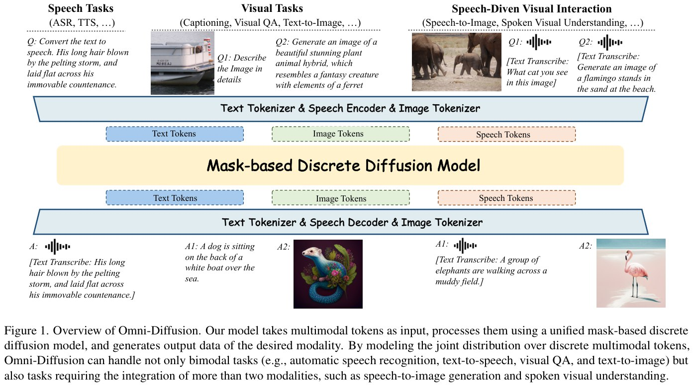

# Omni-Diffusion: Первая any-to-any мультимодальная модель на основе маскированной дискретной диффузии

## Общее описание

**Omni-Diffusion** — это первая any-to-any мультимодальная языковая модель, полностью построенная на архитектуре маскированной дискретной диффузии (mask-based discrete diffusion model). Модель разработана исследователями из Нанкинского университета (Nanjing University), Tencent Youtu Lab и CASIA.

> **Ключевая инновация:** Omni-Diffusion объединяет текст, изображения и речь через единую маскированную дискретную диффузию, без использования авторегрессивного LLM в основе.

В отличие от существующих мультимодальных моделей, которые используют авторегрессивную архитектуру LLM для генерации текста и дополнительные выходные модели для конвертации текстовых скрытых состояний в другие модальности, Omni-Diffusion напрямую моделирует совместное распределение дискретных мультимодальных токенов. Это позволяет модели развивать внутренне согласованное пространство семантических представлений для всех модальностей.

## Архитектура модели

### Основная концепция

Omni-Diffusion использует единую маску-based дискретную диффузионную модель для непосредственного захвата совместного распределения дискретных мультимодальных токенов:

1. **Токенизация всех модальностей** в дискретные токены
2. **Случайное маскирование** токенов во время обучения
3. **Восстановление оригинала** через предсказание замаскированных токенов
4. **Итеративный декодинг** на инференсе начиная с полностью замаскированной последовательности

### Компоненты архитектуры

#### Токенизация изображений (Image Tokenization)
- Используется предобученный **MAGVIT-v2** в качестве токенизатора изображений
- Визуальный энкодер сжимает изображения с фактором downsampling `f = 16`
- Квантователь с размером кодовой книги **8192** преобразует компактное представление в дискретные токены
- Дискретные токены изображений используются как для визуального понимания, так и для генерации

#### Энкодер и декодер речи (Speech Encoder and Decoder)
- **Энкодер:** SenseVoiceSmall с memory-equipped self-attention network для извлечения семантически богатых представлений из речи
- representations проецируются в скрытую размерность backbone модели через lightweight MLP adapter
- **Декодер:** GLM-4-Voice decoder
- Speech tokenizer преобразует речь в дискретные токены с частотой **12.5 Hz** через finite scalar quantization layer с размером кодовой книги **16384**

#### Backbone LLM
- Базовая модель: **Dream-7B** — предобученная дискретная диффузионная языковая модель
- Словарь расширен для размещения:
  - **16384 speech tokens**
  - **8192 image tokens**
- Архитектура дискретной диффузионной модели остаётся неизменной, кроме расширения словаря и соответствующих слоёв embedding и output

## Методология обучения

### Трёхэтапный прогрессивный пайплайн обучения

Для обеспечения эффективного и стабильного обучения предложен трёхэтапный прогрессивный подход:

#### Этап 1: Visual-Language Pre-Alignment
- Оптимизация предобученной диффузионной языковой модели на задачах text-to-image и image captioning
- Цель: выравнивание визуальной модальности с семантическим пространством предобученной языковой модели

#### Этап 2: Speech-Vision-Language Joint Alignment
- Фокус на усилении выравнивания между текстом и другими модальностями
- Сохранение визу-текст датасетов из Этапа 1
- Добавление данных ASR (automatic speech recognition) и TTS (text-to-speech) для облегчения speech-text выравнивания

#### Этап 3: Speech-Driven Visual Interaction Capability Improvement
- Улучшение унифицированного кросс-модального выравнивания
- Fine-tuning на созданном датасете **SDVI (Speech-Driven Visual Interaction)**
- Включение данных spoken question answering (SQA) и visual question answering (VQA)

### Датасет SDVI (Speech-Driven Visual Interaction)

Специально созданный датасет для улучшения способности модели к визуальному взаимодействию через голосовые инструкции:

#### Spoken Visual Question Answering
- Источник данных: **LLaVA-OneVision**
- Конвертация текстовых пар вопрос-ответ в речь с помощью **Cosyvoice2**
- Пайплайн обработки для обеспечения качества:
  - Фильтрация математических вычислений и программирования
  - Переписывание вопросов с множественным выбором в открытые вопросы
  - Удаление образцов с длиной ответа >100 слов
  - Voice cloning на 1000 случайных образцах речи из GigaSpeech для предотвращения overfitting
- **30,000+ образцов** с spoken input question, input image, textual output answer и spoken output response

#### Speech-to-Image Generation
- Источник данных: **Blip3o-Pretrain-JourneyDB** (за fluent native text и high-quality images)
- Конвертация текста в речь через voice cloning на 1000 образцах Gigaspeech
- **30,000 speech-image пар**

### Attenuated Tail-Pad Masking

Стратегия для облегчения генерации переменной длины:

- **Проблема:** Простая uniform masking стратегия приводит к overfitting на специальном pad токене, что вызывает генерацию избыточных pad токенов на инференсе
- **Решение:** Применение scaling factor `γ (γ < 1)` для уменьшения mask ratio специально для pad токенов
- **Результат:** Градиентные обновления преимущественно управляются регулярными семантическими токенами, а не pad токеном

## Методы инференса

### Entropy-based Decoding Strategy

Используется стратегия декодирования на основе энтропии, согласованная с Dream-Instruct-7B:

- Решение о том, какие токены декодировать, принимается на основе энтропии вероятностей токенов
- Интеграция repetition penalty и classifier-free guidance для улучшения качества генерации
- Выбор topk токенов с наибольшей уверенностью (confidence)
- Итеративный процесс начиная с полностью замаскированной последовательности

### Position Penalty (Позиционный штраф)

Стратегия для улучшения качества генерации изображений:

- **Проблема:** Модель иногда генерирует повторяющиеся паттерны в изображениях из-за тенденции декодировать mask токены от начала и конца последовательности к центру
- **Решение:** Масштабирование вниз logits последних `Nt` токенов на фиксированный фактор `γp (γp < 1)` на ранних стадиях инференса
- **Отличие от semi-autoregressive generation:** Применяется мягкое ограничение на порядок генерации без жёсткого принуждения модели генерировать токены в специфических регионах

### Special Token Pre-Infilling

Стратегия для улучшения производительности в задачах spoken dialogue:

- Для начальной mask token последовательности длины `L`, замена mask токена на индексе `0.25L` на специальный токен `[begin-of-speech]`
- Модель генерирует текстовый ответ в первом сегменте `0.25L` и соответствующий speech ответ в оставшемся сегменте `0.75L` одновременно
- Модель может явно учитывать текстовое содержимое во время генерации речи, улучшая логику и когерентность синтезированной речи

### Adaptive Token Length Assignment

Адаптивное присваивание длины начальной mask token последовательности для задач ASR и TTS:

- **Для TTS:** Начальная длина токенов = `3.5 ×` длина текстовых токенов
- **Для ASR:** Начальная длина токенов = `0.2 ×` длина speech токенов
- Улучшение производительности speech понимания и генерации + ускорение процесса сэмплирования

## Возможности модели

Omni-Diffusion поддерживает широкий спектр мультимодальных задач:

### Бимодальные задачи
- **Automatic Speech Recognition (ASR)** — речь → текст
- **Text-to-Speech (TTS)** — текст → речь
- **Visual Question Answering (VQA)** — изображение + текст → текст
- **Text-to-Image** — текст → изображение
- **Image Captioning** — изображение → текст

### Задачи с интеграцией более двух модальностей
- **Speech-to-Image Generation** — речь → изображение
- **Spoken Visual Understanding** — речь + изображение → речь/текст
- **Speech-Driven Visual Interaction** — комбинации речи, изображения и текста

## Экспериментальные результаты

### Speech Tasks
Оценка на бенчмарках LibriSpeech и LibriTTS по метрике Word Error Rate (WER):

- **Сравнение с AnyGPT:** Omni-Diffusion демонстрирует лучшую производительность на speech задачах
- **Сравнение с CosyVoice:** Сопоставимая производительность на TTS задаче с экспертной TTS моделью
- **Сравнение с GLM-4-Voice:** Значительное улучшение над speech-specific LLM

### Visual Tasks
- Производительность сопоставима или лучше существующих авторегрессивных мультимодальных систем
- Поддержка задач image inpainting

### Fast Sampling
- Параллельный декодинг обеспечивает потенциальную эффективность по сравнению с авторегрессивными моделями

## Преимущества перед авторегрессивными моделями

| Характеристика | Авторегрессивные MLLM | Omni-Diffusion |
|----------------|----------------------|----------------|
| Архитектура | Autoregressive LLM backbone | Mask-based discrete diffusion |
| Генерация | Последовательная (left-to-right) | Параллельная |
| Управление выводом | Косвенное через промпты | Нативное через маскирование |
| Распространение ошибок | Накопление ошибок | Возможность исправления на ранних шагах |
| Контроль структуры | Требует специальных техник | Встроенный через initial token sequence |

## Ключевые вклады

1. **Первая any-to-any мультимодальная модель на mask-based discrete diffusion:**
   - Моделирование совместного распределения мультимодальных дискретных токенов
   - Выравнивание разных модальностей в общем пространстве семантических представлений
   - Сильные способности к мультимодальному пониманию и генерации

2. **Специализированные техники обучения и инференса:**
   - Attenuated tail-pad masking для генерации переменной длины
   - Трёхэтапный прогрессивный пайплайн для эффективного multi-modality выравнивания
   - Position penalty для контроля порядка генерации и улучшения визуального качества
   - Special token pre-infilling для улучшения spoken dialogue производительности

3. **Экспериментальная валидация:**
   - Производительность сопоставима или лучше существующих авторегрессивных мультимодальных систем
   - Демонстрация значительного потенциала диффузионных моделей для мультимодального ИИ

## Визуализация архитектуры

### Обзор Omni-Diffusion

**Изображение из статьи:** Общая архитектура Omni-Diffusion показывает, как модель обрабатывает текст, изображения и речь через единую диффузионную модель с маскированными токенами.

### Speech-Driven Visual Interaction

**Изображение показывает:** Примеры задач Speech-Driven Visual Interaction включая speech-to-image генерацию и spoken visual question answering с использованием токенизации речи, текста и изображений.

## Связи с другими темами

- [[discrete_diffusion_architecture.md]] — Дискретная диффузионная архитектура: базовые принципы дискретной диффузии
- [[diffusion_language_models_overview.md]] — Диффузионные языковые модели: обзор DLM и их применение к тексту
- [[../../applications/computer_vision/multimodal_models.md]] — Мультимодальные модели: другие подходы к мультимодальному ИИ (CLIP, SigLIP, Ming)
- [[../diffusion_llm_integration.md]] — Интеграция диффузии с LLM: способы объединения диффузионных моделей и языковых моделей
- [[../llm_diffusion_integration.md]] — Интеграция LLM с диффузией: общие принципы интеграции
- [[../../applications/audio_processing/speech/asr/discrete_flow_matching_asr.md]] — Discrete Flow Matching для ASR: альтернативный подход к speech распознаванию
- [[bert_diffusion_connection.md]] — Связь BERT и диффузии: концептуальные параллели между mask prediction в BERT и диффузии

## Источники

1. **Li, L., Long, Z., Shen, Y., Gao, H., Cao, H., Sun, X., Shan, C., He, R., Fu, C.** "Omni-Diffusion: Unified Multimodal Understanding and Generation with Masked Discrete Diffusion" — arXiv preprint arXiv:2603.06577, 2026. URL: https://arxiv.org/abs/2603.06577
   - Основная статья с полным описанием архитектуры, методологии и экспериментальных результатов
   - Проект: https://omni-diffusion.github.io/

2. **Ключевые цитируемые работы:**
   - MAGVIT-v2 — токенизатор изображений
   - SenseVoiceSmall — энкодер речи
   - GLM-4-Voice — декодер речи
   - Dream-7B — базовая диффузионная языковая модель
   - LLaVA-OneVision — источник данных для SDVI
   - Cosyvoice2 — конвертация текста в речь

## Дополнительные материалы

- **Проект Omni-Diffusion:** https://omni-diffusion.github.io/
- **Код и модели:** https://huggingface.co/lijiang/Omni-Diffusion
- **AlphaXiv overview:** https://alphaxiv.org/overview/2603.06577v1
