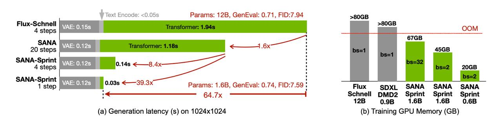

# SANA-Sprint: One-Step Diffusion с непрерывной согласованностью и ускоренной дистилляцией

## Общее описание

SANA-Sprint — это инновационная модель генерации изображений от NVIDIA, которая достигает высокой скорости генерации за счёт использования диффузионных моделей с ускоренной консистентностью (consistency distillation). Основная идея — достижение высокого качества генерации при минимальном количестве шагов (один шаг), что делает модель в разы быстрее традиционных диффузионных моделей.

## Основные принципы

### Непрерывная согласованность (Continuous-time Consistency)

SANA-Sprint основывается на концепции непрерывной согласованности диффузионных моделей, впервые описанной в работах Yang Song. Эта идея заключается в описании движения от шума к сигналу через временную производную, преобразуя дискретный диффузионный процесс в непрерывный поток динамики.

- Вместо дискретных шагов диффузии используется непрерывный поток
- Модель обучается предсказывать траекторию от шума к данным через ОДУ (обыкновенные дифференциальные уравнения)
- Это позволяет достичь генерации за малое количество шагов

### TrigFlow-параметризация

Одним из ключевых аспектов SANA-Sprint является использование специальной параметризации TrigFlow, которая отличается от стандартной flow-matching постановки, используемой в традиционных диффузионных моделях:

- Преобразование временной шкалы в тригонометрические координаты (cos / sin)
- Масштабирование латентных представлений, чтобы шум совпадал по дисперсии с данными
- Трансформация выходного head-компонента для соответствия предсказаний формуле динамики согласованности

### Преобразования модели

Для перевода предобученной диффузионной модели в новую параметризацию SANA-Sprint использует серию преобразований:

1. **Временная шкала в тригонометрические координаты**: Перевод временной параметризации в cos/sin представление
2. **Масштабирование латентов**: Корректировка распределения латентных переменных для совпадения дисперсии шума и данных
3. **Трансформация выходного предсказания**: Адаптация выходной функции головы модели для соответствия динамике согласованности

## Решение проблем стабильности

### Масштабирование временного эмбеддинга

Одной из основных проблем при обучении SANA-Sprint является нестабильность, вызванная слишком большим масштабом шума в временных эмбеддингах. Это приводит к большим производным и нестабильному обучению.

*Решение*: Изменение масштаба частот эмбеддинга и небольшое дообучение модели (всего несколько тысяч итераций).

### Нормализация внимания (QK-Normalization)

Вторая проблема связана с большими нормами градиентов в механизмах внимания трансформеров.

*Решение*: Добавление RMSNorm на Q/K в self- и cross-attention, что стабилизирует обучение.

## Производительность

### Скорость генерации

SANA-Sprint демонстрирует впечатляющую скорость генерации:

- **1024×1024 разрешение**: ~0.1-0.18 секунды при одношаговой генерации
- **Время работы трансформера**: ≈0.03 секунды из общей генерации
- **Остальное время**: VAE-декодер, который становится основным узким местом
- **Сравнение со FLUX-schnell**: 
  - По времени работы диффузионной модели: в 65 раз быстрее
  - По end-to-end задержке: примерно в 10 раз быстрее

 <!-- TODO: Broken image path -->

**Изображение показывает:** Визуальное сравнение производительности моделей Schnell, DMD2 и SANA Sprint, иллюстрирующее преимущество скорости новой модели.

### Качество генерации

Качество генерации SANA-Sprint остается высоким при ускоренной генерации:

- **Метрики FID и GenEval**: На уровне или лучше других быстрых моделей при 1-4 шагах
- **Сравнение с FLUX-schnell**:
  - FID: 7.59 против 7.94 (лучше)
  - GenEval: 0.74 против 0.71 (лучше)
  
Таким образом, SANA-Sprint не только быстрее, но и не уступает по качеству.

## Связь с другими моделями

### Предыстория SANA

- Ранние версии SANA использовали VAE с большим фактором downsampling для ускорения генерации
- В SANA Sprint достигнуто дополнительное ускорение за счёт дистилляции по шагам (consistency distillation)

### Сравнение с FLUX-моделями

- FLUX-schnell был эталонной быстрой моделью до SANA-Sprint
- SANA-Sprint превосходит FLUX-schnell по скорости в 10-65 раз
- Качество остаётся на уровне или выше, чем у FLUX-schnell

## Технические детали

### Архитектура

Использует подход DiT (Diffusion Transformer) с модификациями для ускорения:

- Трансформерная архитектура для диффузионных моделей
- Адаптация для непрерывного времени и согласованности
- Стабилизация через нормализации и масштабирования

### Обучение

- Использует дистилляцию непрерывного времени (continuous-time consistency distillation)
- Требует специальной параметризации для обучения
- Стабилизирована через RMSNorm и корректировку масштаба эмбеддингов

## Применения

- Быстрая генерация изображений в реальном времени
- Интерактивные приложения, где важна низкая задержка
- Сценарии, где требуется компромисс между скоростью и качеством
- Демонстрация возможностей ускоренных диффузионных моделей

## Связи с другими темами

- [[../../consistency_models.md|Consistency Models]] - теоретическая основа для подхода с ускоренной генерацией
- [[../diffusion_transformer.md|Diffusion Transformer]] - базовая архитектурная концепция
- [[../llm_diffusion_integration.md|Диффузионные модели]] - общая модельная парадигма
- [[../../flow_matching.md|Flow Matching]] - один из подходов, объединенных в единой теории и реализованный в SANA-Sprint через TrigFlow-параметризацию
- [[turbo_diffusion_framework.md|TurboDiffusion Framework]] - Альтернативный подход к ускорению генерации видео, использующий гибрид SageAttention2++ и Sparse-Linear Attention, rCM-дистилляцию и квантование моделей

## Источники

- Разбор статьи SANA-Sprint: One-Step Diffusion with Continuous-Time Consistency Distillation от NVIDIA
- CV Time, подготовлено Денисом Кузнеделевым

```metadata
category: компьютерное_зрение
subcategory: генерация_изображений
tags: диффузионные_модели, генерация_изображений, sana, consistency_models, nvidia, скорость_генерации
```