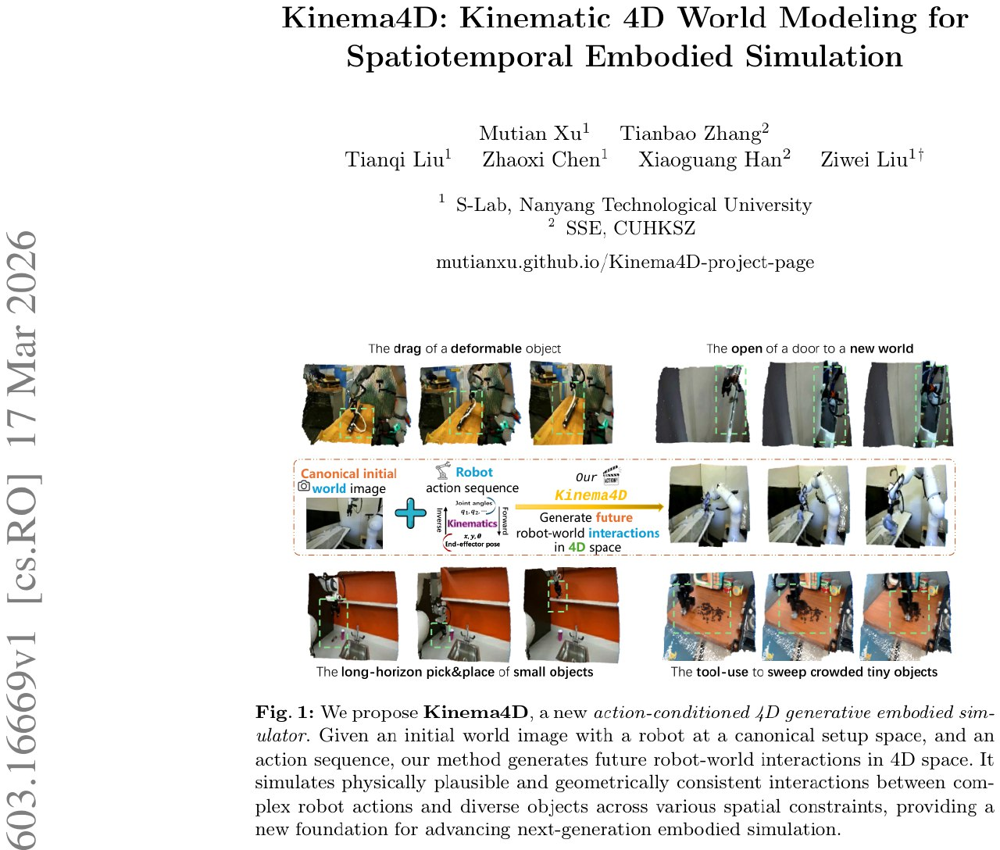

# Kinema4D: Kinematic 4D World Modeling для робототехнической симуляции

## Общее описание

**Kinema4D** — это новая action-conditioned 4D генеративная embodied симулятор для роботов, который разделяет симуляцию робот-мир на две части: детерминированное движение робота через кинематику и генеративное моделирование реакции среды.

Ключевое новшество подхода в том, что большинство видео-симуляторов для роботов работают в 2D пространстве (генерируют пиксели, не понимая геометрии), тогда как Kinema4D работает в истинном 4D пространстве-времени, обеспечивая физически корректную и геометрически согласованную симуляцию [[kinema4d_arxiv_2603_16669|Kinema4D arXiv:2603.16669]].



**Изображение показывает:** Архитектуру Kinema4D с двумя основными компонентами: (1) Кинематическое управление — URDF-модель робота управляется через кинематику для создания точной 4D траектории, (2) 4D генеративное моделирование — траектория проецируется в pointmap последовательность, которая управляет диффузионной моделью для синхронной генерации RGB и pointmap всей сцены.

## Ключевая идея

**Движение робота — физическая определённость, его не надо предсказывать.** А вот реакция среды (деформации, скрытые объекты) — задача для генеративной модели.

Этот подход решает критическую проблему существующих методов: они работают в 2D пиксельном пространстве или используют статические подсказки, игнорируя фундаментальную реальность того, что взаимодействия робот-мир по своей природе являются 4D пространственно-временными событиями [[kinema4d_arxiv_2603_16669|Kinema4D arXiv:2603.16669]].

## Архитектура

### 1. Кинематическое управление (Kinematics Control)

**Цель:** Преобразование абстрактных действий робота в точное 4D представление.

**Процесс:**
1. **3D реконструкция робота:** Использование URDF-моделей или реконструкция через Grounded-SAM2 + ReconViaGen для получения 3D меша робота
2. **Кинематическое развёртывание:**
   - **Joint-space control:** Прямое отображение углов/скоростей суставов
   - **End-effector control:** Решение обратной кинематики (IK) для получения конфигураций суставов
3. **Прямая кинематика (FK):** Вычисление 6-DoF поз для всех звеньев
4. **Пространственно-визуальная проекция:** Проекция 4D траектории робота в последовательность pointmap — пространственно-временной визуальный сигнал

**Pointmap представление:** Для каждой точки на поверхности звена вычисляются пиксельные координаты (u, v) и глубина z через камеру. Результат — pixel-aligned pointmap, хранящий camera-space (x, y, z) координаты [[kinema4d_arxiv_2603_16669|Kinema4D arXiv:2603.16669]].

### 2. 4D генеративное моделирование (4D Generative Modeling)

**Цель:** Синтез реактивной динамики среды в ответ на управление роботом.

**Архитектура:**
- **Base модель:** WAN 2.1 (14B параметров) с 4D-aware предобученными весами от 4DNex
- **Multi-modal latent construction:** Объединение RGB изображения мира, pointmap последовательности робота и guided mask через общий VAE энкодер
- **4D-aware joint modeling:** Diffusion Transformer с shared Rotary Positional Encoding (RoPE) для RGB и pointmap latents
- **Синхронная генерация:** Одновременное предсказание RGB и pointmap последовательностей среды

**Guided mask:** Мягкая маска (10% occupied regions = 0.5) для обеспечения структурной устойчивости и визуальной когерентности [[kinema4d_arxiv_2603_16669|Kinema4D arXiv:2603.16669]].

## Robo4D-200k Dataset

Для обучения Kinema4D создан **Robo4D-200k** — крупнейший 4D робототехнический датасет:

- **201,426 эпизодов** взаимодействий робота с миром
- **Источники данных:** DROID, Bridge, RT-1 (реальные данные) + LIBERO (синтетические данные)
- **4D аннотации:** Реконструкция через ST-V2 для реальных данных, noise-free depth для синтетических
- **Формат:** 49-кадровые последовательности на эпизод
- **Качество:** Ручная верификация и отбраковка низкокачественных записей

Датасет предоставляет беспрецедентный объём и разнообразие взаимодействий для обучения foundation моделей с пространственно-временной и физической осознанностью [[kinema4d_arxiv_2603_16669|Kinema4D arXiv:2603.16669]].

Подробнее: [[robo4d_dataset.md|Robo4D-200k Dataset]]

## Преимущества перед существующими методами

### Сравнение с другими подходами к embodied video generation:

| Тип кондиционирования | Примеры | Ограничения |
|----------------------|---------|-------------|
| **Текст** | [13,20,77,78,90] | Недостаточно fine-grained precision для low-level манипуляций |
| **Latent embedding** | IRASim, Ctrl-World | Заставляют модель "угадывать" кинематику робота |
| **Семантика** | ORV | Требуют off-the-shelf occupancy prediction, нет временной динамики |
| **2D visual prompt** | EVAC, AnchorDream, VAP | Недостаточно spatiotemporal constraints |
| **Kinema4D (4D pointmap)** | **Наш метод** | **Точное управление + spatiotemporal awareness + генеративная гибкость** |

### Ключевые преимущества Kinema4D:

1. **Spatiotemporal rigor:** Истинное 4D моделирование вместо 2D пикселей
2. **Precise control:** Детерминированная кинематика робота вместо "угадывания"
3. **Generative flexibility:** Диффузионная модель фокусируется только на реакции среды
4. **Geometric consistency:** Синхронная генерация RGB + pointmap обеспечивает 3D согласованность
5. **Zero-shot transfer:** Впервые показана возможность переноса на новые сцены без дообучения [[kinema4d_arxiv_2603_16669|Kinema4D arXiv:2603.16669]]

## Применения

- **Симуляция манипуляций:** Long-horizon pick&place мелких объектов
- **Использование инструментов:** Симуляция инструментов для работы с объектами
- **Планирование движений:** Rollout траекторий робота в виртуальной среде
- **Оценка политик:** Evaluation robot policies без реального развёртывания
- **Обучение с подкреплением:** RL training в симуляции
- **Zero-shot перенос:** Применение на новых сценах без дообучения

## Связи с другими темами

- [[world_models.md|World модели]] — Общие world модели в ИИ
- [[world_models_ha_schmidhuber_2018.md|World Models (Ha & Schmidhuber, 2018)]] — Основополагающая работа
- [[../../world_modeling/index.md|World Modeling в RL]] — World modeling в обучении с подкреплением
- [[../../../../domains_and_industries/robotics/index.md|Робототехника]] — Применение в робототехнике
- [[../../diffusion_models/overview.md|Диффузионные модели]] — Архитектура диффузионных моделей
- [[../../flow_matching.md|Flow matching]] — Смежные методы генеративного моделирования
- [[tesseract_world_model.md|TesserAct]] — 4D embodied world модели
- [[4dnex.md|4DNex]] — 4D-native генеративная модель, используемая как основа
- [[particle_former.md|ParticleFormer]] — 3D point cloud world модель для манипуляций
- [[gwm.md|GWM]] — Gaussian world модели для робототехнической манипуляции

## Ограничения и будущие направления

- **Зависимость от URDF:** Требуется точная 3D модель робота
- **Вычислительная сложность:** 14B параметров требуют значительных ресурсов
- **Single-view фокус:** Основная проекция с одной камеры (хотя метод обобщается)
- **Будущее:** Расширение на multi-view, real-time inference, integration с VLA моделями

## Источники

1. **Xu, M., Zhang, T., Liu, T., Chen, Z., Han, X., & Liu, Z. (2026).** Kinema4D: Kinematic 4D World Modeling for Spatiotemporal Embodied Simulation. *arXiv preprint arXiv:2603.16669*. [https://arxiv.org/abs/2603.16669](https://arxiv.org/abs/2603.16669)
   - **PDF:** [[../../media/doc_1773919219_1f8c789b_arxiv_2603.16669.pdf]] — Полная версия статьи с деталями архитектуры, датасета и экспериментов
   - **Project Page:** [mutianxu.github.io/Kinema4D-project-page](https://mutianxu.github.io/Kinema4D-project-page)
   - **Изображение:** [[../../media/img_1773919219_aqadjrdrg8mc2el_kinema4d_kinematic_4d_world_modeling.jpg]] — Визуализация архитектуры Kinema4D

## Дополнительные материалы

- **ST-V2** — Метод 3D/4D реконструкции, используемый для аннотации датасета
- **WAN 2.1** — Base diffusion модель (14B параметров)
- **4DNex** — 4D-native предобученные веса, используемые как основа
- **Grounded-SAM2, SAM2** — Методы сегментации для 3D реконструкции робота
- **ReconViaGen** — Быстрая 3D реконструкция из мульти-вью изображений

```metadata
category: algorithms
subcategory: world_models
tags: kinema4d, 4d_world_model, embodied_simulation, robot_simulation, diffusion_models, pointmap, kinematic_control, robo4d_dataset
```
