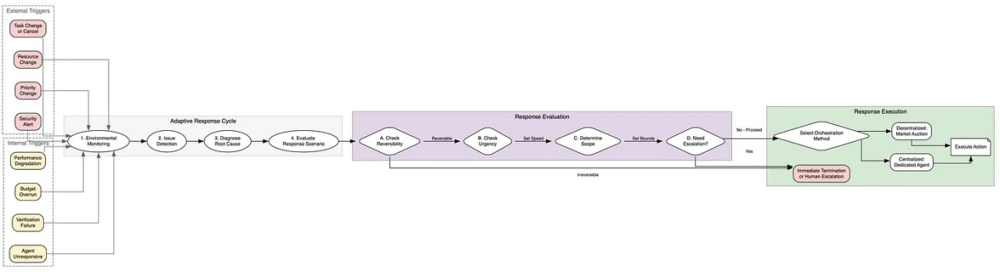

# Фреймворк Intelligent AI Delegation от Google DeepMind

## Обзор

**Image:** Visual representation of the Intelligent AI Delegation framework from Google DeepMind

Исследователи из Google DeepMind (Nenad Tomašev, Matija Franklin, Simon Osindero) предложили фреймворк **Intelligent Delegation** — адаптивный протокол для передачи полномочий, ответственности и подотчетности в мультиагентных системах. В отличие от существующих методов, которые полагаются на простые эвристики, новый подход реализует методологию **contract-first** с динамической оценкой рисков, торгами и верифицируемым выполнением через криптографические доказательства.

**Ключевая проблема:** Современные подходы к делегированию рассматривают его как простую декомпозицию задач, тогда как в реальности делегирование — это социотехнический процесс передачи **власти** (authority) и **ответственности** (liability). Без протокола для управления этими активами возникают бесконечные рекурсии, тихие сбои и уязвимости безопасности.

## Определение Интеллектуального Делегирования

**Интеллектуальное делегирование** определяется как последовательность решений, включающих распределение задач, которая также incorporates:

- Передачу полномочий (authority)
- Передачу ответственности (responsibility)
- Подотчетность за результаты (accountability)
- Четкие спецификации относительно ролей и границ
- Ясность намерений (clarity of intent)
- Механизмы установления доверия между сторонами

## Аспекты Делегирования

Фреймворк вводит несколько осей для анализа случаев использования делегирования:

### 1. Стороны делегирования
- **Делегатор:** Человек или ИИ
- **Исполнитель (Delegatee):** Человек или ИИ

### 2. Характеристики задач

| Ось | Описание |
|-----|----------|
| **Сложность** | Степень трудности, коррелирующая с количеством подшагов и sophistication рассуждений |
| **Критичность** | Важность задачи и серьезность последствий при неудаче |
| **Неопределенность** | Уровень неоднозначности среды, входов или вероятности успеха |
| **Длительность** | Временной диапазон выполнения (от мгновенных подпрограмм до процессов в несколько дней) |
| **Требования к ресурсам** | Вычислительные активы, инструменты, доступ к данным |
| **Стоимость** | Экономические или вычислительные затраты (токены, API fees, энергия) |
| **Ограничения** | Операционные, этические или юридические границы |
| **Верифицируемость** | Сложность валидации результата. Высокая верифицируемость позволяет «бездоверительное» делегирование |
| **Обратимость** | Возможность отменить эффекты выполнения. Необратимые задачи требуют более строгих firebreaks |
| **Субъективность** | Зависимость критериев успеха от предпочтений vs объективных фактов |
| **Контекстуальность** | Объем и чувствительность внешнего состояния, истории, awareness среды |

### 3. Гранулярность и автономия
- **Гранулярность:** От fine-grained до coarse-grained целей
- **Автономия:** От полного контроля до специфичных инструкций
- **Мониторинг:** Непрерывный, периодический или event-triggered

## Ключевые Концепции

### Проблема Принципала-Агента

Проблема принципала-агента возникает, когда принципал делегирует задачу агенту, у которого мотивации не совпадают с принципалом. В контексте ИИ-делегирования эта динамика усложняется:

- **Reward misspecification** — дизайнеры дают ИИ-системе несовершенную цель
- **Reward hacking (specification gaming)** — система эксплуатирует лазейки в сигнале вознаграждения

> **Важно:** Современные ИИ-агенты могут не иметь скрытой повестки, но проблемы выравнивания (alignment) могут проявляться нежелательными способами.

### Span of Control (Диапазон Контроля)

Концепция из человеческих организаций, обозначающая пределы иерархической власти одного менеджера. Для ИИ-делегирования это определяет:

- Сколько orchestrator-узлов требуется относительно worker-узлов
- Сколько ИИ-агентов человек может надежно контролировать без чрезмерной усталости
- Оптимальный span зависит от домена, сложности задач и соотношения cost/performance

### Authority Gradient (Градиент Авторитета)

Термин из авиации, описывающий сценарии, где значительные различия в возможностях, опыте и авторитете затрудняют коммуникацию, приводя к ошибкам.

**В ИИ-делегировании:**
- Более способный делегатор может ошибочно предполагать missing capability у исполнителя
- Исполнитель может из-за sycophancy быть нежелательным оспаривать запрос
- Динамическое когнитивное трение необходимо для выхода из зоны безразличия

### Zone of Indifference (Зона Безразличия)

Диапазон инструкций, которые исполнитель выполняет без критического обдумывания или морального контроля.

**В текущих ИИ-системах:** Зона определяется post-training safety filters и system instructions — пока запрос не触发яет hard violation, модель comply.

**Риск:** В emerging agentic web с длинными цепочками делегирования (A → B → C) широкая зона безразличия позволяет subtle intent mismatches распространяться downstream.

**Решение:** Инженерия **dynamic cognitive friction** — агенты должны распознавать контекстуально амбиiguous запросы и требовать human verification.

### Trust Calibration (Калибровка Доверия)

Уровень доверия делегатора к исполнителю должен быть выровнен с истинными возможностями исполнителя.

**Проблемы:**
- Текущие ИИ-модели склонны к overconfidence даже при фактической ошибочности
- Доверие к автоматизации хрупкое и быстро отзывается при неожиданных ошибках
- Explainability играет важную роль, но может быть недостаточно масштабируемой

### Transaction Cost Economies (Экономика Трансакционных Издержек)

Обосновывает существование фирм через противопоставление costs внутреннего делегирования vs внешнего контрактования.

**Для ИИ-делегирования:**
- AI agent может выбрать: (1) выполнить задачу самостоятельно, (2) делегировать sub-agent с известными capabilities, (3) делегировать другому ИИ с established trust, (4) делегировать новому ИИ
- Разные опции имеют разные expected costs и confidence levels

### Contingency Theory (Теория Контингентности)

Нет универсально оптимальной организационной структуры — наиболее эффективный подход зависит от specific internal и external constraints.

**Применение к ИИ:** Уровень oversight, capability исполнителя и human involvement должны динамически匹配ться характеристикам задачи.

## Архитектура Фреймворка

### 1. Декомпозиция и Capability Matching

Задача дробится до тех пор, пока каждый компонент не станет соответствовать **возможностям верификации** на рынке. Если задачу нельзя проверить — она бьется дальше или отдается человеку.

**Принцип:** Никаких полномочий без возможности спросить за результат.

### 2. Request for Quote (RFQ) и Торги

Назначение задачи — это не вызов функции, а **запрос котировок**:

1. Делегатор публикует task specification
2. Исполнители присылают подписанные **Bid Objects** с:
   - Ценой
   - Сроками
   - Гарантиями (например, исполнение внутри TEE)
   - Репутационными метриками

### 3. Выбор Исполнителя

Делегатор решает задачу **многокритериальной оптимизации**, ища Парето-оптимум между:
- Ценой
- Скоростью
- Репутацией
- Верифицируемостью

Это отход от greedy алгоритмов, хватающих первый попавшийся инструмент.

### 4. Verifiable Task Completion (Верифицируемое Выполнение)

Для обеспечения доверия в среде zero-trust используются:

- **Доказательства с нулевым разглашением (zk-SNARKs)** — субагент может криптографически доказать выполнение конкретного кода на конкретных данных без раскрытия данных
- **Аттестации доверенных сред (TEE)** — подтверждение исполнения в изолированной среде
- **Verification Policy** — в объект Task добавляется поле `verification_policy`. Например, задача считается выполненной только если приложен `zk_snark_trace` по протоколу groth16

Это создает **транзитивную подотчетность**: доказательства корректности всплывают вверх по цепочке делегирования, и ответственность можно математически атрибутировать конкретному узлу.

## Угрозы и Защита

### Типы Угроз

1. **Отравление данных** — компрометация training data или context
2. **Атаки Сивиллы** — создание множества подконтрольных identities
3. **Агентные вирусы** — самораспространяющиеся промпты
4. **Когнитивная Монокультура** — если вся цепочка агентов использует одну модель, ошибка одной модели валит всю цепь

### Механизмы Защиты

- **Web of Trust на базе DIDs** (Decentralized Identifiers) вместо обычных очков репутации
- **Адаптивная координация** — мониторинг триггеров среды и прерывание задач при подозрительном поведении
- **Разнообразие когнитивных субстратов** — делегаторы должны собирать ансамбли из агентов на разных моделях (defense in depth)

## Связь с Существующими Работами

### Hierarchical Reinforcement Learning

Фреймворк строится на идеях иерархического RL, особенно **FeUdal Networks** (Vezhnevets et al., 2017), где Manager устанавливает абстрактные цели для Worker. Однако в Intelligent Delegation иерархия не фиксирована, а делегирование идет во внешний мир.

### Contract Net Protocol

Обновление классического Contract Net Protocol (1980) для эпохи LLM с добавлением:
- Динамической оценки рисков
- Криптографической верификации
- Поддержки гетерогенных агентов (ИИ и люди)

### Model Context Protocol (MCP)

Предлагается расширить протоколы типа MCP или безопасные A2A фреймворки добавлением verification_policy и криптографических доказательств.

## Ограничения и Вызовы

### Вычислительный Оверхед

Строгая декомпозиция, торги и генерация ZK-пруфов создают задержки и требуют вычислений. Для мелких realtime-задач это overkill.

**Complexity Floor (Пол Сложности):** Понятие, введенное авторами — минимальный уровень сложности задачи, ниже которого умное делегирование не имеет смысла.

### Проблема Курицы и Яйца

Чтобы система взлетела, нужна критическая масса агентов, умеющих генерировать крипто-пруфы.

### Технические Вызовы

- Интеграция zk-SNARKs с LLM inference
- Стандартизация verification_policy
- Масштабирование Web of Trust

## Применение

Фреймворк применим к:
- **Human-to-AI делегированию** — персональные ассистенты, enterprise workflows
- **AI-to-AI делегированию** — виртуальные агентные экономики
- **AI-to-Human делегированию** — AI-directed human labour

Особенно важен для high-stakes сред:
- Финансы (торговля, compliance)
- Медицина (диагностика, treatment planning)
- Критическая инфраструктура

## Источники

1. Tomašev, N., Franklin, M., & Osindero, S. (2026). **Intelligent AI Delegation**. arXiv preprint arXiv:2602.11865. Google DeepMind. URL: https://arxiv.org/abs/2602.11865
2. **Intelligent Delegation — ClawHub Skills Lib**. URL: https://clawhub-skills.com/skills/intelligent-delegation
3. **Google DeepMind proposes "Intelligent Delegation" for enterprise AI agents**. TechInformed. URL: https://techinformed.com/google-deepmind-proposes-intelligent-delegation-for-enterprise-ai-agents/

## Дополнительные Материалы

- **Model Context Protocol (MCP)** — Anthropic. URL: https://www.anthropic.com/news/model-context-protocol
- **FeUdal Networks for Hierarchical Reinforcement Learning** — arXiv:1703.01161
- **Chain-of-Agents: End-to-End Agent Foundation Models** — arXiv:2508.13167
- **BlockA2A: Towards Secure and Verifiable Agent-to-Agent Interoperability** — arXiv:2508.01332

## См. Также

- [[applications/agents/chain_of_agents.md]] — энд-ту-енд парадигма LLM reasoning через дистилляцию мультиагентных систем
- [[applications/agents/blocka2a_security_framework.md]] — фреймворк безопасности для A2A взаимодействия с decentralized identity и blockchain auditability
- [[ai/foundational_papers/hierarchical_reinforcement_learning/feudal_networks.md]] — фундаментальная работа по иерархическому RL с Manager-Worker архитектурой
- [[frameworks_and_libraries/agentic-flow/multi_agent_systems.md]] — координация агентов в Agentic-Flow с attention-based механизмами
- [[applications/agents/google_research_scaling_agent_systems.md]] — исследование масштабирования агентных систем от Google Research
