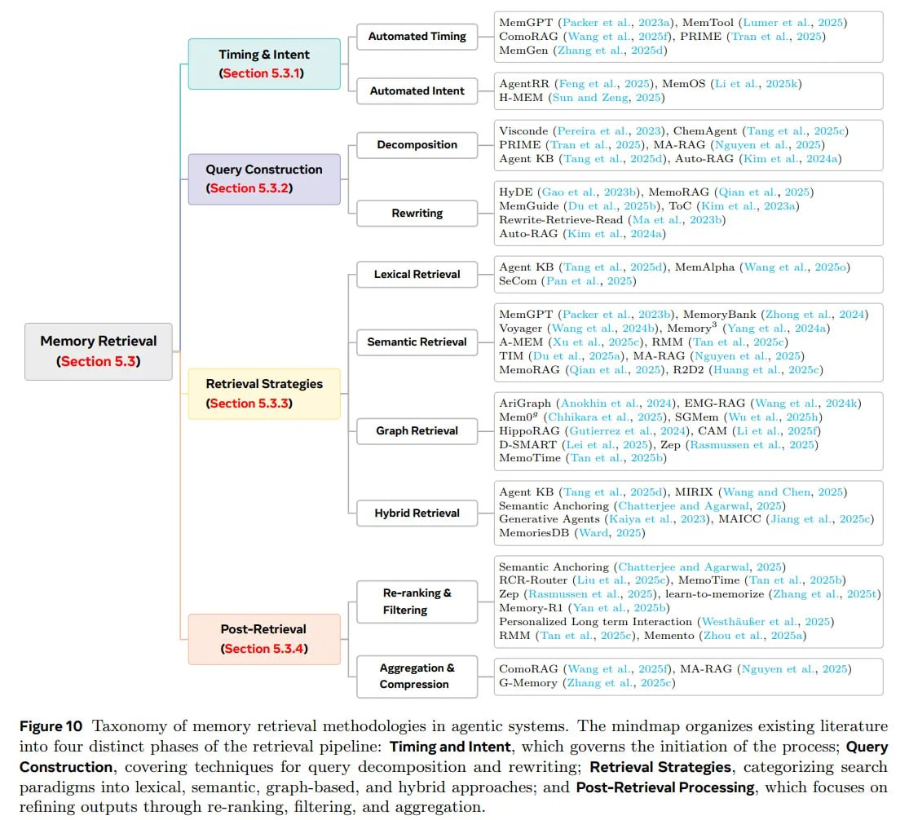

# Динамика памяти в таксономии агентов

## Обзор

Динамика памяти описывает жизненный цикл памяти через три ключевых оператора: формирование (Formation), эволюция (Evolution) и поиск (Retrieval). В отличие от простого хранения информации, динамика фокусируется на том, *как* память изменяется, развивается и используется с течением времени. Это измерение описывает активные процессы управления памятью.

## Формирование памяти (Formation)

### Определение
- Активная трансформация сырых следов взаимодействий в полезные артефакты
- Не пассивное логирование, а целенаправленная обработка информации
- M_form = F(M_t, φ_t) - формула активного формирования памяти, где φ_t - сырые следы взаимодействий

### Методы формирования
1. **Семантическая суммаризация**
   - Преобразование линейных потоков в нарративные блоки
   - Извлечение ключевых смыслов из длинных взаимодействий

2. **Структурированное конструирование**
   - Парсинг взаимодействий в графы знаний
   - Организация информации в структурированные схемы

3. **Абстракция и дистилляция**
   - Создание обобщенных представлений из конкретных примеров
   - Фильтрация шума и выделение значимой информации

### Решаемые задачи
- Сжатие больших объемов данных до управляемых артефактов
- Организация информации в удобной для последующего использования форме
- Сохранение контекста и причинно-следственных связей

## Эволюция памяти (Evolution)

### Определение
- Решает дилемму "стабильности-пластичности" (Stability-Plasticity dilemma)
- Обеспечивает баланс между сохранением важной информации и возможностью адаптации
- Переход от эвристической эволюции к обучаемым подходам

### Компоненты эволюции

#### Консолидация (Consolidation)
- Слияние фрагментарных следов в схемы
- Интеграция информации из разных источников или временных интервалов
- Укрепление важных воспоминаний и ослабление менее важных

#### Обновление (Update)
- Разрешение конфликтов, когда новые факты противоречат старым
- Изменение существующих знаний на основе новой информации
- Поддержание актуальности информации

#### Забывание (Forgetting)
- Прунинг информации с низкой полезностью
- Удаление устаревших или нерелевантных данных
- Управление пространством и ресурсами памяти

### Подходы к эволюции
- **Эвристические подходы**: LRU (Least Recently Used), простые правила приоритизации
- **Обучаемые подходы**: агенты предсказывают долгосрочную полезность следа памяти
- **RL-базированные подходы**: обучение с подкреплением для оптимизации процессов эволюции

## Поиск памяти (Retrieval)

### Определение
- Динамический процесс принятия решений
- Включает тайминг (когда искать) и намерение (что искать)
- Переход от простого поиска по сходству к генеративному поиску

### Типы поиска
1. **Поиск по сходству (Similarity search)**
   - Наиболее распространенный подход в традиционных системах
   - Основан на векторных эмбеддингах и метриках близости

2. **Генеративный поиск (Generative search)**
   - Агент активно синтезирует представление памяти
   - Адаптированное под текущий контекст рассуждений
   - Более гибкий и контекстно-зависимый подход

### Решаемые задачи
- Извлечение релевантной информации в нужный момент
- Оптимизация времени и точности поиска
- Адаптация к изменяющимся потребностям агента

## Переход к RL-управлению памятью

### Классические подходы
- Эвристики в стиле операционных систем (MemGPT)
- Правила и жесткие ограничения
- Заранее определенные стратегии управления

### Современные подходы
- **Обучение с подкреплением**: операции с памятью как действия в политиках RL
- **Mem-α (https://arxiv.org/abs/2509.25911)**: запись в память как обучаемая политика через RL-фреймворк, который обучает агента управлять сложной внешней памятью через вызовы функций
- **Memory-R1 (https://arxiv.org/abs/2508.19828)**: end-to-end оптимизация памяти под успешность задачи с использованием RL для активного управления и использования внешнего банка памяти
- **Memory Manager и Answer Agent**: двухкомпонентная система, где один агент управляет памятью, а другой формирует ответы

### Преимущества RL-подходов
- Адаптивность к специфическим задачам и средам
- Самооптимизирующиеся стратегии управления
- Возможность end-to-end оптимизации под целевые метрики
- Автоматическое обучение оптимальных стратегий формирования, эволюции и поиска в памяти

## Проблемы и ограничения

### Когнитивные искажения
- Зависимость от самой LLM в управлении собственной памятью создает круговую поруку
- Если модель галлюцинирует на этапе формирования или консолидации, она коррумпирует собственную долгосрочную базу знаний

### Риски надежности
- Накапливающиеся ошибки (compounding errors) из-за некачественного формирования
- Проблемы с согласованностью при частых обновлениях

## Сравнение подходов к динамике

| Аспект динамики | Традиционный подход | RL-подход | Преимущества |
|----------------|--------------------|-----------|--------------|
| Формирование | Регулярные суммаризации | Обучаемые стратегии | Адаптация к важности контента |
| Эволюция | Правила и эвристики | Оптимизация через RL | Оптимизация под конкретные задачи |
| Поиск | Поиск по сходству | Генеративный поиск | Контекстно-зависимые извлечения |

## Практические применения

### Формирование
- Автоматическая генерация заметок из диалогов
- Создание структурированных отчетов из неструктурированных данных
- Дистилляция знаний из длинных сессий

### Эволюция
- Автоматическое обновление пользовательских профилей
- Адаптация к новым доменам знаний
- Управление устаревшей информацией

### Поиск
- Контекстно-зависимое извлечение релевантной информации
- Адаптивный выбор источников памяти
- Интеграция с процессами рассуждения

## Визуализация

 <!-- TODO: Broken image path -->

**Image shows:** The mindmap organizes existing literature into four distinct phases of the retrieval pipeline: Timing and Intent, which governs the initiation of the process; Query Construction, covering techniques for query decomposition and rewriting; Retrieval Strategies, categorizing search paradigms into lexical, semantic, graph-based, and hybrid approaches; and Post-Retrieval Processing, which focuses on refining outputs through re-ranking, filtering, and aggregation.

## Источники

- Memory in the Age of AI Agents: A Survey (https://arxiv.org/abs/2512.13564)
- Mem-α paper (https://arxiv.org/abs/2509.25911)
- Memory-R1 paper (https://arxiv.org/abs/2508.19828)
- ArXivIQ Substack article on Memory in the Age of AI Agents (https://arxiviq.substack.com/p/memory-in-the-age-of-ai-agents)

## См. также

[[unified_taxonomy_agent_memory.md]] - Основная таксономия памяти агентов
[[memory_systems_for_ai_agents.md]] - Общие системы памяти для агентов
[[memory_forms_agent_taxonomy.md]] - Формы памяти (Token-level, Parametric, Latent)
[[memory_functions_agent_taxonomy.md]] - Функции памяти (Factual, Experiential, Working)