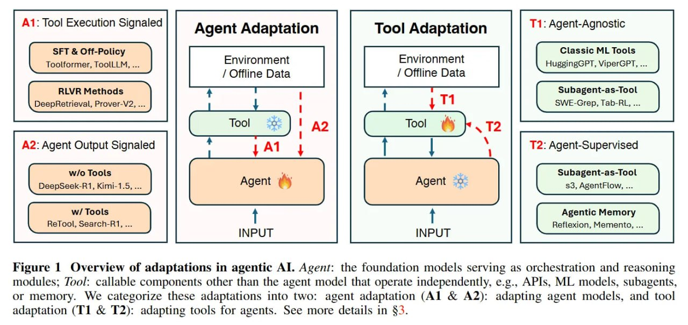

**Image shows:** The figure illustrates the conceptual framework for adaptations in agentic AI. It shows the relationship between the Agent (foundation models serving as orchestration and reasoning modules) and Tool (callable components other than the agent model that operate independently, e.g., APIs, ML models, subagents, or memory). The framework categorizes adaptations into two main types: agent adaptation (A1 & A2) - adapting agent models, and tool adaptation (T1 & T2) - adapting tools for agents.