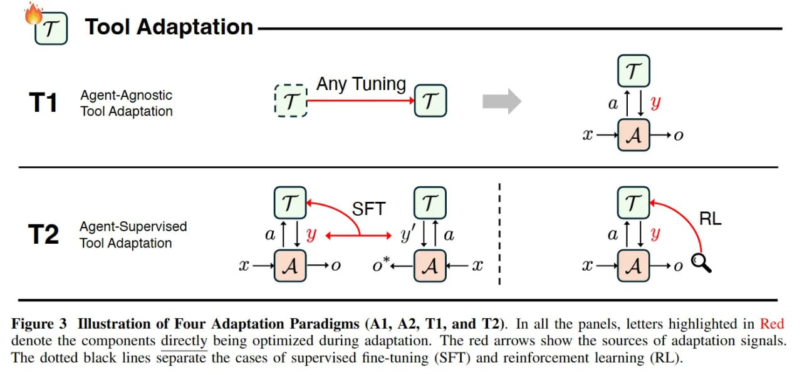

**Image shows:** The figure illustrates the four adaptation paradigms (A1, A2, T1, and T2) in detail. In all panels, letters highlighted in red denote the components directly being optimized during adaptation. The red arrows show the sources of adaptation signals. The dotted black lines separate the cases of supervised fine-tuning (SFT) and reinforcement learning (RL).

- A1 (Tool Execution Signaled Agent Adaptation): The agent is optimized using verifiable outcomes produced by external tools it invokes. The signal comes directly from tool execution (e.g., code sandbox results, retrieval relevance scores, or API call outcomes).

- A2 (Agent Output Signaled Agent Adaptation): The agent is optimized using evaluations of its own outputs (final answers, plans, or reasoning traces). This includes both tool-free outcome-based learning and tool-augmented adaptation driven by answer correctness or preference scores.

- T1 (Agent-Agnostic Tool Adaptation): Tools are trained independently of the frozen agent. These are pre-trained components that can be used as plug-and-play modules orchestrated by the frozen agent.

- T2 (Agent-Supervised Tool Adaptation): The agent remains fixed while its tools are adapted using signals derived from the agent's outputs. This includes reward-driven retriever tuning, adaptive rerankers, search subagents, and memory-update modules.