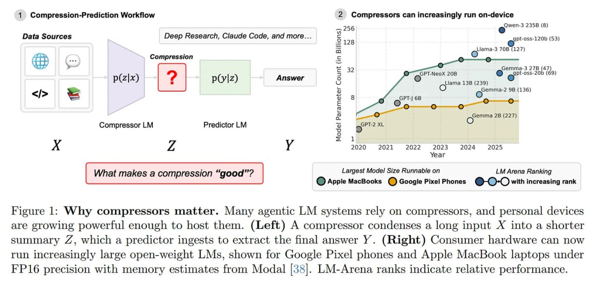
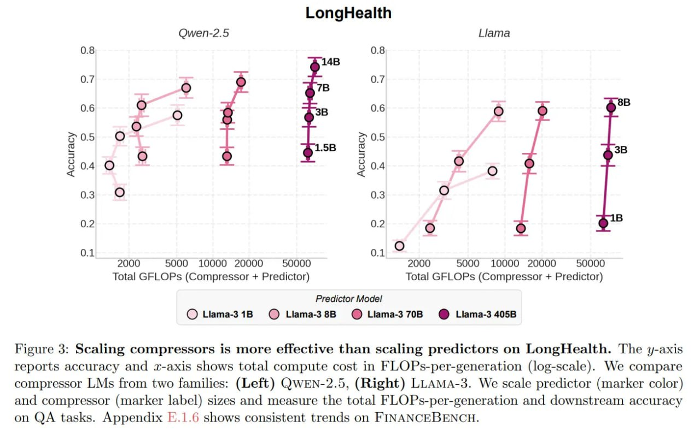
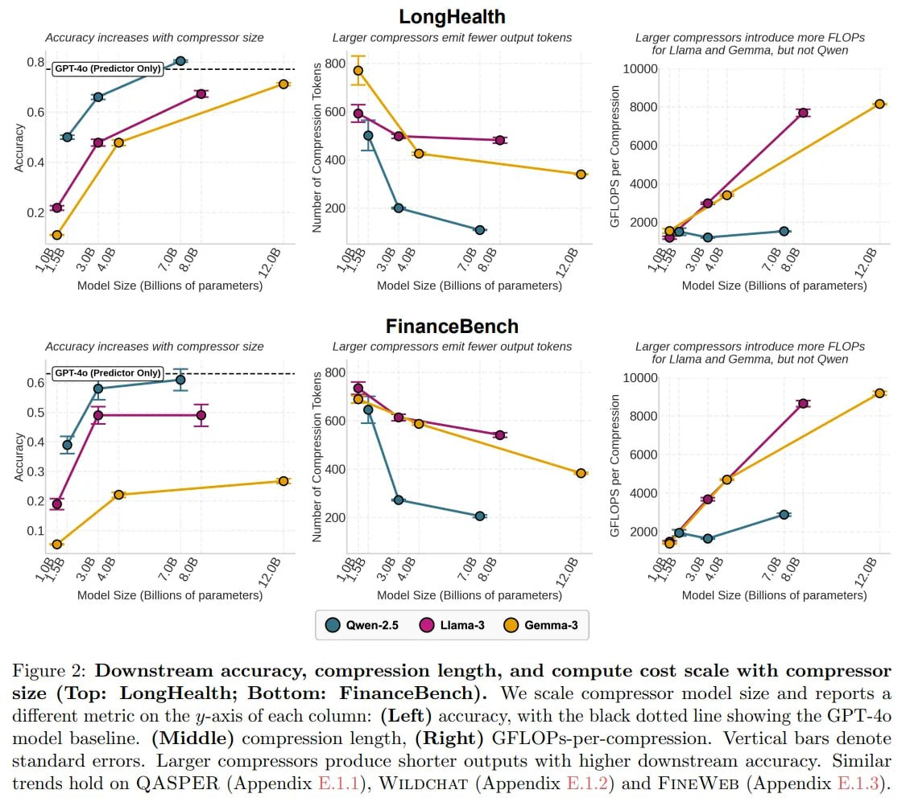
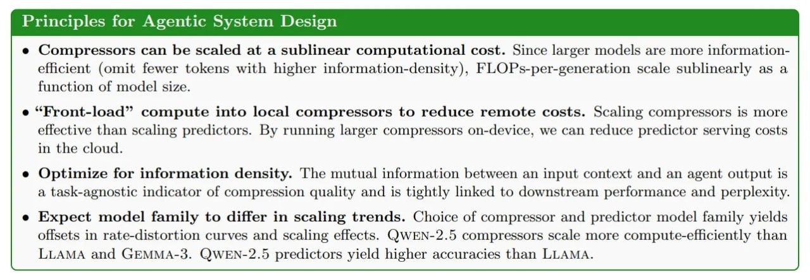
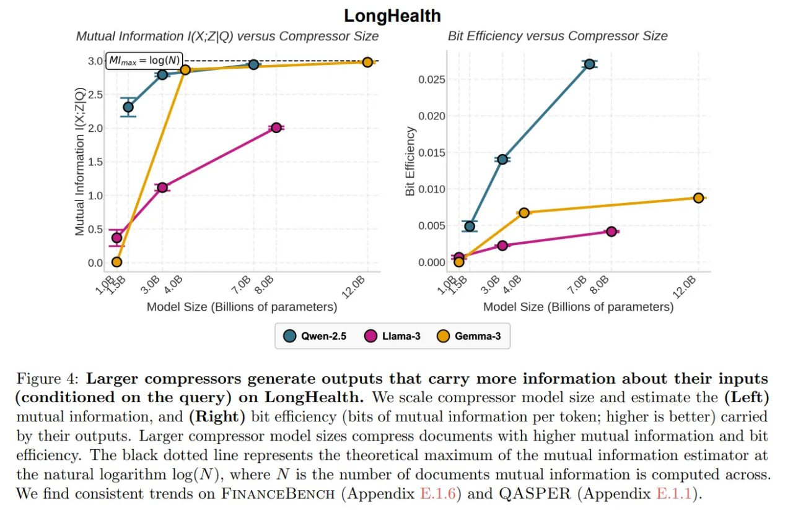
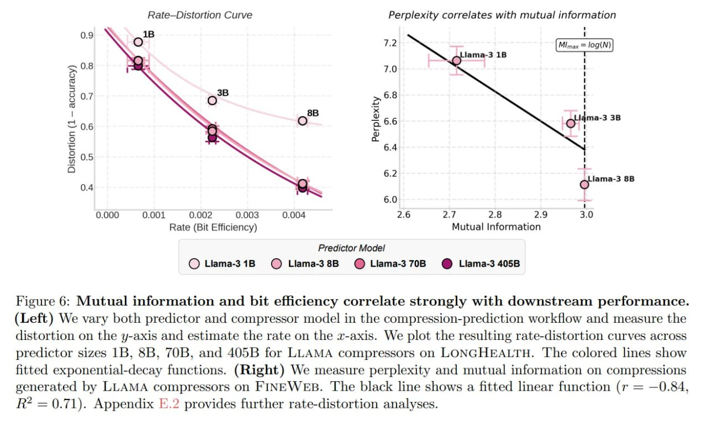
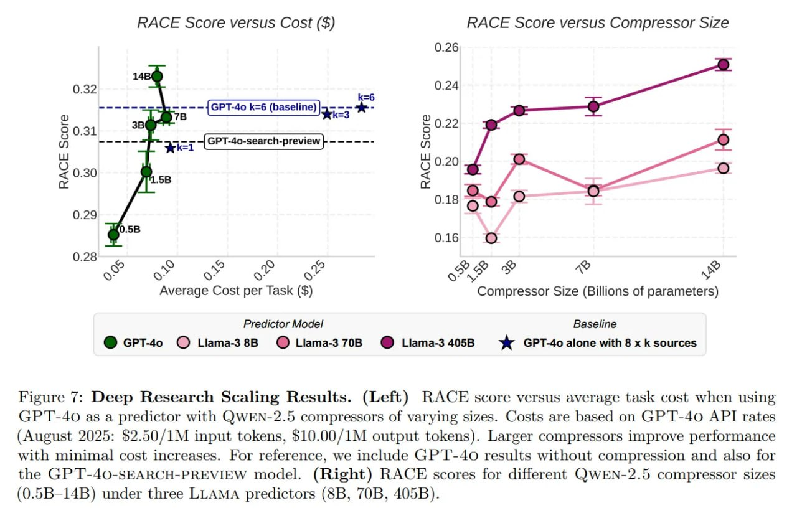

# Теоретико-информационный подход к проектированию агентных систем: почему компрессор важнее предиктора

## Обзор

Статья "An Information Theoretic Perspective on Agentic System Design" (Шизе Хе, Аваника Нараян, Ишан С. Харе, Скотт В. Линдерман, Кристофер Рэ, Дэн Бидерман) представляет формализованную теоретико-информационную модель для проектирования многошаговых агентных систем через архитектуру Compressor-Predictor. Вместо традиционного подхода "всё решат гигантские модели на последнем шаге", исследование демонстрирует, что масштабирование компрессора (модели, сжимающей данные) приводит к значительно большему улучшению производительности, чем масштабирование предиктора (модели, генерирующей финальный ответ).

## Архитектура Compressor-Predictor

Современные сложные агентные системы, такие как OpenAI Deep Research или Claude Code, вынуждены разделять труд, чтобы укладываться в контекстные окна и бюджеты. Стандартная архитектура включает:

- **Компрессор** (часто работающий асинхронно): принимает сырые данные (поиск, логи, документы) и создает краткий дистиллят (саммари) Z
- **Предиктор**: принимает дистиллят Z и генерирует финальный ответ Y

В цепочке Маркова это представляется как: **X → Z → Y**, где:
- X — исходный контекст (сырые данные)
- Z — саммари, созданное компрессором
- Y — финальный ответ, созданный предиктором

### Проблема атрибуции

Главная проблема традиционного подхода — "проблема атрибуции": когда агент ошибается, сложно определить, была ли это ошибка компрессора (потеря важных фактов) или предиктора (не смог додумать). Без метрики качества сжатия, независимой от задачи, весь пайплайн остается черным ящиком.

## Теоретико-информационная модель

Авторы предлагают смотреть на архитектуру Compressor-Predictor через призму Information Bottleneck, оптимизируя баланс между:
- **Эффективностью сжатия (rate)**: насколько компактно представлен саммари Z
- **Потерей смысла (distortion)**: насколько много важной информации потеряно из X

### Information Rate: Метрика качества сжатия

Вместо традиционной перплексии или семантической близости, авторы вводят понятие **Information Rate** — взаимная информация на токен. Это уход от метрик, зависящих от конкретной задачи, к универсальной метрике битовой эффективности.

**Взаимная информация (Mutual Information, MI)** I(X; Z) между исходным контекстом и саммари служит мерой того, насколько хорошо компрессор передает информацию. "Хорошее" сжатие — это то, которое позволяет максимально точно отличить исходный контекст от других, независимо от задачи, которую затем решает предиктор.

### Формула оценки взаимной информации

Поскольку взаимная информация для текста не может быть вычислена напрямую, авторы предлагают Monte Carlo оценку:

Î(X; Z) ≈ 1/(NM) * Σ [ log p(z|x_true) - log (mean(p(z|x_random))) ]

Где:
- Числитель: насколько саммари Z вероятнее для родного контекста x_true
- Знаменатель: усреднение по "левым" контекстам x_random (отрицательные образцы)

## Практические выводы

### 1. Масштабирование компрессора эффективнее масштабирования предиктора

**Результаты экспериментов:**
- Скейлинг компрессора (1B → 7B): прирост точности 60%
- Скейлинг предиктора (70B → 405B): прирост точности всего 12%

Это контринтуитивное открытие разрушает стереотип, что финальная модель должна быть самой большой.

### 2. Крупные компрессоры более эффективны в использовании токенов

При росте с 1.5B до 7B модель не только становится точнее, но и лаконичнее. Плотность информации (бит на токен) возрастает.

**Следствие:** Затраты (FLOPs) растут сублинейно. Масштабирование Qwen-компрессора с 1.5B до 7B увеличило вычислительную стоимость генерации на бенчмарке LongHealth всего на 1.3%.

### 3. Local Compressor + Cloud Predictor: оптимальная архитектура

Принцип проектирования: **Front-load compute.** В симуляции пайплайна:
- Локальный 3B-компрессор на входе
- Облачный предиктор на выходе
- Результат: 99% точности полностью облачного решения при срезании чека за API на 74%

Это открывает путь к частным и дешевым агентам нового поколения с мощными компрессорами на ноутбуках и телефонах, отправляющими в облако концентрированные "векторы мыслей" (текстовые саммари).

## Методология измерения

### Использование прокси-модели (Proxy Model)

Мелкие компрессоры (1B-3B) часто плохо калиброваны, их лог-вероятности шумят. Поэтому авторы используют прокси-модель:
- Оценка вероятностей происходит через более мощную и стабильную модель (например, Qwen-2.5-7B-Instruct)
- Это измеряет реальное семантическое содержание, а не уверенность компрессора в собственной галлюцинации

### Связь с downstream задачами

Точность downstream задач жестко коррелирует (R²=0.71) с Information Rate. Предиктор не может получить то, что потерял компрессор — "Garbage In, Garbage Out".

## Ограничения подхода

1. Оценка взаимной информации зависит от прокси-модели — если она чего-то не понимает, метрика может быть неточной
2. Анализ фокусируется на одношаговом сжатии, в то время как в реальности агенты часто ведут диалог "уточни деталь X"
3. Динамика для MoE-моделей может отличаться от плотных моделей, рассмотренных в статье

## Примеры иллюстраций

**Рисунок показывает:** Figure 1: Почему компрессоры важны. Многие агентные LM-системы полагаются на компрессоры, и персональные устройства становятся достаточно мощными, чтобы размещать их. (Слева) Компрессор сжимает длинный вход X в более короткое резюме Z, которое принимает предиктор для извлечения окончательного ответа Y. (Справа) Аппаратное обеспечение потребителей теперь может запускать все более крупные LM с открытым весом, показано для Google Pixel и Apple MacBook под точностью FP16 с оценками памяти из Modal. Рейтинги LM-Arena указывают на относительную производительность.

**Рисунок показывает:** Figure 3: Масштабирование компрессоров более эффективно, чем масштабирование предикторов на LongHealth. Ось Y показывает точность, а ось Z показывает общие вычислительные затраты в FLOPs за генерацию (логарифмическая шкала). Сравниваются компрессоры LM из двух семейств: (слева) QWEN-2.5, (справа) LLAMA-3. Масштабируется размер предиктора (цвет маркера) и компрессора (метка маркера), измеряются общие FLOPs за генерацию и точность downstream на задачах QA.

**Рисунок показывает:** Figure 2: Точность downstream, длина сжатия и вычислительная стоимость масштабируются с размером компрессора (вверху: LongHealth; внизу: FinanceBench). Масштабируется размер компрессора, и показывается другой метрики на оси Y каждой колонки: (слева) точность, с черной пунктирной линией, показывающей базовый уровень GP'T-4o. (в центре) длина сжатия, (справа) GFLOPs за сжатие. Вертикальные столбцы обозначают стандартные ошибки. Более крупные компрессоры дают более короткие выходы с более высокой точностью downstream.

**Рисунок показывает:** Основные принципы проектирования агентных систем:
- Компрессоры можно масштабировать с сублинейной вычислительной стоимостью. Поскольку более крупные модели более информационно-эффективны (пропускают меньше токенов с более высокой информационной плотностью), FLOPs за генерацию масштабируются сублинейно как функция от размера модели.
- "Фронтальная загрузка" вычислений в локальные компрессоры для снижения удаленных затрат. Масштабирование компрессоров более эффективно, чем масштабирование предикторов. Запуская более крупные компрессоры на устройстве, можно снизить затраты на предиктор в облаке.
- Оптимизация по плотности информации. Взаимная информация между входным контекстом и выходом агента является индикатором качества сжатия, не зависящим от задачи, и тесно связана с downstream производительностью и перплексией.
- Ожидание различий в масштабируемых тенденциях для разных семейств моделей. Выбор компрессора и семейства моделей предиктора дает смещения в кривых rate-distortion и эффектах масштабирования.

**Рисунок показывает:** Figure 4: Более крупные компрессоры генерируют выходы, которые несут больше информации о своих входах (с учетом запроса) на LongHealth. Масштабируется размер компрессора и оценивается (слева) взаимная информация, и (справа) битовая эффективность (биты взаимной информации на токен; выше - лучше) выходов, которые они генерируют. Более крупные размеры модели компрессора сжимают документы с более высокой взаимной информацией и битовой эффективностью.

**Рисунок показывает:** Figure 6: Взаимная информация и битовая эффективность тесно коррелируют с downstream производительностью. (Слева) Варьируются как предиктор, так и компрессор модели в процессе сжатия-предсказания и измеряется искажение по оси Y и оценивается скорость по оси Z. Показываются полученные кривые rate-distortion для разных размеров предиктора 1B, 8B, 70B и 405B для LLAMA компрессоров на LONGHEALTH. Цветные линии показывают подогнанные экспоненциальные функции. (Справа) Измеряется перплексия и взаимная информация сжатий, сгенерированных LLAMA компрессорами на FINEWEB. Черная линия показывает подогнанную линейную функцию (r = -0.84, R² = 0.71).

**Рисунок показывает:** Figure 7: Результаты масштабирования Deep Research. (Слева) Результат RACE в зависимости от средней стоимости задачи при использовании GP'T-40 в качестве предиктора с QWEN-2.5 компрессорами разного размера. Стоимость основана на тарифах GP'T-40 API (август 2025: 2.50$ за 1М входных токенов, 10.00$ за 1М выходных токенов). Более крупные компрессоры улучшают производительность с минимальным увеличением стоимости. В качестве справки включены результаты GP'T-40 без сжатия, а также для модели GPT-40-SEARCH-PREVIEW. (Справа) Результаты RACE для разных размеров QWEN-2.5 компрессоров (0.5B-14B) при трех LLAMA предикторах (8B, 70B, 405B).

## Связь с существующими темами

[[information_bottleneck.md]] - Теоретическая основа для оптимизации компрессии
[[compressor_predictor_architectures.md]] - Архитектуры с разделением компрессора и предиктора
[[apple_clara_continuous_latent_reasoning.md]] - Пример системы с встроенным сжатием
[[mutual_information_metrics.md]] - Метрики взаимной информации для оценки качества моделей
[[scaling_laws_for_agents.md]] - Законы масштабирования для агентных систем
[[edge_cloud_computing_for_agents.md]] - Распределенные вычисления для агентных систем

## Источники

1. He, S., Narayan, A., Khare, I. S., Linderman, S. W., Ré, C., & Biderman, D. (2025). An Information Theoretic Perspective on Agentic System Design. arXiv:2512.21720. https://arxiv.org/abs/2512.21720
2. Review article: https://arxiviq.substack.com/p/an-information-theoretic-perspective
3. Original research paper: https://arxiv.org/abs/2512.21720