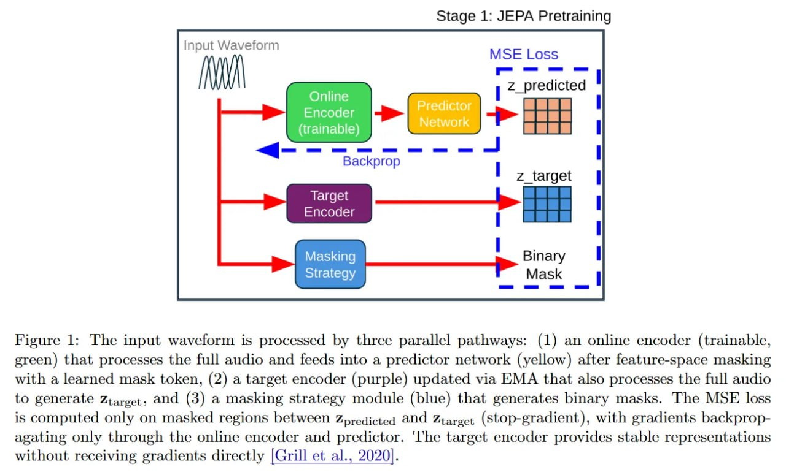
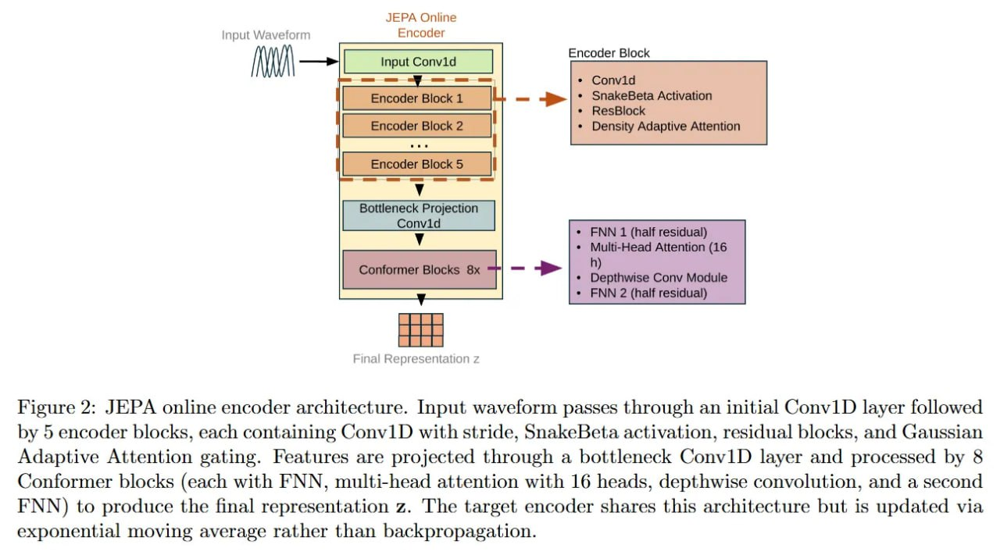
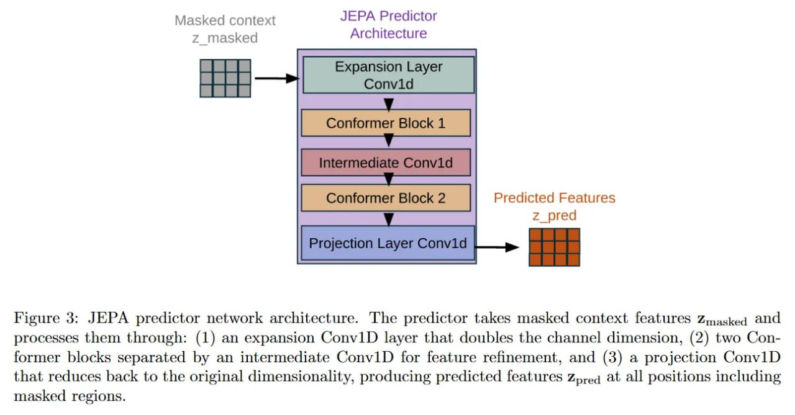
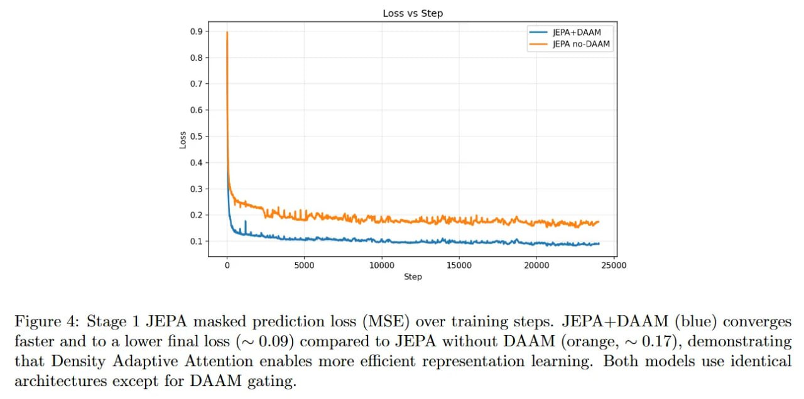
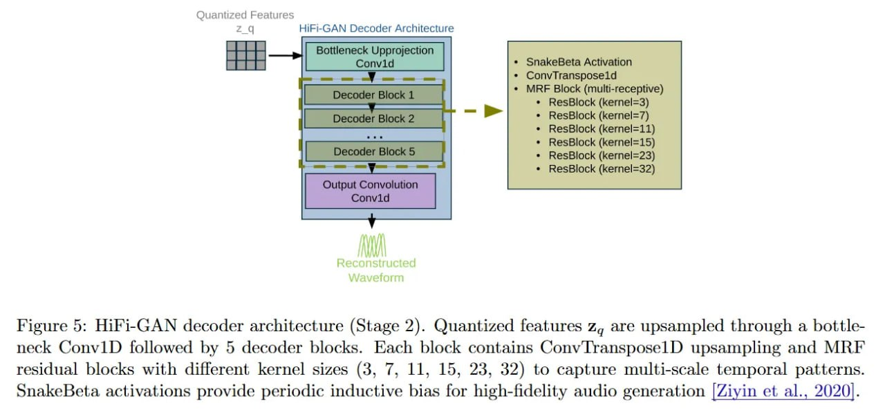
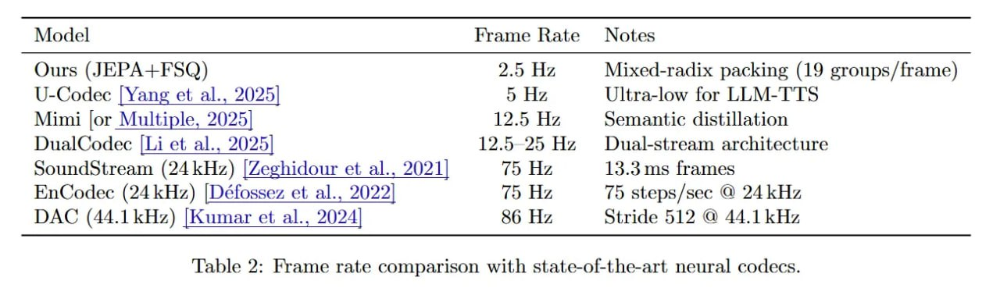
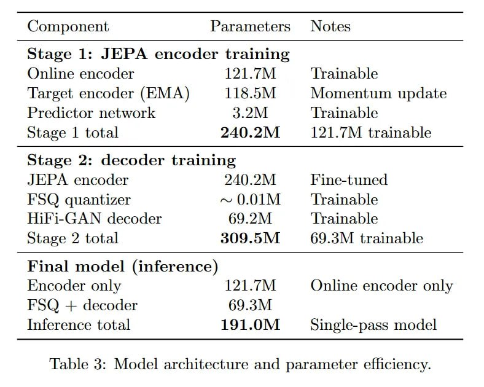

# JEPA как нейронный токенизатор речи: Обучение устойчивым речевым представлениям с адаптивным к плотности вниманием

## Краткое описание

JEPA (Joint-Embedding Predictive Architecture) как нейронный токенизатор речи представляет собой двухэтапный фреймворк для создания речевых представлений, который разрешает вечный конфликт нейронных аудиокодеков между сохранением акустической точности и изучением высокоуровневой семантики. Архитектура использует Joint-Embedding Predictive Architecture (JEPA), усиленную механизмом адаптивного к плотности внимания (DAAM), для обучения семантических фич через предсказание маскированных латентов в полном отрыве от задачи реконструкции волны.

## Основная информация

### Что сделали

Авторы предложили двухэтапный фреймворк для создания речевых представлений:

1. **Этап 1: Предобучение JEPA** - Используется архитектура Joint-Embedding Predictive Architecture (JEPA), усиленная механизмом адаптивного к плотности внимания (DAAM). Это позволяет выучивать семантические фичи через предсказание маскированных латентов в полном отрыве от задачи реконструкции волны.

2. **Этап 2: Обучение декодера** - Энкодер замораживают и обучают HiFi-GAN декодер с конечно-скалярным квантованием (FSQ). Итог — экстремально низкая частота кадров: всего 2.5 Гц (47.5 токенов в секунду).

### Почему это важно

Подход разрешает вечный конфликт нейронных аудиокодеков между сохранением акустической точности и изучением высокоуровневой семантики. Заменив стандартные кодовые книги VQ-VAE на аналитическое FSQ и используя гейтинг внимания на основе вероятностей, модель выдает сильно сжатые, обратимые токены. Они идеально подходят для скармливания в LLM, не жертвуя при этом качеством восстановления аудио.

## Подробности реализации

### Архитектурное решение

В современных нейронных аудиокодеках, вроде [SoundStream](soundstream.md) <!-- TODO: Broken link --> или [EnCodec](encodec.md) <!-- TODO: Broken link -->, есть "узкое горлышко": обучение репрезентаций жестко связано с задачей реконструкции. Такие модели обычно заставляют энкодер сохранять низкоуровневые детали волны, чтобы минимизировать лосс восстановления. Это неизбежно размывает семантическую плотность латентного пространства. Из-за такого смешивания (conflation) токены становятся субоптимальными для языкового моделирования, где лингвистическая структура важнее информации о фазе сигнала.

Авторы решают эту проблему архитектурно, разделяя задачи. На этапе предобучения (JEPA) энкодер оптимизируется исключительно для семантического предсказания в латентном пространстве, игнорируя фазу и мелкий шум. И только на втором этапе декодер учится переводить эти абстрактные фичи обратно в звук. Такое разделение позволяет системе работать на значительно более низкой частоте кадров (2.5 Гц) по сравнению со стандартными 50-75 Гц. По сути, вся нагрузка по акустическому синтезу перекладывается на декодер, а энкодер превращается в чистый "нейронный токенизатор".

### DAAM: Внимание к статистике

Главный теоретический вклад внутри энкодера — интеграция механизма Density Adaptive Attention Mechanism (DAAM). Стандартное внимание работает попарно, вычисляя Attention(Q, K, V), чтобы определить связь каждого шага с каждым. Это мощно, но дорого (квадратичная сложность) и, по сути, отвечает на вопрос: "Какие шаги *похожи* на этот?". DAAM ставит вопрос иначе: "Какие шаги *статистически значимы*?".

DAAM предполагает, что информативные фичи проявляются как отклонения от фонового распределения. Модуль моделирует временную статистику входных фич x размерности B x C x T с использованием обучаемой смеси гауссиан (GMM).

Для заданного шага t механизм считает среднее mu и дисперсию sigma^2 по временной оси, а затем оценивает лог-вероятность по K гауссовым компонентам. Гейт внимания G(x_t) получается через log-sum-exp агрегацию. Если вектор признаков на шаге t имеет низкую вероятность в рамках выученного фона, он считается важным (salient). Это позволяет адаптивно отбирать фичи без оверхеда полных матриц внимания.

### Конвейер: от волны к токенам

Работает всё через строгий двухэтапный пайплайн. На первом этапе сырая волна обрабатывается "Контекстным энкодером" (online) и "Целевым энкодером" (обновляется через EMA). Входной сигнал подвергается жесткому даунсэмплингу с общим шагом 9600, что и дает те самые 2.5 Гц.

Система использует стратегию блочного маскирования, скрывая части в латентном пространстве. Предиктор должен регрессионно восстановить значения выходов маскированного Целевого энкодера, используя только видимые выходы Контекстного. Критически важно, что лосс здесь — простой MSE в пространстве признаков: L_JEPA ~ || z_pred - sg(z_target) ||^2, где sg — stop-gradient.

Как только энкодер предобучен, его веса замораживаются. К нему пристыковываются квантователь и декодер. Вместо векторного квантования (VQ) с кодовыми книгами, авторы используют [Finite Scalar Quantization (FSQ)](fsq_neural_quantization.md) <!-- TODO: Broken link -->.

Непрерывные латентные вектора проецируются через tanh в диапазон (-1, 1), а затем квантуются в дискретные уровни L = [4, 4, 4, 4] на измерение. Эти индексы упаковываются через смешанную систему счисления. Для группы из G=7 измерений итоговый токен считается методом Горнера: token = sum(i_k * prod(r_j)). Это дает словарь 4^7 ~ 16k (как в NLP) и пропускную способность 47.5 токенов/сек. Восстанавливает аудио декодер на базе [HiFi-GAN](hifi_gan_decoder.md) <!-- TODO: Broken link -->.

### Инженерная стабильность

Реализация избегает проблем с "коллапсом кодовой книги", типичных для VQ-VAE. FSQ трактует квантование как аналитическую операцию, отображая вход в ближайший центр из фиксированного набора уровней. Это устраняет необходимость во вспомогательных лоссах или метриках перплексии.

Стабильность обучения JEPA обеспечивается обновлением весов целевого энкодера через EMA: theta_target <- tau * theta_target + (1 - tau) * theta_online, где tau=0.996.

Интеграция DAAM значительно ускоряет сходимость: вариант с ним достигает более низкого лосса (~0.09) гораздо быстрее базового JEPA (~0.17). Гауссовский гейтинг эффективно фильтрует шум, позволяя предиктору фокусироваться на структуре. Финальная реконструкция контролируется набором лоссов (L1, multi-resolution STFT, GAN adversarial) по рецепту HiFi-GAN.

## Скорость и обратимость

Главный козырь — соотношение производительности и качества. Разница в частоте кадров с аналогами колоссальна: EnCodec — 75 Гц, Descript Audio Codec (DAC) — 86 Гц, а здесь — 2.5 Гц. Для LLM это означает огромное сокращение контекста при генерации длинной речи.

Более того, выбор FSQ дает идеальную математическую обратимость токенизации. В VQ-VAE нужно искать вектор в выученной книге. В FSQ "декодирование" — это простая модульная арифметика. Потеря информации происходит только при округлении, но не при упаковке. Несмотря на сжатие, энкодер сохраняет достаточно семантики, чтобы HiFi-GAN мог "сгаллюцировать" правдоподобную акустику.

## Ограничения и итоги

Стратегия маскирования пока примитивна: рандомные блоки фиксированной длины. Речь же иерархична (фонемы, слова, паузы), и адаптивное маскирование могло бы улучшить результаты. Также тесты ограничены английским [LibriLight](https://arxiv.org/abs/1912.07875) датасетом. Неясно, как агрессивные 2.5 Гц переживут тональные или очень быстрые языки.

Но в целом, это сильный аргумент за сдвиг от автоэнкодинга к joint embedding. Авторы показали, что речь можно сжат до длины текста без выравнивателей, а DAAM дает отличный механизм саморегуляции внимания. Дорога к нативным Audio-LLM открыта.

## Визуализации и архитектура

 <!-- TODO: Broken image path -->
*Рисунок: Архитектура предобучения JEPA, показывающая двухэтапный процесс обучения с Context и Target энкодерами*

 <!-- TODO: Broken image path -->
*Рисунок: Архитектура онлайн-энкодера JEPA с DAAM-механизмом*

 <!-- TODO: Broken image path -->
*Рисунок: Архитектура предикторной сети JEPA*

 <!-- TODO: Broken image path -->
*Рисунок: Пример маскирования в Stage 1 JEPA*

 <!-- TODO: Broken image path -->
*Рисунок: Архитектура HiFi-GAN декодера*

 <!-- TODO: Broken image path -->
*Рисунок: Сравнение частоты кадров с существующими моделями (JEPA работает на частоте 2.5 Гц)*

 <!-- TODO: Broken image path -->
*Таблица 3: Архитектура модели и параметры*

## Связи с другими темами

- [[../../../self_supervised_learning/lejepa.md]] - LeJEPA является развитием подхода JEPA в self-supervised learning
- [[../../computer_vision/world_models.md]] - JEPA используется в визуальных задачах, здесь адаптирован для аудио
- [[../soundstream.md]] - Сравнение с традиционным нейронным аудиокодеком
- [[../encodec.md]] - Сравнение с другим нейронным аудиокодеком
- [[../fsq_neural_quantization.md]] - Используемый метод квантования
- [[../hifi_gan_decoder.md]] - Используемый декодер для синтеза аудио
- [[daam_attention_mechanism.md]] - Механизм адаптивного к плотности внимания, используемый в архитектуре

## Источники

1. [JEPA as a Neural Tokenizer: Learning Robust Speech Representations with Density Adaptive Attention](https://arxiv.org/abs/2512.07168) - Основная статья, описывающая архитектуру и подход
2. [Density Adaptive Attention Mechanism (DAAM) paper](https://arxiv.org/abs/2401.11143) - Описание механизма DAAM, используемого в архитектуре
3. [Finite Scalar Quantization (FSQ) paper](https://arxiv.org/abs/2309.15505) - Описание метода квантования, используемого в декодере
4. [HiFi-GAN paper](https://arxiv.org/abs/2010.05646) - Описание GAN-архитектуры для синтеза аудио
5. [Descript Audio Codec (DAC) paper](https://arxiv.org/abs/2306.06546) - Сравниваемый аудиокодек
6. [EnCodec paper](https://arxiv.org/abs/2210.13438) - Сравниваемый аудиокодек
7. [SoundStream paper](https://arxiv.org/abs/2107.03312) - Базовый аудиокодек, с которым сравнивают подход

## См. также

- [[daam_attention_mechanism.md]] - Механизм адаптивного к плотности внимания
- [[neural_audio_tokenizers.md]] - Общее понятие о нейронных токенизаторах аудио
- [[speech_representation_learning.md]] - Обучение речевым представлениям