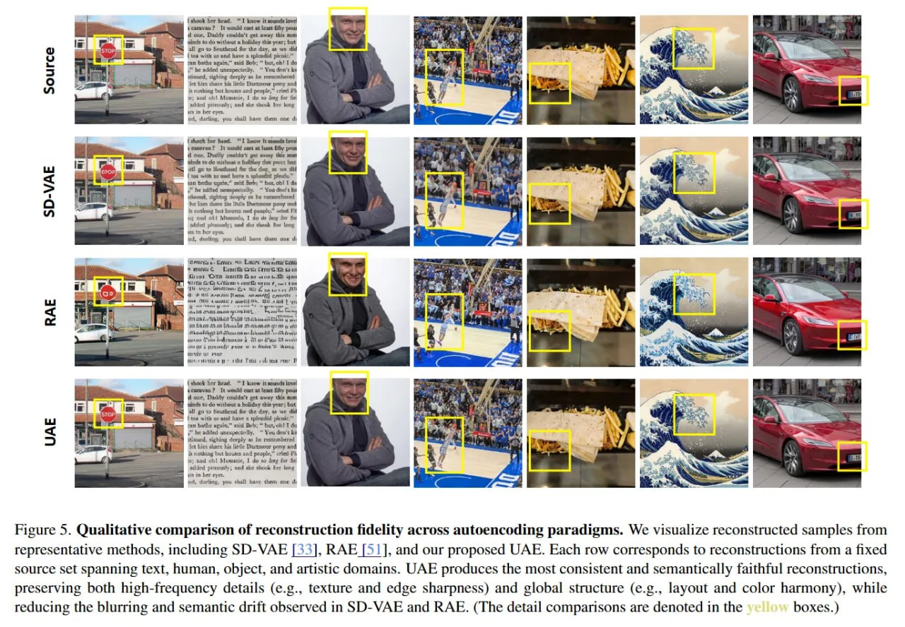
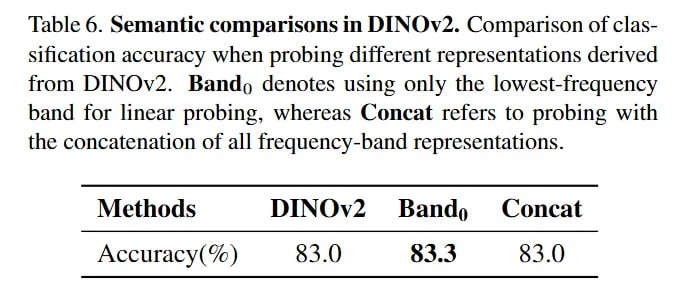
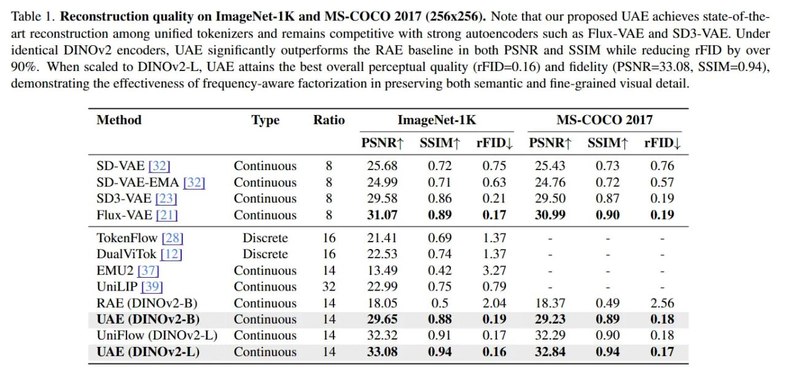

# Unified Autoencoding (UAE): Спектральная унификация семантики и пикселей

## Общее описание

Unified Autoencoding (UAE) - это новая архитектура генеративной модели, разработанная для решения фундаментального конфликта между семантическим пониманием и визуальной генерацией. В отличие от традиционных подходов, которые используют раздельные энкодеры для понимания (например, DINOv2) и генерации (например, VAE), UAE создает единое латентное пространство, которое одновременно обеспечивает высокую семантическую дискриминативность и точную реконструкцию пикселей.

## Контекст проблемы

В современной архитектуре глубокого обучения существует фундаментальное трение между задачами "смотреть" и "создавать". Семантические энкодеры, такие как DINOv2 или CLIP, отлично схватывают абстрактные концепты (например, идентифицируют "золотистого ретривера"), но безжалостно выбрасывают высокочастотные текстуры, необходимые для точной реконструкции. С другой стороны, пиксельные автоэнкодеры (типа VAE в Stable Diffusion) ставят во главу угла высокую точность восстановления картинки, но их латенты семантически непрозрачны.

Недавние попытки, такие как RAE и UniFlow, пытались навести мосты между этими подходами, но часто сталкивались с "перетягиванием каната": либо получаем размытые реконструкции, либо падает различающая способность.

## Гипотеза Призмы (The Prism Hypothesis)

Теоретический фундамент UAE - Гипотеза Призмы. Авторы определяют модальности естественных данных как проекции общего спектра, где главным дифференциатором выступает частота. Чтобы это формализовать, представим изображение I. Можно применить дискретное преобразование Фурье F и радиальную маску M_rho для изоляции частотных компонент:

I_rho_LP = F_inv(M_rho_LP * F(I))

Здесь F_inv - обратное FFT, а * - произведение Адамара. Эмпирический анализ распределения энергии показывает, что семантические энкодеры типа DINOv2 концентрируют почти всю свою энергию в самой низкой частотной полосе (k=0), захватывая глобальный лейаут и идентичность объекта. В то время как генеративные автоэнкодеры (SD-VAE) размазывают энергию по средним и высоким частотам, чтобы кодировать края и текстуры.

Гипотеза гласит, что для унификации нужно явно факторизовать латентное пространство на общую низкочастотную "семантическую базу" и модально-специфичные высокочастотные "остатки деталей".

 <!-- TODO: Broken image path -->

**Изображение показывает:** Концептуальная модель "призмы", раскладывающей визуальные данные на спектральные компоненты по частоте. Низкочастотные полосы захватывают глобальную семантику, а высокочастотные - локальные детали и текстуры. Это вдохновляет UAE на объединение семантических и пиксельных представлений в одном латентном пространстве.

## Архитектура UAE: частотное разделение

Архитектура Unified Autoencoding реализует Гипотезу Призмы через механизм Residual Split Flow. Проследим за трансформацией конкретного входа, например, фотографии дорожного знака. Картинка прогоняется через замороженный семантический энкодер (DINOv2) для получения сырой сетки латентов z. Вместо того чтобы обрабатывать эту сетку напрямую, UAE переводит z в частотную область с помощью FFT.

### Ключевая операция: Итеративное Разделение

Система раскладывает латент z на K различных частотных полос. Для нашего примера со знаком: первая итерация извлекает самую низкую частоту z_f^(0) через мягкую радиальную маску. Эта полоса захватывает прямоугольную форму знака и общий контекст. Остаточный сигнал r^(1) содержит оставшуюся высокочастотную информацию (четкий текст и текстуру ржавчины). Этот остаток затем обрабатывается следующей маской, извлекая следующую полосу, и так далее. 

Правило обновления остатка на шаге k:

r^(k+1) = r^k - P_k(r^k)

Важно, что эти полосы не просто сохраняются, они модулируются. Во время реконструкции полосы суммируются обратно после обучаемой модуляции, формируя q, который подается в пиксельный декодер на базе ViT. Разделяя сигнал, модель может сохранять "семантический макет" в базовой полосе, позволяя декодеру галлюцинировать или уточнять текстурные детали из высокочастотных полос, не портя семантическое ядро.

 <!-- TODO: Broken image path -->

**Изображение показывает:** Общая архитектура предложенного UAE. Входное изображение I отдельно кодируется как предобученным Семантическим энкодером (например, DINOv2), так и обучаемым Унифицированным энкодером. Последний инициализируется из семантического энкодера и оптимизируется под два взаимодополняющих объектива: семантический лосс, выравнивающий низкочастотные компоненты, декомпозированные из представлений семантического энкодера, и пиксельный лосс реконструкции, обеспечивающий визуальную достоверность через Пиксельный декодер за счет адаптивного расширения высокочастотных компонентов. Декодер использует спектральные трансформные блоки для уточнения остаточно-частотного содержимого и производства реконструированного изображения. Такая совместная оптимизация гармонизирует семантическую структуру и пиксельные детали в одном латентном пространстве.

## Инженерия стабильности: лосс и шум

### Семантический лосс

Чтобы разложение работало как задумано, процесс обучения использует специфические ограничения. Самое важное - Semantic-wise Loss, который давит на выравнивание *только* базовой частотной полосы. Пусть f_s - карта признаков замороженного учителя, а f_u - выход обучаемого энкодера. Лосс считается так:

L_sem = sum(||f_u^k - f_s^k||^2) / K_base

Устанавливая K_base=1, авторы заставляют самую низкую частотную полосу строго мимикрировать под DINOv2, гарантируя, что латентное пространство останется семантически дискриминативным. Более высокие полосы свободны от этого ограничения, что позволяет им оптимизироваться чисто под лосс реконструкции пикселей.

### Введение шума

Кроме того, чтобы декодер не слишком полагался на идеальную высокочастотную информацию (которая может быть шумной или отсутствовать в downstream задачах генерации), ввели модуль Noise Injection. Во время обучения бинарная маска случайно выбирает ВЧ-полосы и подмешивает туда гауссовский шум, заставляя декодер быть робастным и уметь восстанавливать детали из частичной спектральной информации.

## Результаты и сравнение

Эмпирические результаты мощно поддерживают идею спектрального разделения. На реконструкции ImageNet-1K (256x256) UAE достигает PSNR 29.65 и rFID 0.19. Это драматическое улучшение по сравнению с конкурентом RAE (PSNR 18.05, rFID 2.04), который пытается использовать семантические латенты без частотной факторизации. Качественно это хорошо заметно на визуализациях: там, где RAE и SD-VAE размывают текст или галлюцинируют текстуры на мелких объектах, UAE сохраняет структурную целостность (спасибо базовой полосе) и резкие края (спасибо остаточным полосам).

 <!-- TODO: Broken image path -->

**Изображение показывает:** Качественное сравнение UAE с другими методами. UAE обеспечивает лучшее качество реконструкции по сравнению с RAE и SD-VAE, сохраняя при этом семантическую целостность.

Истинный тест для "унифицированного" представления - сохраняет ли оно дискриминативную силу семантического учителя. Эксперименты с linear probing на ImageNet подтверждают это: UAE выдает 83.0% top-1 accuracy с бэкбоном ViT-B, сравниваясь с RAE и обгоняя более крупные модели вроде MAE (ViT-L, 75.8%). Абляции показывают, что одна только самая низкая частотная полоса (Band_0) дает 83.3% точности, подтверждая, что семантическая информация действительно сконцентрирована в нижнем спектре и успешно сохраняется стратегией маскирования.

 <!-- TODO: Broken image path -->

**Изображение показывает:** Сравнение UAE с DINOv2 и другими методами по семантической дискриминативности через linear probing на ImageNet.

 <!-- TODO: Broken image path -->

**Изображение показывает:** Квантовая оценка качества реконструкции UAE по сравнению с другими методами на ImageNet. UAE значительно превосходит RAE и другие методы по обоим метрикам.

 <!-- TODO: Broken image path -->

**Изображение показывает:** Результаты linear probing UAE по сравнению с другими подходами на ImageNet-1K, демонстрируя высокую семантическую дискриминативность модели.

## Ограничения подхода

Хотя Гипотеза Призмы элегантна, опора на FFT-сплит вносит специфический inductive bias, который может не идеально ложиться на всю визуальную семантику. Допущение "семантика = низкая частота" отлично работает для объектов и сцен, но может буксовать там, где семантика определяется высокочастотными паттернами - например, QR-коды или очень тонкая классификация видов, где текстура является определяющим семантическим признаком. 

Кроме того, итеративное разделение добавляет вычислительный оверхед по сравнению с простым нарезанием каналов, что может ударить по скорости инференса в чувствительных к задержкам приложениях. Работа фокусируется на разрешении 256x256; масштабирование этого спектрального подхода на мегапиксельные разрешения, где высокочастотные полосы становятся экспоненциально больше, остается инженерным вызовом.

## Значение и влияние

UAE представляет собой взросление в дизайне фундаментальных визуальных репрезентаций. Вместо того чтобы относиться к нейросетям как к black-box и надеяться, что скейлинг сам разрешит противоречивые цели, эта работа применяет первые принципы обработки сигналов для структурирования задачи обучения. Явно признавая и архитектурно учитывая спектральное несоответствие между пониманием и генерацией, UAE предлагает чертеж для следующего поколения "Omni-моделей" - систем, способных анализировать и генерировать мир через единую, целостную линзу. 

Для исследователей, строящих диффузионные трансформеры или мультимодальных агентов, эта частотно-ориентированная токенизация предлагает прагматичный путь к более высокой производительности без раздувания размеров модели.

## Связь с другими темами

- [[../../algorithms/specialized/diffusion_models/computer_vision/diffusion_pixel_space.md|Диффузионные модели в пиксельном пространстве]] - альтернативный подход к генерации напрямую в пиксельном пространстве
- [[../../algorithms/neural_networks/transformers/variational_autoencoders.md|Вариационные автоэнкодеры]] - традиционный подход к генерации через латентное пространство
- [[../../algorithms/specialized/diffusion_models/computer_vision/pixeldit_pixel_diffusion_transformers.md|PixelDiT]] - архитектура, работающая напрямую в пиксельном пространстве
- [[../../algorithms/specialized/diffusion_models/computer_vision/minimax_vtp_visual_tokenizer.md|VTP]] - развитие подходов к визуальному токенизатору

## Источники

1. [The Prism Hypothesis: Harmonizing Semantic and Pixel Representations via Unified Autoencoding](https://arxiv.org/abs/2512.19693) - основная научная статья о UAE и Гипотезе Призмы
2. [Representation Autoencoders](https://arxiv.org/abs/2510.11690) - предыдущая работа, связанная с унификацией представлений
3. [UniFlow: Unifying Representation Learning with Diffusion Models](https://arxiv.org/abs/2510.10575) - дополнительная связанная работа
4. [Masked Autoencoders Are Scalable Vision Learners](https://arxiv.org/abs/2111.06377) - для сравнения с MAE