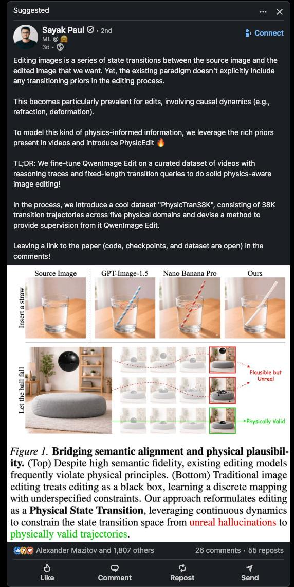

# Physics-Aware Image Editing: Редактирование изображений с учётом физических законов

```metadata
category: computer_vision
subcategory: image_editing
tags: physics_aware, image_editing, physicedit, diffusion_models, latent_transitions, physical_state_transition
```

## Обзор

**Physics-Aware Image Editing** (Физически-осознанное редактирование изображений) — это парадигма редактирования изображений, которая реформирует задачу из статического отображения в **предсказание физических переходов состояний**. Существующие модели редактирования достигают высокой семантической точности, но часто нарушают физические принципы, поскольку обучаются на дискретных отображениях изображений с недоопределёнными ограничениями.

Этот подход был представлен в работе **"From Statics to Dynamics: Physics-Aware Image Editing with Latent Transition Priors"** (Zhao et al., февраль 2026), которая предлагает фреймворк **PhysicEdit** для физически-корректного редактирования изображений.

## Проблема существующих подходов

Современные модели редактирования изображений на основе инструкций:
- Достигают выдающихся результатов в **семантическом выравнивании**
- Часто **нарушают физические принципы** при редактировании сцен со сложной причинно-следственной динамикой
- Рассматривают редактирование как **дискретное отображение** между парами изображений, что оставляет динамику перехода недоопределённой

### Примеры нарушений физических законов

**Классический пример**: Вставка соломинки в прозрачный стакан с водой:
- Существующие модели правильно идентифицируют объект ("соломинка") и местоположение ("в стакане воды")
- Но **не отображают оптическую рефракцию** — соломинка должна казаться преломлённой или смещённой на поверхности воды
- Вместо этого генерируется наивная прямая соломинка, нарушающая законы оптики

**Другие примеры**:
- Деформация материалов без учёта физических свойств
- Нарушение законов отражения света
- Неправильное взаимодействие объектов с жидкостями
- Термические процессы (таяние, плавление) без физической корректности

## Решение: PhysicEdit

### Основная идея

Редактирование переформулируется как **Physical State Transition** (Переход физического состояния):
- Исходное изображение представляет **начальное состояние S₀** сцены
- Инструкция редактирования задаёт **внешнее взаимодействие или триггер**
- Процесс редактирования — это **симуляция эволюции системы во времени** под действием физических законов Ω (гравитация, гидродинамика, оптика и т.д.)

### Архитектура PhysicEdit

PhysicEdit — это end-to-end фреймворк с механизмом **textual-visual dual-thinking** (текстово-визуальное двойное мышление):

#### 1. Физически-обоснованное рассуждение (Physically-Grounded Reasoning)
- Использует **замороженную MLLM Qwen2.5-VL-7B** для генерации структурированных физических ограничений
- Создаёт текстовый контекст с описанием:
  - Какие физические законы должны соблюдаться
  - Как изменение должно разворачиваться причинно-следственно
  - Как материалы должны вести себя в процессе перехода

#### 2. Implicit Visual Thinking (Неявное визуальное мышление)
- Вводит **обучаемые transition queries** (запросы переходов) для неявного восстановления приоров перехода в латентном пространстве
- **64 learnable transition queries** обрабатываются вместе с текстом и исходным изображением
- Во время обучения супервизируются псевдо-целевыми признаками из промежуточных ключевых кадров видео

#### 3. Timestep-Aware Dynamic Modulation (Пошаговая динамическая модуляция)
- Согласует руководство с coarse-to-fine генерацией диффузионной модели
- При **высоком шуме (t → 1)**: акцент на структурные признаки (DINOv2)
- При **низком шуме (t → 0)**: акцент на текстурные признаки (VAE)

### Процесс обучения

**Функция потерь**:
```
L = L_diff + α * L_tran
```
где:
- `L_diff` — стандартный flow-matching loss для диффузионного backbone
- `L_tran` — transition loss для дистилляции знаний из видео в transition queries
- `α = 1` во всех экспериментах

**Важно**: diffusion loss обновляет только диффузионный трансформер и feature extractors, а transition queries обновляются исключительно через transition loss — это обеспечивает **разъединённое градиентное обновление**.

## Dataset: PhysicTran38K

### Описание

**PhysicTran38K** — это крупномасштабный видео-датасет, специально созданный для обучения физически-осознанного редактирования:
- **38,000 переходных траекторий**
- **5 основных физических доменов**
- **16 промежуточных поддоменов**
- **46 различных типов переходов**

### Физические домены

1. **Mechanical** (Механические) — гравитация, столкновения, деформация
2. **Thermal** (Термические) — плавление, кипение, теплопередача
3. **Material** (Материальные) — упругость, пластичность, разрушение
4. **Optical** (Оптические) — рефракция, отражение, преломление света
5. **Biological** (Биологические) — рост, деформация тканей

### Конвейер создания датасета

#### 1. Иерархические физические категории
- Создание таксономии физических законов
- Подбор специализированных пулов объектов для каждого типа перехода

#### 2. Структурированная генерация видео
- Использование **Wan2.2-T2V-A14B** для генерации видео
- Промт-шаблон: `[Start State] + [Trigger Event] + [Transition Description] + [Final State]`
- **1,000 сырых видео на тип перехода**
- Ограничение на статичную камеру для минимизации изменений точки зрения

#### 3. Верификация и фильтрация
- **ViPE** (Vision Pose Estimation) как фильтр геометрической стабильности
- **Адаптивная стратегия** для переходов с большой деформацией
- **GPT-5-mini** для principle-driven верификации:
  - Предлагает N (обычно 3) принципов для каждого перехода
  - Классифицирует как `align`, `contradict`, или `unknown`
  - Сохраняет видео только если `S_verify = N_align / N_total ≥ 0.5`

#### 4. Constraint-Aware Reasoning Generation
- **Qwen2.5-VL-7B** для генерации инструкций и структурированного рассуждения
- Интеграция результатов верификации как логических ограничений
- Принципы `align` поощряются, `contradict`/`unknown` — явные негативные ограничения

## Результаты экспериментов

### Количественные метрики

PhysicEdit демонстрирует значительные улучшения по сравнению с базовыми моделями:

| Метрика | Улучшение vs Qwen-Image-Edit |
|---------|------------------------------|
| **Физический реализм** | **+5.9%** |
| **Knowledge-grounded редактирование** | **+10.1%** |

### Бенчмарки

Оценка проводилась на:
- **GeneVal** — оценка соответствия инструкциям
- **PicaBench-Superficial** — оценка физических аспектов (GPT-5)
- **KRIS** — оценка knowledge-grounded редактирования

### Категории оценки PicaBench

- **LP** (Light propagation) — распространение света
- **LSE** (Light Source Effects) — эффекты источников света
- **RFL** (Reflection) — отражение
- **RFR** (Refraction) — рефракция
- **DFM** (Deformation) — деформация
- **CSL** (Causality) — причинно-следственные связи
- **GST** (Global State Transition) — глобальные переходы состояния
- **LST** (Local State Transition) — локальные переходы состояния

### Сравнение с моделями

**Open-Source модели**:
- PhysicEdit устанавливает **новый SOTA** среди open-source методов
- Значительно превосходит Bagel и Bagel-Think

**Proprietary модели**:
- Конкурентоспособен с ведущими проприетарными моделями:
  - Nano Banana Pro
  - GPT-Image-1.5
  - Seedream 4.0

## Связь с другими темами

- [[diffusion_transformer.md]] — DiT архитектура, используемая в PhysicEdit
- [[diffusion_pixel_space.md]] — Диффузионные модели в пиксельном пространстве
- [[qwen_image_edit_2511.md]] — Qwen-Image-Edit, базовая модель для PhysicEdit
- [[editing_models_and_controlnet.md]] — Редактирующие модели и ControlNet
- [[generative_segmentation_as_editing.md]] — Парадигма генеративной сегментации как редактирования
- [[../algorithms/specialized/world_modeling/latent_action_models.md]] — Латентные модели действий, концептуально связанные с transition queries
- [[../../algorithms/neural_networks/transformers/latent_variables_reasoning.md]] — Латентные переменные для рассуждений

## Применение

- **Редактирование сцен с физическими взаимодействиями** — вставка объектов в жидкости, стекло
- **Материальная деформация** — реалистичное изгибание, сжатие, растяжение объектов
- **Оптические эффекты** — рефракция, отражение, преломление света
- **Термические процессы** — таяние, кипение, изменение агрегатного состояния
- **Биологические изменения** — рост растений, деформация тканей

## Ключевые инновации

1. **Переформулировка задачи**: от статического отображения к динамическому переходу состояния
2. **Видео-супервизия**: использование временных последовательностей для обучения приоров перехода
3. **Dual-thinking механизм**: разделение физического понимания на текстовое рассуждение и неявное визуальное представление
4. **Transition queries**: компактное латентное представление динамики перехода
5. **Timestep-aware modulation**: адаптивное руководство в процессе диффузионной генерации

## Ограничения и будущие направления

### Текущие ограничения
- Обучение требует видео-данных с промежуточными кадрами
- Inference работает только с одиночными изображениями (промежуточные состояния недоступны)
- Вычислительная сложность обучения transition queries

### Будущие направления
- Расширение физических доменов
- Интеграция с 3D-представлениями
- Улучшение моделирования сложных физических взаимодействий (жидкости, газы)
- Применение к видео-редактированию

## Источники

1. **Оригинальная статья**: "From Statics to Dynamics: Physics-Aware Image Editing with Latent Transition Priors"
   - Авторы: Liangbing Zhao, Le Zhuo, Sayak Paul, Hongsheng Li, Mohamed Elhoseiny
   - URL: https://arxiv.org/abs/2602.21778
   - Дата: Февраль 2026
   - Краткое описание: Представление PhysicEdit — фреймворка для физически-корректного редактирования изображений

2. **Проект PhysicEdit**:
   - URL: https://liangbingzhao.github.io/statics2dynamics/
   - Краткое описание: Официальная страница проекта с демонстрациями и ресурсами

3. **GitHub репозиторий**:
   - URL: https://github.com/liangbingzhao/PhysicEdit
   - Краткое описание: Исходный код, чекпоинты и датасет PhysicTran38K

4. **Профиль Sayak Paul**:
   - URL: https://sayak.dev/
   - Краткое описание: Информация об одном из авторов работы, исследователе Hugging Face

## Медиа



**Описание**: Визуализация концепции Physics-Aware Image Editing. Верхняя часть показывает, как существующие модели редактирования нарушают физические принципы despite высокую семантическую точность. Нижняя часть иллюстрирует подход PhysicEdit, который реформирует редактирование как Physical State Transition, используя непрерывную динамику для направления генерации от нереалистичных галлюцинаций к физически корректным траекториям.
