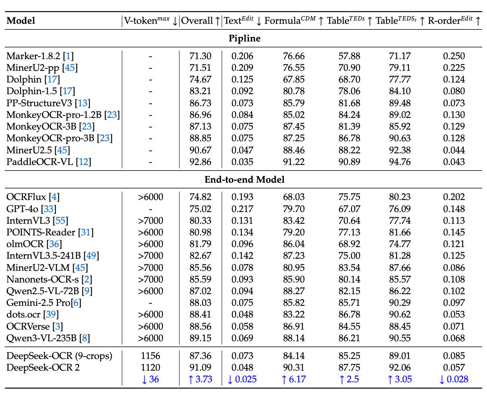

# DeepSeek OCR и DeepSeek-OCR 2

## Описание

DeepSeek OCR - новая модель оптического распознавания символов (OCR), которая показывает значительные преимущества в соотношении цена/качество по сравнению с существующими решениями. Модель разработана DeepSeek AI и представлена как решение для контекстной оптической компрессии. Модель является исследованием в области сжатия длинных контекстов через оптическое 2D-сопоставление.

### DeepSeek-OCR 2 (новое поколение)

DeepSeek представили **DeepSeek-OCR 2** - 3B модель для продвинутого понимания изображений, документов и OCR, которая выходит на уровень SOTA. Это новое поколение технологии, которое значительно улучшает способность модели к пониманию сложных структур.

**Ключевая новинка** - DeepEncoder V2. В отличие от классических vision LLM, которые «читают» картинку как сетку (слева-направо, сверху-вниз), **DeepEncoder V2** работает ближе к тому, как читает человек:

- Сначала формируется **глобальное понимание изображения**
- Затем модель определяет **логический порядок чтения** — что важно первым, что дальше

### Практические улучшения DeepSeek-OCR 2

- **Лучше работает со сложными макетами документов**
- **Корректно читает таблицы**
- **Связывает подписи и значения**
- **Понимает колонки и структурированный текст**
- **Надёжнее обрабатывает смесь текста и визуальной структуры**

### Качество и производительность

- Обходит **Gemini 3 Pro** на ряде бенчмарков
- Даёт **>4% прироста** по сравнению с прошлой версией DeepSeek-OCR
- Размер модели всего **3B параметров**, сохраняя высокую эффективность
- Теперь **можно удобно запускать и fine-tune** через Unsloth по готовому гайду

## Архитектура

DeepSeek-OCR архитектурно следует стандартной схеме для VLM: визуальный энкодер, подключенный к предобученной языковой модели (в данном случае DeepSeek-3B). Однако вместо стандартного CLIP/SigLIP в качестве энкодера используется пайплайн из SegmentAnything (SAM-ViT-Det), свёрточного адаптера и CLIP (CLIP-ViT), который в статье называют DeepEncoder.

### DeepEncoder (оригинальная версия)

DeepEncoder состоит из:
- **SegmentAnything (SAM-ViT-Det)**: Может принимать на вход изображение любого размера; токенизированные патчи обрабатываются независимо друг от друга благодаря window attention — поэтому количество вычислений уменьшается.
- **Свёрточный адаптер**: Снижает количество токенов в 16 раз
- **CLIP (CLIP-ViT)**: Глобальный аттеншн в CLIP-ViT агрегирует токены

Авторы хотели, чтобы энкодер был эффективным и быстрым, и чтобы в уже обученном энкодере можно было легко «на лету» менять количество визуальных токенов.

### DeepEncoder V2 (новая версия в DeepSeek-OCR 2)

В отличие от оригинального DeepEncoder, **DeepEncoder V2** реализует парадигму чтения, приближенную к человеческой:
- Формирует **глобальное понимание изображения** перед локальным анализом
- Определяет **иерархию важности элементов** для логического порядка обработки
- Позволяет лучше понимать **структурированные документы** с несколькими уровнями вложенности

### Идея с обучаемыми queries

Авторы вдохновлялись двумя работами:

1. **DETR (2020)** на тему детекции объектов. В ней картинку сначала прогоняют через ResNet и получают визуальные признаки, а затем делают кросс-аттеншн с набором object queries. Каждая query отвечает за потенциальный объект, и decoder-like-модель выдаёт предсказания по этим queries.

2. **BLIP-2** — captioning-модель, в которой используется Q-former с обучаемыми queries. Они делают кросс-аттеншн к визуальным токенам из CLIP и передают уже агрегированное представление в LLM. В результате вместо сотен визуальных токенов в LLM передаётся компактное представление через queries.

Подход DeepSeek-OCR 2 во многом похож на Q-former, но здесь число query соответствует числу визуальных токенов.

LLM применяют, потому что они уже хорошо показали себя в инициализации для мультимодальных задач.

### Режимы подачи изображений

Используются два режима подачи:
- **1024×1024 (256 токенов)** у всего изображения целиком
- **768×768 для локальных кропов**

Если документ небольшой, подают только целое изображение. Если документ большой, нарезают на локальные кропы и добавляют сжатое целое изображение.

## Поддержка динамического разрешения

DeepSeek-OCR поддерживает оба основных подхода к динамическому разрешению:
- **Tile-based-resolution**: изображение разрезается на квадраты (например 512×512 пикселей), и каждое прогоняется через визуальный энкодер
- **Native-resolution**: визуальный энкодер обучается принимать на вход изображение любого размера, используя подходящие для этого позиционные эмбеддинги типа RoPE

Во время обучения модель видит как большие, так и маленькие картинки в разных представлениях, что улучшает её универсальность.

## Технические характеристики

- Поддерживаемые разрешения: 
  - Tiny: 512×512 (64 визионных токена)
  - Small: 640×640 (100 визионных токенов)
  - Base: 1024×1024 (256 визионных токенов)
  - Large: 1280×1280 (400 визионных токенов)
  - Dynamic resolution (Gundam): n×640×640 + 1×1024×1024
- Производительность: ~2500 токенов/с (на A100-40G)
- Поддерживает режимы: документ-конверсия, изображение-OCR, свободный OCR, парсинг фигур
- Использует точность bfloat16 и процессоры n-gram логитов для предотвращения повторений
- Для надёжного чтения текста можно использовать примерно в 10 раз меньше визуальных токенов, чем необходимо текстовых токенов для представления текста на изображении

## Обучение модели

### DeepSeek-OCR v1: Двухэтапный процесс

Процесс обучения упрощён и включает только две стадии: тренировку энкодера и обучение модели целиком.

#### Этап 1: Обучение энкодера
Во время тренировки энкодера DeepEncoder обучается работать и в режиме native-resolution, и в режиме tile-based-resolution. Энкодер тренируется на парах картинок и текстовых описаний по схеме, описанной в статье Vary: к нему приделывается маленький текстовый декодер, и они вместе обучаются авторегрессионно.

#### Этап 2: Обучение всей VLM
Второй этап с обучением всей VLM повторяет обычный претрейн/SFT во множестве других VLM. Для обучения используется типичная смесь пар (картинка-описание) и только текстовых данных с упором на OCR: печатный текст, графики и таблицы, формулы. В отличие от других OCR-специализированных VLM (обычно обучаемых только на английском и китайском), датасеты содержат более 100 языков.

### DeepSeek-OCR 2: Трёхстадийный процесс обучения

Процесс обучения DeepSeek-OCR 2 состоит из **трёх стадий**:

#### 1. Encoder training
Обучают только энкодер, а декодер заморожен. Смысл стадии — научить токенизатор и LLM работать как энкодер: извлекать признаки, сжимать токены и собирать представление.

#### 2. Query enhancement
Обучают энкодер и декодер вместе. Происходит донастройка их совместной работы.

#### 3. Decoder specialization
Замораживают энкодер и финально доучивают только декодер.

### Данные для обучения

Авторы используют те же данные, что и для предыдущей версии. Чтобы модель не забывала общие визуальные представления, добавляют и обычную зрительную информацию, но распознавание текста преобладает. Распределение немного перебалансируют и делают небольшую доработку меток.

## Результаты

### DeepSeek-OCR v1

DeepSeek-OCR показывает отличное качество на OmniDocBench, опережая в зависимости от разрешения не только сильные опенсорсные бэйзлайны, вроде Qwen-2.5VL, но и Gemini2.5-Pro. При этом скорость обработки на GPU сопоставима с пайплайновыми OCR-пакетами.

Замеры точности распознавания в зависимости от размера изображения (и числа токенов) на OCR-бенчмарке Fox показывают, что для надёжного чтения текста можно использовать примерно в 10 раз меньше визуальных токенов, чем необходимо текстовых токенов для представления текста на изображении. При уменьшении этого соотношения качество чтения быстро падает.

Хотя результаты получились впечатляющими, в работе использовались только бенчмарки с фокусом на PDF-подобных картинках, а другие, более разнообразные OCR-бенчи для VLM (OCRBench_v2, CC-OCR) не замерялись. Также в статье нет аблейтов влияния на результаты ни выбранной архитектуры, ни этапов обучения, поэтому авторы сами называют свои результаты proof-of-concept.

### DeepSeek-OCR 2

Авторы замеряются на большом двуязычном (английский и китайский) бенчмарке **OmniDocBench v1.5**. Он содержит примерно 1400 документов разных категорий, включая журналы, академические статьи и отчёты.

В сравнении с бейзлайнами в новой версии:
- **Чуть меньше токенов** — модель дешевле
- **Общее качество выросло примерно на 4%**
- **Больше всего улучшились срезы по формулам и таблицам**
- **Уменьшилась метрика Edit Distance**, которая показывает, насколько распознанный текст отличается от эталона в документе

 <!-- TODO: Broken image path -->

**Изображение показывает:** Таблицу сравнения результатов различных OCR моделей, включая DeepSeek-OCR 2, который показывает 91.09% overall accuracy при использовании 1120 визуальных токенов, превосходя многие другие подходы, но уступая PaddleOCR-VL (92.86%).

Сравнение идёт с InternVL, Miner и другими OCR-специфичными подходами. По цифрам **PaddleOCR-VL всё ещё выглядит чуть лучше**.

В некоторых аспектах DeepSeek-OCR v2 есть куда расти — например, в задаче распознавания текста на газетах. Объясняют это тем, что на очень насыщенных текстом документах выбранные разрешения и степень сжатия могут мешать точному распознаванию, и для улучшения, возможно, нужно обучаться на большем количестве кропов.

В итоге авторам удалось получить решение, которое быстро, недорого и с хорошим качеством обрабатывает документы. Код и модель выложены в публичный доступ.

## Применение в проекте alphaXiv

Создатели проекта alphaXiv использовали DeepSeek OCR для обработки более 500 000 статей по ИИ. Основная цель - извлечение данных из таблиц и диаграмм для анализа самых популярных бенчмарков и датасетов.

### Результаты

- Обработка 500 000+ статей обошлась всего в $1000
- По сравнению с Mistral OCR, которая до этого считалась одной из лучших по соотношению цена/качество, процесс с ней обошелся бы в $7500
- Это демонстрирует значительное снижение затрат при использовании DeepSeek OCR

## Перспективы использования

### Конвертация PDF в Markdown

alphaXiv объявили о планах релиза датасета со статьями с arXiv, сразу переведенными из PDF в формат Markdown с помощью DeepSeek OCR. Это значительно упростит обработку и анализ научных публикаций.
Преобразование PDF в Markdown особенно мощное применение технологии, позволяющее автоматизировать обработку научных публикаций.

### Возможности использования

- Конвертация документов: `<image>\n<|grounding|>Convert the document to markdown.`
- OCR изображений: `<image>\n<|grounding|>OCR this image.`
- Свободный OCR: `<image>\nFree OCR.`
- Парсинг фигур: `<image>\nParse the figure.`
- Описание изображений: `<image>\nDescribe this image in detail.`
- Локализация объектов: `<image>\nLocate <|ref|>xxxx<|/ref|> in the image.`

### Демонстрационный проект

Проект по извлечению данных из статей в качестве демонстрации возможностей DeepSeek OCR является примером практического применения технологии для анализа научной литературы.

## Значение

DeepSeek OCR представляет собой прорыв в области обработки документов, особенно для академических и исследовательских целей, где требуется преобразование больших объемов PDF-документов в структурированные данные. Технология показывает, как современные визионные энкодеры могут быть эффективно интегрированы в языковые модели для решения задач оптического распознавания.

## Реализации

- [[deepseek_ocr_rs.md]] - Rust-реализация DeepSeek-OCR с высокой производительностью, CLI и HTTP-сервером, совместимым с OpenAI

## Связи с другими темами

- [[deepseek_ocr_training_process.md]] - Подробное описание процесса обучения DeepSeek-OCR
- [[specialized_vlm_models.md]] - Контекст других специализированных OCR-VLM моделей
- [[dynamic_resolution_approaches.md]] - Подробное описание подходов к динамическому разрешению, использованных в модели
- [[hunyuanocr.md]] - Компактная OCR-модель от Tencent с 1 миллиардом параметров, достигающая SOTA результатов, конкурент DeepSeek OCR по эффективности
- [[object_detection_yolo_ocr.md]] - Общие сведения об OCR и его применении в системах компьютерного зрения
- [[chandra_ocr.md]] - Современная OCR-модель от DataLab, конкурирующая с DeepSeek OCR по качеству и функциональности
- [[lightonocr.md]] - Альтернативная OCR-модель от LightOnAI, дистиллированная из Qwen2-VL-72B-Instruct, сравнимая по качеству, но быстрее и дешевле
- [[docling.md]] - Библиотека обработки документов от IBM с похожими возможностями по преобразованию документов
- [[multimodal/ibm_granite_docling_258m.md]] - Мультимодельная модель IBM для преобразования документов, альтернативное решение для обработки документов
- [[qianfan_ocr.md]] — End-to-end модель от Baidu с 4B параметров и механизмом Layout-as-Thought, прямой конкурент DeepSeek-OCR на OmniDocBench

## Источники

1. [DeepSeek-OCR: Contexts Optical Compression](https://arxiv.org/abs/2510.18234) - Основная научская статья, описывающая архитектуру и возможности DeepSeek-OCR
2. [CV Time: DeepSeek-OCR разбор статьи](https://towardsai.net/p/machine-learning/deepseek-ocr-contexts-optical-compression-paper-review) - Детальный разбор статьи о DeepSeek-OCR
3. [Unsloth Guide for DeepSeek-OCR 2](https://unsloth.ai/docs/models/deepseek-ocr-2) - Гайд по запуску и fine-tune DeepSeek-OCR 2 через Unsloth
4. [DeepSeek-OCR 2 на HuggingFace](https://huggingface.co/deepseek-ai/DeepSeek-OCR-2) - Модель DeepSeek-OCR 2 на HuggingFace
5. [Github репозиторий DeepSeek-OCR 2](https://github.com/deepseek-ai/DeepSeek-OCR-2/tree/main) - Исходный код и документация DeepSeek-OCR 2
6. [Статья о DeepSeek-OCR 2 (PDF)](https://github.com/deepseek-ai/DeepSeek-OCR-2/blob/main/DeepSeek_OCR2_paper.pdf) - Научная статья о DeepSeek-OCR 2