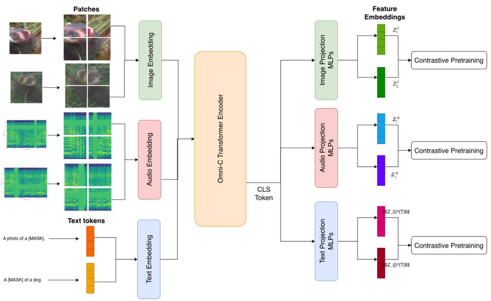
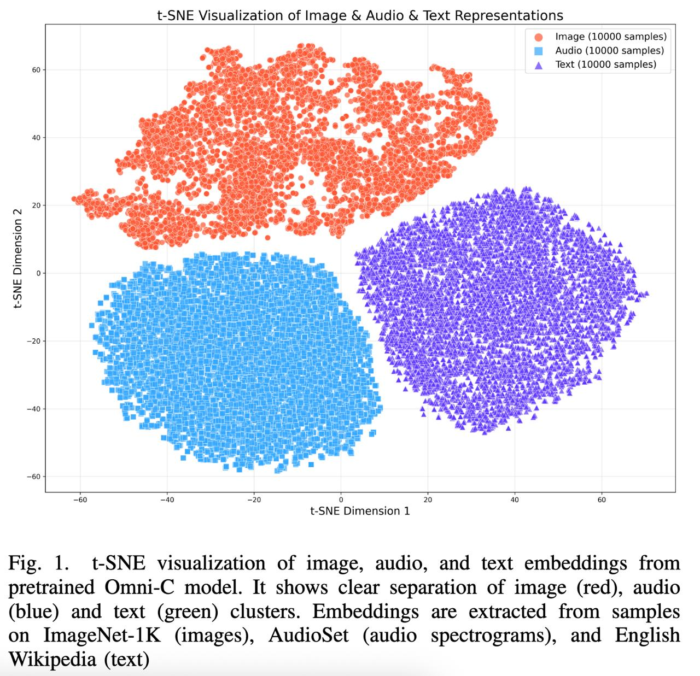
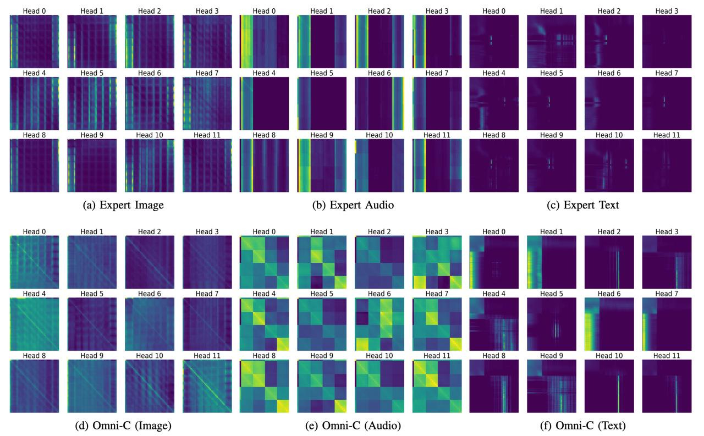

# Omni-C: Единый плотный энкодер для мультимодальных данных

## Краткое описание

**Omni-C (Omni-Compress)** — архитектура единого плотного Transformer-энкодера для обработки гетерогенных модальностей (изображения, аудио, текст) без использования MoE (Mixture of Experts) или раздельных экспертных энкодеров. Модель достигает сопоставимой производительности с экспертными моделями при ~3x экономии памяти на инференсе.

**Ключевая идея:** Один плотный ViT-B/32 для всех модальностей + модально-специфичные проекционные головы для контрастивного обучения на невыровненных данных.

---

## Мотивация

### Проблема современных мультимодальных систем

Современные мультимодальные модели используют отдельные экспертные энкодеры для каждой модальности, что приводит к:

- **Линейному росту параметров** при добавлении новой модальности
- **Сложности инференса**: необходимость загрузки нескольких моделей в память
- **Необходимости выровненных парных данных** для обучения

### Альтернатива: MoE-модели

MoE-архитектуры (Uni-MoE, Qwen3-Omni, Ming-Omni) добавляют маршрутизацию и специализированных экспертов, но:

- Увеличивают общее число параметров
- Вводят накладные расходы на маршрутизацию
- Требуют больше памяти при инференсе из-за разреженной активации экспертов

### Исследовательский вопрос

> Может ли единый унифицированный энкодер, обученный совместно на аудио, визуальных и текстовых модальностях, достичь конкурентоспособной производительности без явных механизмов маршрутизации?

---

## Архитектура Omni-C

### Бэкбон

- **ViT-B/32** (12 слоёв, 768 dim, 12 attention heads)
- Максимальное разделение параметров между модальностями
- Обрабатывает все модальности через единый механизм self-attention

### Входные проекции (Patch Embeddings)

| Модальность | Формат входа | Проекция |
|-------------|--------------|----------|
| **Изображения** | RGB I ∈ R^(3×H×W) | 2D conv с патчем 32×32 |
| **Аудио** | Log-mel спектрограммы S ∈ R^(1×H'×W') | 2D conv с патчем 32×32 |
| **Текст** | Токены BERT T ∈ R^L | Линейная проекция в dim=768 |

*Рис. 3: Архитектура Omni-C. Изображения и аудио спектрограммы разделяются на неперекрывающиеся патчи и проецируются через отдельные 2D свёрточные слои, текстовые последовательности токенизируются и проецируются линейным слоем. Общий learnable [CLS] токен добавляется к последовательности эмбеддингов, и вся последовательность обрабатывается единым Transformer бэкбоном.*

### Позиционный энкодинг

- **2D синусоидальный** для изображений и аудио патчей
- **1D синусоидальный** для текстовых токенов
- Learnable **[CLS] токен** добавляется к началу каждой последовательности

### Проекционные головы

**Ключевой компонент архитектуры:**

- 3 отдельных легких MLP (по одному на модальность)
- Каждый MLP: 2 слоя (линейный → ReLU → линейный)
- Проецируют [CLS]-токен из бэкбона в пространство для контрастивной цели
- **Предотвращают конфликт модальностей** в общем embedding-пространстве

---

## Обучение: контрастивный SSL на невыровненных данных

### Датасеты

| Модальность | Датасет | Размер |
|-------------|---------|--------|
| Изображения | ImageNet-1K | ~1.28M train / 50K val |
| Аудио | AudioSet | ~2M 10-сек клипов (632 класса) |
| Текст | English Wikipedia | Миллиарды токенов |

**Балансировка:** AudioSet и Wikipedia subsampled до ~1.28M сэмплов для соответствия ImageNet-1K.

### Стратегия обучения

**Modality-separated minibatch:**

1. В каждом батче — сэмплы **только одной модальности**
2. Генерируются два случайно аугментированных view для каждого сэмпла
3. Оба view проходят через общий бэкбон
4. [CLS]-токен пропускается через модально-специфичный MLP
5. Вычисляется **контрастивный loss** (InfoNCE-style):
   - Сближает представления двух view одного сэмпла
   - Отталкивает представления разных сэмплов в батче

### Почему это работает

- **Раздельные проекционные головы** + modality-separated батчи → стабильное обучение
- Модальности формируют **отдельные кластеры на гиперсфере** (t-SNE, Fig. 1)
- Внутри каждой модальности сохраняется дискриминативность (высокое сходство positive пар, низкое — negative)

*Рис. 1: t-SNE визуализация эмбеддингов из предобученной Omni-C модели. Показывает чёткое разделение кластеров изображений (красный), аудио (синий) и текста (зелёный). Эмбеддинги извлечены из сэмплов ImageNet-1K (изображения), AudioSet (аудио спектрограммы) и English Wikipedia (текст).*

---

## Почему zero-shot проседает?

### Разница в паттернах внимания

| Характеристика | Экспертные модели | Omni-C |
|----------------|-------------------|---------|
| **Внимание** | Сфокусированное (узкие области) | Распределённое ("размазано" по патчам) |
| **Специализация** | Модально-специфичные детали | Глобальные, обобщённые представления |
| **Преимущество** | Острые модальные признаки | Быстрое извлечение global gist |

*Рис. 2: Визуализация attention heads для экспертных моделей (a, b, c) и Omni-C (d, e, f). Экспертные модели демонстрируют сфокусированное внимание на специфичных областях, в то время как Omni-C показывает распределённое внимание по всем патчам.*

**Расплата за универсальность:** Omni-C теряет острые модально-специфичные детали, что приводит к просадке в zero-shot (особенно на тексте и аудио).

### Восстановление производительности

Просадка отыгрывается лёгким файнтюном:

- **Linear probing** — обучается линейный слой поверх замороженного Omni-C
- **PEFT (LoRA/SBoRA)** — параметр-эффективный файнтюнинг
- После дообучения производительность сопоставима с экспертными моделями

---

## Кросс-модальное выравнивание

### Методология

Поверх **замороженного Omni-C** обучаются легкие линейные слои для выравнивания:

- **Image→Text:** Conceptual Captions 3M (CC3M)
- **Audio→Text:** AudioCaps (~50K пар)

**Loss:** CLIP-style symmetric InfoNCE loss — сближает positive cross-modal пары, отталкивает negative в батче.

### Результаты zero-shot classification после alignment

| Задача | Omni-C | Expert baseline | Дельта |
|--------|--------|-----------------|--------|
| **Image→Text** | 13.79% | 12.17% | **+1.62%** |
| **Audio→Text** | 4.51% | 4.34% | **+0.17%** |

**Вывод:** Единая модель не только не уступает, но и **превосходит** связку из двух экспертов в zero-shot кросс-модальных задачах после легкого alignment.

---

## Сравнение с альтернативами

### Omni-C vs Multi-Encoder Baselines

| Характеристика | Multi-Encoder | Omni-C |
|----------------|---------------|---------|
| Число моделей | 3 (image, audio, text) | 1 |
| Память на инференсе | ~3x | **1x** |
| Сложность системы | Высокая | Низкая |
| Производительность | Базовая | Сопоставимая/лучше |

### Omni-C vs MoE-модели

| Характеристика | MoE (Uni-MoE, Qwen3-Omni) | Omni-C |
|----------------|---------------------------|---------|
| Архитектура | Разреженная (sparse experts) | **Плотная (dense)** |
| Маршрутизация | Требуется router | **Не требуется** |
| Накладные расходы | Routing overhead | **Нет** |
| Память при инференсе | Выше (sparse activation) | **Ниже** |
| Обучение | Сложнее (expert balancing) | **Проще** |

---

## Ключевые результаты

### Вклад Omni-C

1. **Единый плотный энкодер** для мультимодальностей без MoE и параллельной загрузки экспертов
2. **Lossy universal compressor** — производит робастные глобальные представления, восстанавливаемые через PEFT (SBoRA)
3. **Эффективное cross-modal выравнивание** через linear-probe подход (вдохновлён SAIL)
4. **Решение межмодальных конфликтов** через модально-специфичные проекционные головы

### Итоговые преимущества

- ✅ **x3 экономия памяти** на инференсе по сравнению с multi-encoder baseline
- ✅ Сопоставимая производительность на unimodal и cross-modal задачах
- ✅ Упрощённая архитектура без routing и expert balancing
- ✅ Возможность использования на memory-constrained устройствах

---

## Технические детали реализации

### Конфигурация модели (ViT-B/32)

- **Layers:** 12
- **Attention heads:** 12
- **Embedding dim:** 768
- **Patch size:** 32×32
- **Image resolution:** 224×224
- **Audio spectrogram:** 256×128 (time×freq)
- **Text sequence length:** 256 токенов

### Обучение

- **Optimizer:** Adam
- **Batch strategy:** modality-separated minibatch
- **Contrastive loss:** InfoNCE-style с двумя augmented views
- **Projection heads:** 2-layer MLP (linear → ReLU → linear)

---

## Связи с другими темами

- [[multimodal_models.md]] — обзор мультимодальных моделей (CLIP, SigLIP, ALIGN, MoE-архитектуры); Omni-C предлагает альтернативу без раздельных энкодеров
- [[../../algorithms/neural_networks/transformers/mixture_of_experts.md]] — MoE архитектуры для масштабирования; Omni-C демонстрирует, что плотный Transformer может конкурировать без маршрутизации
- [[../../vision_transformers/self_supervised_learning.md]] — self-supervised обучение в ViT (DINO, MAE, SimCLR); Omni-C использует контрастивный SSL в мультимодальном контексте
- [[../../algorithms/neural_networks/transformers/vision_transformer.md]] — основы ViT архитектуры, используемой Omni-C как бэкбон
- [[siglip_visual_encoder.md]] — визуальные энкодеры в мультимодальных моделях; Omni-C заменяет раздельные энкодеры единым
- [[vl_jepa_model.md]] — альтернативный подход к мультимодальному обучению через предсказание эмбеддингов; Omni-C использует контрастивное выравнивание

---

## Источники

1. **Omni-C Paper**: "Omni-C: Compressing Heterogeneous Modalities into a Single Dense Encoder" — Kin Wai Lau et al. (2026)
   - URL: https://arxiv.org/abs/2603.05528v1
   - Краткое описание: Оригинальная статья о Omni-C — едином плотном энкодере для изображений, аудио и текста

2. **GitHub Repository**: Omni-C Official Code
   - URL: https://github.com/StevenLauHKHK/Omni-C
   - Краткое описание: Официальная реализация модели и предобученные веса

3. **SAIL Paper**: "Assessing and Learning Alignment of Unimodal Vision and Language Models" — Li et al. (2025)
   - URL: https://arxiv.org/abs/2512.13564
   - Краткое описание: Метод линейного выравнивания замороженных энкодеров, использованный в Omni-C для cross-modal alignment

4. **Omnivore Paper**: "Omnivore: A Single Model for Many Visual Modalities" — Girdhar et al. (2022)
   - URL: https://arxiv.org/abs/2202.05262
   - Краткое описание: Единая модель для визуальных модальностей; Omni-C расширяет подход на гетерогенные модальности с SSL

---

## См. также

- [[ming.md]] — мультимодальная модель с Sparse MoE для текста, изображений, видео, аудио
- [[seedream_v4_5.md]] — модель генерации изображений с мультимодальным контролем
- [[x_fusion.md]] — добавление визуальной генерации в замороженные LLM через двухбашенную архитектуру
