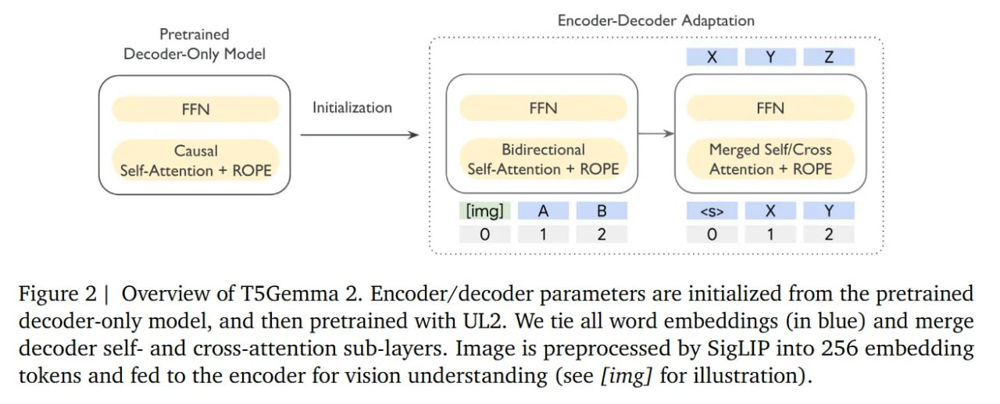

# SigLIP (Sigmoidal Large Image Pre-training)

## Описание

SigLIP (Sigmoidal Large Image Pre-training) - это архитектура визуально-языковой модели (vision-language model), разработанная для эффективного обучения взаимосвязям между изображениями и текстом. Это альтернативная архитектура для моделей типа CLIP (Contrastive Language-Image Pre-training), которая использует сигмоидальную функцию для парного контрастного обучения вместо softmax функции, применяемой в CLIP.

## Архитектура

### Общая архитектура
- **Отдельные энкодеры**: Используются отдельные энкодеры для изображений и текста
- **Изображение-энкодер**: Обычно основан на Vision Transformer (ViT) или ResNet архитектуре
- **Текст-энкодер**: Обычно основан на Transformer архитектуре
- **Общее пространство представлений**: Оба энкодера обучены генерировать представления в общем пространстве, где схожие изображения и тексты близки друг к другу

### Особенности архитектуры SigLIP
- **Сигмоидальная функция**: Использует сигмоид-базированную контрастную функцию потерь вместо softmax функции, применяемой в CLIP
- **Парное обучение**: В отличие от CLIP, который использует softmax для контрастного обучения, SigLIP сравнивает каждую пару изображение-текст индивидуально
- **Улучшенная стабильность**: Более численно стабильная функция обучения по сравнению с softmax в CLIP

## Обучение

### Контрастное обучение
- Использует контрастное обучение для обучения взаимосвязей между изображениями и текстами
- В отличие от CLIP, использует сигмоид-базированную функцию потерь
- Позволяет модели изучать ассоциации между визуальным и текстовым содержимым

### Преимущества обучения
- **Численная стабильность**: Сигмоид-функция более стабильна численно по сравнению с softmax
- **Масштабируемость**: Может быть более эффективным при обучении на больших датасетах
- **Качество изображений**: Показывает улучшенные результаты в задачах сопоставления изображений и текста

## Применение в T5Gemma 2

### Роль в мультимодальной архитектуре
- В T5Gemma 2 используется как визуальный энкодер на 400M параметров
- Преобразует изображения в 256 токенов-эмбеддингов
- Визуальный энкодер заморожен во время UL2 адаптации
- Позволяет модели эффективно обрабатывать как текстовые, так и визуальные входы

### Интеграция
- Визуальные эмбеддинги из SigLIP вводятся в энкодер T5Gemma 2
- После визуального энкодирования, представления обрабатываются стандартными механизмами трансформера
- Позволяет модели понимать визуальный контекст и генерировать соответствующий текстовый вывод

## Сравнение с другими моделями

### В отличие от CLIP:
- Использует сигмоид-функцию вместо softmax для контрастного обучения
- Более численно стабильный процесс обучения
- Потенциально лучшие результаты на определенных задачах сопоставления изображений и текста

### В отличие от ALIGN:
- Использует другой подход к контрастному обучению
- Различная функция потерь и архитектура

## Преимущества

1. **Численная стабильность**: Более стабильный процесс обучения по сравнению с CLIP
2. **Эффективность**: Лучшая масштабируемость при обучении на больших датасетах
3. **Качество**: Повышенное качество в задачах сопоставления изображений и текста
4. **Применимость**: Подходит для включения в мультимодальные архитектуры, такие как T5Gemma 2

## Применение

- Визуальные языковые задачи (VQA - Visual Question Answering)
- Сопоставление изображений и текста
- Генерация описаний изображений
- Поиск изображений по текстовому описанию
- Извлечение информации из мультимодальных данных
- Компонент в мультимодальных LLM (как в T5Gemma 2)
- **Генеративные задачи**: Совместим с адаптацией через FAE (Feature Auto-Encoder) для использования в генеративных моделях

 <!-- TODO: Broken image path -->

**На изображении показано, как SigLIP используется в T5Gemma 2 для предварительной обработки изображений в 256 токенов эмбеддингов, подаваемых в энкодер для визуального понимания.**

## Связи с другими темами

- [[t5gemma_2.md]] - Использование SigLIP в мультимодальной архитектуре T5Gemma 2
- [[encoder_decoder_vs_decoder_only.md]] - Мультимодальная поддержка в энкодер-декодер архитектурах
- [[../algorithms/specialized/computer_vision/feature_adaptation/feature_auto_encoder_fae.md]] - FAE фреймворк для адаптации SigLIP и других визуальных энкодеров к генеративным задачам
- [[multimodal_models.md]] - Общее описание мультимодальных моделей
- [[vision_transformer.md]] - Архитектура, на основе которой часто строятся визуальные энкодеры в SigLIP
- [[t5gemma_2_news_2025.md]] - Новостной обзор использования SigLIP в T5Gemma 2

## Источники

1. [Sigmoidal Large Image Pre-training (SigLIP)](https://arxiv.org/abs/2303.15343) - Оригинальная статья, описывающая SigLIP
2. [Google Research: SigLIP Documentation](https://ai.googleblog.com/2023/05/siglip-scalable-vision-language-model.html) - Официальное описание от Google
3. [Hugging Face Documentation: SigLIP](https://huggingface.co/docs/transformers/model_doc/siglip) - Документация для имплементации
4. [T5Gemma 2: Seeing, Reading, and Understanding Longer](https://arxiv.org/abs/2512.14856) - Использование SigLIP в контексте T5Gemma 2