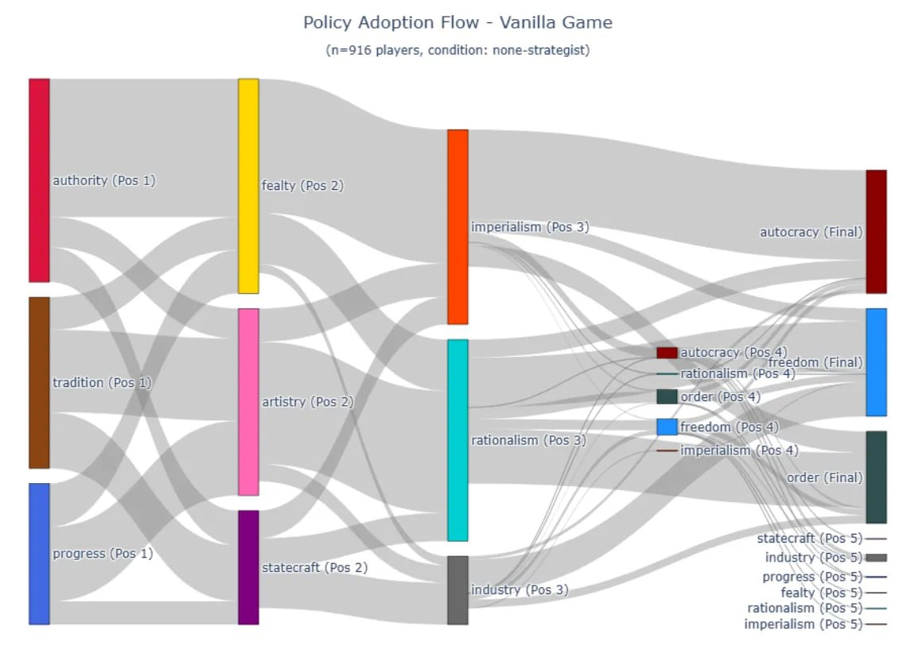
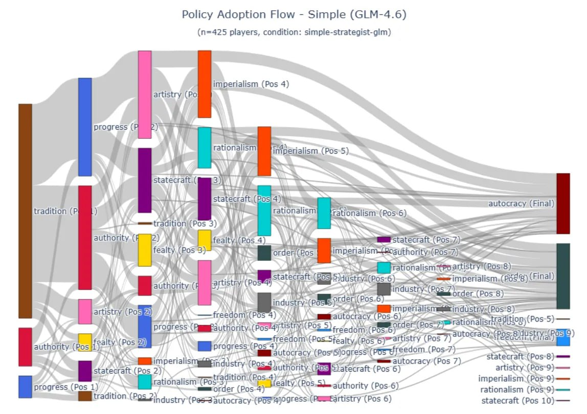

# Vox Deorum: Гибридная LLM-архитектура для 4X-стратегий

## Краткое описание

**Vox Deorum** — гибридная архитектура "LLM+X" для игры *Sid Meier's Civilization V*, которая заменяет высокоуровневый стратегический модуль алгоритмического ИИ на LLM и делегирует тактическое микро-исполнение традиционным алгоритмам на основе поиска. Система успешно отыгрывает полные партии по 400 ходов с выживаемостью ~97.5% и винрейтом, статистически не уступающим оптимизированным алгоритмическим бейзлайнам.

**Источник**: Chen J., Cheng S., Gurkan C., Lay R., Salahuddin M. "Vox Deorum: A Hybrid LLM Architecture for 4X / Grand Strategy Game AI - Lessons from Civilization V" [[arxiv:2512.18564](https://arxiv.org/abs/2512.18564)]

---

## Основная информация

### Архитектура

```
Game Engine → Named Pipe → REST API → MCP Server → Markdown State → LLM → Structured API Call → VPAI → Tactical Execution
```

**Ключевые компоненты**:

| Компонент | Описание |
|-----------|----------|
| **Game Engine** | Civilization V с модом Vox Populi |
| **Named Pipe** | Межпроцессное взаимодействие (IPC) |
| **REST API** | Экспонирует внутренние механизмы игры |
| **MCP Server** | Model Context Protocol — переводит состояние игры в Markdown |
| **LLM Strategist** | GPT-OSS-120B или GLM-4.6 для макро-стратегии |
| **VPAI** | Vox Populi Algorithmic AI — тактическое исполнение |

### Механизм работы

1. **Кодирование состояния**: Игра экспонирует состояние через Named Pipe в REST API, MCP-сервер переводит в структурированный Markdown-документ с секциями:
   - Victory Progress (прогресс победы)
   - Strategic Options (стратегические опции)
   - Player Summaries (сводка игроков)
   - City Summaries (сводка городов)
   - Military Summaries (военная сводка)
   - Events (события с последнего хода)

2. **Принятие решений**: LLM получает Markdown и генерирует структурированный API-вызов с макро-директивами:
   - Экономическая стратегия (например, `EarlyExpansion`, `LosingMoney`)
   - Военная стратегия (например, `WinningWars`, `EmpireDefenseCritical`)
   - Дипломатический персонаж
   - Приоритеты исследований и политик

3. **Тактическое исполнение**: Директивы LLM преобразуются в **весовые модификаторы (flavors)** для оценочной функции VPAI:
   
   $$f(s) = w^T\phi(s)$$
   
   где директива `WinningWars` повышает веса параметров наступления и превосходства в воздухе, заставляя тактический алгоритм приоритезировать вражеские вторжения.

4. **Исполнение**: VPAI математически вычисляет точные действия (перемещение юнитов, производство, бой) на основе модифицированных весов.

### Ключевые инновации

- **Иерархическое делегирование**: LLM действует как "совет директоров", выдавая семантические директивы, а не координаты гексов
- **Директивы как модификаторы**: Атомарная единица вмешательства — не дискретное действие, а весовой модификатор в эвристическом дереве поиска
- **Асинхронность**: LLM активируется после завершения хода игрока, минимизируя задержку для человека

---

## Результаты экспериментов

### Масштаб исследования

- **2,327 полных игр** по 400 ходов
- **4 игрока** на карте Communitas_79a (tiny size)
- **43 цивилизации** случайно распределялись между игроками
- Все типы победы включены: Domination, Cultural, Diplomatic, Science, Time

### Производительность

| Метрика | GPT-OSS-120B | GLM-4.6 | VPAI (бейзлайн) |
|---------|--------------|---------|-----------------|
| **Выживаемость** | ~97.5% | ~97.5% | ~97.5% |
| **Винрейт** | статистически равен | статистически равен | базовое значение |
| **Соотношение очков** | сопоставимо | сопоставимо | базовое значение |
| **Стоимость за игру** | ~$0.86 | ~$0.86 | — |
| **Время на ход** | ~14.8 сек | ~14.8 сек | <1 сек |

### Использование токенов

| Тип токенов | Паттерн роста | Значение |
|-------------|---------------|----------|
| **Входные токены** | O(t²) — от линейного к квадратичному | ~52,000 токенов/ход (средний) |
| **Выходные токены** | O(1) — плоский | ~1,400 токенов/ход |

**Инференс**: средний ход с префиллом ~52,000 токенов и генерацией ~1,400 токенов выполняется за ~14.8 секунд, что укладывается в стандартные лимиты таймера мультиплеера.

### Стратегические профили

| Модель | Стиль игры | Особенности |
|--------|------------|-------------|
| **GPT-OSS-120B** | Гиперагрессивный | +31.5% на победу через Domination (p < 0.001), в ущерб науке и дипломатии |
| **GLM-4.6** | Сбалансированный | Сфокусирован на культуре, меньше стратегических пивотов |
| **VPAI** | Алгоритмический | 51.6 смен стратегии за 100 ходов |

**Стратегическая когерентность**:
- GLM-4.6: 13.9 пивотов за 100 ходов
- VPAI: 51.6 пивотов за 100 ходов

---

## Сравнение с другими подходами

### Pure Reinforcement Learning

**Преимущества RL**:
- Сверхчеловеческий APM в StarCraft II, Dota 2, Go
- Быстрый инференс после обучения
- Прямая оптимизация на винрейт

**Недостатки RL в 4X**:
- Переобучение на узкие наборы правил
- Reward hacking (например, массовое производство дешёвых юнитов)
- Проблемы с назначением награды на длинных горизонтах
- Сложность трансфера на новые правила/карты

### Pure LLM (end-to-end)

**Преимущества**:
- Рассуждение на естественном языке
- Многошаговое планирование
- Адаптивность к новым ситуациям

**Недостатки**:
- Галлюцинации при тактическом исполнении
- Прогрессивный расход токенов (десятки юнитов × города)
- Нестабильный мультиагентный контроль
- Задержки на каждое микро-действие

### CivRealm (FreeCiv)

**Подход**: Чистый LLM или RL на ремейке Civilization II

**Результаты**:
- RL: разумная производительность в мини-играх
- LLM: лучше высокоуровневое поведение, но провалы в экономике и обороне
- **Оба подхода не выживают в полной игре** [[arxiv:2401.10568](https://arxiv.org/abs/2401.10568)]

### LLM-PySC2 (StarCraft II)

**Подход**: LLM диктует мультиагентный контроль юнитов текстом

**Результаты**:
- Галлюцинированный таргетинг
- Невалидные действия
- Коллапс под задержками инференса
- 0% винрейт на уровне 3+ в стандартном контроле [[arxiv:2411.05348](https://arxiv.org/abs/2411.05348)]

### Vox Deorum (текущая работа)

**Преимущества**:
- Выживаемость ~97.5% в полных играх
- Винрейт на уровне оптимизированного VPAI
- Стоимость ~$0.86 за игру
- Задержка ~14.8 сек/ход (в пределах мультиплеерных лимитов)
- Различные стратегические профили у разных LLM

---

## Ограничения и слепые зоны

### 1. Пространственная слепота

**Проблема**: LLM воспринимает карту через сжатые текстовые зоны и координаты, не может нативно "видеть" геометрию.

**Последствия**:
- Не распознаёт географические чокпойнты, горные перевалы, морские блокады
- Иррациональные "странные войны" (phony wars) — выделение ресурсов для борьбы с далёкими цивилизациями за непреодолимыми океанами

### 2. Квадратичный рост контекста

**Проблема**: Использование входных токенов растёт как O(t²) с прогрессом игры.

**Причины**:
- Расширение тумана войны
- Рост числа городов и юнитов
- Увеличение дипломатических опций

**Решения**:
- RAG (Retrieval-Augmented Generation)
- Мультимодальные визуальные входы
- Агрессивное прунинг-сжатие состояния

### 3. Стратегическое упрямство

**Проблема**: LLM иногда отказывается бросать проигрышную стратегию.

**Наблюдение**: GLM-4.6 пивотилась в 3.7 раза реже VPAI (13.9 vs 51.6 за 100 ходов), что указывает на лучшую приверженность, но иногда — на неспособность вовремя сменить курс.

---

## Инженерные детали

### Реализация

| Компонент | Технологии |
|-----------|------------|
| **civ5-dll** | C++ (GPL 3.0) |
| **bridge-service** | TypeScript, REST API |
| **mcp-server** | TypeScript, Model Context Protocol |
| **vox-agents** | TypeScript, LLM integration |
| **civ5-mod** | Lua scripts |

**Репозиторий**: [github.com/CIVITAS-John/vox-deorum](https://github.com/CIVITAS-John/vox-deorum)

### Лицензии

- **civ5-dll**: GPL 3.0 (следуя upstream)
- **Остальные модули**: CC BY-NC-SA 4.0

### Требования для запуска

- Windows 10/11
- Civilization V с обоими DLC
- API-ключ от LLM-провайдера
- Node.js ≥20, Python 3.x, Visual Studio Build Tools (для сборки)

---

## Связи с другими темами

### В рамках базы знаний

- [[../../ai/llm/llm_agents.md]] - LLM-агенты: общие принципы и архитектуры
- [[../../ai/imitation_learning/behavioral_cloning.md]] - Поведенческое клонирование: альтернативный подход к игровому ИИ
- [[../../algorithms/classical_ml/reinforcement_learning/index.md]] - Обучение с подкреплением: контрастный подход
- [[../../applications/agents/sima_2_embodied_agent.md]] - SIMA 2: мультимодальный агент для игр
- [[../../applications/gaming_ai/track_embedding_representations.md]] - Представление игрового состояния: эмбеддинги трасс vs Markdown-сводки

### Внешние связи

- **Vox Populi Mod**: [github.com/LoneGazebo/Community-Patch-DLL](https://github.com/LoneGazebo/Community-Patch-DLL)
- **Model Context Protocol**: [modelcontextprotocol.io](https://modelcontextprotocol.io)
- **CivRealm**: [[arxiv:2401.10568](https://arxiv.org/abs/2401.10568)] — среда для обучения и рассуждения в Civilization
- **LLM-PySC2**: [[arxiv:2411.05348](https://arxiv.org/abs/2411.05348)] — StarCraft II для LLM-агентов

---

## Источники

1. **Vox Deorum Paper**: Chen J., et al. "Vox Deorum: A Hybrid LLM Architecture for 4X / Grand Strategy Game AI - Lessons from Civilization V". arxiv:2512.18564, 2025. [PDF](../media/doc_1772683033_0cefb7b1_arxiv_2512.18564.pdf)

2. **Vox Deorum Review**: "Vox Deorum: A Hybrid LLM Architecture for Civilization V AI". arxiviq.substack.com/p/vox-deorum-a-hybrid-llm-architecture

3. **Vox Deorum Repository**: github.com/CIVITAS-John/vox-deorum

4. **CivRealm Paper**: Qi S., et al. "CivRealm: A Learning and Reasoning Odyssey in Civilization for Decision-Making Agents". arxiv:2401.10568, 2024. [PDF](../media/doc_1772683033_e9c9fe01_arxiv_2401.10568.pdf)

5. **LLM-PySC2 Paper**: Li Z., et al. "LLM-PySC2: StarCraft II Learning Environment for Large Language Models". arxiv:2411.05348, 2024. [PDF](../media/doc_1772683033_0ce044a0_arxiv_2411.05348.pdf)

---

## Медиа

### Архитектура Vox Deorum


**Рисунок 1: Vox Deorum — гибридная архитектура LLM+X для 4X-стратегий.** Левая панель: LLM-стратег обрабатывает состояние игры и устанавливает высокоуровневые стратегии, которые направляют алгоритмический ИИ Civilization V (Vox Populi) для тактического исполнения. С простым промптом LLM-стратеги достигли сопоставимого винрейта и соотношения очков против бейзлайна (верхний правый) через различные типы побед (нижний правый) и стили игры.

### Система Vox Deorum


**Рисунок 2: Обзор системы Vox Deorum.** Схема показывает поток данных от игрового движка через Named Pipe, REST API, MCP Server к LLM-стратегу и обратно к VPAI для тактического исполнения.

### Использование токенов


**Рисунок 3: Использование входных токенов на ход.** Входные токены растут от линейного к квадратичному O(t²) с прогрессом игры по мере расширения тумана войны и увеличения числа городов/юнитов.


**Рисунок 4: Использование выходных токенов на ход.** Выходные токены остаются плоскими O(1) на протяжении всей игры, представляя ризонинг LLM и вызовы инструментов.

### Распределение типов победы


**Рисунок 5: Распределение типов победы между условиями.** GPT-OSS-120B показывает гиперагрессивный стиль с предпочтением Domination (+31.5% эффект), GLM-4.6 — сбалансированный культурный стиль, VPAI — более равномерное распределение.

### Профили принятия стратегий


**Рисунок 6: Профили принятия стратегий победы.** Например, OSS-120B Domination = 0.8 означает, что 80% выживших ходов имели принятую стратегию "Domination". Показывает различные стратегические профили LLM по сравнению с VPAI.

### Поток принятия политик



**Рисунок: Поток принятия политик — Vanilla игра.** n=916 игроков, условие: none-strategist (базовый VPAI без LLM).


**Рисунок: Поток принятия политик — Simple (OSS-120B).** n=987 игроков, условие: simple-strategist. Гиперагрессивный стиль с доминированием.



**Рисунок: Поток принятия политик — Simple (GLM-4.6).** n=4275 игроков, условие: simple-strategist-glm. Сбалансированный стиль с культурным фокусом.

```metadata
category: applications
subcategory: gaming_ai
tags: vox_deorum, hybrid_llm, game_ai, 4x_strategy, civilization_v, llm_agents, hierarchical_delegation
```
