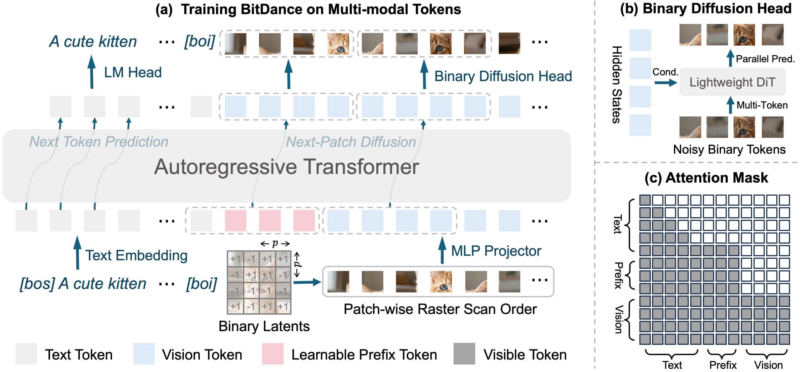

# BitDance: Авторегрессионная генерация изображений с бинарными токенами

## Описание

**BitDance** — экспериментальная 14B авторегрессионная (AR) модель для генерации изображений, разработанная группой китайских исследователей. Модель представляет собой гибридный подход, сочетающий авторегрессионную архитектуру с диффузионным head и бинарным токенизатором, что позволяет преодолеть традиционные проблемы AR-моделей генерации изображений.


*Схема архитектуры BitDance: бинарный токенизатор + diffusion head + параллельный патчинг*

## Проблематика авторегрессионных моделей

Генеративные модели делятся на два основных лагеря:

1. **Диффузионные модели** — высокое качество, но требуют множества шагов
2. **Авторегрессионные модели** — концептуально ближе к LLM (генерируют токен за токеном), но традиционно имеют проблемы:
   - Очень медленная генерация
   - Качество уступает диффузионным моделям
   - Плохая реконструкция токенизатора
   - Нестабильный сэмплинг

BitDance решает все три ключевые проблемы AR-моделей через отдельные архитектурные решения.

## Ключевые инновации BitDance

### 1. Бинарный токенизатор (решение проблемы плохой реконструкции)

Вместо традиционного VQ-кодбука используется **бинарный токенизатор на основе квантования с групповым разбиением каналов**.

**Характеристики:**
- Словарь размером **2²⁵⁶** (для сравнения: у Cosmos — 65 536 токенов)
- PSNR **25.29** против 24.81 у непрерывного DC-AE
- Бинарные токены реконструируют изображение **лучше**, чем VAE у SANA

**Преимущество:** Гигантское пространство состояний при лучшей реконструкции благодаря бинарному представлению.

### 2. Diffusion Head (решение проблемы нестабильного сэмплинга)

**Проблема:** Как выбирать из словаря в 2²⁵⁶ вариантов? Обучить классификатор на все возможные токены невозможно — такой слой не поместится ни в какую память.

**Решение:** Прикручен **diffusion head**, который моделирует биты на непрерывном гиперкубе.

**Механизм работы:**
- Модель предсказывает структуру битов через **velocity-matching**
- Это позволяет сэмплить из гигантского пространства состояний
- Непрерывная оптимизация вместо дискретной классификации

### 3. Параллельный патчинг (решение проблемы скорости)

**Традиционная проблема:** AR генерирует по одному токену за шаг.

**Решение BitDance:** За один шаг выдает сразу **64 токена** (или 16), при этом модель понимает, как они связаны между собой внутри этого блока.

**Результат:**
- **30x ускорение** относительно next-token AR при сопоставимом качестве
- Генерация блоками токенов с учётом внутренних зависимостей


*Сравнение скорости и качества генерации BitDance с другими моделями*

## Результаты тестов

### ImageNet (мелкая версия)
- **BitDance-H**: FID **1.24**
- Лучший результат среди AR-моделей (наравне с xAR-H)

### DPG-Bench (text-to-image)
- **BitDance 14B**: **88.28** баллов
- Выше чем: FLUX.1-Dev, SD3, Janus-Pro
- Уступает: Seedream 3.0, Qwen-Image

## Доступные версии

В релизе представлены **2 версии 14B модели**:
1. С предикшеном на **16 токенов** за шаг
2. С предикшеном на **64 токена** за шаг
3. Максимальное разрешение: **1 Мпиксель**

Также есть версии на ImageNet с разрешением 256×256 для воспроизведения экспериментов.

## Лицензирование

**Apache 2.0 License** — открытая лицензия, позволяющая коммерческое использование и модификацию.

## Ресурсы проекта

- 🟡 [Страница проекта](https://bitdance-project.github.io/)
- 🟡 [Arxiv](https://arxiv.org/)
- 🟡 [Модель](https://huggingface.co/)
- 🟡 [Demo](https://huggingface.co/spaces/)
- 🖥 [GitHub](https://github.com/)

## Открытые вопросы

### Латентность на каждом шаге
Насколько бинарный токенизатор + diffusion head добавляет латентности на каждом шаге, даже если самих шагов стало меньше из-за патчинга?

### Сравнение с диффузионными моделями
30x ускорение — это сравнение не с диффузионными моделями, которые уже умеют генерировать за 4–8 шагов. Актуальное сравнение с современными диффузионными моделями требует дополнительных исследований.

### Практическая доступность
14B параметров — это не про «взял и запустил». Требуются значительные вычислительные ресурсы для инференса и обучения.

## Сравнение с аналогами

| Модель | Параметры | Подход | FID (ImageNet) | DPG-Bench | Скорость |
|--------|-----------|--------|----------------|-----------|----------|
| **BitDance-H** | 14B | AR + бинарные токены + diffusion head | 1.24 | 88.28 | 30x vs next-token AR |
| xAR-H | - | AR | 1.24 | - | - |
| FLUX.1-Dev | - | Diffusion | - | <88.28 | - |
| SD3 | - | Diffusion | - | <88.28 | - |
| Seedream 3.0 | - | - | - | >88.28 | - |
| Qwen-Image | - | - | - | >88.28 | - |

## Архитектурные компоненты

### Бинарный токенизатор
- Квантование с групповым разбиением каналов
- Словарь 2²⁵⁶ возможных состояний
- Превосходная реконструкция (PSNR 25.29)

### Diffusion Head
- Моделирование битов на непрерывном гиперкубе
- Velocity-matching для предсказания структуры битов
- Обход проблемы гигантского классификатора

### Параллельный патчинг
- Генерация 16 или 64 токенов за один шаг
- Учёт внутренних зависимостей внутри блока
- 30x ускорение относительно традиционных AR

## Связи с другими темами

- [[../../algorithms/specialized/diffusion_models/diffusion_llm_integration.md]] — Интеграция диффузионных моделей с LLM, схожий гибридный подход
- [[../../algorithms/specialized/diffusion_models/architectures/discrete_diffusion_architecture.md]] — Дискретные диффузионные архитектуры
- [[../../algorithms/neural_networks/transformers/variational_autoencoders.md]] — Традиционные VAE для сравнения с бинарным токенизатором BitDance
- [[representation_autoencoders_rae.md]] — Representation Autoencoders, альтернативный подход к улучшению реконструкции
- [[scaling_diffusion_transformers_with_rae.md]] — Масштабирование диффузионных трансформеров
- [[../../ai/multi_token_prediction.md]] — Предсказание нескольких токенов, концептуально схожий подход к ускорению

## Источники

1. **BitDance: авторегрессионная генерация изображений с бинарными токенами** — Telegram-канал @ai_machinelearning_big_data, оригинальное описание модели
2. [BitDance Project Page](https://bitdance-project.github.io/) — Официальная страница проекта
3. [BitDance на Arxiv](https://arxiv.org/) — Научная публикация
4. [Модель на HuggingFace](https://huggingface.co/) —_weights модели
5. [GitHub репозиторий](https://github.com/) — Исходный код
6. Лицензия: **Apache 2.0 License**

```metadata
category: machine_learning
subcategory: generative_models
tags: ml, generative, autoregressive, text_to_image, bitdance, binary_tokens, diffusion_head, image_generation, ar_models, t2i
```
