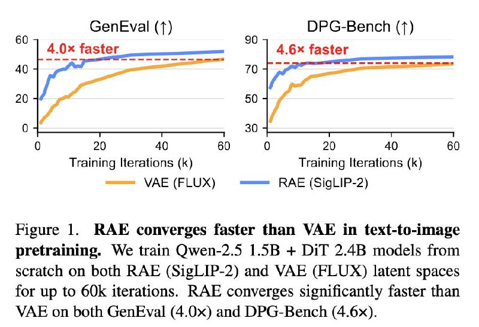

# Representation Autoencoders (RAE) для генерации изображений по тексту

## Краткое описание

RAE (Represenation Auto Encoders) - это альтернативная архитектура к VAE (Variational Autoencoder), которая показывает хорошие результаты в генерации изображений по тексту (text-2-image), особенно в задачах масштабирования. Изначально RAE использовались для Class Conditional генерации, но новая работа исследует их применение в задачах text-2-image, показывая, что RAE могут конвергировать быстрее и достигать лучшего качества при заданном вычислительном бюджете.

## Метод

RAE способны кодировать как высокочастотную информацию, необходимую для реконструкции, так и семантическую информацию. Начальная инициализация RAE происходит с помощью семантических энкодеров (например, SigLIP или WebSSL), после чего модель дообучается на задачу реконструкции с дополнительными лоссами:

- LPIPS (Learned Perceptual Image Patch Similarity)
- Грам лосс (Gram loss)
- Адверсариальный лосс (adversarial loss)

Для реконструкции текстов также важно использование текстовых данных в процессе обучения. Архитектура RAE использует MetaQuery - последовательность обучаемых токенов фиксированной длины (256 токенов для изображений 224x224), которая соответствует выходу RAE.

## Эксперименты и результаты

Обучение RAE состоит из двух стадий:
1. Претрейн на большом объеме данных
2. Файнтюн на более качественных данных

Данные собирались частично из открытых датасетов, частично из синтетических данных. Лучшие результаты показало сочетание реальных и синтетических данных, а не просто увеличение объема данных одного типа.

В экспериментах использовалась 1.5B парамететровая модель Qwen в качестве текстового энкодера и 2.4B парамететровая диффузионная модель. RAE показал:

- Значительно более быструю конвергенцию к тем же метрикам (в 4 раза быстрее по GenEval, в 4.6 раза по DPG Bench)
- Сходимость до лучших показателей при заданном вычислительном бюджете
- Качество реконструкции между SDXL VAE и FLUX VAE

Интересной особенностью подхода RAE является способность оценивать качество собственных генераций, что позволяет использовать тест-тайм скалинг по типу "Best-of-N".

## Технические особенности

- В отличие от оригинальных RAE (где были важны шумление латентов и широкая DDТ голова), для задач text-2-image эти модификации дают меньший прирост если обучать модели достаточно долго.
- Однако сдвиг расписания (flow shift) остается важным компонентом.
- Лучшие результаты дают комбинации SigLIP2/WebSSL как базовых энкодеров и обученных RAE для реконструкции.

## Выводы

- RAE являются эффективной альтернативой VAE для задач генерации изображений по тексту
- Подход показывает хорошую масштабируемость и быструю конвергенцию
- Для финальной оценки эффективности требуются более крупномасштабные модели сравнимого с сотнями миллиардов параметров качества
- Возможность RAE оценивать собственные генерации открывает новые возможности для постпроцессинга

## Критика и альтернативные подходы

Работа Kumar и Patel (2026) **«Learning on the Manifold: Unlocking Standard Diffusion Transformers with Representation Encoders»** выступает прямым опровержением гипотезы RAE о «бутылочном горлышке ёмкости».

### RJF: Альтернативный диагноз проблемы

В то время как RAE предполагает, что DiT не сходятся из-за недостаточной ширины модели (capacity bottleneck), Kumar и Patel демонстрируют, что проблема заключается в **геометрической интерференции**:

- Признаки DINOv2/SigLIP жёстко прибиты к гиперсфере S^{d-1} из-за LayerNorm
- Стандартный Flow Matching использует линейную интерполяцию (хорды), проходящую через невалидную внутренность сферы
- Модель тратит ёмкость на минимизацию радиальных ошибок, которых не существует в топологии данных

### RJF: Геометрически-корректное решение

Метод **Riemannian Flow Matching with Jacobi Regularization (RJF)** предлагает:

1. **SLERP** (Spherical Linear Interpolation) — геодезическая интерполяция по поверхности сферы
2. **Регуляризация Якоби** — взвешивание лосса с учётом кривизны многообразия
3. **Геодезический интегратор** (Exponential Map) — обновление через вращение, а не эйлеров шаг

### Сравнение результатов

| Метод | Модель | Параметры | FID (без guidance) | FID (с guidance) |
|-------|--------|-----------|-------------------|------------------|
| RAE (width scaling) | DiT-B | 131M+ | требует расширения | - |
| **RJF** | **DiT-B** | **131M** | **6.77** | **3.37** |

RJF позволяет стандартному DiT-B достичь SOTA-уровня **без расширения архитектуры**, просто учитывая геометрию многообразия.

### Связь с RAE

Оба подхода работают с пространствами признаков предобученных энкодеров, но:
- **RAE** фокусируется на реконструкции и требует width scaling для диффузии
- **RJF** фокусируется на геометрической корректности и работает со стандартными DiT

Эти подходы могут быть комплементарными: RJF может улучшить диффузию в латентном пространстве RAE.

 <!-- TODO: Broken image path -->

**Изображение показывает:** На рисунке демонстрируется, что RAE сходятся значительно быстрее, чем VAE при обучении text-to-image моделей с нуля (на основе Qwen-2.5 1.5B + DiT 2.4B) на 60K итераций. RAE показывает 4.0x ускорение по GenEval и 4.6x по DPG-Bench по сравнению с VAE (FLUX).

## Источники

1. **Scaling Text-to-Image Diffusion Transformers with Representation Autoencoders** — коллектив оригинальных авторов RAE плюс Янн ЛеКун. https://rae-dit.github.io
   - Медиа: Figure from RAE convergence study, показывающая 4x faster convergence по GenEval и 4.6x по DPG-Bench

2. **Learning on the Manifold: Unlocking Standard Diffusion Transformers with Representation Encoders** — Amandeep Kumar, Vishal M. Patel, 2026. arXiv:2602.10099. https://arxiv.org/abs/2602.10099
   - Критика гипотезы capacity bottleneck
   - Код RJF: https://github.com/amandpkr/RJF
   - Ревью: https://arxiviq.substack.com/p/learning-on-the-manifold-unlocking

## Связи с другими темами

- [[../../algorithms/specialized/diffusion_models/riemannian_flow_matching.md]] — RJF: геометрически-корректная альтернатива width scaling
- [[scaling_diffusion_transformers_with_rae.md]] — Масштабирование диффузионных трансформеров с использованием RAE
- [[technical_insights_rae_scaling.md]] — Технические подробности масштабирования RAE
- [[../../algorithms/specialized/diffusion_models/computer_vision/diffusion_transformer.md]] — Diffusion Transformers (DiT)