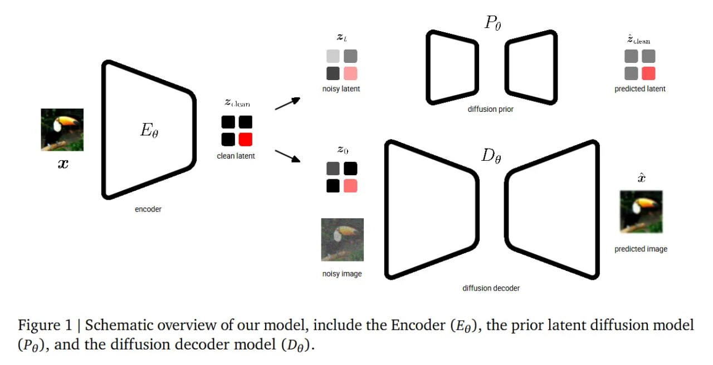
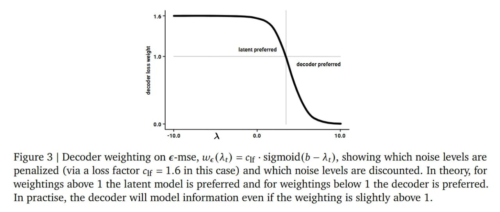
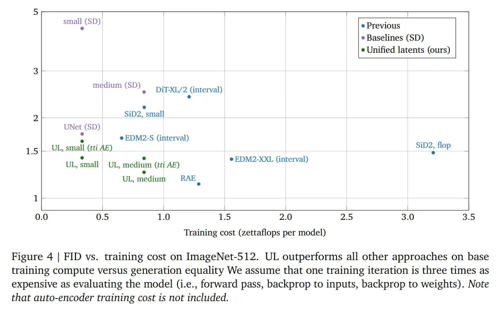
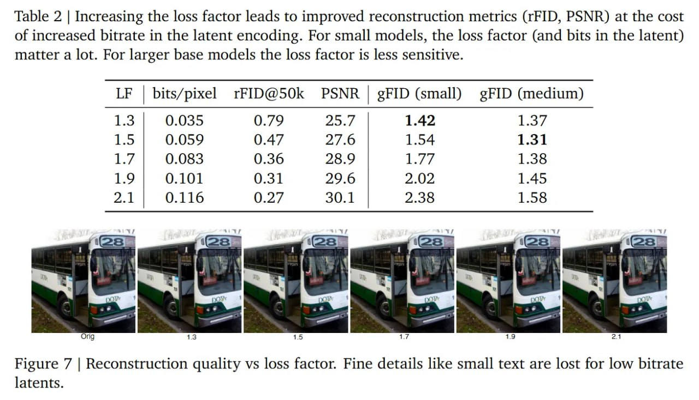
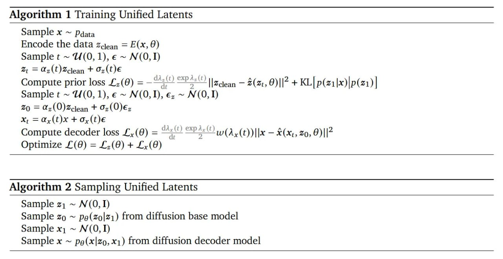

# Unified Latents (UL): Как обучать латенты

## Краткое описание

Unified Latents (UL) — фреймворк для совместного обучения детерминированного энкодера изображений, диффузионного прайора (prior) и диффузионного декодера. Метод заменяет ручные штрафы на базе KL-дивергенции (как в стандартных VAE) на взвешенную функцию потерь MSE по уровням шума, обеспечивая точную, математически ограниченную оценку информации в латентах.

## Ключевая проблема: Информационный боттлнек

Генеративное моделирование опирается на двухэтапный пайплайн: сначала многомерный сигнал сжимается в компактное латентное пространство, затем диффузионная модель учится генерировать эти латенты. Однако существует жёсткий компромисс:

- **Слабо регуляризованные латенты** — сохраняют высокочастотные детали, дают идеальную реконструкцию, но создают сложное многообразие, которое трудно выучить базовой модели
- **Сильно регуляризованные латенты** (например, DINO, SigLIP) — легко моделировать, но теряются высокочастотные текстуры, падает PSNR, появляются артефакты

Стандартный подход использует штраф KL-дивергенции с произвольным весом, что не даёт механизма для количественной оценки битов информации в латентном пространстве.

## Фундамент: Ограничение битрейта через диффузию

Unified Latents предлагают смену парадигмы в ограничении объёма информации:

1. **Детерминированный выход энкодера** — вместо предсказания гибкого распределения (среднее и дисперсия), энкодер выдаёт `z_clean`
2. **Фиксированное зашумление** — к `z_clean` применяется прямой диффузионный процесс до шага `t=0` с финальным `log-SNR λ(0) = 5`
3. **Апостериорное распределение** — `p(z_0|z_clean) = N(α_0 z_clean, σ_0)`, где `α_0 ≈ 1.0` и `σ_0 ≈ 0.08`

Это сводит традиционный член KL-дивергенции к **взвешенной MSE по уровням шума**. Информационное содержание (битрейт) латентов непрерывно измеряется и штрафуется совместно обучаемым диффузионным прайором.

## Архитектура Unified Latents

### Компоненты

1. **Энкодер E_θ** — ResNet, отображает входное изображение `x` в детерминированный латент `z_clean`
2. **Диффузионный прайор P_θ** — пытается отшумить полностью искажённый латент `z_t` обратно к `z_clean`, вычисляет `L_prior(θ)` из невзвешенной ELBO
3. **Диффузионный декодер D_θ** — UViT, берёт зашумлённое изображение `x_t` и использует `z_0` как условие для предсказания чистой картинки `x`, вычисляет `L_decoder(θ)`

### Процесс обучения

```
1. Энкодер: z_clean = E(x, θ)
2. Добавление шума: z_0 = α_0 * z_clean + σ_0 * ε_z
3. Prior loss: L_z(θ) — невзвешенная ELBO для диффузии в латентном пространстве
4. Decoder loss: L_x(θ) — перевзвешенная ELBO с сигмоидной функцией
5. Оптимизация: L(θ) = L_z(θ) + L_x(θ)
```

 <!-- TODO: Broken image path -->

**Изображение показывает:** Схематический обзор модели, включающий энкодер (E_θ), прайор латентной диффузии (P_θ) и модель диффузионного декодера (D_θ).

 <!-- TODO: Broken image path -->

**Изображение показывает:** Изображение x кодируется в z_clean. Диффузионный прайор моделирует путь от чистого шума z_1 к слегка зашумлённому латенту z_0. Этот z_0 используется диффузионным декодером для реконструкции изображения. Прайор измеряет и регуляризует информационное содержание z_0.

## Динамика оптимизации и функция потерь

### Предотвращение коллапса апостериорного распределения

Мощный диффузионный декодер может полностью игнорировать латентное условие (posterior collapse). Решение — **перевзвешивание ELBO для декодера**:

- Сигмоидная функция: `w(λ_x(t)) = sigmoid(λ(t) - b)`
- Масштабируется множителем `c_lf` (loss factor)
- Намеренно снижается вес лосса на низких уровнях шума (мелкие детали)

**Диапазон c_lf: 1.3–1.7** — вычислительно стимулирует декодер моделировать высокочастотную информацию самостоятельно, так как «стоимость бита» ниже, чем заставлять энкодер упаковывать детали в латент.

 <!-- TODO: Broken image path -->

**Изображение показывает:** Взвешивание декодера на ε-mse, w_ε(λ_t) = c_lf · sigmoid(b - λ_t), показывающее, какие уровни шума штрафуются (через множитель лосса c_lf = 1.6) и какие дисконтируются. Для весов выше 1 предпочтителен латентная модель, для весов ниже 1 — декодер.

### Двухэтапная стратегия обучения

1. **Этап 1: Совместное предобучение** — энкодер, прайор и декодер обучаются совместно
2. **Этап 2: Заморозка и обучение базовой модели** — энкодер и декодер замораживаются, на полученных репрезентациях с нуля обучается более крупная базовая модель с использованием стандартного сигмоидного расписания весов

## Результаты и эффективность

### ImageNet-512

- **FID генерации: 1.4** — конкурентоспособный результат
- Новый рубеж Парето для соотношения вычислительных затрат на обучение и качества генерации
- Значительно превосходит модели на стандартных латентах Stable Diffusion (при фиксированной архитектуре двухуровневого ViT)

 <!-- TODO: Broken image path -->

**Изображение показывает:** Зависимость FID от стоимости обучения на ImageNet-512. UL превосходит все другие подходы по вычислительной эффективности предобучения и качеству генерации.

### Kinetics-600 (видео)

- **FVD: 1.3** — новый state-of-the-art
- Доказывает временную стабильность и применимость к генерации видео

### Регулятор битрейта

Множитель лосса `c_lf` работает как точный регулятор битрейта латентов (измеряется в битах на пиксель):

| Loss Factor (LF) | bits/pixel | rFID@50k | PSNR  | gFID (small) | gFID (medium) |
|------------------|------------|----------|-------|--------------|---------------|
| 1.3              | 0.035      | 0.79     | 25.7  | 1.42         | 1.37          |
| 1.5              | 0.059      | 0.47     | 27.6  | 1.54         | 1.31          |
| 1.7              | 0.083      | 0.36     | 28.9  | 1.77         | 1.38          |
| 1.9              | 0.101      | 0.31     | 29.6  | 2.02         | 1.45          |
| 2.1              | 0.116      | 0.27     | 30.1  | 2.38         | 1.58          |

 <!-- TODO: Broken image path -->

**Изображение показывает:** Увеличение loss factor приводит к улучшению метрик реконструкции (rFID, PSNR) за счёт увеличения битрейта в латентном кодировании. Для маленьких моделей loss factor (и биты в латенте) имеют большое значение, для крупных базовых моделей — менее чувствительны.

### Зависимость от размера модели

- **Маленькие базовые модели** — требуют агрессивно сжатых латентов (меньший битрейт, худший FID реконструкции) для оптимального качества генерации
- **Крупные базовые модели** — обладают достаточной ёмкостью для латентов с высоким битрейтом, достигают превосходной детализации

## Эволюция генеративных латентов

Unified Latents представляет синтез различных подходов:

| Подход | Характеристика | Недостатки |
|--------|---------------|------------|
| Стандартные AE / GAN-VAE | MSE-лосс или сильно зажатые VAE | Нестабильность, низкое качество |
| TiTok | Экстремальное сжатие, дискретные 1D-токены | Потеря информации |
| Epsilon-VAE, DiffuseVAE | Диффузионное декодирование | Произвольные ограничения размерности, традиционные MSE-таргеты |
| Семантические энкодеры (DINO, SigLIP) | Семантическая связность | Катастрофическая потеря текстур |
| LSGM | Совместное предобучение с диффузионным прайором | Нестабильность из-за энтропийного члена энкодера |
| **Unified Latents** | **Диффузионный прайор + диффузионный декодер** | **Вычислительная стоимость декодера** |

UL заменяет чужеродный VAE-штраф на непрерывный диффузионный прайор, решая проблемы нестабильности LSGM.

## Вычислительные ограничения

**Главный недостаток:** диффузионный декодер требует итеративного процесса денойзинга в пиксельном пространстве.

- **Latent Diffusion (GAN-декодер)** — один прямой проход
- **UL (диффузионный декодер)** — на порядок выше задержка на инференсе

**Практическое развёртывание** потребует дистилляции декодера для сжатия траектории сэмплирования.

## Стратегическое значение

Unified Latents превращает эмпирический процесс настройки автоэнкодера в явно параметризованный компромисс между:
- **Битрейтом латента**
- **Генеративной ёмкостью**

Это даёт инструментарий для вывода **предсказуемых законов масштабирования**. Будущие диффузионные модели, скорее всего, откажутся от изолированных автоэнкодеров в пользу совместно оптимизируемых, ограниченных диффузией пространств репрезентаций.

## Алгоритм обучения

 <!-- TODO: Broken image path -->

**Изображение показывает:** Алгоритм 1 — Обучение Unified Latents, включающий сэмплирование данных, кодирование, вычисление prior loss и decoder loss, и оптимизацию суммарного лосса.

## Архитектурные детали

### Энкодер
- ResNet с каналами [128, 256, 512, 512]
- 2 residual block'а для каждой стадии downsampling
- 3 block'а в финальной стадии
- 2x2 патчинг для экономии вычислений

### Прайор
- Одноуровневый ViT
- 8 блоков, 1024 канала

### Базовая модель (этап 2)
- Двухуровневый ViT
- Каналы [512, 1024]
- Блоки [6, 16]
- Dropout 0.1

### Декодер
- UViT с каналами [128, 256, 512] в свёрточных стадиях
- Transformer в середине: 8 блоков, 1024 канала
- Dropout 0.1

## Сравнение с альтернативами

### VAE с нормальным прайором
Требует латентов с более высоким битрейтом для достижения хорошего качества реконструкции, что приводит к более сложным для обучения латентам и худшему gFID.

### Learned Variance
Попытка заставить энкодер предсказывать среднее и дисперсию приводит к:
- Быстрому падению выученного шума до 0
- Нестабильности модели
- Высокой дисперсии оценки KL
- Худшему gFID по сравнению с фиксированной дисперсией

## Ограничения

1. **Диффузионный декодер дорогой** — на порядок дороже GAN-декодеров при сэмплировании
2. **Сравнение осложнено** — разные AE обучаются на разных датасетах (ImageNet vs. веб-данные)
3. **Слабые латенты** — часть задачи моделирования перемещается на декодер
4. **Требуется дистилляция** — для практического использования необходима дистилляция декодера

## Выводы

Unified Latents демонстрируют, что:
- Латентные репрезентации можно эффективно обучать совместным обучением энкодера, диффузионного прайора и диффузионного декодера
- Подход превосходит существующие методы по эффективности обучения и качеству генерации
- Обеспечивается стабильный, интерпретируемый контроль над информацией в латентах через простые гиперпараметры
- Компромисс реконструкция-моделирование становится явным и управляемым

## Источники

1. **Unified Latents (UL): How to train your latents** — Jonathan Heek, Emiel Hoogeboom, Thomas Mensink, Tim Salimans. Google DeepMind Amsterdam, 2026. arXiv:2602.17270. https://arxiv.org/abs/2602.17270
   - Медиа: Figure 1, 2, 3, 4, Table 2, Algorithm 1
   - Ревью: https://arxiviq.substack.com/p/unified-latents-ul-how-to-train-your

2. **Latent Diffusion Models** — Robin Rombach et al., 2022. arXiv:2112.10752. https://arxiv.org/abs/2112.10752
   - Оригинальная работа по латентным диффузионным моделям

3. **Score-based Generative Modeling in Latent Space (LSGM)** — Arash Vahdat et al., 2021. arXiv:2106.05931. https://arxiv.org/abs/2106.05931
   - Совместное обучение диффузионного прайора в VAE-фреймворке

## Дополнительные материалы

- **DINO** — https://arxiv.org/abs/2104.14294
- **SigLIP** — https://arxiv.org/abs/2303.15343
- **UViT** — https://arxiv.org/abs/2410.19324
- **TiTok** — https://arxiv.org/abs/2406.07550
- **Epsilon-VAE** — https://arxiv.org/abs/2410.04081
- **DiffuseVAE** — https://arxiv.org/abs/2201.00308

## Связи с другими темами

- [[representation_autoencoders_rae.md]] — Representation Autoencoders (RAE): альтернативный подход с использованием предобученных семантических энкодеров
- [[../../algorithms/specialized/diffusion_models/index.md]] — Diffusion Models: базовые концепции диффузионных моделей
- [[variational_autoencoders.md]] — Variational Autoencoders: традиционный подход с KL-дивергенцией
- [[scaling_diffusion_transformers_with_rae.md]] — Масштабирование диффузионных трансформеров: сравнимый подход к оптимизации латентных пространств

```metadata
category: machine_learning
subcategory: generative_models
tags: unified_latents, diffusion_models, latent_space, generative_ai, image_generation, vae_alternative, bitrate_control, google_deepmind
```
