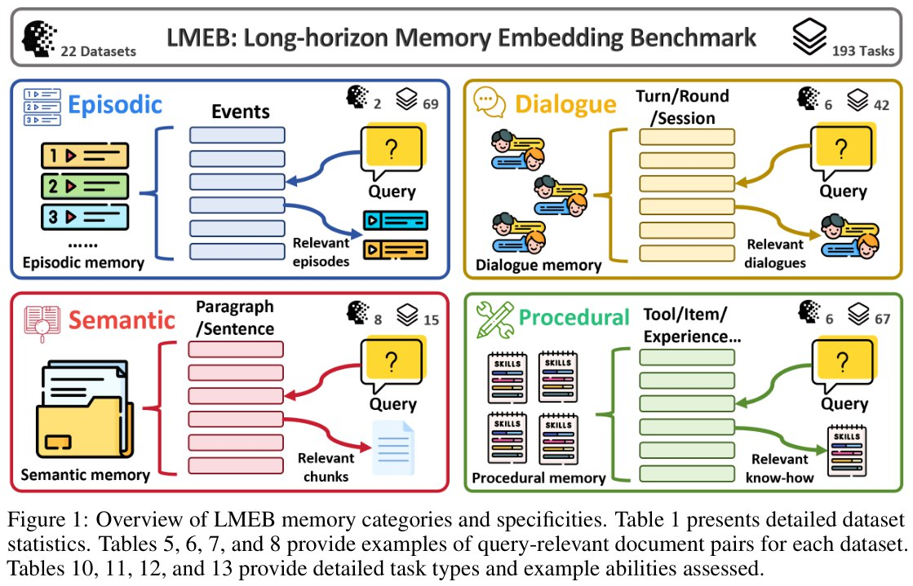

# LMEB: Бенчмарк для оценки long-horizon memory retrieval

## Краткое описание

**LMEB (Long-horizon Memory Embedding Benchmark)** — первый комплексный бенчмарк для оценки способности embedding-моделей к извлечению долгосрочных воспоминаний в агентных системах и AI-ассистентах. В отличие от традиционных бенчмарков (MTEB и аналоги), которые тестируют поиск по хорошо структурированным текстам, LMEB оценивает работу с фрагментарной, контекстно-зависимой информацией из далёкого прошлого.

Разработан исследователями из **KaLM-Embedding** (Harbin Institute of Technology, Shenzhen Loop Area Institute, Peking University).

## Основная проблема

Существующие бенчмарки для эмбеддингов (MTEB) фокусируются на **passage retrieval** — поиске по хорошо организованным пассажам. Однако в агентных системах и AI-ассистентах требуется:

- Вспоминать фрагментарные воспоминания
- Работать с контекстно-зависимой информацией
- Извлекать данные с временными метками из далёкого прошлого
- Обрабатывать многоходовые диалоги

## 4 типа памяти в LMEB

LMEB охватывает четыре типа памяти, классифицированных по двум измерениям: **уровень абстракции** и **временная зависимость**:

### 1. Эпизодическая память (Episodic Memory)
- **Характеристики**: низкая абстракция, высокая временная зависимость
- **Что оценивает**: извлечение прошлых событий, связанных с временными метками, сущностями, содержанием и пространственным контекстом
- **Гранулярность**: уровень событий (event-level)
- **Датасеты**: EPBench (54 задачи), KnowMeBench (15 задач)
- **Всего задач**: 69

### 2. Диалоговая память (Dialogue Memory)
- **Характеристики**: высокая абстракция, высокая временная зависимость
- **Что оценивает**: поддержание контекста в многоходовых взаимодействиях, запоминание предыдущих реплик и предпочтений пользователя
- **Гранулярность**: уровень реплики (turn), раунда (round), сессии (session)
- **Датасеты**: LoCoMo, LongMemEval, REALTALK, TMD, MemBench, ConvoMem
- **Всего задач**: 42

### 3. Семантическая память (Semantic Memory)
- **Характеристики**: низкая абстракция, низкая временная зависимость
- **Что оценивает**: извлечение общих знаний и фактов о мире, независимых от времени и конкретного контекста
- **Гранулярность**: уровень предложения или абзаца
- **Датасеты**: QASPER, NovelQA, PeerQA, Covid-QA, ESG-Reports, MLDR, LooGLE, SciFact
- **Всего задач**: 15

### 4. Процедурная память (Procedural Memory)
- **Характеристики**: высокая абстракция, низкая временная зависимость
- **Что оценивает**: извлечение изученных навыков и последовательностей действий, необходимых для решения задач и многошагового рассуждения
- **Гранулярность**: уровень инструмента (tool), опыта (experience), траектории (trajectory), элемента (item)
- **Датасеты**: Gorilla, ToolBench, ReMe, MemGovern, DeepPlanning
- **Всего задач**: 67

## Структура бенчмарка

| Параметр | Значение |
|----------|----------|
| **Всего датасетов** | 22 |
| **Всего задач** | 193 (zero-shot retrieval) |
| **Типов памяти** | 4 |
| **Протестировано моделей** | 15 |
| **Диапазон параметров** | от сотен миллионов до 10 миллиардов |

### Принципы дизайна LMEB

1. **Generalization (Обобщение)**: zero-shot оценка без task-specific fine-tuning
2. **Usability (Удобство)**: минимальные изменения кода для интеграции новых моделей, добавление датасетов через конфигурационные файлы
3. **Diversity (Разнообразие)**: широкий спектр типов памяти и задач, AI-генерированные и human-annotated данные
4. **Difficulty (Сложность)**: варьируемые уровни сложности (гранулярность, размер корпуса, количество релевантных документов на запрос, длина запроса/документа)

## Ключевые результаты тестирования

После тестирования 15 широко используемых embedding-моделей выявлены следующие находки:

### 1. LMEB обеспечивает разумный уровень сложности
- Лучшая модель достигла **Mean (Dataset) score 61.41** на N@10
- Бенчмарк предлагает содержательный вызов для оценки memory retrieval

### 2. Больший размер модели не гарантирует лучший результат
- В некоторых случаях крупные модели уступают меньшим
- Подчёркивается важность архитектуры модели и адаптивности к задачам

### 3. LMEB и MTEB практически ортогональны
- **Коэффициенты корреляции Пирсона и Спирмена близки к 0**
- LMEB фокусируется на long-horizon memory retrieval
- MTEB оценивает passage retrieval
- **Вывод**: хорошо искать по пассажам и хорошо "помнить" — это разные навыки

## Значение для области

LMEB заполняет критический пробел в оценке memory embedding, предоставляя:

- Стандартизированный инструмент для оценки long-horizon memory retrieval
- Диагностический инструмент для разработки более надёжных memory embedding моделей
- Общедоступный leaderboard для воспроизводимых сравнений
- Открытый evaluation toolkit для тестирования новых моделей

## Визуализация структуры

*Рисунок 1: Обзор категорий памяти LMEB и их специфика. Детальная статистика датасетов представлена в таблице ниже.*

## Статистика датасетов

### Эпизодическая память
| Датасет | Гранулярность | Задач | Query src | Corpus src | #Query | #Corpus |
|---------|---------------|-------|-----------|------------|--------|---------|
| EPBench | Event | 54 | AI | AI | 3,644 | 2,838 |
| KnowMeBench | Event | 15 | AI | Human | 2,162 | 27,062 |
| **Total** | Event | **69** | AI | Hybrid | **5,806** | **29,900** |

### Диалоговая память
| Датасет | Гранулярность | Задач | #Query | #Corpus |
|---------|---------------|-------|--------|---------|
| LoCoMo | Turn | 5 | 1,976 | 5,882 |
| LongMemEval | Session | 6 | 500 | 237,655 |
| REALTALK | Turn | 3 | 679 | 8,944 |
| TMD | Turn | 12 | 2,134 | 7,463 |
| MemBench | Round | 10 | 10,000 | 929,115 |
| ConvoMem | Turn | 6 | 5,867 | 500,221 |
| **Total** | Multi-granularity | **42** | **21,156** | **1,689,280** |

### Семантическая память
| Датасет | Гранулярность | Задач | #Query | #Corpus |
|---------|---------------|-------|--------|---------|
| QASPER | Paragraph | 1 | 1,335 | 65,300 |
| NovelQA | Paragraph | 7 | 1,541 | 79,286 |
| PeerQA | Sentence | 1 | 136 | 18,593 |
| Covid-QA | Paragraph | 1 | 1,111 | 3,351 |
| ESG-Reports | Paragraph | 1 | 36 | 2,407 |
| MLDR | Paragraph | 1 | 100 | 1,536 |
| LooGLE | Paragraph | 2 | 3,052 | 28,190 |
| SciFact | Sentence | 1 | 188 | 1,748 |
| **Total** | Multi-granularity | **15** | **7,499** | **200,411** |

### Процедурная память
| Датасет | Гранулярность | Задач | #Query | #Corpus |
|---------|---------------|-------|--------|---------|
| Gorilla | Tool | 3 | 598 | 1,005 |
| ToolBench | Tool | 19 | 1,100 | 13,862 |
| ReMe | Experience | 3 | 1,217 | 914 |
| MemGovern | Trajectory | 48 | 40 | 336 |
| DeepPlanning | Item | 3 | 120 | 19,839 |
| **Total** | Multi-granularity | **67** | **124,550** | **157,431** |

## Новые концепции и термины

- **Long-horizon memory retrieval**: извлечение воспоминаний из далёкого прошлого с фрагментарной, контекстно-зависимой информацией
- **Episodic Memory**: память о конкретных событиях с временными метками и пространственным контекстом
- **Dialogue Memory**: память о многоходовых диалогах, предпочтениях пользователя
- **Semantic Memory**: стабильные общие знания, независимые от времени
- **Procedural Memory**: навыки и последовательности действий для решения задач
- **Zero-shot retrieval**: оценка без дообучения на конкретные задачи

## Связи с другими темами

- [[./embedding_models.md]] — Модели эмбеддингов для RAG-систем, включая MTEB бенчмарки
- [[../agents/memory/memory_systems_for_ai_agents.md]] — Системы памяти для ИИ-агентов, типы памяти
- [[../../algorithms/neural_networks/embedders/embedding_retrieval_theoretical_limits.md]] — Теоретические ограничения векторных эмбеддингов
- [[../../algorithms/neural_networks/embedders/embedding_dimension_vs_combinations.md]] — Связь размерности эмбеддингов и количества представимых комбинаций
- [[../../applications/agents/memory_forms_agent_taxonomy.md]] — Таксономия форм памяти в агентных системах
- [[../../applications/agents/memory_dynamics_agent_taxonomy.md]] — Динамика памяти в агентных системах

## Источники

1. Zhao, X., Hu, X., Xu, J., Tang, D., Zhang, X., Zhou, M., Zhong, Y., Zhou, Y., Shan, Z., Zhang, M., Hu, B., & Zhang, M. (2026). **LMEB: Long-horizon Memory Embedding Benchmark**. arXiv preprint arXiv:2603.12572. https://arxiv.org/abs/2603.12572
2. [LMEB GitHub Repository](https://github.com/KaLM-Embedding/LMEB) — Официальный репозиторий бенчмарка с кодом и документацией
3. [LMEB Leaderboard](https://github.com/KaLM-Embedding/LMEB.github.io) — Публичный leaderboard для сравнения моделей
4. [HyperAI: LMEB —长程记忆嵌入基准测试](https://hyper.ai/cn/papers/2603.12572) — Обзор бенчмарка на китайском языке
5. [ChatPaper: LMEB Benchmark Summary](https://chatpaper.com/zh-CN/paper/252197) — Краткое изложение ключевых результатов

## Дополнительные материалы

- **MTEB (Massive Text Embedding Benchmark)**: https://huggingface.co/spaces/mteb/leaderboard — Традиционный бенчмарк для passage retrieval
- **OpenClaw**: https://github.com/OpenClaw — Пример memory-augmented системы, для которой важен LMEB
