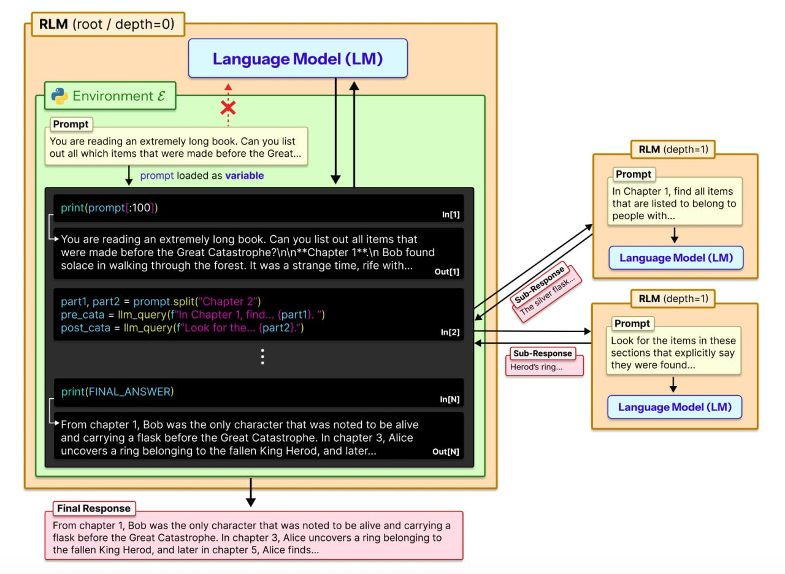
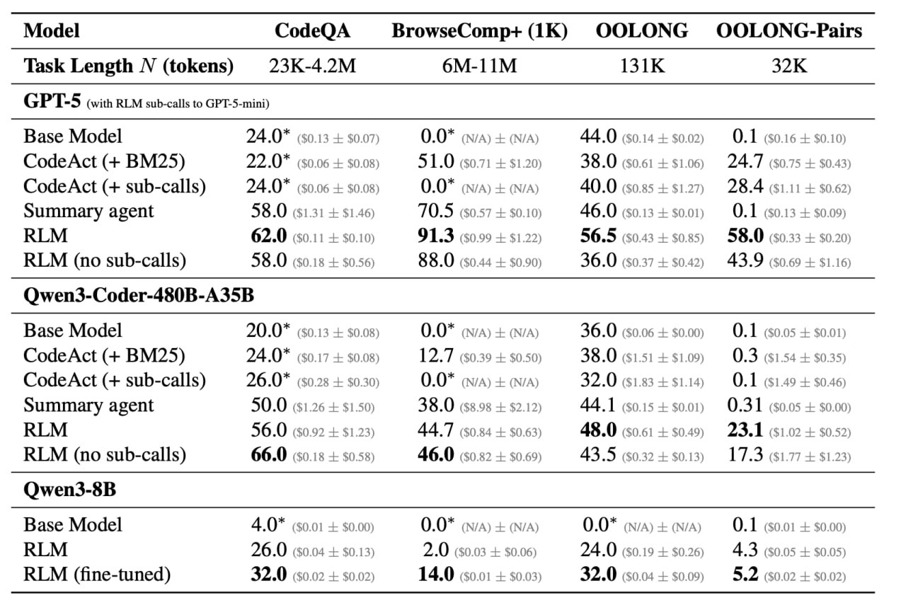

# Рекурсивные Языковые Модели (Recursive Language Models, RLM)

## Краткое описание

Рекурсивные Языковые Модели (RLM) - это общая стратегия инференса, предложенная Алексом Л. Чжаном (MIT CSAIL), Тимом Краской (MIT CSAIL) и Омаром Хаттабом (MIT CSAIL), которая позволяет языковым моделям обрабатывать произвольно длинные промпты через программное взаимодействие с внешней средой. Вместо прямой передачи длинного контекста в нейронную сеть, RLM рассматривает промпт как часть внешней среды, к которой модель может программно обращаться, разбивать на части и рекурсивно вызывать саму себя над фрагментами промпта.

**Источник:** Заметка Ивана Рубачёва, канал "Душный NLP" — разбор проблемы длинного контекста и решения через рекурсивные вызовы моделей.

## Основная идея

Ключевая идея RLM заключается в том, что длинные промпты не должны подаваться напрямую в нейронную сеть (например, Transformer), а должны рассматриваться как часть среды, с которой LLM может символически взаимодействовать:

- Входной промпт загружается как переменная в среде программирования типа REPL (Read-Eval-Print Loop)
- Модель получает возможность писать код для просмотра, декомпозиции и вызова под-моделей над фрагментами переменной
- Модель рекурсивно вызывает саму себя для решения подзадач

## Архитектура и принцип работы

### Основной процесс

**Изображение 1:** Архитектура рекурсивной языковой модели. Корневая модель (depth=0) получает промпт и взаимодействует с REPL-окружением. Промпт загружается как переменная, модель может разбивать его на части (например, по главам) и рекурсивно вызывать подмодели (depth=1) с функцией `llm_query` для обработки отдельных фрагментов. Подмодели работают с пустым контекстом, получая только указанный фрагмент промпта.

1. **Инициализация**: RLM инициализирует среду программирования (например, Python REPL), в которой промпт P устанавливается как значение переменной
2. **Интерактивное взаимодействие**: LLM получает общую информацию о среде REPL и может писать код для просмотра и разбиения P
3. **Рекурсивные вызовы**: Модель программно конструирует подзадачи и рекурсивно вызывает себя над ними
4. **Сбор результатов**: Результаты рекурсивных вызовов агрегируются для формирования финального ответа

### Ключевое отличие от кодовых агентов

Важное отличие RLM от типичных кодовых агентов (Claude Code, Codex): в RLM вызов `llm_query` живёт «внутри» REPL, а значит модель может встроить его в цикл, условие или любую другую программную конструкцию. В Claude Code или Codex субагент — это отдельный тул-колл, который модель вызывает из контекста напрямую, без программного контроля.

### Сравнение с другими подходами
| Подход | Проблема с длинным контекстом | Основной метод |
|--------|-----------------------------|----------------|
| Традиционная LLM | Контекстное "гниение" (context rot), ограниченное окно | Увеличение размера окна, архитектурные изменения |
| Компрессия контекста | Потеря деталей, невозможность доступа ко всем частям | Последовательное суммирование, сжатие |
| RLM | Обходит ограничения напрямую | Программное взаимодействие с контекстом, рекурсивные вызовы |

## Экспериментальные результаты

RLM были протестированы с использованием:
- GPT-5 (закрытая модель)
- Qwen3-Coder-480B-A35B (открытая модель)

### Задачи оценки

1. **S-NIAH (Single Needle-In-A-Haystack)**: Поиск конкретной информации при постоянной сложности
2. **BrowseComp-Plus**: Многоходовой вопрос-ответ по множеству документов (контекст 6–11 миллионов токенов, нужно найти один релевантный документ из тысячи и ответить на вопрос)
3. **OOLONG**: Бенчмарк долгих рассуждений, требующий семантического преобразования частей входных данных (линейная сложность относительно длины входа)
4. **OOLONG-Pairs**: Модификация OOLONG, требующая агрегации пар частей данных (квадратичная сложность)

### Результаты экспериментов

Эксперименты проводились на Qwen3 и GPT-5.

**Изображение 2:** Сравнение производительности различных методов на бенчмарках. RLM с самовызовами значительно превосходит базовые модели и другие подходы, особенно на задачах с высокой информационной плотностью.

- **BrowseComp+**: Базовые модели невозможно запустить — контекст (6–11 млн токенов) просто не влезает. RLM здесь работает и показывает результат ~91% для GPT-5.
- **OOLONG** (линейная сложность): RLM без самовызовов уступает даже базовой модели, потому что задача требует «видеть» весь контекст. RLM с самовызовами заметно выигрывает у всех бейзлайнов (56.5% vs 46% для GPT-5).
- **OOLONG-Pairs** (квадратичная сложность): Самый показательный результат. Базовая модель и summary agent выдают результат около нуля. RLM с самовызовами решает эту задачу, программно организуя квадратичное число вызовов через код в REPL (58% для GPT-5, 23.11% для Qwen3-Coder). Это класс задач, недоступный другим подходам.

### Результаты
- RLM успешно обрабатывали входы на два порядка величины больше, чем окна контекста моделей
- На задачах с длинным контекстом RLM значительно превосходят базовые LLM и общие подходы с длинным контекстом
- На задачах с 10M+ токенами RLM показали сильные результаты
- В большинстве случаев улучшение составляло двузначные проценты при сопоставимой или более низкой стоимости
- По стоимости RLM с самовызовами зачастую сопоставима с базовой моделью, хотя со сложностью задачи стоимость растёт

## Ключевые паттерны в RLM траекториях

1. **Фильтрация входной информации** через выполнение кода на основе приоритетов модели
2. **Разбиение и рекурсивные подвызовы** языковых моделей
3. **Проверка ответов** через подвызовы LM с малыми контекстами
4. **Передача рекурсивных выводов LM через переменные** для задач с длинным выводом

## Преимущества

- **Масштабируемость**: Обработка входов на 10^7+ токенов
- **Модель-агностичность**: Поддержка различных LLM
- **Сопоставимая стоимость**: Аналогичная или более низкая стоимость по сравнению с базовыми моделями
- **Информационная плотность**: Хорошие результаты на задачах с высокой плотностью информации

## Ограничения и направления будущей работы

- Неоптимальный механизм реализации RLM остается недостаточно исследованным
- Синхронные подвызовы в REPL увеличивают время выполнения
- Текущие модели неэффективно принимают решения о контексте
- Потенциал для явной подготовки моделей к использованию в качестве RLM

## Сравнение с другими методами

- **Контекстная компрессия**: RLM не теряет информацию через суммирование
- **Код-агенты**: В отличие от CodeAct, RLM выносят промпт в среду кода, а не используют его напрямую
- **Контекстное сжатие**: RLM позволяют сохранить доступ ко всей информации

## Обсуждение и влияние

Нюансы разницы RLM и типичных кодовых агентов до сих пор вызывают дискуссии с авторами в Twitter. Хайп вокруг статьи и идеи только растёт.

Ключевые точки дискуссий:
- Отличие RLM от субагентов в Claude Code и Codex: в RLM вызов модели программно контролируется через REPL
- RLM не обязательно должна быть идентична изначальной модели — главное, что у неё пустой контекст
- Возможность программной организации квадратичного числа вызовов через код в REPL открывает новые классы задач

## Практическое применение

RLM особенно полезны для:
- Задач с длинным контекстом, где требуется доступ ко всем частям входных данных
- Процессов рассуждения с плотной информацией
- Сценариев, где традиционные методы не справляются из-за "гниения контекста"
- Задач, требующих одновременно длинного входа и длинного выхода
- Задач с квадратичной сложностью (например, сравнение пар фрагментов), которые недоступны другим подходам

## Связи с другими темами

- [[../../algorithms/neural_networks/transformers/long_context_handling_methods.md]] - Альтернативные методы обработки длинного контекста
- [[../../algorithms/neural_networks/transformers/long_context_transformers.md]] - Длинноконтекстные трансформеры
- [[../memory_architectures/retrieval_augmented_generation.md]] - Использование внешней информации в моделях
- [[../../algorithms/neural_networks/transformers/memory/llm_memory_overview.md]] - Обзор подходов к памяти в LLM

## Источники

1. Zhang, A. L., Kraska, T., & Khattab, O. Recursive Language Models. arXiv preprint arXiv:2512.24601, 2025. URL: https://arxiv.org/abs/2512.24601
2. Иван Рубачёв. "Рекурсивные языковые модели". Канал "Душный NLP", 2026. Разбор проблемы длинного контекста и решения через рекурсивные вызовы моделей.