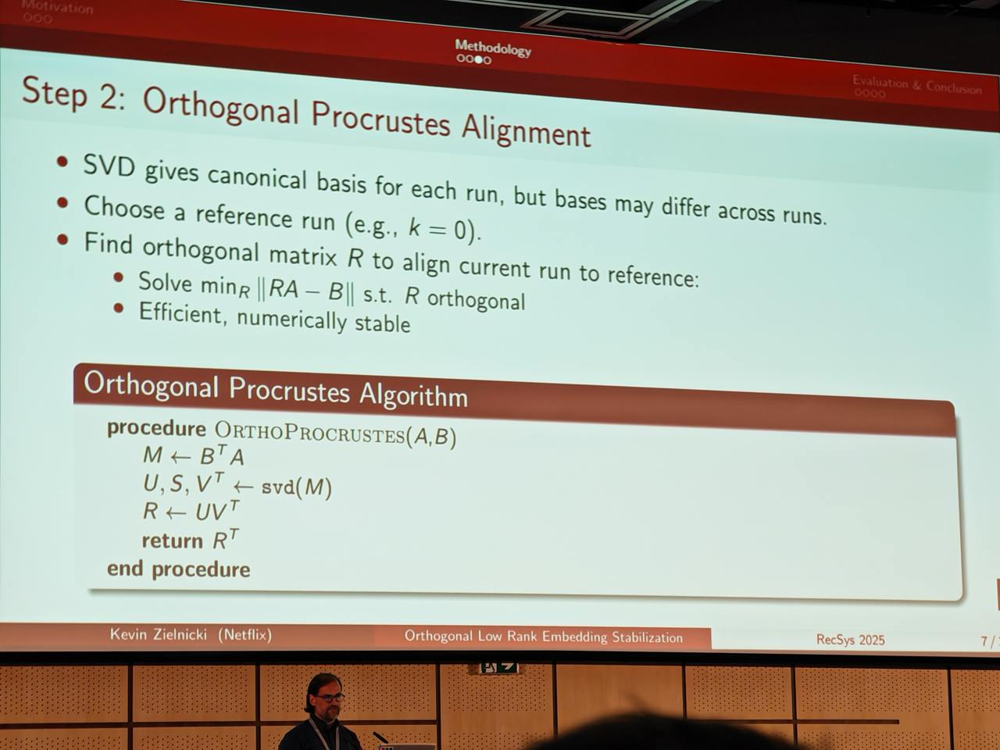
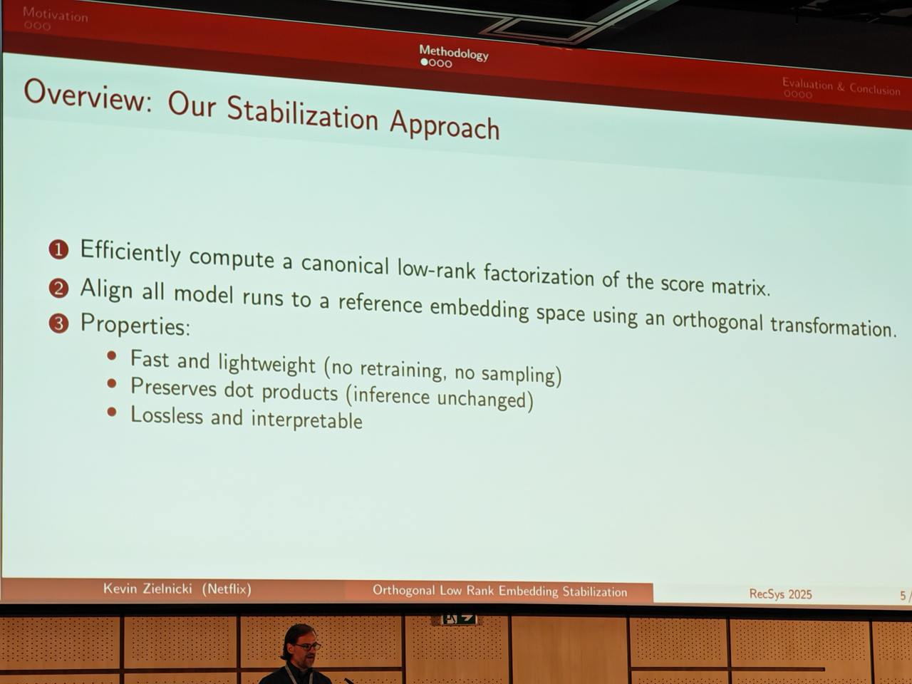
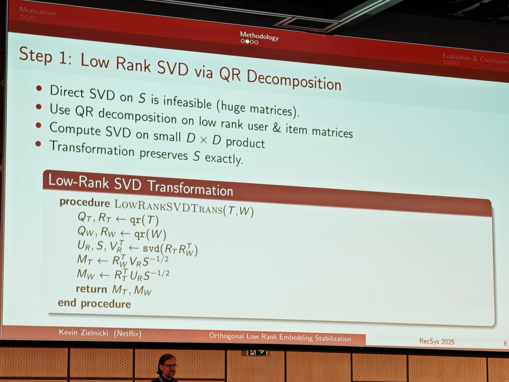
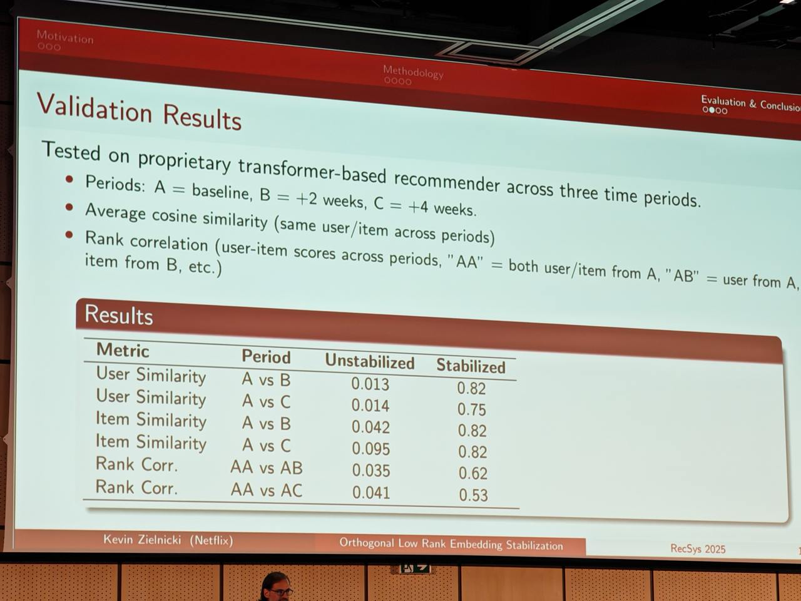
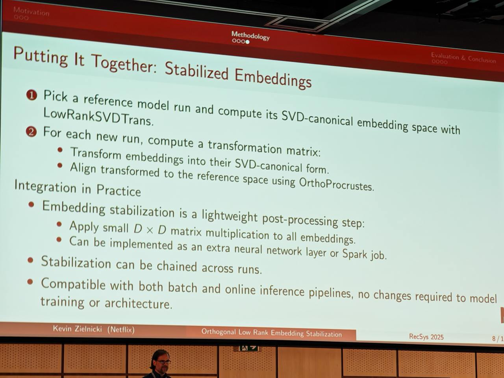

# Ортогональная стабилизация низкоранговых эмбеддингов (Orthogonal Low Rank Embedding Stabilization)

## Описание

Ортогональная стабилизация низкоранговых эмбеддингов — это метод стабилизации обучаемых эмбеддингов пользователей/документов в двухбашенных архитектурах с поздним связыванием. Метод был предложен авторами из Netflix для решения проблемы "разворота" (rotation) пространств эмбеддингов при переобучении моделей, когда отдельные координаты эмбеддингов не имеют специального смысла, а важна лишь их суммарная взаимосвязь.

## Математическая постановка проблемы

В двухбашенной архитектуре с поздним связыванием (late binding) эмбеддинги пользователей и айтемов (документов) вычисляются отдельно. Рассмотрим:

- Матрицу пользовательских эмбеддингов W ∈ R^(m×e), где m — количество пользователей, e — размерность эмбеддинга
- Матрицу айтемных эмбеддингов T ∈ R^(n×e), где n — количество айтемов, e — размерность эмбеддинга

Для предсказания релевантности между пользователем i и айтемом j вычисляется скалярное произведение: score(i,j) = w_i · t_j

При дообучении модели эмбеддинги W и T могут измениться существенно, несмотря на то, что результирующие скалярные произведения остаются стабильными. Это приводит к "развороту" пространства, когда:
- Координаты отдельных векторов могут кардинально измениться
- Взаимосвязи между векторами сохраняются
- Глобальная структура пространства нарушается

## Проблема стабильности

В двухбашенных архитектурах с поздним связыванием (late binding) классической проблемой при дообучении является "разворот" пространств эмбеддингов пользователя/документа при сохранении результирующего скалярного произведения (dot product). Это происходит потому, что отдельные координаты эмбеддингов (например, 1-я или i-ая координата вектора документа) не имеют специального смысла, важна лишь их суммарная взаимосвязь с соответствующим вектором пользователя.

Из-за нестабильности приходится пересчитывать эмбеддинги всех элементов после каждого этапа дообучения модели, что увеличивает вычислительные затраты. Также необходимо синхронизировать версии пользовательской и документной частей моделей, что зачастую невозможно на практике.

## Решение

Авторы статьи предлагают элегантное решение проблемы, комбинируя две идеи:
- эффективное сингулярное разложение (SVD) матрицы взаимодействий пользователя/документа;
- приведение к выбранному эталонному пространству с помощью ортогональной задачи Прокруста.

### Обозначения

Обозначим таблицу эмбеддингов документов как T (размерностью n × e, где n — количество документов, а e — размерность эмбеддингов), а таблицу эмбеддингов пользователей — как W (размерностью m × e, где m — количество пользователей). Тогда их произведение будет иметь смысл матрицы взаимодействий (X=TWᵀ). 

### Математический подход

#### 1. Эффективное сингулярное разложение

Сами документные и пользовательские эмбеддинги могут быть нестабильны при обучении: даже небольшие пертурбации в начальных условиях приводят к существенно разным результатам. При этом сингулярное разложение матрицы взаимодействий остается уникальным (с точностью до знаков сингулярных векторов):

X = UΣVᵀ

Однако получить напрямую SVD-разложение матрицы X вычислительно сложно: O(mn²). В статье предлагают воспользоваться тем, что матрица X — это произведение двух низкоранговых матриц TWᵀ, и сделать QR-разложение каждой из них:

- T = QₜRₜ
- W = Q_wR_w

где Qₜ, Q_w — ортогональные матрицы, а Rₜ, R_w — верхние треугольные матрицы.

QR-разложение имеет линейную сложность по n и m соответственно. Затем сделать SVD-разложение уже низкоранговой (e × e) матрицы RₜR_wᵀ:

SVD(RₜR_wᵀ) = UᵣSṼᵣᵀ

Поскольку X = TWᵀ = QₜRₜR_wᵀQ_wᵀ, сингулярное разложение X можно получить как:

- U = QₜUᵣ
- Σ = S
- V = Q_wṼᵣ

#### 2. Вычисление матриц перехода

После получения сингулярного разложения X = UΣVᵀ, следующим шагом является вычисление матриц перехода для стабилизации T и W. Цель — найти матрицы перехода Mₜ и M_w такие, что:

- TMₜ = US¹ᐟ²
- WM_w = VS¹ᐟ²

Это гарантирует, что матрица взаимодействий сохранится:
TMₜ(WM_w)ᵀ = US¹ᐟ²(S¹ᐟ²)Vᵀ = USVᵀ = TWᵀ

Имея QR-разложения T = QₜRₜ и W = Q_wR_w, а также SVD(RₜR_wᵀ) = UᵣSVᵣᵀ, матрицы перехода вычисляются как:
- Mₜ = RₜᵀUᵣS⁻¹ᐟ²
- M_w = R_wᵀVᵣS⁻¹ᐟ²

#### 3. Ортогональная задача Прокруста

Второй шаг — перевести полученное стандартизированное представление эмбеддингов к эталонному пространству. В качестве эталонного можно выбрать результат работы первой версии модели, что фиксирует эталонную систему координат.

Затем задача сводится к поиску матрицы, отображающей полученное на очередном шаге дообучения представление в эталонное пространство. Удобно ограничить поиск только среди ортогональных матриц, чтобы сохранить геометрические свойства пространства.

Формально, имея матрицы Tₖ (текущее пространство) и T₀ (эталонное пространство), требуется найти такую ортогональную матрицу R, что RTₖ ≈ T₀. Эта задача называется ортогональной задачей Прокруста и решается через сингулярное разложение.

Пусть SVD(T₀ᵀTₖ) = UΣVᵀ, тогда оптимальная ортогональная матрица:

R = UVᵀ



**Image shows:** Процесс преобразования текущего запуска к эталону: решение задачи минимизации |RA - B| где R - ортогональная матрица

#### 4. Финальное преобразование

Финально, получив матрицы отображения на первом (Mₜ и M_w) и втором (R) шагах, мы имеем преобразование, которое стабилизирует пространства эмбеддингов документов (MₜR) и пользователей (M_wR). Так как преобразование ортогональное, значения матрицы взаимодействий не меняются. При этом размерность матрицы — e × e, что делает её хранение и применение очень легкой операцией, которую можно добавить последним слоем нейросети.

Общее преобразование:
- Стабилизированные документные эмбеддинги: T' = TMₜR
- Стабилизированные пользовательские эмбеддинги: W' = WM_wR



**Image shows:** Основные свойства метода стабилизации: быстрота и легковесность, неизменяемость и интерпретируемость, сохранение скалярных произведений (без изменения инференса)

## Алгоритм процедуры



**Image shows:** Процедура LowR ANKSVDTRanNes(T,W) - алгоритм преобразования с низким рангом сингулярного разложения

## Преимущества

Предложенный в статье способ не зависит от выбранной модели и легко добавляется в любой пайплайн обучения или инференса, что позволяет стабилизировать эмбеддинги при дообучении.



**Image shows:** Сравнение оценок для одинаковых пользователей/элементов на разных периодах, демонстрирующее улучшенное сходство после стабилизации. Таблица показывает, как пользовательские и предметные симиларити улучшаются после стабилизации.


**Image shows:** Корреляция оценок пользователь-предмет на разных днях. Без стабилизации: эмбеддинги без стабилизации. Стабилизация: Мы ожидаем гораздо более высокую степень выравнивания, что позволяет беспрепятственно использовать в downstream задачах.

## Требуемые изменения в пайплайне



**Image shows:** Изменения, необходимые в пайплайне для внедрения метода стабилизации эмбеддингов

## Применение

Метод может быть применен для:
- Стабилизации эмбеддингов в рекомендательных системах
- Уменьшения вычислительных затрат на пересчет эмбеддингов при дообучении
- Упрощения синхронизации версий эмбеддингов пользователей и документов

## Связи с другими темами

- [[../matrix_factorization.md]] - Матричная факторизация: основа для понимания подходов к декомпозиции
- [[../../architectures/two_tower_architecture.md]] - Двухбашенные архитектуры: основная архитектура, к которой применяется метод
- [[../candidate_generation.md]] - Генерация кандидатов: этап, где используются эмбеддинги
- [[../../../../algorithms/neural_networks/transformers/optimization/laser_layer_selective_rank_reduction.md]] - Сингулярное разложение (SVD): техника, используемая в алгоритме

## Источники

1. Оригинальная статья от авторов из Netflix о стабилизации обучаемых эмбеддингов пользователей/документов, представленная в рамках конференции по рекомендательным системам
2. Подробный разбор и объяснение подготовлено Артёмом Ваншулиным (@RecSysChannel)

## Дополнительные материалы

- [Netflix Research Paper on Orthogonal Low Rank Embedding Stabilization] - Оригинальная статья от исследовательской группы Netflix
- [[orthogonal_procrustes_problem.md]] - Ортогональная задача Прокруста: математическая основа для решения проблемы
- [[matrix_factorization.md]] - Матричная факторизация: фундаментальные концепции, на которых строится метод
- [[two_tower_architecture.md]] - Двухбашенная архитектура: базовая архитектура, к которой применяется метод

```metadata
category: machine_learning
subcategory: recommendation_systems
tags: embeddings, stabilization, two-tower, svd, procrustes, matrix-factorization, netflix, recsys
```