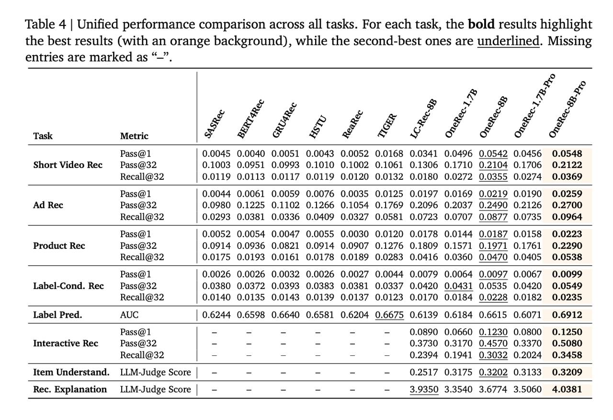

# OpenOneRec: Открытая фундаментальная модель и бенчмарк для ускорения генеративных рекомендаций

## Краткое описание

OpenOneRec - это комплексная фреймворк для построения фундаментальных моделей рекомендательных систем, разработанный командой Kuaishou. Работа представляет OneRec-Foundation - серию моделей с 1.7B и 8B параметрами, которые устанавливают новый стандарт качества (SOTA) на всех задачах в бенчмарке RecIF-Bench. Основная цель - создать по-настоящему интеллектуальные рекомендательные системы, которые смогут объединить глубокое понимание пользовательских предпочтений с широкими знаниями об окружающем мире.

## Проблема и мотивация

Современные рекомендательные модели учатся и применяются на узком срезе данных, что мешает им приобретать общие знания и масштабироваться, как большим языковым моделям. Для преодоления этого разрыва OpenOneRec предлагает:
- **Бенчмарк RecIF-Bench** - комплексный бенчмарк для оценки рекомендательных систем
- **Открытый датасет** - 120M взаимодействий, 200K пользователей, 15M+ айтемов
- **Семейство опенсорсных моделей** - OneRec-Foundation с 1.7B и 8B параметрами

## Ключевые инновации

### 1. RecIF-Bench: Голистический бенчмарк для рекомендаций с инструкциями

**RecIF-Bench** - это первый комплексный бенчмарк для оценки возможностей рекомендательных систем в выполнении задач через инструкции. Он включает 8 разнообразных задач, охватывающих спектр от фундаментальной рекомендации до сложного логического мышления:

- **L0: Семантическое выравнивание**:
  - Понимание айтема: Генерация текстового описания по itemic токену

- **L1: Фундаментальная рекомендация**:
  - Рекомендация коротких видео
  - Рекламная рекомендация
  - Продуктовая рекомендация
  - Прогнозирование метки

- **L2: Следование инструкциям**:
  - Интерактивная рекомендация
  - Условная по метке рекомендация

- **L3: Логическое мышление**:
  - Объяснение рекомендаций

**Статистика датасета RecIF-Bench**:
- 120M взаимодействий от 200K уникальных пользователей
- Охватывает три различных домена: короткие видео, реклама и продукты
- Включает богатые метаданные: пользовательские портреты, мультимодальные эмбеддинги, сигналы взаимодействия

### 2. Itemic Токены: Мост между модальностями

Одной из ключевых инноваций является **Itemic Tokenization**, подход для представления айтемов в пространстве LLM. Вместо использования текстовых описаний, которые приводят к чрезмерно длинным контекстам, или дискретных ID, которые не гарантируют генерацию существующих айтемов, OpenOneRec использует:

- **RQ-Kmeans**: Квантизация предобученных семантических эмбеддингов в иерархические дискретные коды
- **Иерархическая структура**: Айтемы с похожей семантикой делят общие префиксы токенов
- **Эффективность**: Компрессия семантики айтемов в короткие фиксированные последовательности токенов
- **Преемственность знаний**: Возможность передачи знаний на основе близости токенов

### 3. Единая формулировка задачи

Все задачи рекомендаций рассматриваются как проблема **Next-Token Prediction**:

```
P(Y|I, C) = P(target_response|instruction, user_context)
```

Где Y может быть:
- Последовательностью токенов целевого айтема (для задач рекомендации)
- Естественно-языковой последовательностью (для объяснений, метаданных и т.д.)

Унифицированный словарь: V = V_text ∪ V_item

## Архитектура и обучение

### Этап 1: Предобучение (Pre-Training)

**Стадия 1: Выравнивание Itemic-Text**
- Расширение словаря добавлением itemic специальных токенов
- Инициализация эмбеддингов из многомерного нормального распределения
- Обучение только параметров эмбеддингов для itemic токенов (остальные заморожены)

**Стадия 2: Полно-параметрическое совместное предобучение (Full-Parameter Co-Pretraining)**
- Разморозка всех параметров модели
- Обучение на смешанных данных: 62.34% общедоменные + 37.66% рекомендательные
- Применение AdamW с косинусным затуханием LR
- Максимальная длина контекста 32K токенов

### Этап 2: Пост-обучение (Post-Training)

**Много-задачное контролируемое дообучение (Multi-task SFT)**
- Восстановление способностей следовать инструкциям
- Использование смешанных данных: общие + рекомендательные задачи
- Формат чата с использованием шаблона Qwen3

**On-policy Distillation для общих возможностей**
- Стратегия distillation с использованием policy gradient
- Минимизация reverse KL дивергенции между студентом и учителем
- Восстановление общих рассуждений и предотвращение "катастрофического забывания"

**Обучение с подкреплением для рекомендаций (Rec-RL)**
- Использование Group Relative Policy Optimization (GRPO)
- Rule-based награда, ориентированная на "hit" события
- Выравнивание с метриками ранжирования (Recall, NDCG)

## Результаты и масштабирование

### Основные результаты
- **RecIF-Bench**: OneRec-Foundation устанавливает новый SOTA на всех задачах
- **Amazon Benchmark**: Среднее улучшение 26.8% в Recall@10 на 10 различных датасетах
- **Общие способности**: Сохранение большинства способностей Qwen3 backbone

### Трейд-офф между моделями
Интересно, что есть трейд-офф между обычной 8B и 8B Pro:
- **8B Pro**: Лучше в рекомендательных задачах
- **8B обычная**: Часто сильнее в задачах, где нужно говорить и объяснять

### Таблица результатов

 <!-- TODO: Broken image path -->

**Таблица показывает:** Сравнение производительности моделей на всех задачах RecIF-Bench. Для каждой задачи выделены лучшие результаты (жирным с оранжевым фоном) и вторые лучшие (подчёркнутые). Метрики включают Pass@1, Pass@32, Recall@32 для задач рекомендаций (Short Video, Ad, Product, Label-Cond, Interactive), а также LLM-Judge Score для понимания айтемов и объяснения рекомендаций.

### Эмпирические законы масштабирования в рекомендациях
- **Распределение вычислительного бюджета**: N_opt ∝ C^0.44, D_opt ∝ C^0.56
- **Отличие от текстовых законов**: Рекомендательные задачи требуют более агрессивного увеличения объема данных по сравнению с параметрами (b > a)
- **Низкая энтропия рекомендательных задач**: В отличие от генерации текста, рекомендации обладают более низкой неопределенностью

## Значение и влияние

OpenOneRec представляет собой важный шаг к созданию фундаментальных моделей рекомендаций, которые:
- Объединяют понимание пользовательских предпочтений с широкими знаниями об окружающем мире
- Поддерживают разнообразные типы задач через единый интерфейс с инструкциями
- Могут масштабироваться предсказуемо с сохранением общих способностей
- Обеспечивают объясняемость и интерпретируемость рекомендаций

## Источники

- [OpenOneRec Technical Report] - arXiv:2512.24762 - Оригинальная техническая статья, описывающая фреймворк OpenOneRec, бенчмарк RecIF-Bench и модели OneRec-Foundation.
- [Kuaishou OneRec GitHub] - https://github.com/Kuaishou-OneRec/OpenOneRec - Репозиторий с открытым исходным кодом, содержащий реализацию фреймворка.
- [HuggingFace OpenOneRec] - https://huggingface.co/OpenOneRec - Модельные чекпоинты и данные.

## Дополнительные материалы

- [Web search results on OpenOneRec] - Результаты веб-поиска по OpenOneRec foundation model generative recommendation.

## См. также

- [[../../architectures/minionerec_framework.md]] - MiniOneRec: Академическая реализация идей OneRec на открытых данных
- [[../../llm_based/main.md]] - Другие LLM-базированные подходы к рекомендательным системам
- [[../../llm_based/onerec_think/main.md]] - OneRec-Think: предшественник OpenOneRec с возможностями логического вывода (ризонинга)
- [[../semantic_ids_in_recsys.md]] - Общие сведения о семантических идентификаторах в рекомендательных системах
- [[../rq_vae.md]] - RQ-VAE и другие подходы к токенизации айтемов
- [[../../../algorithms/neural_networks/transformers/scaling_laws.md]] - Законы масштабирования для нейронных сетей