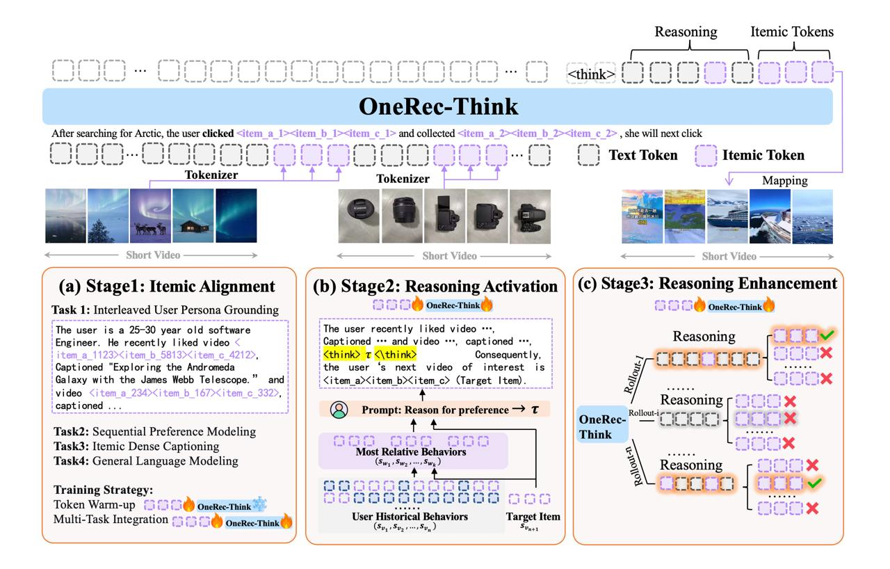

# OneRec-Think: In-Text Reasoning for Generative Recommendation

## Краткое описание

OneRec-Think — это расширение оригинальной рекомендательной системы OneRec от Kuaishou, которое добавляет возможности логического вывода (ризонинга) и диалогов в генеративную рекомендательную систему. Модель направлена на замену традиционного рекомендательного стека единственной генеративной моделью с улучшенными возможностями рассуждения.

## Основные инновации

### 1. Itemic Alignment (Этап 1)
- Добавление айтем-токенов в словарь модели (3×8К = 24К новых токенов)
- Обучение модели пониманию айтем-токенов в одном контексте с текстовыми данными
- Аккуратный подход: сначала замораживание бэкбона и обучение только эмбеддингов новых токенов, затем размораживание всех параметров
- Использование нескольких задач: интерпретация пользовательской истории, последовательное предсказание следующего айтема и декодирование айтемов в текстовые описания

### 2. Reasoning Activation (Этап 2)
- Извлечение ризонинг-траекторий через внешнюю модель близости айтемов g(·,·)
- Извлечение top-k (k=10) самых релевантных айтемов из истории пользователя для таргет-айтема
- Генерация осмысленных объяснений, почему пользователь взаимодействовал с таргетным айтемом
- Использование этих объяснений как SFT-данные: сначала генерация ризонинг-трейса, а потом — следующего айтема

### 3. Reasoning Enhancement (Этап 3)
- Модель сэмплит несколько объяснений
- Под каждое объяснение считается reward не в бинарной форме, а на основе степени совпадения семантических токенов предсказанных кандидатов с таргетным айтемом
- Использование beam search по продолжениям
- Ризонинг-траектории, ведущие к более точным предсказаниям, получают больший вес и становятся более вероятными

## Решаемые проблемы

### Проблема 1: Отсутствие понимания рекомендательных айтемов
- Стандартные LLM не знают, что такое рекомендательные айтемы (видео, треки и прочее)
- Решение: Itemic Alignment обеспечивает понимание айтемов в контексте языковой модели

### Проблема 2: Отсутствие рекомендательного ризонинга
- Даже если LLM «думает», она не умеет думать в рекомендательном домене
- Длинные и шумные истории пользователей ломают красивый ризонинг
- Решение: Reasoning Activation извлекает только релевантные айтемы для генерации осмысленных объяснений

## Онлайн-схема Think-Ahead

Для внедрения при больших RPS (запросов в секунду), авторы предлагают схему Think-Ahead:
- Вычислительно тяжелая часть (генерация ризонинга и первые шаги декодирования айтем-токенов) вычисляется офлайн
- Сохраняется набор возможных префиксов для пользователя
- В онлайн-режиме OneRec ограничивается этим множеством и быстро достраивает финальный айтем
- Преимущества: снижение стоимости инференса и перенос знаний LLM в продакшн-систему через ризонинг-префиксы

## Результаты

Модель не только генерирует объяснения и учитывает текстовые ограничения, но и сохраняет качество предсказания следующего айтема, что подтверждают онлайн-эксперименты.

## Связь с существующими подходами

OneRec-Think является продолжением работ Kuaishou над генеративными рекомендациями. В отличие от базовой модели OneRec, OneRec-Think:
- Добавляет возможности логического вывода (ризонинга)
- Включает диалоговые возможности
- Использует интеграцию ризонинга непосредственно в процессе предсказания следующего айтема

## Иллюстрация архитектуры

**Изображение показывает:** Архитектура OneRec-Think с тремя основными этапами: Itemic Alignment для интеграции айтемов в LLM, Reasoning Activation для генерации объяснений на основе релевантных исторических взаимодействий, и Reasoning Enhancement для улучшения качества предсказаний через веса, основанные на точности предсказаний.

## Ключевые особенности

- **Генеративный подход**: Одна модель заменяет классический рекомендательный стек
- **Ризонинг в тексте**: Логические рассуждения интегрированы в процесс генерации
- **Itemic токенизация**: Специализированные токены для рекомендательных айтемов
- **Многозадачность**: Совмещение задач рекомендаций с языковым моделированием
- **Offline-online оптимизация**: Разделение вычислительно сложных и быстрых операций

## Связи с другими темами

- [[../main.md]] - Общее описание LLM-based рекомендательных систем, контекст для OneRec-Think как одного из ключевых подходов
- [[../../architectures/minionerec_framework.md]] - Академическая реализация, развившаяся на основе OneRec, интересна для сравнения промышленного и академического подходов
- [[../../foundations/openonerec/main.md]] - Новое поколение фундаментальных моделей для генеративных рекомендаций, развитие идей OneRec-Think
- [[../../../research_papers/2025_research_compilation_part1.md#onerec-think-in-text-reasoning-for-generative-recommendation]] - Упоминание в обзоре современных исследований
- [[../../llm_user_interaction.md]] - Другие подходы к использованию LLM в рекомендательных системах, контраст с OneRec-Think

## Источники

1. [OneRec-Think: In-Text Reasoning for Generative Recommendation] - Основная статья, описывающая подход OneRec-Think от Kuaishou
2. Разбор подготовлен Артёмом Матвеевым (RecSysChannel)