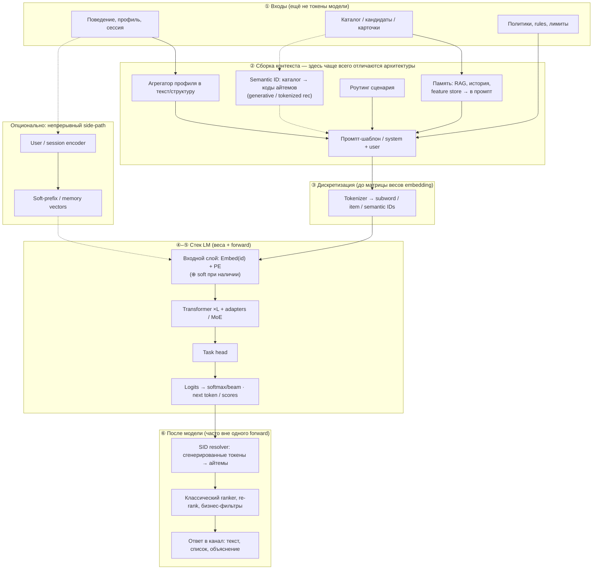

# Вариации архитектуры персонализации LLM в рекомендациях

## Зачем отдельный обзор архитектуры

Вопрос "как применить LLM в рекомендациях" обычно распадается на более практичный: **в какой точке модели инжектировать персональную информацию пользователя**.  
От выбора точки инъекции зависят:
- качество персонализации;
- latency и стоимость;
- сложность эксплуатации;
- риски приватности и воспроизводимости.

Ниже - архитектурные паттерны, которые реально встречаются в современных системах и исследованиях (2024-2026), с упором на production-пригодность.

---

## Блок-схема конвейера: где LLM, куда входят токены, что на выходе

**Смысл:** персонализация — это не «один блок», а изменение **цепочки до/внутри/после** стека LLM. Ниже — опорный **поток данных**: что остаётся сырыми сигналами, где появляются **токены**, что считается **внутри модели**, а что уходит в **пост-обработку** (ranker, маппинг в айтемы).

- **До токенизатора** всё ещё в таблицах, JSON, эмбеддингах retriever — это не токены модели.
- **Tokenizer** переводит текст промпта в **индексы субслов** словаря LM; это ещё **дискретные ID**, не векторные представления слоёв.
- **Первый слой весов LM** — lookup embedding по ID + позиционное кодирование (как в классических схемах Transformer); сюда же **подмешиваются** soft-prefix / memory-векторы, если есть.
- Дальше внутри стека — блоки Transformer → голова → logits/сэмплинг.
- **На выходе** — распределение по токенам (logits), из него — текст, JSON, «следующий item-токен» или сигнал для tool; дальше часто **отдельный** декод в реальные ID айтемов или **внешний ranker**.

**Та же логика в draw.io (цвета: токены / модель / пост):** файл [`diagrams/llm_recsys_personalization_dataflow.drawio`](diagrams/llm_recsys_personalization_dataflow.drawio) — открыть в [diagrams.net](https://app.diagrams.net/) или в редакторе с поддержкой `.drawio`.

**Как читать:** **PRM → TOK → INP** — текст промпта сначала становится **целочисленными ID** (ещё не скрытые состояния трансформера), затем **первый слой LM** делает embedding + PE. Пунктир **ENC → SOFT → INP** — персонализация **векторами**, а не дополнительным текстом в промпте; ветку можно опустить. Пунктир **CAT → SID → PRM** — ветка **generative recommendation по semantic / item ID**: каталог переводится в коды, они попадают в промпт (и дальше в тот же tokenizer / расширенный словарь); на выходе **GEN** предсказывает следующие ID, а **DEC** — **resolver** в реальные айтемы. **Режим только encoder** (например, shared LLM для ANN): представления после **TR/HEAD** без полного **GEN** и без зелёного поста — отдельный forward.

### Какие блоки меняются от паттерна к паттерну

| Паттерн (см. § ниже) | Главные «движущиеся» блоки на схеме | Что на практике меняют |
|---------------------|-------------------------------------|------------------------|
| **Prompt-level (§1)** | ② PRM, иногда состав ② MEM | Текст профиля, инструкции, лимиты длины контекста |
| **Scenario-routed (§10)** | ② RT + ② PRM (+ иногда ② MEM) | Набор шаблонов и retriever-политик на сценарий |
| **RAG / память (§5, §A)** | ② MEM → ② PRM | Индекс, retriever, формат фактов в промпте |
| **History compression / memory tokens (§6)** | ② MEM и/или **③ TOK** / **④ INP** (спец-токены или сжатый текст) | Как история попадает в промпт или в виде отдельных ID |
| **Soft tokens / prefix (§2)** | **SIDE** + **④ INP** (и далее TR) | Encoder пользователя, размер prefix, обучение mapping |
| **Adapters / LoRA (§3)** | **④ TR** (+ выбор весов на инференсе) | Набор адаптеров, роутинг по сегменту |
| **Adaptive user layers (§4)** | **④ TR** | Условные слои от user state |
| **MoE (§8)** | **④ TR** (роутинг экспертов) | Логика выбора экспертов от профиля/домена |
| **Semantic ID / item tokens (§7)** | **③ TOK** (словарь), **GEN**, **⑥ DEC** | Item-токены в словаре LM, constrained decoding, маппинг в каталог |
| **Unified LLM encoder для retrieval (подвариант D)** | Часто **без полного ⑤→⑥** в одном вызове: отдельный forward → ANN | Два «режима»: encoder forward vs генеративный |
| **Hybrid LLM + ranker (§9)** | ②→④ дают **сигналы**; итоговый top-K в **⑥ RNK** | Где обрубать LLM (features vs logits), контракт фич |
| **Feature-space offline (§G)** | В основном **до ①–②**: обогащение профиля/айтема | LLM не в online-пути; меняется вход классического ranker |
| **Controller / agent (§F, F1–F3)** | Оркестрация **нескольких** проходов по схеме | Кто вызывает ②/④/⑥ и в каком порядке |

Кратко: **меняется либо то, что попадает в промпт и в дискретные ID (②–③), либо то, как устроен стек весов LM (④ INP+TR+HEAD+GEN), либо пост-модельный слой (⑥)** — часто одновременно в двух местах.

Таксономия паттернов по **типу инъекции** (дерево **B–F**) — в конце заметки, раздел **«Единая Mermaid-схема архитектур»**.

---

## Карта вариантов инъекции персональной информации

### 1) Prompt-level персонализация (внешняя инъекция в контекст)

**Идея:** профиль пользователя, сессионный контекст, ограничения и цели передаются в prompt как текст/JSON-блок.

**Как устроено**
- агрегатор профиля формирует краткое описание интересов;
- в prompt добавляются динамические признаки (время, устройство, сценарий);
- LLM ранжирует/объясняет/уточняет рекомендации.

**Сильные стороны**
- самый быстрый старт (без изменения весов модели);
- удобно для A/B и итеративных экспериментов;
- легко включить guardrails и policy-правила.

**Слабые стороны**
- зависимость от качества prompt-компоновки;
- ограничение контекстного окна;
- нестабильность при длинной истории пользователя.

**Когда выбирать:** пилоты, conversational UX, слой объяснений, low-risk внедрение.

---

### 2) Soft personalization tokens (prefix/prompt-tuning, user embedding -> soft prompt)

**Идея:** персональная информация кодируется в компактный вектор/набор soft tokens, которые добавляются к входу модели.

**Как устроено**
- отдельный encoder строит user embedding;
- mapping-модуль переводит embedding в soft-prefix;
- backbone LLM остается (почти) frozen.

**Сильные стороны**
- лучше масштабируется, чем длинные текстовые профили;
- параметрически эффективная персонализация (PEFT-подход);
- меньше шума по сравнению с "сырым" текстовым профилем.

**Слабые стороны**
- сложнее отладка, чем у prompt-only;
- требуется отдельный контур обучения/обновления embedding;
- риск деградации при сильном интерес-дрифте без регулярного refresh.

**Когда выбирать:** нужен баланс качества и стоимости при большом трафике.

---

### 3) Adapter-based персонализация (LoRA/Adapters per segment/domain)

**Идея:** в frozen LLM подключаются адаптеры, отвечающие за персонализацию (по сегментам пользователей, доменам или задачам).

**Как устроено**
- базовая модель общая;
- персональные/доменные адаптеры подгружаются на инференсе;
- роутер выбирает нужный адаптер (или смесь адаптеров).

**Сильные стороны**
- хорошее качество при умеренной цене дообучения;
- модульность и управляемый rollout;
- можно обслуживать много стратегий на одном backbone.

**Слабые стороны**
- операционная сложность хранения/версирования адаптеров;
- возможны проблемы совместимости между адаптерами;
- требуется зрелая serving-инфраструктура.

**Когда выбирать:** зрелая ML-платформа, частые эксперименты персонализации, multi-domain продукт.

---

### 4) In-model персонализация через адаптивные слои

**Идея:** персональные слои/модули (например, conditional FFN, user-conditioned normalization) встраиваются внутрь трансформера.

**Как устроено**
- базовая LLM + адаптивные пользовательские слои;
- активация слоев зависит от user state и сценария;
- обновление персональных параметров может быть near-line/online.

**Сильные стороны**
- более глубокая персонализация, чем prompt-only;
- учитывается персональный контекст на уровне внутренних представлений;
- потенциально лучше на сложных пользовательских паттернах.

**Слабые стороны**
- высокий инженерный порог;
- сложная эксплуатация (обновление, откат, мониторинг);
- высокие риски регрессий без сильной экспериментальной дисциплины.

**Когда выбирать:** если простой PEFT уже не дает прироста, а продукт критично зависит от personalization quality.

Связанный материал: [[../architectures/concept_adaptive_user_layers|Adaptive User Layer LLM]]

---

### 5) Retrieval-personalization (RAG с пользовательским индексом/памятью)

**Идея:** персональная информация хранится во внешней памяти (vector index, feature store, history store), извлекается в рантайме и подается в LLM.

**Как устроено**
- user profile индексируется как набор фактов/событий/интересов;
- ретривер достает релевантный срез под текущий запрос;
- LLM использует retrieved context для генерации/ранжирования.

**Сильные стороны**
- персонализация обновляется без перетренировки LLM;
- прозрачнее аудит: видно, какие факты использовались;
- удобно контролировать privacy-фильтры до генерации.

**Слабые стороны**
- качество ограничено ретривером и схемой индексации;
- дополнительная latency из-за retrieval-шага;
- нужно управлять консистентностью памяти.

**Когда выбирать:** быстро меняющиеся интересы пользователя, высокий drift, частые обновления каталога/контекста.

Связанный материал: [[../architectures/concept_rag_user_index|RAG с пользовательским индексом]]

---

### 6) History compression + memory tokens (персонализированная долговременная память)

**Идея:** длинная история пользователя сжимается в специальные токены/представления, которые модель использует как long-term memory.

**Как устроено**
- история режется на сегменты;
- сегменты сжимаются в expert/memory tokens;
- на инференсе используются tokens + текущая сессия.

**Сильные стороны**
- позволяет учитывать long-term интересы без взрыва compute;
- улучшает баланс "длинная история vs latency";
- переиспользуемые memory-кэши ускоряют инференс.

**Слабые стороны**
- риск потери редких, но важных сигналов при сжатии;
- требует аккуратного дизайна сегментации;
- усложняет интерпретацию решения модели.

**Когда выбирать:** sequential recsys с очень длинной историей взаимодействий.

Связанный материал: [[../architectures/personalized_expert_tokens|Personalized Expert Tokens]]

---

### 7) Semantic ID / Item tokenization персонализация (генеративные архитектуры)

**Идея:** модель оперирует не "сырыми" item IDs, а семантическими токенами/кодами айтемов; персонализация происходит через генерацию следующего semantic ID в пользовательском контексте.

**Как устроено**
- item representation переводится в дискретные токены (semantic IDs, itemic tokens);
- LLM решает задачу next-token/next-item generation;
- далее идет декодирование токенов в реальные айтемы.

**Сильные стороны**
- единый генеративный интерфейс для retrieval+ranking;
- потенциальный выигрыш в обобщении для long-tail/new items;
- хорошо сочетается с foundation-style pretraining.

**Слабые стороны**
- сложный дизайн токенизации и декодирования;
- чувствительность к ошибкам генерации;
- высокая стоимость внедрения и дебага в production.

**Когда выбирать:** research-heavy команды и задачи, где нужен end-to-end generative rec.

Связанные материалы:
- [[../foundations/openonerec/itemic_tokenization|Itemic Tokenization]]
- [[../architectures/semantic_ids_in_recsys|Semantic IDs в рекомендациях]]

---

### 8) MoE персонализация (эксперты по доменам/сегментам)

**Идея:** персональная информация используется роутером для выбора экспертов (domain experts, persona experts, scenario experts).

**Как устроено**
- общий backbone + набор специализированных экспертов;
- routing-функция учитывает user profile, intent, контекст;
- выходы экспертов смешиваются и отдаются в ранжирование/генерацию.

**Сильные стороны**
- высокая емкость модели без полного dense-увеличения compute;
- естественная специализация под домены/сценарии;
- удобно масштабировать multi-domain продукты.

**Слабые стороны**
- сложность балансировки нагрузки экспертов;
- риск деградации при ошибках роутинга;
- повышенные требования к инфраструктуре мониторинга.

**Когда выбирать:** большие экосистемы с разными доменами и выраженной сегментацией пользователей.

Связанный материал: [[../architectures/concept_moe_personalized_domains|MoE personalized domains]]

---

### 9) Гибрид LLM + классический ranker (split personalization)

**Идея:** LLM отвечает за "понимание пользователя" (интересы, intent, объяснения), а финальный скоринг/ранжирование выполняет **специализированный ranker вне контура генеративного LLM**: от классических моделей (two-/three-tower, GBDT, линейные/факторизационные) до отдельной нейросетевой listwise-модели.

**Как устроено**
- LLM извлекает/суммаризирует персональные сигналы из истории;
- формируются features/tags/intent-векторы;
- downstream ranker (например, two-/three-tower или listwise ranker) строит итоговый top-K.

**Сильные стороны**
- production-устойчивость: критичный онлайн-ранжирующий слой остается детерминированным;
- легко контролировать latency и стоимость;
- проще выполнять бизнес-ограничения и пост-фильтрацию.

**Слабые стороны**
- больше межмодельных интерфейсов и точек деградации;
- потенциальная потеря части "богатого" reasoning-сигнала при переходе в features;
- требуется аккуратное согласование objective между LLM и ranker.

**Когда выбирать:** high-throughput системы, где нужен сильный personalization uplift без перехода в full generative serving.

Связанные материалы:
- [[main|RecGPT / гибридный подход]]
- [[FLARE|FLARE (гибрид в REGEN)]]

---

### 10) Scenario-routed personalization (персонализация через роутинг сценария)

**Идея:** перед основной моделью работает слой определения пользовательского сценария (миссия, контекст, стадия сессии), и персональная информация инжектируется в зависимости от выбранного сценария.

**Как устроено**
- классификатор/роутер определяет сценарий (например, discovery, replenishment, gift-shopping);
- для каждого сценария используется свой prompt-template, retriever, adapter или policy;
- результаты выравниваются общим ранжированием и safety/business rules.

**Сильные стороны**
- лучшее попадание в intent в multi-purpose продуктах;
- снижает "универсальный шум" одной стратегии персонализации;
- удобно развивать независимо по сценариям.

**Слабые стороны**
- риск ошибок роутера и неверной ветки персонализации;
- выше операционная сложность (много конфигураций и метрик);
- требуется строгая оркестрация между сценариями.

**Когда выбирать:** суперприложения/маркетплейсы и продукты с несколькими типами пользовательских миссий.

Связанные материалы:
- [[oxygenrec/main|OxygenRec]]
- [[oxygenrec/multi_scenario_alignment|Multi-scenario alignment]]

---

## Ключевые подварианты, которые важно не потерять

### A) Instruction-conditioned retrieval alignment (Q2I/IGR)

Это подтип retrieval-персонализации, где выравнивается пространство:
- пользовательский intent из инструкции;
- представления айтемов;
- objective retrieval (Q2I, instruction-guided retrieval).

Когда важно: сложные intent-heavy сценарии, где обычный user-profile retrieval не хватает.

Связанный материал: [[oxygenrec/semantic_alignment|OxygenRec semantic alignment]]

### B) Fast/Slow personalization loop

Архитектура с временным разделением:
- **slow контур** (near-line): более глубокий reasoning и обновление персональных инструкций/памяти;
- **fast контур** (online): быстрый инференс на уже подготовленном персональном контексте.

Когда важно: высокий QPS и жесткий SLA при необходимости сложной персонализации.

Связанный материал: [[oxygenrec/fast_slow_thinking|Fast and Slow Thinking]]

### C) Unified multi-scenario policy (train-once, deploy-everywhere)

Не просто роутинг по сценариям, а единая policy-модель:
- общее пространство награды/целей;
- выравнивание между сценариями;
- единый деплой вместо "много маленьких моделей".

Когда важно: экосистемы с несколькими рекомендательными сценариями и дорогой поддержкой множества моделей.

Связанный материал: [[oxygenrec/multi_scenario_alignment|Multi-scenario alignment]]

### D) Unified LLM retriever encoder (замена two-tower shared-LLM энкодером)

Персонализация строится на общей LLM-репрезентации:
- пользователь и айтем кодируются одной LLM-семьей;
- retrieval обучается контрастивно (InfoNCE, hard negatives);
- далее используется классический ANN/retrieval слой.

Когда важно: нужно усилить retrieval-семантику, но оставить production-пайплайн управляемым.

Связанный материал: [[linkedin_large_scale_retrieval|LinkedIn large-scale retrieval]]

### E) Semantic-ID подсемейства

В generative personalization полезно отдельно различать:
- **dual-aligned SID** (выравнивание user/item пространств): [[../architectures/das_dual_aligned_semantic_ids|DAS]]
- **variable-length SID** (адаптивная длина кода под head/tail): [[../research_papers/2024_2025_articles/variable_length_semantic_ids|Variable-length SID]]
- **SID hashing/prefix features** для ranker/generalization: [[../research_papers/2024_2025_articles/better_generalization_semantic_ids|Better generalization semantic IDs]]

### F) LLM controller as personalization policy layer

Отдельный паттерн, где LLM не ранжирует напрямую, а выбирает стратегию:
- какой retriever/ranker использовать;
- какие инструменты/источники контекста подключить;
- какую персонализационную политику применить в текущей сессии.

Связанный материал: [[llm_pipeline_controller|LLM pipeline controller]]

### G) Feature-space personalization injection (offline/near-line)

Персонализация может добавляться до online serving:
- LLM-generated user/item features;
- персональные interest embeddings;
- enriched profile features для downstream ranker.

Это отдельный архитектурный слой, часто самый дешевый и надежный для старта.

Связанные материалы:
- [[llm_feature_engineering|LLM feature engineering]]
- [[llm_feature_encoders|LLM feature encoders]]

---

## Сравнение архитектур (кратко)

| Вариант | Качество персонализации | Latency/Cost | Сложность внедрения | Обновляемость профиля |
|---|---|---|---|---|
| Prompt-level | Среднее | Низкая/средняя | Низкая | Высокая |
| Soft tokens / Prefix | Среднее-высокое | Средняя | Средняя | Средняя |
| Adapters (LoRA) | Высокое | Средняя | Средне-высокая | Средняя |
| Adaptive layers | Высокое | Средне-высокая | Высокая | Средняя |
| RAG user memory | Среднее-высокое | Средняя (retrieval overhead) | Средняя | Очень высокая |
| Memory tokens | Высокое на long-history | Средняя | Высокая | Средняя |
| Semantic ID generative | Потенциально высокое | Высокая | Очень высокая | Средняя |
| MoE personalization | Высокое | Средняя/высокая | Очень высокая | Средняя |
| Hybrid LLM + ranker | Высокое | Средняя | Средне-высокая | Высокая |
| Scenario-routed | Среднее-высокое | Средняя | Высокая | Высокая |

---

## Рекомендуемый путь внедрения

1. **Старт:** Prompt-level + RAG profile memory (быстрая проверка ценности персонализации).
2. **Усиление:** Soft tokens или Adapters для стабильного online-качества.
3. **Масштаб:** Memory compression / MoE / Semantic-ID генеративные схемы (если доказан business uplift и есть инфраструктура).

Практическое правило: если нет зрелой observability и experimentation-платформы, лучше не начинать с end-to-end генеративной архитектуры.

---

## Что отслеживать в проде для любой архитектуры

- Качество: NDCG@K, CTR/CVR, retention, diversity.
- Экономика: cost per 1k recommendations, cost-per-uplift.
- Надежность: P95/P99 latency, timeout rate, fallback rate.
- Безопасность: утечки персональных данных, prompt injection в tool/RAG-контур.
- Стабильность: деградация между версиями профиля/ретривера/адаптера.

---

## Связанные темы в базе знаний

- [[overview|Обзор применения LLM в рекомендациях]]
- [[llm_variations_in_recommendations|Вариации использования LLM в рекомендациях]]
- [[llm_feature_encoders|LLM как энкодеры признаков]]
- [[llm_pipeline_controller|LLM как контроллер пайплайна]]
- [[llm_user_interaction|Диалоговый UX и уточнение предпочтений]] (часто усиливает **B1**)
- [[personalized_llm_architecture|Персонализированная LLM архитектура (прикладной концепт)]]
- [[llm_in_recsys_production_pipeline|Итеративный пайплайн внедрения в production]]

## Внешние ориентиры для актуализации

- Обзоры по LLM-for-RecSys (ACM TOIS и последующие survey 2024-2025).
- Работы по parameter-efficient personalization (embedding-to-prefix, user embedding modules).
- Линия исследований по semantic IDs / tokenization для generative recommendation (P5/TIGER/TokenRec и последующие).

---

## Единая Mermaid-схема архитектур

Схема группирует паттерны по **месту инъекции** персонализации (не по этапу классического пайплайна retrieval → rank). Один продукт почти всегда совмещает несколько веток (например, **B1 + D1 + E2**: prompt + RAG-профиль + классический ranker).

**Соответствие тексту:** корневые ветки **B–F** — укрупнённая таксономия; листья **B1–B3, C1–C4, …** отражают разделы **§1–§10** и подварианты **§A–§G** выше (см. также [[llm_scoring_ranking_functions|LLM как re-ranker]] — часто это вариант **B1** на ограниченном top-N).

```mermaid
flowchart TD
    A[Personalization in LLM RecSys] --> B[Input-level injection]
    A --> C[Parameter-level injection]
    A --> D[Memory and retrieval-level injection]
    A --> E[Representation and generation-level injection]
    A --> F[Orchestration and policy-level injection]

    B --> B1[Prompt-level personalization]
    B --> B2[Scenario-routed personalization]
    B --> B3[Feature-space personalization]

    C --> C1[Soft tokens and Prefix tuning]
    C --> C2[LoRA and adapters]
    C --> C3[Adaptive user layers]
    C --> C4[MoE personalization]

    D --> D1[RAG with user profile index]
    D --> D2[Instruction-conditioned retrieval Q2I and IGR]
    D --> D3[History compression and memory tokens]
    D --> D4["Fast-Slow loop<br/>near-line reasoning + online fast path"]

    E --> E1["Unified LLM retriever encoder<br/>shared user-item encoder"]
    E --> E2[Hybrid LLM plus classic ranker]
    E --> E3[Semantic ID and item tokenization]

    E3 --> E31[Dual-aligned SID]
    E3 --> E32[Variable-length SID]
    E3 --> E33[SID prefix features and hashing]

    F --> F1[LLM pipeline controller]
    F --> F2[Unified multi-scenario policy]
    F --> F3[Tool-augmented agentic policies]
```

**Заметки по чтению схемы**

- **E1** (shared encoder для retrieval) по смыслу ближе к retrieval, но отнесён к **E**, потому что персонализация задаётся **совместным пространством представлений** пользователя и айтема, а не только текстом в prompt.
- **F3** пересекается с **F1** [[llm_pipeline_controller|LLM pipeline controller]]: выделен отдельно как акцент на **tools + policies** (feature store, rules, инвентарь); см. роль оркестратора в [[overview|обзоре LLM в рекомендациях]].
- Комбинации вроде **B2 + (C1–C4)** или **ветка D + B1** в проде распространены; «чистые» листья на схеме — идеализированные опорные точки.
