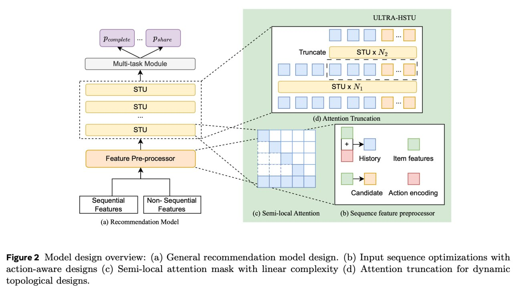

# ULTRA-HSTU: Инженерные Оптимизации для Масштабных Рекомендательных Систем

## Описание

ULTRA-HSTU - это усовершенствованная версия архитектуры HSTU (Hierarchical Semantic Transformer for User behavior modeling) от Meta, представленная в статье "Bending the Scaling Law Curve in Large-Scale Recommendation Systems" (2025). В отличие от оригинальной HSTU, которая фокусировалась на моделировании, ULTRA-HSTU концентрируется на **инженерных оптимизациях** для максимального ускорения обучения и инференса.

**Ключевое достижение**: уменьшение FLOPs в **2 раза** для обучения и в **10 раз** для инференса, что позволило значительно масштабировать модель.

## Контекст появления

Оригинальная статья про HSTU ("Actions Speak Louder than Words") стала вирусной, показав возможность масштабирования в RecSys с получением профита. ULTRA-HSTU представляет собой эволюцию подхода с акцентом на системную эффективность.

## Ключевые Инновации

**Изображение показывает:** Общий дизайн модели ULTRA-HSTU: (a) общий дизайн рекомендательной модели, (b) оптимизации входной последовательности с action-aware дизайном, (c) маска semi-local attention с линейной сложностью, (d) attention truncation для динамических топологических дизайнов.

### 1. Отказ от Interleaved Представления Истории

**Проблема**: Оригинальная HSTU использовала interleaved представление истории в виде `(item, action, item, action, ...)`, что требовало дополнительной обработки.

**Решение**: Простое суммирование эмбеддингов события и действия в один вектор.

**Результат**:
- Уменьшение FLOPs на **32%** при обучении
- Уменьшение FLOPs на **63%** при инференсе (для длины истории в 3к)

### 2. Load-Balanced Stochastic Length (LBSL)

**Проблема**: Обычный Stochastic Length подход ускоряет обучение, случайно обрезая историю на каждом шаге, но в распределённом обучении это создаёт дисбаланс нагрузки на воркерах, приводя к простоям.

**Решение**: LBSL семплирует длину истории так, чтобы нагрузка каждого воркера была максимально близка к определённому значению для каждого батча.

**Результат**:
- **+15%** пропускной способности
- Без деградации качества модели

### 3. Semi-Local Attention (SLA)

**Проблема**: Полная каузальная маска имеет квадратичную сложность O(n²), что дорого для длинных последовательностей.

**Решение**: Вместо полной каузальной маски используется внимание только по **локальному** и **глобальному** окнам:
- **Локальное окно**: учитывает текущие интересы (свежие взаимодействия)
- **Глобальное окно**: учитывает долгосрочные интересы

**Сложность**: Из квадратичной становится линейной (почти).

**Результат**:
- Улучшение метрики training scaling efficiency в **2.7 раза**
- Улучшение метрики inference scaling efficiency в **5.1 раза**

### 4. Mixed Precision с Оптимизацией Memory-Bound Операций

**Проблема**: HSTU-style внимание является memory-bound - основные ресурсы уходят на перенос тензоров из HBM в SRAM и обратно.

**Решение**:
- Большинство операций оставляют в **BF16**
- Матмулы выполняют в **FP8**
- Добавляют фьюзинг ядер для ускорения
- Используют и модифицируют ядра **Flash Attention v3** для STU-блоков
- Минимальное требование к железу: **H100**

**Результат**:
- **+10%** пропускной способности на обучении
- **+40%** пропускной способности на применении (инференсе)

### 5. Attention Truncation

**Проблема**: Даже с Semi-Local Attention каждый слой остаётся дорогим для длинных последовательностей.

**Решение**: Двухфазная архитектура:
1. Сначала делают **N слоёв** по всей последовательности (полученной с Semi-Local Attention)
2. Выбирают сегмент длины **L'** из истории (предлагают брать самые свежие события)
3. Добавляют ещё **M слоёв**, но уже только по этому последнему сегменту

**Пример схемы**: 3 + 6 слоёв (3 полных + 6 на усечённой истории)

**Результат**:
- В **1.5 раза** меньше FLOPs на инференсе относительно HSTU с 6 слоями

## Архитектурные Параметры Продакшен Модели

Meta внедрили в прод модель со следующими характеристиками:

| Параметр | Значение |
|----------|----------|
| Количество STU слоёв | **18** |
| Длина истории | **16,000** (16к) |
| Embedding dimension | **512** (предположительно) |
| Количество GPU для обучения | **~512** (сотни, оценка из LBSL секции) |

## Результаты и Метрики

### Бизнес-метрики

- **+4%** consumption (потребление контента)
- **+2-8%** engagement (вовлечённость)
- По оценке команды: "single-digit прирост это уже большой прорыв"

### Технические метрики

| Метрика | Улучшение |
|---------|-----------|
| FLOPs (обучение) | ↓ в 2 раза |
| FLOPs (инференс) | ↓ в 10 раз |
| Training scaling efficiency | ↑ в 2.7 раза |
| Inference scaling efficiency | ↑ в 5.1 раза |
| Пропускная способность (обучение) | +10% (mixed precision) + 15% (LBSL) |
| Пропускная способность (инференс) | +40% (mixed precision) |

### Исследовательские Наблюдения

**Cross-attention vs Self-attention**:
- При росте глубины **cross-attention** довольно быстро насыщается
- **Self-attention** продолжает улучшаться при добавлении слоёв

Это наблюдение влияет на архитектурные решения при масштабировании глубины модели.

## Сравнение с Оригинальной HSTU

| Аспект | HSTU (оригинальная) | ULTRA-HSTU |
|--------|---------------------|------------|
| Фокус | Моделирование и архитектура | Инженерные оптимизации |
| Представление истории | Interleaved (item, action, ...) | Суммированные эмбеддинги |
| Attention | Полная каузальная маска | Semi-Local (локальное + глобальное) |
| Точность вычислений | Стандартная | Mixed precision (BF16 + FP8) |
| Глубина обработки | Единая глубина | Attention Truncation (N + M слои) |
| Распределённое обучение | Стандартное | Load-Balanced Stochastic Length |
| FLOPs (инференс) | Базовые | ↓ в 10 раз |

## Значение для Индустрии

ULTRA-HSTU демонстрирует несколько важных принципов:

1. **Системный подход**: Оптимизация только модели недостаточна - нужен ко-дизайн модели и системы
2. **Масштабирование работает**: Продолжение масштабирования RecSys моделей даёт профит
3. **Инженерия критична**: Архитектурные инновации важны, но без системных оптимизаций не работают на масштабе
4. **Одна из самых больших моделей**: Meta заявляют, что это одна из самых больших моделей, выкаченных в прод в мире (хотя точных цифр по параметрам не приводят)

## Связи с Другими Темами

- [[actions_speak_louder_than_words.md]] - Оригинальная статья HSTU, основа для ULTRA-HSTU
- [[transformer_based_recommendation_models.md]] - Трансформерные модели в рекомендательных системах
- [[vista_architecture.md]] - Другая архитектура от Meta для генеративных рекомендаций
- [[gem_model.md]] - GEM: ещё одна современная архитектура от Meta
- [[semi_local_attention.md]] - Детальное описание механизма Semi-Local Attention
- [[load_balanced_stochastic_length.md]] - Детальное описание LBSL техники
- [[attention_truncation.md]] - Детальное описание техники Attention Truncation
- [[mixed_precision_training.md]] - Mixed precision обучение и FP8/BF16 форматы
- [[flash_attention.md]] - Flash Attention и оптимизации механизма внимания

## Источники

1. **"Bending the Scaling Law Curve in Large-Scale Recommendation Systems"** - Meta, 2025. Основная статья, представляющая ULTRA-HSTU.
   - URL: https://arxiv.org/abs/2602.16986
   - Дата публикации: Февраль 2025

2. **Сообщение от @researchoshnaya** - Технический разбор статьи ULTRA-HSTU с подробным описанием всех оптимизаций и результатов.

3. **Meta Research Blog** - Описание подхода Meta к масштабированию рекомендательных систем.

## Дополнительные Материалы

- [[../research_papers/2024_2025_articles/index.md]] - Другие статьи 2024-2025 годов в области рекомендательных систем
- [[../../algorithms/neural_networks/transformers/specialized_attention_mechanisms_comparison.md]] - Сравнение механизмов разреженного внимания
