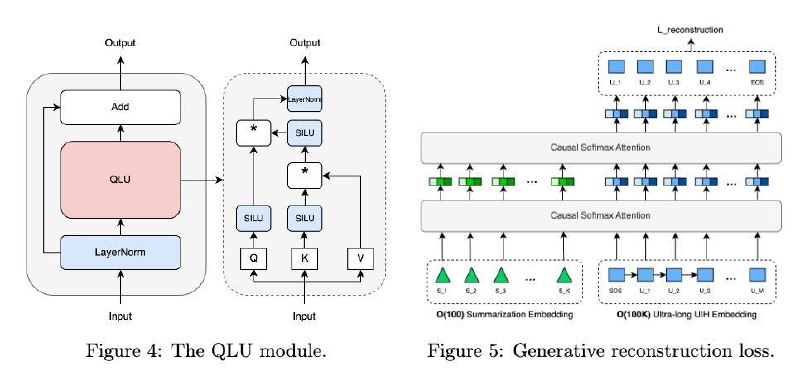
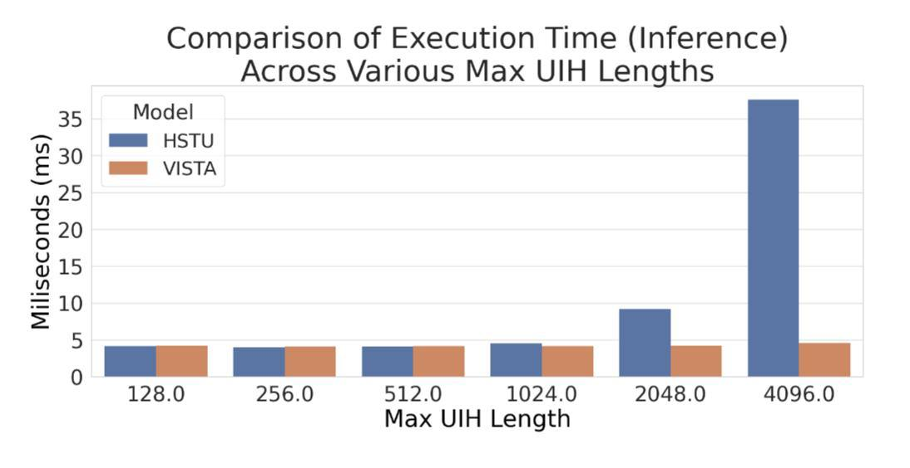
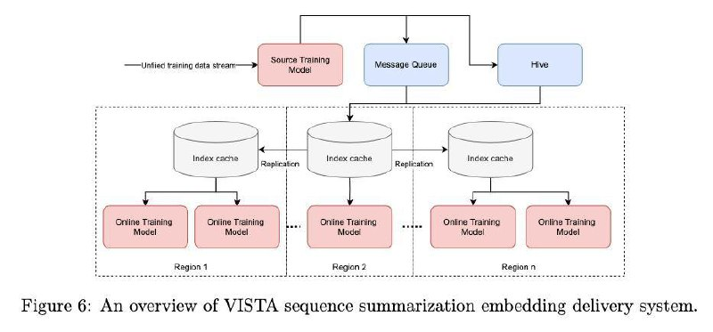

# VISTA: Архитектура для генеративных рекомендательных систем

## Описание

VISTA - это новая архитектура от Meta для генеративных рекомендательных систем, представленная в статье "Massive Memorization with Hundreds of Trillions of Parameters for Sequential Transducer Generative Recommenders". Архитектура решает проблему обработки длинной истории взаимодействия пользователя (UIH - User Interaction History) без линейного роста стоимости инференса. Архитектура обещает обучаться на пожизненной истории пользователя до миллиона событий, при этом сохраняя фиксированную стоимость инференса.

**На изображении показан общий обзор архитектуры VISTA, включающий ключевые компоненты: сжатие истории пользователя, систему доставки эмбеддингов и рантайм инференс.**

## Ключевые проблемы

Традиционные подходы к обработке длинной истории пользователей сталкиваются с двумя основными проблемами:

1. **HSTU (History-based Sequential Transformer Units)** - подход "берём всё", который требует обработки всей истории пользователя, приводя к дорогой полной прогонке
2. **SIM/TWIN** - подход "берём релевантный срез", который приводит к линейному росту стоимости по числу кандидатов

Оба подхода страдают от увеличения вычислительных затрат в зависимости от длины истории пользователя.

## Архитектурная концепция VISTA

### Двухступенчатая архитектура

VISTA реализует двухступенчатую архитектуру, разделяя обучение и инференс:

1. **Сжатие истории пользователя (обучение)**: Длинная UIH сжимается в несколько сотен эмбеддингов с использованием виртуальных "seed"-токенов
2. **Инференс с фиксированной стоимостью**: На этапе инференса кандидаты смотрят только на этот компактный буфер, обеспечивая фиксированную стоимость независимо от длины истории

### Система доставки эмбеддингов

- Компактные summary-эмбеддинги выгружаются в отдельную систему доставки эмбеддингов
- Эмбеддинги хранятся в KV-хранилище объемом от терабайтов до петабайтов
- Модель на проде просто подтягивает нужные эмбеддинги и вычисляет target-attention

### Квазилинейное внимание (QLA - Quasi-Linear Attention)

- Линейная по длине последовательности формулировка
- Без "перетекания" внимания между кандидатами, чтобы избежать утечек (leakage)
- Похоже на подходы Lightning/Mamba, но адаптировано для рекомендательных систем
- Позволяет масштабироваться до 16k длины на блок больше при сопоставимых метриках

**На изображении представлен QLU (Quasi-Linear Unit) модуль, ключевой компонент архитектуры VISTA, обеспечивающий квазилинейное внимание.**

### Реконструкционный лосс

- Добавляется генеративный reconstruction-лосс, который заставляет summary реально "выписывать" исходную последовательность
- Обеспечивает "дисциплину для памяти модели" - summary не может просто делать вид, что понимает историю

## Преимущества

1. **Фиксированная стоимость инференса**: Не зависит от длины истории пользователя
2. **Масштабируемость до 1M событий**: Возможность работы с пожизненной историей пользователя
3. **Эффективность KV-хранилища**: Хранение дешевле GPU-вычислений
4. **Улучшенные метрики**: В онлайн A/B тестировании на 5% трафика в течение 15 дней показала значимый рост ключевых метрик потребления и онбординга против HSTU

## Архитектурные компоненты

### Сжатие UIH в Summary-эмбеддинги
- Использование виртуальных "seed"-токенов для сжатия истории
- Summary-как-сервис концепция
- Кэширование "сути" пользователя заранее

### Target-Attention механизм
- На инференсе кандидаты взаимодействуют только с компактным буфером
- Обеспечивает фиксированную вычислительную стоимость

## Эксперименты и результаты

- Офлайн-абляции показали, что QLA даёт ускорение
- Online A/B тестирование на 5% трафика в течение 15 дней подтвердило значимый рост ключевых метрик
- Улучшения в потреблении и онбординге по сравнению с HSTU
- Возможность масштабирования до 16k длины при сопоставимых метриках

**Изображение показывает сравнение времени выполнения инференса при различных максимальных длинах UIH, демонстрируя фиксированную стоимость инференса VISTA в отличие от линейного роста у HSTU.**

**Фигура 6: Обзор архитектуры VISTA, показывающий систему сжатия истории и доставки эмбеддингов.**

## Сравнение с другими подходами

| Подход | Стоимость инференса | Масштабируемость | Ограничения |
|--------|-------------------|------------------|-------------|
| HSTU | Линейная (O(n)) | Ограниченная | Дорогая полная прогонка |
| SIM/TWIN | Линейная (O(n)) | Ограниченная | Рост стоимости по числу кандидатов |
| VISTA | Фиксированная | До 1M событий | Необходимость в сложной системе доставки эмбеддингов |

## Связи с другими темами

- [[quasi_linear_attention.md]] - Квазилинейное внимание: ключевой компонент архитектуры VISTA
- [[../candidate_generation.md]] - Генерация кандидатов: VISTA решает проблемы масштабируемости на этапе кандидат-генерации
- [[../../llm/linear_sequence_modeling.md]] - Линейное моделирование последовательностей: концептуально связано с квазилинейным вниманием
- [[../../llm/log_linear_attention.md]] - Log-Linear Attention: альтернативный подход к эффективному вниманию
- [[../../llm/llm_long_term_memory.md]] - Системы долгосрочной памяти для LLM: VISTA использует внешнюю систему хранения для масштабирования памяти
- [[../generative_retrieval_models.md]] - Генеративные модели поиска: VISTA относится к генеративным рекомендательным системам
- [[../../nlp/transformers/next_gen_transformer_architectures.md]] - перспективные архитектуры трансформеров и усовершенствованные механизмы внимания
- [[../gem_model.md]] - GEM: альтернативная архитектура от Meta для рекомендательных систем с инновационным подходом к обработке длинных последовательностей через пирамидальную структуру

## Источники

1. [Сообщение о VISTA и Massive Memorization от @researchoshnaya](https://t.me/researchoshnaya) - описание архитектуры VISTA, преимуществ и экспериментальных результатов от Meta для генеративных рекомендательных систем
2. [Massive Memorization with Hundreds of Trillions of Parameters for Sequential Transducer Generative Recommenders] - основная статья, описывающая архитектуру VISTA и подход к масштабному запоминанию для рекомендательных систем
3. [[../research_papers/massive_memorization_with_hundreds_of_trillions_of_parameters.md]] - детальный разбор статьи о подходе massive memorization от Meta

## Связанные темы

- [[../research_papers/massive_memorization_with_hundreds_of_trillions_of_parameters.md]] - подробный разбор основной статьи
- [[quasi_linear_attention.md]] - Квазилинейное внимание: ключевой компонент архитектуры VISTA
- [[../candidate_generation.md]] - Генерация кандидатов: VISTA решает проблемы масштабируемости на этапе кандидат-генерации
- [[../../llm/linear_sequence_modeling.md]] - Линейное моделирование последовательностей: концептуально связано с квазилинейным вниманием
- [[../../llm/log_linear_attention.md]] - Log-Linear Attention: альтернативный подход к эффективному вниманию
- [[../../llm/llm_long_term_memory.md]] - Системы долгосрочной памяти для LLM: VISTA использует внешнюю систему хранения для масштабирования памяти
- [[../generative_retrieval_models.md]] - Генеративные модели поиска: VISTA относится к генеративным рекомендательным системам
- [[../../nlp/transformers/next_gen_transformer_architectures.md]] - перспективные архитектуры трансформеров и усовершенствованные механизмы внимания
- [[../gem_model.md]] - GEM: альтернативная архитектура от Meta для рекомендательных систем с инновационным подходом к обработке длинных последовательностей через пирамидальную структуру