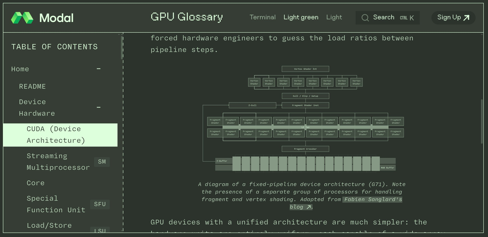

# GPU Программирование: Глоссарий от Modal Labs

## Обзор

Modal Labs создали подробный глоссарий GPU-терминов, чтобы решить проблему фрагментированной документации, с которой они столкнулись при работе с графическими процессорами в сервисе Modal. Глоссарий охватывает весь стек GPU-программирования в одном месте, с особым акцентом на NVIDIA GPU, используемые на платформе Modal.

Modal Labs (бренд Modal) – компания, основанная в 2021 году, которая предоставляет высокопроизводительную серверную вычислительную платформу для разработчиков, работающих с данными, ИИ и машинным обучением.

## Структура глоссария

Глоссарий охватывает следующие основные области:

### 1. Ядра и архитектура
- **CUDA ядра** - программные блоки, выполняемые на GPU NVIDIA
- **SM (Streaming Multiprocessors)** - вычислительные блоки GPU NVIDIA
- **Тензорные ядра** - специализированные ядра для высокопроизводительных матричных операций
- **Warp-планировщики** - компоненты GPU, управляющие выполнением групп потоков

### 2. Потоки и память
- **Потоки** - базовые единицы выполнения в GPU-программировании
- **PTX (Parallel Thread Execution)** - виртуальная инструкция NVIDIA для GPU
- **Иерархия памяти** - различные уровни памяти в GPU (глобальная, разделяемая, константная и т.д.)

### 3. Производительность и оптимизация
- **Roofline модель** - метод анализа производительности вычислений
- **Дивергенция** - явление, снижающее эффективность выполнения программ на GPU
- **Профилирование** - методы анализа производительности GPU-приложений

### 4. Инструменты и библиотеки
- **nvcc** - компилятор CUDA
- **nvidia-smi** - инструмент мониторинга GPU
- **cuBLAS** - библиотека линейной алгебры для GPU
- **Nsight** - инструменты профилирования NVIDIA
- **libcuda** - низкоуровневая библиотека для работы с GPU

## Взаимосвязи в глоссарии

Одной из ключевых особенностей глоссария от Modal Labs является система внутренних ссылок, позволяющая переходить между связанными концепциями. Например, при изучении Warp Scheduler можно легко получить понимание потоков, упомянутых в статье о модели программирования CUDA.

## Значение глоссария

Этот глоссарий особенно ценен для:
- Разработчиков, работающих с GPU-вычислениями
- Исследователей, применяющих GPU для ИИ и ML
- Инженеров, оптимизирующих производительность GPU-приложений

## Иллюстрации

 <!-- TODO: Broken image path -->

**Изображение показывает:** диаграмму архитектуры GPU с CUDA ядрами, потоковыми мультипроцессорами (SM), специальными функциональными блоками (SFU), блоками загрузки/хранения и шейдерами. Также показано сравнение фиксированной архитектуры конвейера (G71) и унифицированной архитектуры GPU.

## Источники

- **Название**: GPU Glossary от Modal Labs
- **Описание**: Словарь терминов, связанных с программированием GPU, с особым акцентом на GPU NVIDIA, используемые на платформе Modal
- **Особенности**: Все страницы глоссария связаны между собой для комплексного понимания
- **Происхождение**: Составлено Modal Labs из PDF-документации NVIDIA, Discord-сообществ и учебников
- **Статус**: Проект с открытым исходным кодом, доступный на GitHub: https://github.com/modal-labs/gpu-glossary
- **Онлайн версия**: https://modal.com/gpu-glossary
- **Лицензии**: Файлы в папке gpu-glossary под лицензией Creative Commons Attribution 4.0 International (CC BY 4.0); остальные файлы под лицензией MIT

## Связанные темы

- [[../../frameworks_and_libraries/pytorch/kernel_programming_pytorch.md]] - Программирование GPU ядер в PyTorch с использованием Triton
- [[../cs_fundamentals/computer_architecture.md]] - Общие вопросы архитектуры компьютеров, включая GPU
- [[../../../algorithms/classical_ml/optimization/applications/cuda_l2_ai_gpu_optimization.md]] - Автоматическая оптимизация GPU-ядер с помощью ИИ